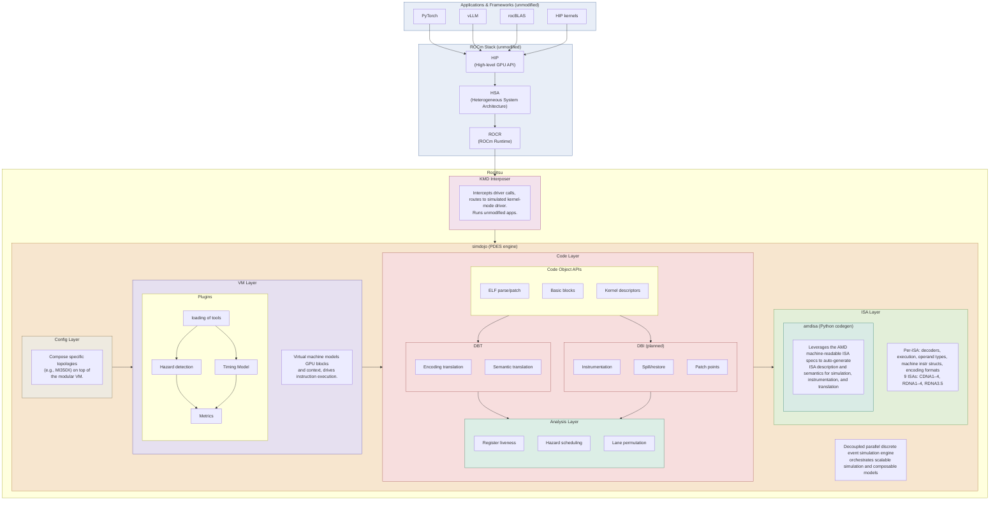
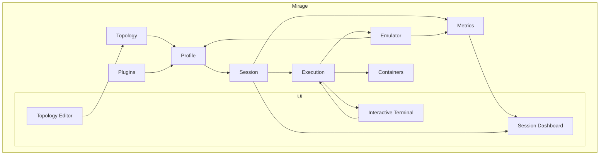

# ROCM Emulation

[work board](https://github.com/orgs/ROCm/projects/164)

## Components

- [Rocjitsu](emulation/rocjitsu/) — JIT-based AMD GPU emulator. The core engine that interprets/translates AMDGPU ISA and models GPU blocks so unmodified ROCm apps can run without a physical GPU.
  - [KMD Interposer](emulation/rocjitsu/lib/rocjitsu/src/rocjitsu/kmd/) — Intercepts kernel-mode driver calls and routes them to the simulated KMD. Per-OS backends in [linux/](emulation/rocjitsu/lib/rocjitsu/src/rocjitsu/kmd/linux/) and [windows/](emulation/rocjitsu/lib/rocjitsu/src/rocjitsu/kmd/windows/).
  - [Config Layer](emulation/rocjitsu/lib/rocjitsu/src/rocjitsu/config/) — Loads and composes topology/profile configs (e.g. MI350X) on top of the modular VM. See [config_loader.cpp](emulation/rocjitsu/lib/rocjitsu/src/rocjitsu/config/config_loader.cpp) and [checkpoint.cpp](emulation/rocjitsu/lib/rocjitsu/src/rocjitsu/config/checkpoint.cpp).
  - [VM Layer](emulation/rocjitsu/lib/rocjitsu/src/rocjitsu/vm/) — Virtual machine modeling GPU blocks, SoC, and thread context; drives instruction execution. Plugin harness via [execution_plugin.h](emulation/rocjitsu/lib/rocjitsu/src/rocjitsu/vm/execution_plugin.h). Per-arch backends in [amdgpu/](emulation/rocjitsu/lib/rocjitsu/src/rocjitsu/vm/amdgpu/) and [risc_v/](emulation/rocjitsu/lib/rocjitsu/src/rocjitsu/vm/risc_v/). Design notes: [DESIGN.md](emulation/rocjitsu/lib/rocjitsu/src/rocjitsu/vm/DESIGN.md).
  - [Code Layer](emulation/rocjitsu/lib/rocjitsu/src/rocjitsu/code/) — Code object APIs: ELF parse/patch, basic blocks, kernel descriptors, executables. See [amdgpu_code_object.cpp](emulation/rocjitsu/lib/rocjitsu/src/rocjitsu/code/amdgpu_code_object.cpp), [basic_block.cpp](emulation/rocjitsu/lib/rocjitsu/src/rocjitsu/code/basic_block.cpp), [executable.cpp](emulation/rocjitsu/lib/rocjitsu/src/rocjitsu/code/executable.cpp).
    - [DBT](emulation/rocjitsu/lib/rocjitsu/src/rocjitsu/code/dbt/) — Dynamic binary translation: encoding and semantic translation.
    - [Patch / DBI](emulation/rocjitsu/lib/rocjitsu/src/rocjitsu/code/patch/) — Patch points and (planned) instrumentation, spill/restore.
  - [Analysis Layer](emulation/rocjitsu/lib/rocjitsu/src/rocjitsu/analysis/) — Register liveness, def-use chains, hazard scheduling, lane permutation. See [liveness.cpp](emulation/rocjitsu/lib/rocjitsu/src/rocjitsu/analysis/liveness.cpp) and [def_use_chain.cpp](emulation/rocjitsu/lib/rocjitsu/src/rocjitsu/analysis/def_use_chain.cpp).
  - [ISA Layer](emulation/rocjitsu/lib/rocjitsu/src/rocjitsu/isa/) — Per-ISA decoders, operand types, machine instruction structs, encoding formats (CDNA1–4, RDNA1–4, RDNA3.5). Entry points: [decoder.cpp](emulation/rocjitsu/lib/rocjitsu/src/rocjitsu/isa/decoder.cpp), [rj_decode.cpp](emulation/rocjitsu/lib/rocjitsu/src/rocjitsu/isa/rj_decode.cpp); per-arch tables in [arch/](emulation/rocjitsu/lib/rocjitsu/src/rocjitsu/isa/arch/).
  - [simdojo](emulation/rocjitsu/lib/simdojo/) — Decoupled parallel discrete-event simulation engine that orchestrates composable models. See [DESIGN.md](emulation/rocjitsu/lib/simdojo/DESIGN.md) and [src/](emulation/rocjitsu/lib/simdojo/src/) ([simulation.cpp](emulation/rocjitsu/lib/simdojo/src/simulation.cpp), [topology.cpp](emulation/rocjitsu/lib/simdojo/src/topology.cpp), [component.cpp](emulation/rocjitsu/lib/simdojo/src/component.cpp)).
  - [amdisa](emulation/rocjitsu/lib/python/amdisa/) — Python codegen that consumes AMD machine-readable ISA specs to auto-generate decoders, semantics, encoding/legalization tables, and cross-ISA translators. Key modules: [parser.py](emulation/rocjitsu/lib/python/amdisa/parser.py), [semantics.py](emulation/rocjitsu/lib/python/amdisa/semantics.py), [encoding_translator_codegen.py](emulation/rocjitsu/lib/python/amdisa/encoding_translator_codegen.py), [legalization_codegen.py](emulation/rocjitsu/lib/python/amdisa/legalization_codegen.py), [cross_isa.py](emulation/rocjitsu/lib/python/amdisa/cross_isa.py), [codegen/](emulation/rocjitsu/lib/python/amdisa/codegen/).
  - [rocjitsu_vllm](emulation/rocjitsu/lib/python/rocjitsu_vllm/) — Python integration glue for running vLLM on top of rocjitsu.
  - [configs](emulation/rocjitsu/configs/), [schemas](emulation/rocjitsu/schemas/), [scripts](emulation/rocjitsu/scripts/), [tests](emulation/rocjitsu/tests/) — Topology/profile configs, schema definitions, build/dev scripts, and test suites.
- [Mirage](emulation/mirage/) — iOS-simulator-inspired UX and CLI that drives rocjitsu (named profiles, persistent sessions, containers, topology editor, session dashboard, interactive terminal). A Rust workspace whose top-level [`mirage`](emulation/mirage/src/) binary composes the crates below. See the [Mirage](#mirage) section for the architecture.
  - [core](emulation/mirage/core/) — Shared library: profile/session/topology/agent stores, the control-plane trait, KMD/library discovery, and container env wiring. See [discovery.rs](emulation/mirage/core/src/discovery.rs), [profile.rs](emulation/mirage/core/src/profile.rs), [ctl.rs](emulation/mirage/core/src/ctl.rs), [container.rs](emulation/mirage/core/src/container.rs).
  - [ctl](emulation/mirage/ctl/) — User-facing control plane: parses and dispatches every `mirage` subcommand (profile/topology/agent/session/exec/run/…). Entry point [lib.rs](emulation/mirage/ctl/src/lib.rs).
  - [host](emulation/mirage/host/) — Per-session host process that boots a session, brings up containers, hosts the emulator daemon, and runs/streams executions across nodes and ranks. See [lib.rs](emulation/mirage/host/src/lib.rs) and [main.rs](emulation/mirage/host/src/main.rs).
  - [container](emulation/mirage/container/) — Drives the `docker`/`podman` CLI to realise the containerised parts of a session: image build/pull, networks, node launch. See [lib.rs](emulation/mirage/container/src/lib.rs).
  - [builtin](emulation/mirage/builtin/) — Built-in agents and topologies (e.g. MI300X/MI350X) preloaded into the user config. See [agents.rs](emulation/mirage/builtin/src/agents.rs) and [profiles.rs](emulation/mirage/builtin/src/profiles.rs).
  - Emulator backends — pluggable engines registered via `inventory`, selected per profile by `kind`:
    - [rocjitsu](emulation/mirage/rocjitsu/) — rocjitsu integration: synthesizes the sim config, hosts the in-process emulator daemon, and the `rocjitsu-dbt` translation backend. See [lib.rs](emulation/mirage/rocjitsu/src/lib.rs), [daemon.rs](emulation/mirage/rocjitsu/src/daemon.rs), [dbt.rs](emulation/mirage/rocjitsu/src/dbt.rs).
    - [rocjitsu_sys](emulation/mirage/rocjitsu_sys/) — Runtime (dlopen) FFI bindings to the rocjitsu VM C API (`rj_vm_*`). See [lib.rs](emulation/mirage/rocjitsu_sys/src/lib.rs).
    - [hotswap](emulation/mirage/hotswap/) — HotSwap backend: load-time ISA rewriter that runs a guest-built workload on the host GPU. See [lib.rs](emulation/mirage/hotswap/src/lib.rs).
    - [noop](emulation/mirage/noop/) — Pass-through backend that runs the workload directly with no GPU emulation. See [lib.rs](emulation/mirage/noop/src/lib.rs).
  - [daemon](emulation/mirage/daemon/) — Optional HTTP/WebSocket server exposing the control plane as a REST API (off by default). See [api.rs](emulation/mirage/daemon/src/api.rs) and [server.rs](emulation/mirage/daemon/src/server.rs).
  - [dashboard](emulation/mirage/dashboard/) — React + Vite single-page app (topology editor, session dashboard, interactive terminals) bundled into the daemon. Source under [web/src/](emulation/mirage/dashboard/web/src/).
  - [scripts](emulation/mirage/scripts/), [tests](emulation/mirage/tests/), [docs](emulation/mirage/docs/), [cmake](emulation/mirage/cmake/) — Build/dev and Dockerized-build scripts, end-to-end and ML test fixtures, design docs, and the CMake wrapper over cargo.

## Rocjitsu

The heart and core of the emulation effort.

##

## Mirage

An iOS-simulator-inspired UX and CLI that makes rocjitsu easy to drive. Where rocjitsu is the raw emulation engine, Mirage is the control plane around it: it turns a one-off `LD_PRELOAD` invocation into a managed, reproducible workflow with named configs, persistent sessions, containers, and a dashboard.

Mirage exists to:

- **Drive the emulator.** A single `mirage run` boots an emulated GPU and launches your unmodified ROCm workload on it — Mirage discovers the rocjitsu KMD interposer, synthesizes the simulation config from your profile, hosts the emulator daemon, and injects the right environment so the app "sees" the virtual hardware.
- **Support complex topologies.** Describe multi-GPU, multi-node systems (e.g. MI300X/MI350X/MI450X) declaratively. The topology editor and `--num-nodes` / `--gpus-per-node` / `--nproc_per_node` flags let you stand up large virtual clusters, and Mirage wires up rendezvous (`MASTER_ADDR`, `WORLD_SIZE`, `RANK`, per-node `NCCL_HOSTID`, …) so distributed frameworks like torchrun and RCCL run unchanged.
- **Support containers and reproducible runs.** A profile is a self-contained, on-disk description of a workload. Executions run inside containers with pinned images so a run can be replayed identically on another machine, and Mirage handles image bring-up, mounts, and host/glibc compatibility automatically.
- **Make it easier to debug and run.** Persistent sessions, a session dashboard with live metrics, interactive terminals into running sessions, and streamed build/boot logs replace the manual dance of preloading libraries and hand-editing JSON configs.

### Concepts

Mirage models a workload as a small set of layered, persistent objects:

| term | definition |
| --- | --- |
| profile | a config: emulator + topology + container/image + plugins |
| session | a booted, running profile (an emulated machine) |
| execution | running a program on a session |
| workload | a profile + execution |
