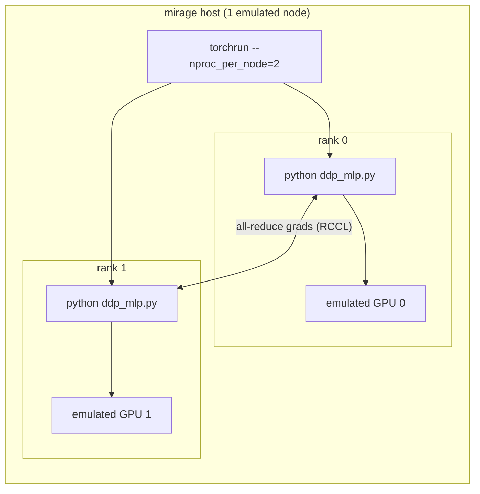

# Distributed training with PyTorch DDP on mirage

This tutorial trains a small MLP with PyTorch
[`DistributedDataParallel`](https://pytorch.org/docs/stable/notes/ddp.html)
(DDP) across **multiple emulated MI350X GPUs**, launched with
[`torchrun`](https://pytorch.org/docs/stable/elastic/run.html). No
physical GPU is required — [`rocjitsu`](architecture.md) emulates the
devices, so the same launch command you would use on a real 8-GPU box
runs on a laptop.

By the end you will have run:

```sh
mirage run --profile mi350x --gpus-per-node 2 \
  -- torchrun --standalone --nproc_per_node=2 ddp_mlp.py
```

and watched two ranks all-reduce their gradients and converge to
byte-identical weights.

The ready-to-run pieces live in the repo:

| File | Purpose |
|------|---------|
| [`tests/fixtures/ml/ddp_mlp.py`](../tests/fixtures/ml/ddp_mlp.py) | the DDP training workload (one process per rank) |
| [`tests/run_ddp_mlp_mi350.sh`](../tests/run_ddp_mlp_mi350.sh) | end-to-end runner: sets up a venv and launches the demo |

## TL;DR

```sh
cd emulation/mirage
./tests/run_ddp_mlp_mi350.sh          # first run installs a venv; prints ddp_mlp_ok
SKIP_INSTALL=1 ./tests/run_ddp_mlp_mi350.sh   # reuse the venv on later runs
```

A successful run ends with:

```text
[rank 0] loss: 30.5666 -> 0.2634 over 50 steps
[rank 0] all ranks converged with identical replicas
ddp_mlp_ok
==> PASS: DDP MLP trained on 2 emulated mi350x GPUs via torchrun
```

## How the pieces fit together



Three things make this work:

1. **Multiple emulated GPUs.** `mirage run --gpus-per-node N` tells
   rocjitsu to synthesize `N` KFD device nodes, so inside the workload
   `torch.cuda.device_count() == N`. Every rank must pin itself to a
   *distinct* device — RCCL refuses to run if two ranks land on the same
   GPU (`Duplicate GPU detected`). The fixture picks
   `rank % torch.cuda.device_count()`, so each rank owns its own GPU.

2. **`torchrun` rendezvous works out of the box.** mirage exports the
   standard `torch.distributed` variables `MASTER_ADDR` and
   `MASTER_PORT` on every node (aliasing mirage's own
   `MIRAGE_HEAD_ADDR` / `MIRAGE_HEAD_PORT`). For a single node,
   `torchrun --standalone` picks its own loopback rendezvous; for
   multi-node you can point `torchrun --rdzv-endpoint` at
   `$MASTER_ADDR:$MASTER_PORT`.

3. **The daemon emulator (default).** mirage runs the emulator as a
   separate daemon process by default, so the rank processes share GPU
   memory through it — which is what lets RCCL set up its transports
   across ranks. Pass `mirage run --in-process` to instead give every
   process its own in-process emulator (no shared GPU memory; multi-GPU
   RCCL cannot work in that mode).

## Step by step

### 1. Set up a venv

The demo uses PyTorch and the ROCm SDK (which ships rocjitsu) from the
`gfx950-dcgpu` (MI350) nightly index. The runner script does this for
you, but to do it by hand:

```sh
cd emulation/mirage
python3 -m venv .venv-mi350
source .venv-mi350/bin/activate
pip install --index-url https://rocm.nightlies.amd.com/v2/gfx950-dcgpu/ \
  "rocm[libraries,devel]" torch numpy
rocm-sdk init      # unpacks librocjitsu_kmd.so + configs into the venv
```

`rocm-sdk init` is required: the `devel` package ships its contents
compressed, and rocjitsu's KMD interposer only appears under
`site-packages/_rocm_sdk_devel` after this step. mirage auto-detects
that library from the active venv — no `LD_LIBRARY_PATH` wiring needed.

### 2. Launch the training

From the workspace (so mirage's own rocjitsu discovery works), run:

```sh
cargo run --quiet -- run \
  --profile mi350x \
  --gpus-per-node 2 \
  -- .venv-mi350/bin/torchrun --standalone --nproc_per_node=2 \
     tests/fixtures/ml/ddp_mlp.py
```

The first `--` ends `cargo run`'s arguments; the second ends mirage's,
so everything after it is the workload `torchrun` launches once per
rank. mirage already runs the shared-memory daemon emulator by default
(pass `--in-process` to opt out).

### 3. Read the output

Each rank logs the loss it started and ended with, and rank 0 confirms
that every replica converged to identical weights before printing
`ddp_mlp_ok`. The fixture fails loudly (non-zero exit) if the loss does
not drop or any rank's weights diverge.

## What the workload does

[`ddp_mlp.py`](../tests/fixtures/ml/ddp_mlp.py) is a standard,
self-contained DDP program:

1. Reads `RANK`, `WORLD_SIZE`, `LOCAL_RANK` (set by `torchrun`) and
   `MASTER_ADDR` / `MASTER_PORT` (set by mirage).
2. Pins to GPU `LOCAL_RANK` and joins the process group.
3. Builds an identical MLP on every rank, wraps it in
   `DistributedDataParallel` (which broadcasts the initial weights and
   all-reduces gradients every backward pass).
4. Trains on a per-rank shard of a fixed synthetic regression task, so
   the gradients genuinely differ and the all-reduce matters.
5. Verifies the loss dropped **and** that an `all_gather` of the final
   weight checksum is identical on every rank — proof that DDP kept the
   replicas in lock-step.

## Tuning the run

The runner script and fixture honor these environment variables:

| Variable | Default | Meaning |
|----------|---------|---------|
| `NPROC` | `2` | GPUs / ranks per node (`torchrun --nproc_per_node`, `mirage --gpus-per-node`). |
| `STEPS` | `50` | Optimizer steps. |
| `PROFILE` | `mi350x` | mirage profile / emulated GPU. |
| `VENV` | `.venv-mi350` | venv location. |
| `SKIP_INSTALL` | unset | set to `1` to reuse an already-populated venv. |

Examples:

```sh
# 4 emulated GPUs, 100 steps
NPROC=4 STEPS=100 SKIP_INSTALL=1 ./tests/run_ddp_mlp_mi350.sh
```

## Multi-node DDP (no launcher)

mirage emulates each *node* as its own rank process and exports the full
set of `torch.distributed` `env://` variables — `RANK`, `WORLD_SIZE`,
`LOCAL_RANK`, `MASTER_ADDR`, `MASTER_PORT` — on every node. That means
you can run the workload **directly**, with no `torchrun` launcher: each
node runs `python ddp_mlp.py` once and rendezvouses through `env://`.

```sh
mirage run --profile mi350x --num-nodes 2 --gpus-per-node 2 \
  --env NCCL_P2P_DISABLE=1 --env NCCL_SHM_DISABLE=1 --env NCCL_SOCKET_IFNAME=lo \
  -- .venv-mi350/bin/python3 tests/fixtures/ml/ddp_mlp.py
```

- `--num-nodes 2` makes `WORLD_SIZE == 2` and runs the script twice, once
  per rank, with distinct `RANK`s.
- `--gpus-per-node 2` exposes two GPUs so each rank can pin to a distinct
  device (`rank % device_count`).
- The `NCCL_*` variables force RCCL onto its loopback socket transport,
  which is what the daemon emulator supports.

### Quick connectivity check

Before the full training run, a minimal smoke test
([`tests/fixtures/ml/dist_smoke.py`](../tests/fixtures/ml/dist_smoke.py))
does a single `all_reduce` and prints `dist_smoke_ok`. It is heavily
logged with timestamps so any stall is easy to localize:

```sh
mirage run --profile mi350x --num-nodes 2 --gpus-per-node 2 \
  --env NCCL_P2P_DISABLE=1 --env NCCL_SHM_DISABLE=1 --env NCCL_SOCKET_IFNAME=lo \
  -- .venv-mi350/bin/python3 tests/fixtures/ml/dist_smoke.py
```

A successful run shows each rank on its own device and the reduced sum:

```text
[rank 0] current device = 0 (cuda:0)
[rank 1] current device = 1 (cuda:1)
[rank 0] post all_reduce: tensor = 3.0
dist_smoke_ok
```

## Troubleshooting

- **`torch.cuda.is_available()` is False.** The venv is missing the ROCm
  runtime or `rocm-sdk init` was not run. Re-run the install step in the
  active venv.
- **A rank SIGSEGV/SIGABRTs immediately with `--nproc_per_node > 1`.**
  You are likely in `--in-process` mode, where each rank has its own
  emulator and cannot share GPU memory. Drop `--in-process` so the
  default daemon emulator is used.
- **`Duplicate GPU detected` / `ncclInvalidUsage` at the first
  collective.** Two ranks pinned to the same emulated GPU. Give the
  session at least as many GPUs as ranks (`--gpus-per-node N`) so each
  rank can own a distinct device (the fixtures use
  `rank % torch.cuda.device_count()`).
- **Multi-GPU run hangs / times out after a few steps.** Known
  limitation: RCCL initializes and a single collective completes (the
  `dist_smoke.py` smoke test passes), but DDP's repeated, bucketed
  collectives stall on a later one over the daemon emulator. Single-rank
  runs train end to end.
- **`KMD preload library not found`.** You are running an installed
  `mirage` from `PATH` instead of the workspace build. Run via
  `cargo run --` from `emulation/mirage` (see
  [building.md](building.md)).
