<!--
Render this deck with Marp:
  npx @marp-team/marp-cli docs/demo-debugging-at-scale.md --html -o demo.html
  npx @marp-team/marp-cli docs/demo-debugging-at-scale.md --pdf
Or just read it top-to-bottom — every slide is a self-contained talking point.
Slides are separated by `---`. Speaker notes live in HTML comments.
-->

# Debugging ROCm at Scale

## with **mirage** + **rocjitsu**

*Run real ROCm workloads on emulated GPUs — no hardware required.*

<!--
Hook: "Today I'll show how we debug multi-node ROCm jobs on a laptop, with
zero physical GPUs, using mirage as the UX over the rocjitsu emulator."
-->

---

# The problem

Debugging GPU code at scale is **expensive and slow**:

- 🖥️  You need the **actual hardware** — MI300X / MI350X / MI450X.
- 🌐  Multi-node bugs (RCCL collectives, rank coordination) need a **whole cluster**.
- 🔁  Repro is flaky; the cluster is shared; the queue is long.
- 🔬  When it crashes at 2am on node 47, you get a core dump and a prayer.

> **What if every engineer could spin up a 2-node MI450X "cluster" on their laptop,
> inspect every byte of state with `cat`, and re-run instantly?**

That is what **mirage + rocjitsu** does.

---

# Two pieces, one story

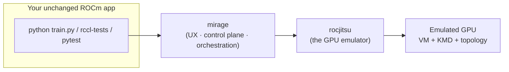

| Layer | What it is |
| ----- | ---------- |
| **rocjitsu** | The ROCm Just-In-time Suite — a software GPU **emulator** (functional or clocked). |
| **mirage** | The user-facing **UX**: CLI + optional web dashboard that drives rocjitsu (and other backends) at scale. |

<!--
Key framing: rocjitsu is the engine, mirage is the cockpit. The app never changes.
-->

---

# rocjitsu in one slide

A real ROCm app expects a real kernel driver (`/dev/kfd`) and a real GPU.
rocjitsu **fakes both** so the app runs unmodified.

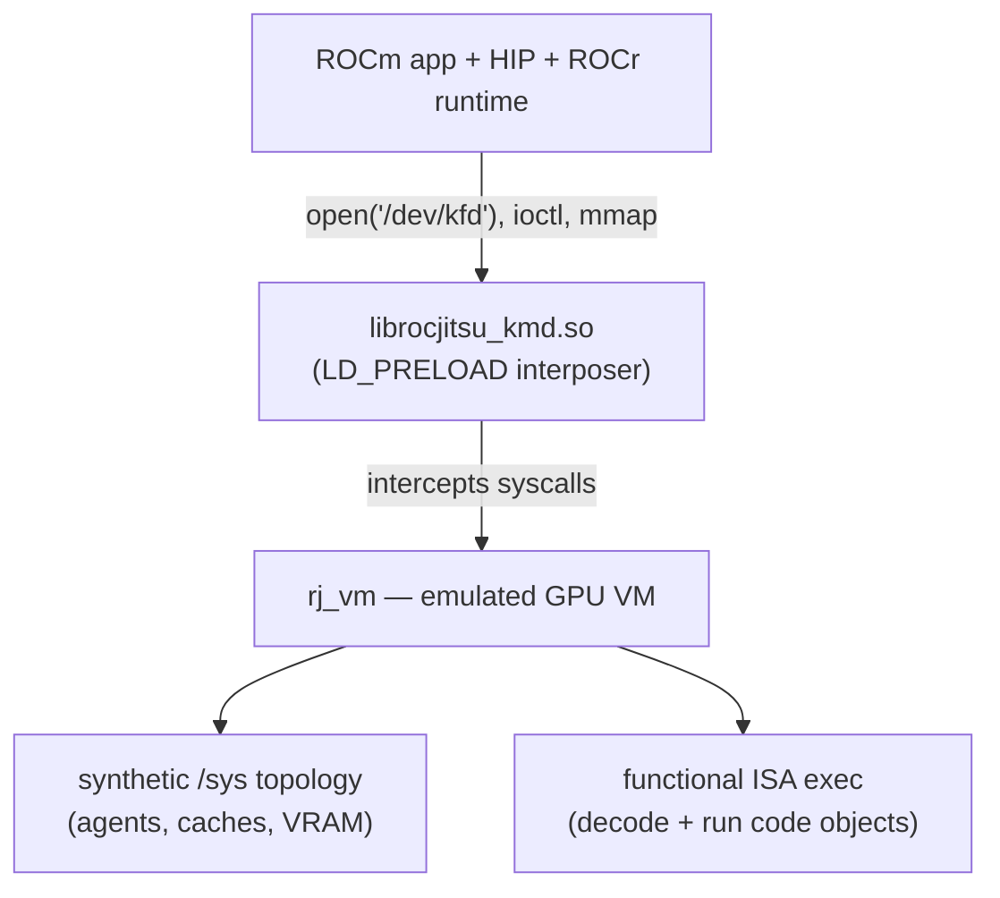

- **No `/dev/kfd`?** The interposer synthesizes the whole kernel interface.
- **No GPU?** `rj_vm` models the device, its topology, and executes the ISA.
- The app sees a normal MI350X. It is software, all the way down.

---

# mirage core concepts

Six nouns. Learn these and you know the tool.

| Concept | What it is |
| ------- | ---------- |
| **Emulator** | A backend that runs GPU code: `rocjitsu`, `rocjitsu-dbt`, `hotswap`, `noop`. |
| **Agent** | A hardware GPU definition — `MI300X`, `MI350X`, `MI450X`. |
| **Topology** | A rack / node / GPU layout that references an agent. |
| **Profile** | A reusable preset: emulator + topology + options. |
| **Session** | A long-lived context (one host process) that hosts an emulator and runs execs. |
| **Exec** | A single command invocation inside a session, with fully redirected stdio. |

> Flow: pick a **profile** → start a **session** → run **execs**.
> `mirage run` does all three in one shot.

---

# The 30-second demo

```console
$ mirage emulators
NAME          INSTALLED  SUPPORTED  DESCRIPTION
noop*         yes        yes        no-op emulator: runs commands directly
rocjitsu      yes        yes        ROCm just-in-time GPU emulator
rocjitsu-dbt  yes        no         dynamic binary translation (needs real GPU)
hotswap       no         yes        load-time ISA-rewriting backend
* = default emulator for new profiles

$ mirage profile create cdna4 --emulator rocjitsu --agent MI350X
created profile 'cdna4'

$ mirage run --profile cdna4 -- python3 train.py
tiny_torch_ok
```

That last line came out of an **emulated MI350X**. No GPU was harmed.

<!--
Pause here. This is the "wow" — a torch workload on a laptop on a fake GPU.
-->

---

# Architecture: one binary, three roles

The single `mirage` executable is a control plane, a host, and a dashboard.
The subcommand decides which role runs.

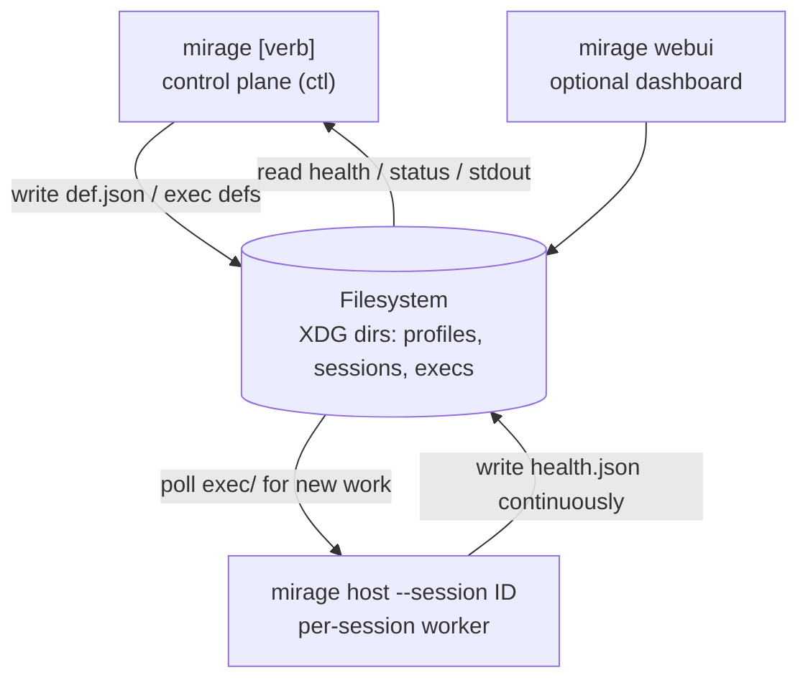

> The CLI and the host **never talk over a socket**. They coordinate
> *only* through files in the session directory.

---

# Why file-backed? (this is the debugging superpower)

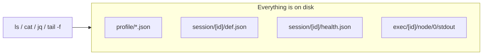

- **Inspectable** — read any state with `ls`, `cat`, `jq`. No IPC to trace.
- **Crash-resilient** — a dead CLI or host doesn't lose state; restart and resume.
- **No required daemon** — read-only commands work with nothing running.
- **Scriptable** — every list/show takes `--json`; exit codes are predictable.

> Debugging an emulated cluster becomes "read the files."

---

# The crate map

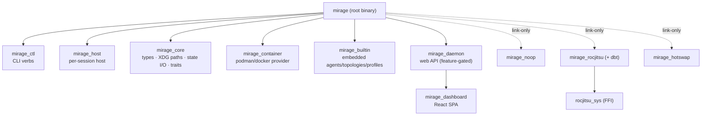

Backends are **link-only** — they self-register via `inventory`. Turn a
Cargo feature on/off and the backend appears/disappears from `mirage emulators`.
The binary never names a backend.

---

# The emulator backends

| Backend | How it runs GPU code | When to use |
| ------- | -------------------- | ----------- |
| **rocjitsu** | Pure software emulation. Synthesizes `/dev/kfd`, runs the ISA in `rj_vm`. | Debug anywhere — no GPU needed. **The headline.** |
| **rocjitsu-dbt** | Dynamic Binary Translation: translates guest ISA → host GPU ISA, runs on real HW. | You *have* a GPU but want a *different* arch. |
| **hotswap** | Load-time ISA rewriting. | Quick arch retargeting on real HW. |
| **noop** | Runs the command directly, no emulation. | Exercise the tooling with zero deps. |

All four share the **same** mirage UX. Switching is one flag:

```console
$ mirage run --profile cdna4 --emulator rocjitsu-dbt -- ./app
```

---

# Inside rocjitsu: the KMD interposer

`librocjitsu_kmd.so` is `LD_PRELOAD`-ed into the workload and hooks libc.

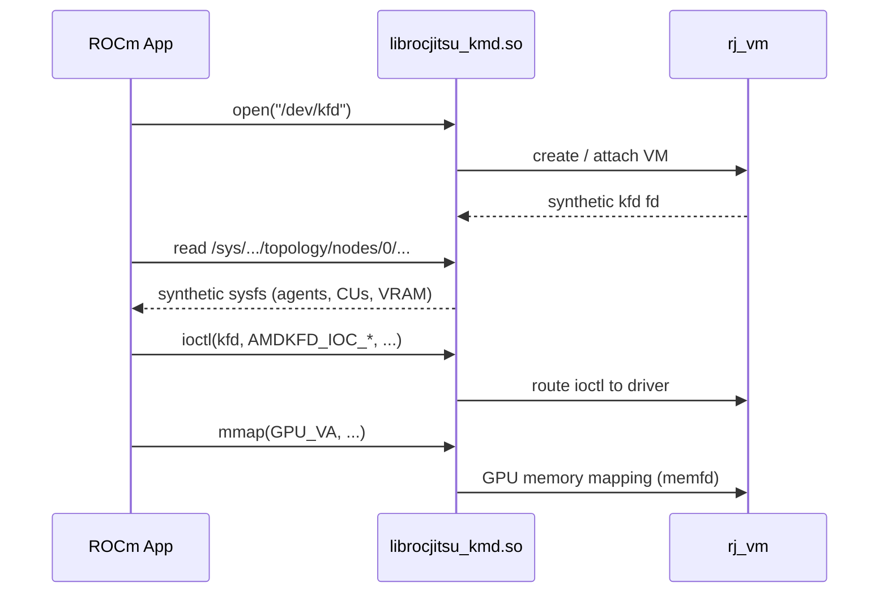

Hooked calls: `open`/`openat`, `mmap`/`munmap`, `ioctl`, `stat`, `dlsym`,
DRM + amdgpu APIs. The app thinks it's talking to a kernel driver.

---

# rocjitsu: local mode vs daemon mode

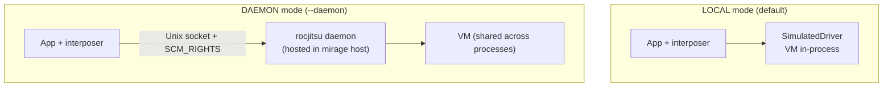

- **Local** — one process, one VM. Interposer reads the session's config directly.
- **Daemon** — the VM lives in the mirage **host** process; the workload connects
  over `$ROCJITSU_RUNTIME_DIR/daemon.sock`. GPU memory shared via **memfds / SCM_RIGHTS**.
- mirage hosts the daemon **in-process via FFI** (`rocjitsu_sys`) — no separate CLI.

> Daemon mode = multiple processes share **one** emulated GPU. Essential for scale.

---

# Topology: modeling the rack

A topology is just a rack / node / GPU layout that references an agent.

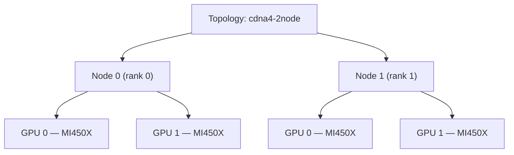

```console
$ mirage topology create cdna4-2node --agent MI450X --num-nodes 2 --gpus-per-node 2
created topology 'cdna4-2node'

$ mirage topology show cdna4-2node --json | jq '{nodes:.num_nodes, gpus:.gpus_per_node, agent:.agent}'
{ "nodes": 2, "gpus": 2, "agent": "MI450X" }
```

A **profile** binds this topology to an emulator + options.

---

# Startup: how rocjitsu boots on each box

The logical topology (nodes × GPUs) maps **1 node → 1 physical box**. On every
box a `mirage host` boots the rocjitsu daemon, which brings the box's emulated
GPUs online.

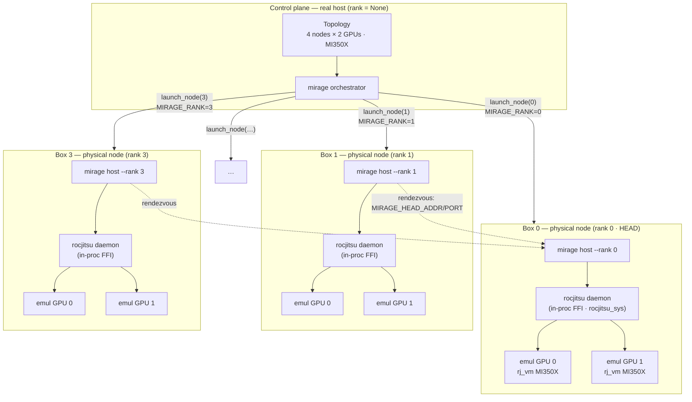

- **Box** = one physical node (or its container). Topology rank → box → one `mirage host`.
- Each host hosts a **rocjitsu daemon in-process** (`rocjitsu_sys` FFI) — one daemon per box.
- The daemon stands up `gpus-per-node` emulated `rj_vm` GPUs; workloads on that box
  attach via `$ROCJITSU_RUNTIME_DIR/daemon.sock`.
- Rank 0 is the **head**; every other box rendezvouses to it for collectives.

---

# Startup at scale: 32 boxes × 8 GPUs

Same shape, more boxes. A `32 × 8` topology fans out to **32 physical boxes**,
each running one `mirage host` + one rocjitsu daemon hosting **8 emulated GPUs** —
**256 emulated GPUs** total, all on disk, all inspectable.

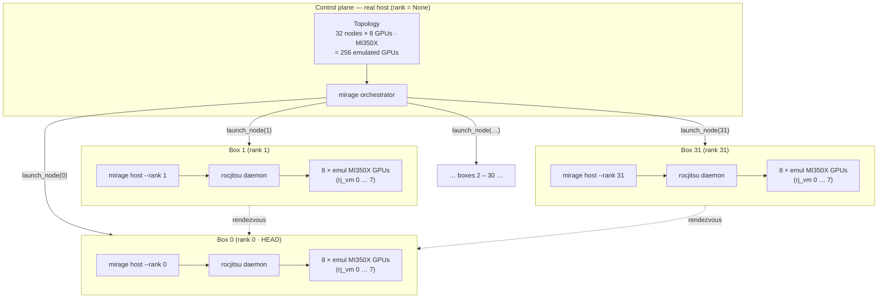

```console
$ mirage profile create super --emulator rocjitsu --agent MI350X \
      --num-nodes 32 --gpus-per-node 8
$ mirage run --profile super -- mpirun -np 32 ./all_reduce_perf -b 8 -e 1G
```

> 32 hosts, 32 daemons, 256 emulated GPUs — the boot pattern is identical to
> one box, just replicated per rank.

---

# Containerization: one container per node

When a profile requests an image, the **orchestrator** brings up one container
per node, bind-mounts the session dir in, and runs a `mirage host` *inside* each.

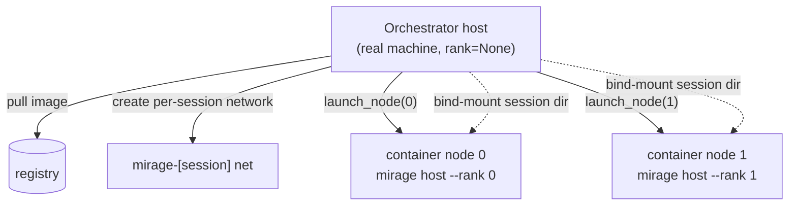

- Provider auto-detected: **podman** or **docker** (`--container-provider` to force).
- podman gets `--group-add keep-groups`; docker gets explicit `/dev/kfd` + render nodes.
- Per-node container ids are recorded in session state, shown by `session list`.

---

# Rank & head-node coordination

The split: **orchestrator** owns containers + session health; **per-node hosts**
own only their rank's execs.

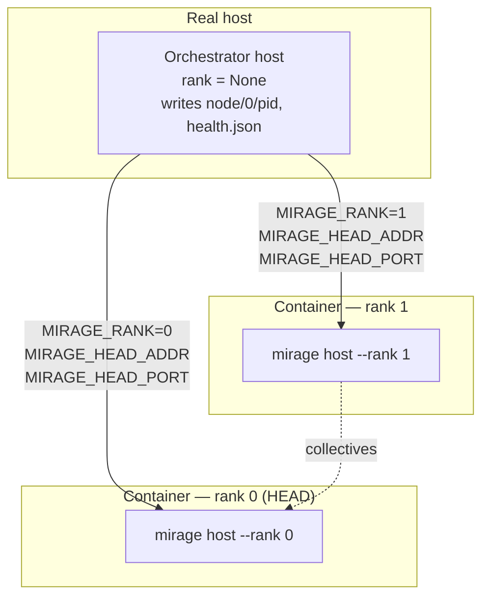

mirage injects into every node container:

- `MIRAGE_RANK` — this node's rank (0 = head).
- `MIRAGE_HEAD_ADDR` / `MIRAGE_HEAD_PORT` — where rank 0 lives, for the workload's
  own rendezvous (e.g. RCCL / torch.distributed init).

---

# How a multi-node exec fans out

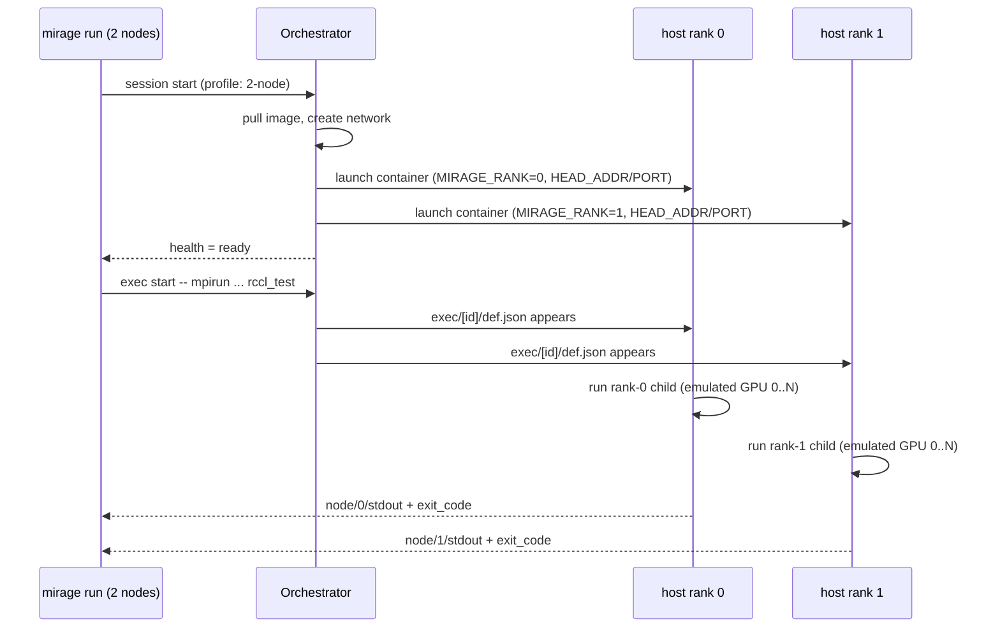

Each node writes its **own** `node/<rank>/{pid,stdout,exit_code}`. The CLI merges them.

---

# On-disk layout: a session you can read

```text
$XDG_RUNTIME_DIR/mirage/session/<id>/
├── def.json              # SessionDef (immutable)
├── health.json           # {healthy, state, terminal}
├── node/                 # one dir per rank
│   ├── 0/{pid, host.log}
│   └── 1/{pid, host.log}
└── exec/
    └── e-000000/
        ├── def.json      # the command
        ├── status.json   # {started, ended, exit_code, nodes{...}}
        └── node/
            ├── 0/{stdin, stdout, pid, exit_code}
            └── 1/{stdin, stdout, pid, exit_code}
```

- `stdin` is a **FIFO** — `printf 'data\n' > node/0/stdin` feeds the child.
- `stdout` is `O_APPEND` — `tail -f` it safely from anywhere.
- All JSON writes are **atomic** (`.tmp.<pid>` then `rename`).

---

# DEMO 1 — single-node MI350X

```console
$ mirage profile create cdna4 --emulator rocjitsu --agent MI350X
created profile 'cdna4'

$ sid=$(mirage session start --profile cdna4)
$ echo $sid
s-20260616-191636-f6c1

$ mirage session show $sid --json | jq '{state:.health.state, healthy:.health.healthy}'
{ "state": "ready", "healthy": true }

$ mirage exec start $sid -- python3 tests/fixtures/ml/tiny_torch.py
tiny_torch_ok

$ mirage session stop $sid
stopped s-20260616-191636-f6c1
```

Lifecycle in the open: **create → ready → exec → stop**, every step inspectable.

---

# DEMO 2 — inspect a live session

```console
$ mirage paths
config:   /home/me/.config/mirage
runtime:  /run/user/1000/mirage
sessions: /run/user/1000/mirage/session

$ ls $(mirage session dir $sid)
def.json  health.json  node/  exec/

$ cat $(mirage session dir $sid)/health.json | jq
{
  "timestamp": "2026-06-16T19:16:36Z",
  "healthy": true,
  "state": "ready",
  "terminal": false
}

$ tail -f $(mirage session dir $sid)/exec/e-000000/node/0/stdout
[rj] vm online: agent MI350X gfx950
loading code object ... ok
tiny_torch_ok
```

No debugger attach, no IPC tracing — the truth is in the files.

---

# DEMO 3 — multi-node RCCL collective

```console
$ mirage profile create cluster --emulator rocjitsu --agent MI450X \
      --num-nodes 2 --gpus-per-node 2
created profile 'cluster'

$ mirage run --profile cluster -- mpirun -np 2 ./all_reduce_perf -b 8 -e 128M
[rank 0] MIRAGE_RANK=0  HEAD=10.88.0.2:5000
[rank 1] MIRAGE_RANK=1  HEAD=10.88.0.2:5000
#                                          out-of-place
#       size      count   type    time   algbw   busbw
           8          2   float   12.4    0.00    0.00
   134217728   33554432   float   18.7    7.18   13.6
# Avg bus bandwidth : 6.81 GB/s
```

Two **emulated** nodes, a real collective, ranks coordinated through the
head node — all on one machine.

<!--
Numbers are illustrative; the point is the topology + rank wiring works.
-->

---

# DEMO 4 — containerized session

```console
$ mirage profile create boxed --emulator rocjitsu --agent MI350X --num-nodes 2 \
      --image rocm/dev-ubuntu:6.4 --container-provider podman
created profile 'boxed'

$ sid=$(mirage session start --profile boxed)
$ mirage session list
ID                       PROFILE  STATE    NODES  PROVIDER  IMAGE
s-20260616-2003-9ab2     boxed    ready    2      podman    rocm/dev-ubuntu:6.4

$ mirage session show $sid --json | jq '.container.nodes'
[
  { "rank": 0, "cid": "f3a9c1...", "name": "mirage-s-..-0" },
  { "rank": 1, "cid": "b71e44...", "name": "mirage-s-..-1" }
]
```

Each node is a container. Inside each, a `mirage host --rank <n>` runs
the emulated GPU. The orchestrator wires the network + head node.

---

# DEMO 5 — debugging a crash

A workload exits abnormally. mirage keeps everything for the post-mortem.

```console
$ mirage exec start $sid --keep -- python3 crashy_kernel.py
RuntimeError: HIP error: invalid device function
[exit code 1]

$ mirage exec show $sid e-000003 --json | jq '{ended:.ended, code:.exit_code, nodes:.nodes}'
{
  "ended": true,
  "code": 1,
  "nodes": { "0": { "pid": 110934, "exit_code": 1 } }
}

$ mirage logs $sid e-000003 | tail -3
[rj] kernel launch: grid=(1024,1,1) block=(256,1,1)
[rj] code object arch mismatch: gfx942 != gfx950
RuntimeError: HIP error: invalid device function
```

`--keep` preserves the exec dir; the emulator's `[rj]` trace pinpoints the
arch mismatch. Re-run instantly — no cluster queue.

---

# DEMO 6 — attach, signal, follow

```console
# Detached long-running job, kept for later attach.
$ eid=$(mirage exec start $sid --detach --keep -- python3 long_train.py)
$ echo $eid
e-000004

# Re-attach from another terminal; output replays + streams live.
$ mirage attach $sid e-000004
epoch 3/100  loss=2.14
epoch 4/100  loss=1.98
^P   # detach without killing

# Follow just the log.
$ mirage logs $sid e-000004 -f
epoch 5/100  loss=1.81

# Send it a signal.
$ mirage exec signal $sid e-000004 TERM
signalled e-000004 with SIGTERM
```

stdin is a FIFO, stdout is append-only — attach/detach/replay all "just work."

---

# DEMO 7 — daemon mode (shared emulated GPU)

```console
$ mirage run --profile cdna4 --daemon -- sh -c \
    'test -S $ROCJITSU_RUNTIME_DIR/daemon.sock && echo DAEMON_SOCKET_PRESENT'
DAEMON_SOCKET_PRESENT

$ mirage run --profile cdna4 --daemon -- env | grep -E 'LD_PRELOAD|ROCJITSU'
LD_PRELOAD=/.../_rocm_sdk_devel/lib/librocjitsu_kmd.so
ROCJITSU_RUNTIME_DIR=/run/user/1000/mirage/session/s-.../rocjitsu
```

- `--daemon` stands up the rocjitsu VM **in the mirage host** (in-process FFI).
- The workload's interposer connects to the daemon socket first.
- Multiple processes → **one** shared emulated GPU, GPU memory via memfds.

---

# DEMO 8 — drop-in rocjitsu compatibility

Existing `rocjitsu` scripts keep working — mirage is a drop-in.

```console
# Upstream rocjitsu CLI shape:
$ rocjitsu --config cfg.json -- ./app --flag

# Same line, just swap the binary:
$ mirage --config cfg.json -- ./app --flag
# == mirage run --config cfg.json -- ./app --flag
```

A bare invocation with `--` and no recognized subcommand is routed to
`mirage run`. `--attach` maps to `--daemon`. No script changes required.

---

# The web dashboard (optional)

```console
$ cargo build --workspace --features webui
$ mirage webui                      # serve on 127.0.0.1:5174
$ mirage webui install              # register a systemd user service
```

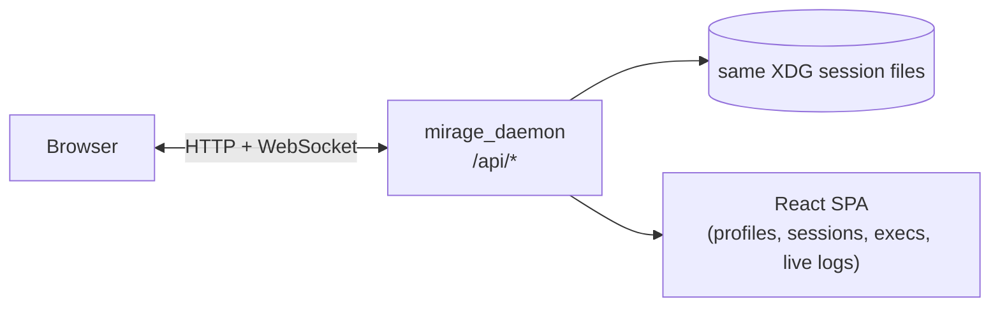

- Cross-session view of every profile, session, and exec.
- Live log streaming over WebSocket.
- Reads the **same files** the CLI does — one source of truth.
- Fully **opt-in**: plain `cargo build` pulls in **no** Node, no dashboard.

---

# Debugging at scale: the test matrix

mirage ships an E2E matrix that is the full cross-product of how teams debug:

| Dimension | Values |
| --------- | ------ |
| **Emulator** | `rocjitsu`, `rocjitsu-dbt` |
| **Containerization** | `node`, `podman`, `docker` |
| **Hardware** | `mi350x`, `mi450x` |
| **Payload** | `tiny_torch` (1 node), `rccl` (2 nodes), `crash` (1 node) |
| **Plugins** | `none`, `hazard-detection` |

```console
$ cargo test --test matrix_e2e -- --nocapture
mi350x  rocjitsu  node    tiny_torch  none              RAN
mi450x  rocjitsu  podman  rccl        hazard-detection  RAN
mi450x  rocjitsu-dbt node  tiny_torch none              SKIP (no translation GPU)
... 14 ran, 4 skipped, 18 total
```

Unsupported combos **skip with a reason** — same suite on a laptop, in CI, on a real host.

---

# Plugins: hazard & race detection

Backends can advertise plugins that turn the emulator into a **bug finder**:

```console
$ mirage profile create checked --emulator rocjitsu --agent MI350X \
      --option plugin=hazard-detection
created profile 'checked'

$ mirage run --profile checked -- ./my_kernel
[rj hazard] data race: write @0x7f.. (wave 3) vs read @0x7f.. (wave 7)
[rj hazard]   kernel: fused_attention  line 142
RuntimeError: detected 1 memory hazard
```

Because it's an emulator, it sees **every** memory access — races that are
non-deterministic on real hardware become **reproducible** here.

---

# Why this changes how we debug

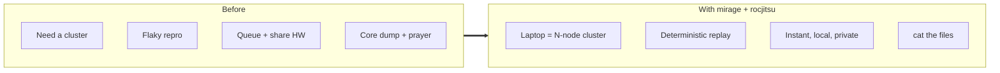

- **Shift left** — catch multi-node bugs before you ever touch real silicon.
- **Democratize** — every engineer gets an MI450X cluster.
- **Inspectable** — the whole machine is files you can read.

---

# Recap

- **rocjitsu** = software GPU emulator (interposer + VM, local or daemon).
- **mirage** = the UX that runs it **at scale**: profiles, sessions, execs.
- **Topology** models the rack; **containers** isolate each node.
- **Rank + head-node** coordination via `MIRAGE_RANK` / `MIRAGE_HEAD_ADDR/PORT`.
- **Everything on disk** → inspect, script, recover, replay.
- One UX for **rocjitsu / rocjitsu-dbt / hotswap / noop**.

```console
$ mirage profile create cdna4 --emulator rocjitsu --agent MI450X --num-nodes 2
$ mirage run --profile cdna4 -- ./your-rocm-app
```

## Questions?

<!--
Close: "Pick a profile, hit run. Your laptop is now a debuggable MI450X cluster."
-->
