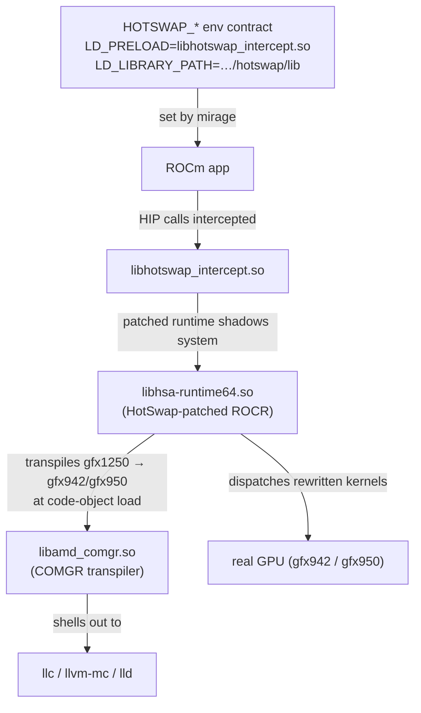

# HotSwap

HotSwap is a **load-time ISA rewriter** for AMD GPUs. It lets a workload built
for one GPU architecture run on a different physical GPU by rewriting device
code as it is loaded — for example running a `gfx1250` (RDNA-class) workload on
a `gfx942` (MI300) or `gfx950` (MI350) host GPU.

Unlike [`rocjitsu`](../rocjitsu/) — which is a *software* simulator that decodes
the ISA in an event-driven core — HotSwap runs on **real hardware** by raising
the source assembly to LLVM IR and lowering it back down to the host
architecture's assembly. There is no guarantee about which instructions survive
unchanged. Because the rewrite happens once, at code-object load time, it is much
faster than a full simulator while still letting you exercise code for an
architecture you don't physically have.

## How used HotSwap

HotSwap is **not** a single `libhsa-hotswap.so`. It is a set of co-installed
artifacts (the same ones the reference Docker recipe produces), staged into one
tree:

```
<hotswap-root>/
  lib/        libhotswap_intercept.so   # HIP intercept, LD_PRELOADed
              libhsa-runtime64.so     # HotSwap-patched ROCR runtime
              libamd_comgr.so           # COMGR transpiler
  llvm-tools/ llc llvm-mc lld ld.lld    # the transpiler shells out to these
  runtime/hotswap_py/                   # python adapter runtime
```

mirage wires these into a workload through the **HotSwap env contract**: the
patched ROCR + COMGR shadow the system copies via `LD_LIBRARY_PATH`, the HIP
intercept is `LD_PRELOAD`ed, and the `HSA_HOTSWAP_*` variables select the source
target and adapter policy (mirroring the reference `env_contract.py`).

## Status

By default mirage does **not** build HotSwap — it *finds* and *uses* an existing
install. An opt-in CMake flag (`MIRAGE_BUILD_HOTSWAP`, see below) can build it
from source as part of the mirage build.

If mirage cannot find hotswap, it won't run things using hotswap.

## Usage with mirage

Once a HotSwap tree is installed somewhere mirage can find it (see
[Where mirage looks](#where-mirage-looks)):

```sh
# Create a profile that uses HotSwap, then run under it:
mirage profile create rdna --emulator hotswap
mirage run --profile rdna -- ./my-rocm-app --flag
```

mirage discovers the install and builds the HotSwap env contract (mirroring the
reference `env_contract.py`): it `LD_PRELOAD`s the patched ROCR + intercept,
points `LD_LIBRARY_PATH` at the lib dir, sets `HOTSWAP_HOME` to the install root,
puts the python `sitecustomize` on `PYTHONPATH`, and sets the `HSA_HOTSWAP_*`
variables — `HSA_HOTSWAP_SOURCE_TARGET`
(default `gfx1250:32`), `HSA_HOTSWAP_ISA_OVERRIDE` (the physical GPU detected on
this host), `HSA_HOTSWAP_BACKEND_ADAPTER_POLICY` (default `compile`),
`HSA_HOTSWAP_IR_RAISER`, `HSA_HOTSWAP_STRICT`, and the policy-driven
source-arch overrides
(`PYTORCH_ROCM_ARCH`, `TRITON_OVERRIDE_ARCH`, …). `HSA_HOTSWAP_SOURCE_TARGET` and
`HSA_HOTSWAP_BACKEND_ADAPTER_POLICY` can be overridden from the exec
environment.

If mirage can't find a HotSwap install, `mirage profile create --emulator
hotswap` fails with guidance describing exactly which locations were searched
and how to make it discoverable. mirage also fails loudly at run time rather
than silently running the workload unemulated.

### Where mirage looks

Discovery is
1. `$HOTSWAP_HOME` — the HotSwap install root (`<root>/lib`).
2. `../../build/hotswap/` relative to the `mirage` binary — where the
   `MIRAGE_BUILD_HOTSWAP` source build stages, so a monorepo build is found
   automatically.

## Installation

### Install a prebuilt tree

Place the `lib/`, `llvm-tools/` and `runtime/hotswap_py/` directories under any
location from [Where mirage looks](#where-mirage-looks), e.g.:

```sh
export HOTSWAP_HOME=/abs/path/to/hotswap/
# (llvm-tools/ and runtime/hotswap_py/ are expected next to that lib dir)
```

### Build from source (opt-in, via mirage's CMake)

HotSwap is built by a dedicated, opt-in CMake path. It is a full LLVM + COMGR +
ROCR source build, so it is **off by default**:

```sh
cmake -S . -B build -DMIRAGE_BUILD_HOTSWAP=ON
cmake --build build --target hotswap
```

This mirrors the [reference Docker recipe](https://github.com/ROCm/aise/blob/mluecke/hotswap-transformers-ut/docker/huggingface_ut_hotswap.ubuntu.amd.Dockerfile) and produces three artifact sets,
staged under `build/hotswap/` (`lib/`, `llvm-tools/`, `runtime/hotswap_py/`).
mirage discovers this tree automatically (it probes `../../build/hotswap/lib`
relative to the binary); no extra configuration is needed for an in-tree build.

1. **COMGR transpiler** (`libamd_comgr.so`) + the LLVM tools, from the
   `llvm-project` HotSwap fork. The in-tree
   [`../llvm-project-hotswap`](../llvm-project-hotswap) checkout is used as the
   source by default to avoid re-cloning llvm-project.
2. **HotSwap-patched ROCR** (`libhsa-runtime64.so`), from the `rocm-systems`
   HotSwap fork (built with `ROCR_ENABLE_HOTSWAP_COMGR_ADAPTER=ON`).
3. **HIP intercept** (`libhotswap_intercept.so`) + the python runtime, from the
   HotSwap testing repo.

Useful cache variables (see [`cmake/Hotswap.cmake`](cmake/Hotswap.cmake)
for the full list):

| Variable | Purpose | Default |
| --- | --- | --- |
| `MIRAGE_HOTSWAP_STAGE` | Where artifacts are staged | `build/hotswap` |
| `MIRAGE_HOTSWAP_LLVM_SRC` | Existing llvm-project (HotSwap fork) checkout | `llvm-project-hotswap` |
| `MIRAGE_HOTSWAP_ROCR_REPO` / `_REF` | ROCR fork URL / ref | `martin-luecke/rocm-systems` @ `users/mluecke/hotswap-compatibility` |
| `MIRAGE_HOTSWAP_TESTING_REPO` / `_REF` | intercept repo URL / ref | `harsh-amd/rocm-hotswap-testing` @ `mluecke/hotswap-env-contract` |
| `MIRAGE_HOTSWAP_ROCM_PATH` | ROCm prefix for the ROCR build | `$ROCM_PATH` or `/opt/rocm` |
| `MIRAGE_HOTSWAP_JOBS` | Parallel build jobs | host CPU count |

The ROCR and intercept sources are private forks: clone over HTTPS using
whatever credentials git is configured with (a token in the URL, a credential
helper, or an SSH rewrite).

## How it works (under the hood)



mirage's job is discovery + wiring: it finds the HotSwap tree and sets the env
contract. The rewriting itself lives in the patched ROCR + COMGR.

## See also

- [`../rocjitsu/`](../rocjitsu/) — the software GPU simulator backend.
- [`cmake/Hotswap.cmake`](cmake/Hotswap.cmake) — the source build.
- [`../README.md`](../README.md) — the mirage CLI/dashboard overview.
- [HotSwap Design & Brainstorming Hub][confluence] (internal).

[confluence]: https://amd.atlassian.net/wiki/spaces/MLSE/pages/1620425029/HotSwap+Design+Brainstorming+Hub
