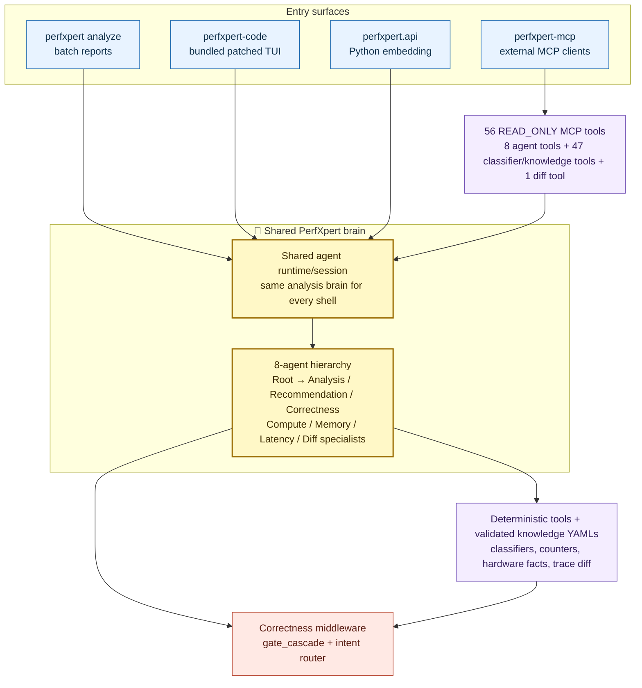

# PerfXpert

AI-powered AMD ROCm GPU trace analysis.

## Caution

> **Experimental software.** PerfXpert is still evolving and is provided
> without warranties or guarantees. AI-generated analysis, explanations, and
> recommendations can be incomplete or incorrect, so verify important results
> before relying on them in production or performance-critical workflows.


## Quickstart

### Install

```bash
# SKIP-SAMPLE — package install + venv setup are host-specific
# Ubuntu 22/24 example. Use the package-manager equivalent on RHEL/SLES.
apt install -y curl git unzip python3-venv python3-pip
python3 -m venv .venv
. .venv/bin/activate
bun --version  # install bun from your approved package source if this fails

# Latest development build from ROCm/rocm-systems.
REF=develop; curl -fsSL "https://raw.githubusercontent.com/ROCm/rocm-systems/${REF}/experimental/python/perfxpert/scripts/pip-install-from-git.sh" | bash -s -- "${REF}"
```

Pin a tag or commit by changing `REF`:

```bash
# SKIP-SAMPLE — replace <SHA> with a real tag or commit
REF=<SHA>; curl -fsSL "https://raw.githubusercontent.com/ROCm/rocm-systems/${REF}/experimental/python/perfxpert/scripts/pip-install-from-git.sh" | bash -s -- "${REF}"
```

The wrapper installs from GitHub, scopes submodule init to the pinned
PerfXpert `opencode` submodule, and builds the patched bundled `perfxpert-code` binary.
If bun is missing, pip fails with an actionable prerequisite message instead
of producing a partial TUI install. The wrapper verifies `perfxpert-code`
before exiting.
No separate `opencode` install is needed for the default `perfxpert-code`
TUI. See [docs/guides/getting-started.md](docs/guides/getting-started.md)
for the Ubuntu/RHEL/SLES package matrix, direct-pip equivalent, editable
installs, and troubleshooting.

### LLM Providers

| Provider | Source | Typical use |
|----------|--------|-------------|
| `anthropic` | Claude API | Production default; requires `ANTHROPIC_API_KEY` |
| `openai` | OpenAI API | Alternative hosted; requires `OPENAI_API_KEY` |
| `ollama` | Local Ollama | Fully local; requires a running `ollama serve` |
| `private` | Any OpenAI-compatible endpoint | Internal deployments; requires an endpoint (`PERFXPERT_LLM_PRIVATE_URL`) plus either `PERFXPERT_LLM_PRIVATE_API_KEY` or `--llm-api-key`; set `PERFXPERT_LLM_PRIVATE_MODEL` to select the deployment model |
| `opencode` | Bundled opencode CLI | Used by `perfxpert-code`; not callable from inside opencode itself (recursion-guarded) |

Private endpoint example:

```bash
# SKIP-SAMPLE — requires a real trace.db and reachable private endpoint
export PERFXPERT_LLM_PRIVATE_URL="https://llm-api.iexample.com/OpenAI"
export PERFXPERT_LLM_PRIVATE_MODEL="gpt-5.3-codex"
export PERFXPERT_LLM_PRIVATE_API_KEY="..."
export PERFXPERT_LLM_PRIVATE_HEADERS='{"Ocp-Apim-Subscription-Key":".......","user":".....","api-version":"preview"}'
perfxpert analyze -i trace.db --llm private
```

### Analyze

`--format` accepts `text` (default), `json`, `markdown`, and `webview`
(AMD-themed HTML). `text` prints to stdout unless `-o/-d` is supplied.
All other formats write a report file by default, even when `-o` and
`-d` are omitted; use `-o -` to force stdout for pipelines.

LLM-backed analysis uses Chat Completions-style requests. Choose a provider
model or private endpoint model that supports the Chat Completions API;
Responses-only, embeddings-only, or non-chat models will fail.

```bash
# SKIP-SAMPLE — requires a real trace.db and provider credentials
export ANTHROPIC_API_KEY="sk-ant-..."
perfxpert analyze -i trace.db --llm anthropic --format webview -o report.html

export OPENAI_API_KEY="sk-..."
perfxpert analyze -i trace.db --llm openai --llm-model gpt-4o-mini --format markdown -o report.md

# Air-gap mode: no LLM calls, deterministic local analysis only.
PERFXPERT_AIRGAP=1 perfxpert analyze -i trace.db --format markdown -o report.md
```

### Interactive TUI

```bash
# SKIP-SAMPLE — launches interactive CLIs and may write backend config
# Default first-class TUI: bundled patched opencode built during install.
perfxpert-code

# Use native shells with PerfXpert MCP and context installed for that backend.
perfxpert-code claude
perfxpert-code codex
perfxpert-code gemini

# Explicit upstream-opencode escape hatch. The default TUI does not need this.
PERFXPERT_OPENCODE_PATH="$(command -v opencode)" perfxpert-code opencode
```

Preview or uninstall a backend integration:

```bash
# SKIP-SAMPLE — preview/uninstall commands mutate or inspect backend setup
perfxpert-code claude --dry-run "analyze this trace"
perfxpert-code uninstall claude
```

### Other Commands

```bash
# SKIP-SAMPLE — requires real trace DB paths
perfxpert diff baseline.db candidate.db --format markdown
perfxpert doctor
```

## Architecture (v0.2.0+)



The GitHub wrapper is the supported install path today. It installs
PerfXpert and builds the default `perfxpert-code` TUI from the pinned
`experimental/python/perfxpert/opencode` submodule plus the local patch
series. If build prerequisites are missing, install fails with
package-manager guidance instead of falling back to an arbitrary opencode
binary.

## Contributing

perfxpert welcomes contributions. Start with [CONTRIBUTING.md](CONTRIBUTING.md)
for the extension-surface matrix + governance. Per-surface guides under
[docs/contributing/](docs/contributing/). Architectural changes go through
an [RFC](docs/rfcs/README.md).

## Feature flags

| Flag | Default | Purpose |
|------|---------|---------|
| `PERFXPERT_OPENCODE_PATH` | unset | Explicit upstream-opencode escape hatch used only by `perfxpert-code opencode ...`; the default TUI ignores it |

## Supported GPUs

| Arch | GPU | CDNA/RDNA |
|------|-----|-----------|
| gfx908 | MI100 | CDNA1 |
| gfx90a | MI210/MI250/MI250X | CDNA2 |
| gfx942 | MI300A/MI300X/MI325X | CDNA3 |
| gfx950 | MI350X/MI355X | CDNA4 |
| gfx1030 | RX 6900 XT | RDNA2 |
| gfx1100 | RX 7900 XTX | RDNA3 |

## Documentation

- **Getting started**
  - [Getting started guide](docs/guides/getting-started.md)
  - [Agentic mode: air-gap vs LLM, provider ladder](docs/guides/agentic-mode.md)
  - [Multi-backend launcher (`perfxpert-code claude|gemini|codex`)](docs/guides/backends.md)
    — register perfxpert with your native Claude Code / Gemini CLI
    TUI while keeping the perfxpert tool-priority gate.
- **Architecture (v0.2.0+)**
  - [Architecture overview](docs/architecture.md)
  - [Architecture index](docs/architecture/README.md)
    - [Agent hierarchy (Root / Analysis / Recommendation / specialists)](docs/architecture/agent-hierarchy.md)
    - [Gate cascade (5 correctness gates as middleware)](docs/architecture/gate-cascade.md)
    - [BackendAdapter protocol (multi-backend launcher)](docs/architecture/backend-adapter.md)
- **Integration**
  - [Integration index](docs/integration/README.md)
    - [MCP server (`perfxpert-mcp`) — 56 READ_ONLY tools (8 agent-hierarchy + 47 knowledge/classifier + 1 trace_diff)](docs/integration/mcp-server.md)
    - [Python API (`perfxpert.api`) — 1:1 mirror of the 8 agent MCP tools](docs/guides/python-api.md)
- **Contributing**
  - [CONTRIBUTING.md](CONTRIBUTING.md)
  - [Contributing index](docs/contributing/README.md)
    - [External-tool dependencies (`require_tool`)](docs/contributing/external-tools.md)
- **Other**
  - [Historical migration notes](docs/archive/migration-to-agentic.md)

## Licensing

MIT. opencode is also MIT — the packaged build bundles a patched binary
from the pinned upstream submodule, and source/editable checkouts use
that same fork via the local submodule build path.
