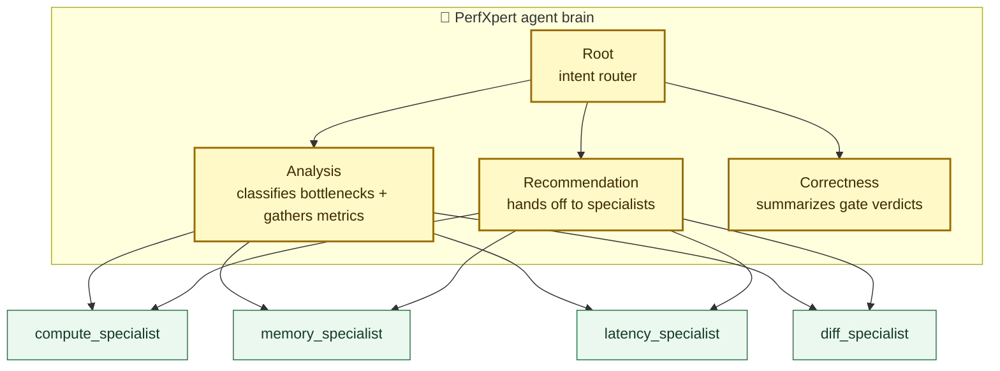

# perfxpert Architecture

_Last refreshed: v0.2.0. Source of truth: local multi-agent-perfxpert
design spec (kept in the contributor's working copy)._

## High-level shape

perfxpert is a **multi-agent system** for GPU performance analysis on AMD
ROCm. The shipped entry surfaces are the batch CLI (`perfxpert analyze`),
the interactive launcher (`perfxpert-code`), the stdio MCP server
(`perfxpert-mcp`), and the in-process Python API (`perfxpert.api.*`).
All four resolve into the same session/runtime layer in
`perfxpert.agents.runtime`.

## Agents (spec §2)



8 agents total. Each has ≤ 400 lines of fence + ≤ 5 tools + ≤ 10 input / ≤ 5 output fields. Narrow scope is CI-enforced.

See [architecture/agent-hierarchy.md](architecture/agent-hierarchy.md) for the tier-by-tier map, fence-slice pattern, and source-tree locations, and [architecture/gate-cascade.md](architecture/gate-cascade.md) for the 5-gate correctness middleware that sits between the agents. The full architecture docs index lives at [architecture/README.md](architecture/README.md).

## Tools (spec §3 + Appendix A)

perfxpert ships dozens of deterministic Python tools. The current MCP
surface exposes **56 READ_ONLY tools**; side-effecting tools remain
in-process only. The split is:

- **READ_ONLY** — safe for MCP (agent lookups, analysis, classification)
- **EXECUTION** — in-process only (profile.run, compile.build, patch.apply)

Every tool is pure (modulo knowledge YAML loads and SQL reads); < 100 ms p99.

## Knowledge (spec §3 Appendix B)

22 YAML files under `perfxpert/knowledge/`, each paired with a JSON schema
in `_schemas/`.
CI validates every YAML against its schema on every PR.

## Providers (spec §3)

5 LLM provider adapters under `perfxpert/providers/`:

- Anthropic (Claude Sonnet family)
- OpenAI (GPT-4 family)
- Ollama (local)
- Private (any OpenAI-compatible endpoint)
- Opencode (bundled subprocess wrapper)

All five verified nightly via `.github/workflows/perfxpert-nightly.yml`.

## Runtime middleware (spec §5)

`perfxpert/runtime/`:

- `gate_cascade.py` — cascaded 5-gate correctness pipeline
- `intent_classifier.py` — deterministic router (air-gap mode)
- `recursion_guard.py` — blocks opencode-in-opencode recursion

## Data flow

### Batch CLI

```
user  →  perfxpert analyze -i trace.db
        → perfxpert.agents.runtime.build_session(...)
        → session.run_root(RootInput(...))
        → agent runtime (Root → Analysis → bottleneck.classify …)
        → Recommendation hands off to specialist
        → Correctness runs 5 gates
        → formatters → text / json / markdown / html
```

### Interactive / backend TUIs

```
user  →  perfxpert-code
        → default patched opencode path
          (repo-local build in source checkouts, bundled binary in wheels)
          OR native claude / gemini / codex CLI
        → perfxpert-mcp + staged prompt / gate config as needed
        → same agent runtime under the hood
```

### Library API

```python
# Agentic library API — v0.2.0+
from perfxpert.agents.runtime import build_session
from perfxpert.agents.schemas import RootInput

session = build_session(airgap=True)  # or provider='anthropic'
output = session.run_root(RootInput(
    user_query="Summarize the primary bottleneck.",
    airgap=True,
))
print(output.primary_bottleneck)
```

### MCP + Python embedding

External clients and in-process callers use the same underlying brain:

- `perfxpert.api.agent_*` calls the same session runners directly.
- `perfxpert-mcp` re-exposes the same READ_ONLY agent and classifier
  tools over MCP.
- `perfxpert-code` backends differ only in TUI / config / gate-plumbing,
  not in analysis semantics.

## Test pyramid (spec §6)

```
Level 5 — Benchmarks (nightly)        TritonBench + KernelBench
Level 4 — End-to-end CLI + SDK (PR)   pytest tests/e2e
Level 3 — Agent integration (PR)      pytest tests/test_integration
Level 2 — Per-agent isolation (PR)    pytest tests/test_agents
Level 1 — Per-tool unit (PR)          pytest tests/test_tools
Level 0 — Knowledge YAML (PR)         pytest tests/test_knowledge
```

## Correctness gates (spec §5)

1. **Claims** — magnitude within proven_optimizations range
2. **Sakana** — hardware-counter sanity
3. **Schema** — output shape valid
4. **Regression** — no hot kernel regressed > 5% (weighted-geomean definition)
5. **Correctness** — semantic preservation (structural)

## What's NOT in this diagram

The following symbols were deleted during the agentic refactor and are
no longer present:

- `interactive.py`, `llm_conversation.py` — bespoke LLM-session state machine (removed in Phase 7.1), superseded by OpenAI Agents SDK sessions.
- `perfxpert/ai_analysis/` module — removed in Phase 7.1 and superseded by `perfxpert/agents/`.

Consult the git history or [CHANGELOG.md](../CHANGELOG.md) for the
old code.

## Pointers

- Full spec and phase plans: living documents in the contributor's
  working copy (not tracked in the repo).
- Contributor entry: `CONTRIBUTING.md`
- RFCs: `docs/rfcs/`
