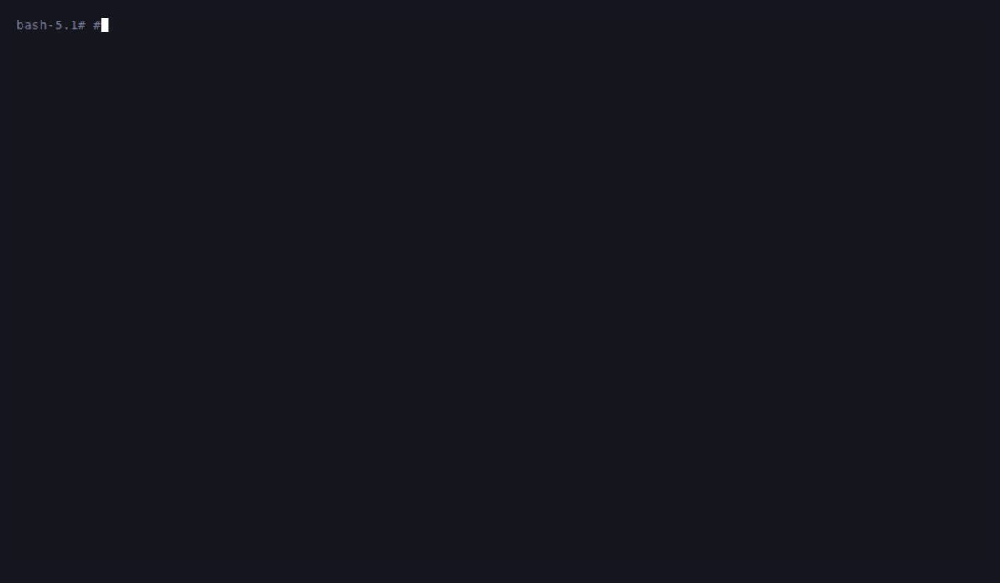
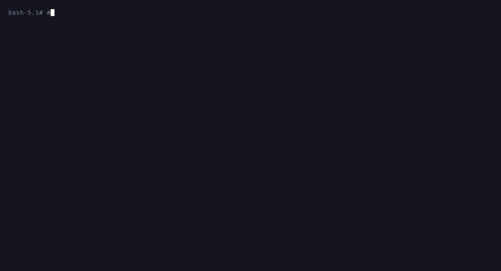
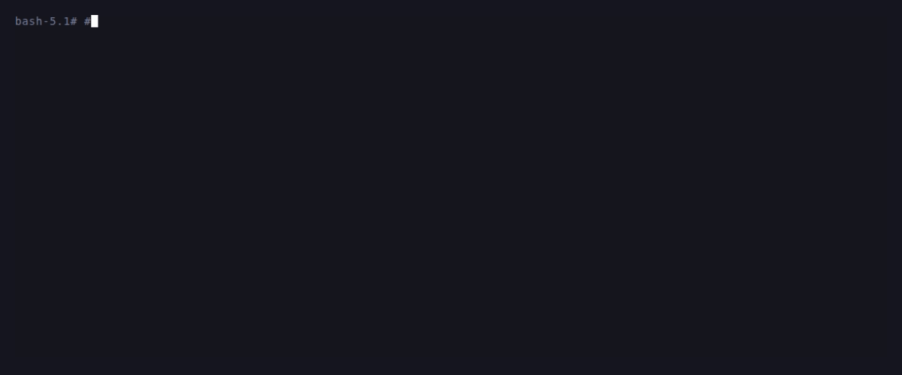
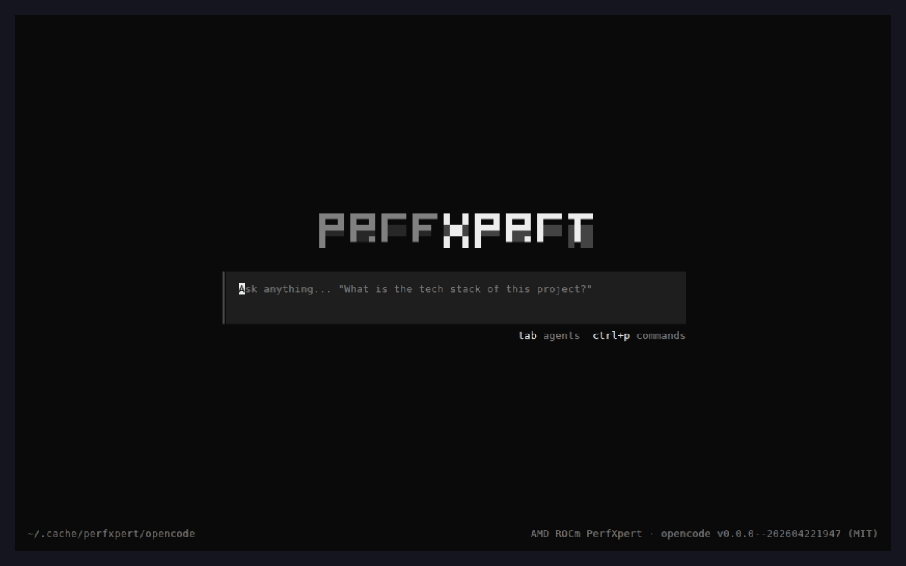
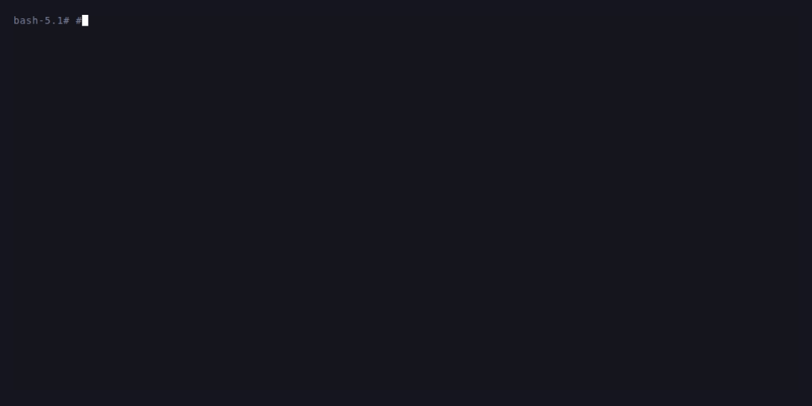
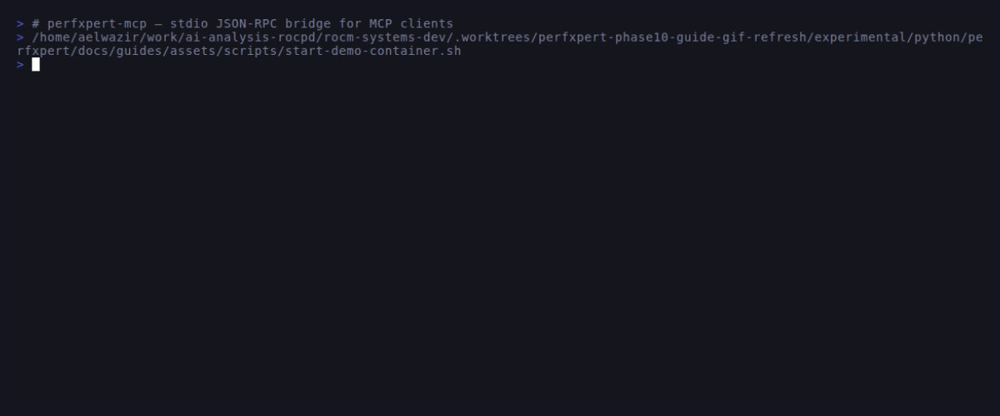

# PerfXpert — Getting Started

This guide walks through
install, the three entry points, the first analysis, and the top
troubleshooting cases. For deeper dives follow the cross-links at the
end of each section; nothing here duplicates reference material that
lives elsewhere.

## What is PerfXpert

PerfXpert is an AI-augmented GPU profiling and optimization tool for
AMD ROCm. It reads `rocprofv3` trace databases (`.db`), classifies
bottlenecks against hardware SoL bounds, and produces targeted
recommendations — either deterministically (air-gap) or with an LLM
specialist agent. Supported GPUs: MI100 / MI200 / MI300 / MI350 and
RDNA2 / RDNA3.

## 1. Install


*Install in a clean ROCm container, then verify the CLI surfaces. The
pip build hook bootstraps bun when needed so the bundled patched
`perfxpert-code` build completes during install.*

PerfXpert ships as a single Python wheel. The `setuptools` build hook
in `setup.py` compiles the AMD-branded bundled opencode binary during
`pip install`. If bun is missing, pip bootstraps it into the user's home
directory. If OS prerequisites such as `curl`, `git`, or `unzip` are
missing, pip fails with the missing package-manager pieces instead of
silently producing a broken `perfxpert-code`.

### Prerequisites

- Python 3.10+
- `curl`, `git`, `unzip`, `python3-venv`, and `python3-pip` for GitHub installs.
- On Ubuntu 24+ and other externally managed Python environments,
  create and activate a virtual environment before invoking pip.
- `bun` on PATH, or `curl` + `unzip` so pip can bootstrap bun into the
  user's home directory during install.
- The repo-pinned `experimental/python/perfxpert/opencode` submodule
  populated if you are installing from a checkout without using the
  wrapper. The setup hook may attempt a scoped `git submodule update
  --init --depth 1 -- experimental/python/perfxpert/opencode`, but it
  will not clone an arbitrary upstream tag during install.

#### Opt-out env vars

- `PERFXPERT_SKIP_BUNDLED_BUILD=1` — skip the entire opencode build.
  Use only in CI that intentionally skips the interactive TUI. The
  default `perfxpert-code` command will not fall back to an arbitrary
  upstream opencode binary.
- `PERFXPERT_SKIP_OPENCODE_FETCH=1` — don't even attempt the scoped
  submodule init when the vendored `opencode/` checkout is empty.
- `PERFXPERT_OPENCODE_PATH=/path/to/opencode` — explicit user-owned
  upstream escape hatch used only by `perfxpert-code opencode ...`.

#### Note on Windows

PerfXpert does not auto-bootstrap bun on Windows. If the bundled
`opencode` build is not available on your host, use the multi-backend
launcher (`perfxpert-code claude` / `codex` / `gemini`) against a native
backend CLI instead.

### Distro package setup

Use a virtual environment for the supported install flow. The GitHub
wrapper path has been validated in clean containers for Ubuntu 22.04,
Ubuntu 24.04, UBI/RHEL 9, UBI/RHEL 10, and SLES 15.6. Package setup
differs slightly by distro:

```bash
# SKIP-SAMPLE — Ubuntu 22.04 / 24.04
apt install -y curl git unzip python3-venv python3-pip
python3 -m venv .venv
. .venv/bin/activate
```

```bash
# SKIP-SAMPLE — RHEL 9
command -v curl >/dev/null || dnf install -y curl
dnf install -y git unzip python3.11 python3.11-pip
python3.11 -m venv .venv
. .venv/bin/activate
```

```bash
# SKIP-SAMPLE — RHEL 10
command -v curl >/dev/null || dnf install -y curl
dnf install -y git unzip python3 python3-pip
python3 -m venv .venv
. .venv/bin/activate
```

```bash
# SKIP-SAMPLE — SLES 15
zypper install -y curl git unzip python311 python311-pip
python3.11 -m venv .venv
. .venv/bin/activate
```

UBI/RHEL base images can provide `curl` through `curl-minimal`. That is
valid for the wrapper and for pip's bun bootstrap; do not force dnf to
replace it with the full `curl` package unless `command -v curl` fails.

If the venv's pip/setuptools are too old and metadata preparation fails
with `filename has 'perfxpert', but metadata has 'unknown'`, upgrade
them inside the venv and retry:

```bash
# SKIP-SAMPLE — only needed for older venv toolchains
python -m pip install -U pip setuptools wheel
```

### Pip install

```bash
# SKIP-SAMPLE — install from a local checkout (editable mode)
pip install -e "experimental/python/perfxpert[all]"
```

…or pull the latest build straight from GitHub using the fast-install
wrapper (see §1.2 for why):

```bash
# SKIP-SAMPLE — latest develop branch, no local clone needed
REF=develop; curl -fsSL "https://raw.githubusercontent.com/ROCm/rocm-systems/${REF}/experimental/python/perfxpert/scripts/pip-install-from-git.sh" | bash -s -- "${REF}"
# Pin a tag or commit hash:
# REF=v0.2.0; curl -fsSL "https://raw.githubusercontent.com/ROCm/rocm-systems/${REF}/experimental/python/perfxpert/scripts/pip-install-from-git.sh" | bash -s -- "${REF}"
# REF=<SHA>; curl -fsSL "https://raw.githubusercontent.com/ROCm/rocm-systems/${REF}/experimental/python/perfxpert/scripts/pip-install-from-git.sh" | bash -s -- "${REF}"
# Base package only:
# REF=develop; curl -fsSL "https://raw.githubusercontent.com/ROCm/rocm-systems/${REF}/experimental/python/perfxpert/scripts/pip-install-from-git.sh" | bash -s -- "${REF}" --extras ''
```

The GitHub install paths require `git` because pip shells out to
`git clone`. The wrapper installs missing OS prerequisites with the host
package manager when it is running as root or when sudo is available;
otherwise it prints the exact package-manager command to run first. On
externally managed system Python it tells the user to create a virtual
environment first. It prefers the active `python`, then `python3`, and
only falls back to another already-installed `python3.10+` binary on
PATH when the distro default is too old; it never downloads a separate
Python runtime. During the pip build, `setup.py` bootstraps bun when it
is missing so the bundled patched opencode binary is built from the
pinned perfxpert submodule.

Pass the ref as the first argument after `bash -s --` when you need to
pin a specific tag or commit hash.

If you already have a local rocm-systems checkout, the equivalent
command is:

```bash
# SKIP-SAMPLE — local checkout equivalent
bash rocm-systems/experimental/python/perfxpert/scripts/pip-install-from-git.sh develop
# bash rocm-systems/experimental/python/perfxpert/scripts/pip-install-from-git.sh <SHA>
```

The `[all]` extra pulls in `anthropic`, `openai`, `rich`, and
`litellm`, which covers the hosted/local SDK-backed provider paths.
The bundled `opencode` path is validated separately through the
launcher/build flow. Omit `[all]` if you only want deterministic
air-gap analysis (wrapper: pass `--extras ''` to skip extras entirely).
On the GitHub wrapper path, the wrapper exits non-zero if the bundled
patched `perfxpert-code` binary is still absent after install. Direct
pip/editable paths use the same `setup.py` build hook: pip bootstraps
bun when the OS prerequisites are available, or fails with a
distro-specific prerequisite message when they are not.

### 1.2 Why the wrapper: scoped submodule init

`pip install "perfxpert @ git+https://...rocm-systems.git#subdirectory=..."`
triggers pip's built-in `git submodule update --init --recursive -q`
on the cloned work-tree BEFORE the perfxpert build hook ever runs.
The rocm-systems root `.gitmodules` declares ~34 submodules (mscclpp,
perfetto, glog, fmt, gtest, dyninst, sqlite, …) shared by the other
projects in the monorepo; pip dutifully fetches every one of them.
PerfXpert itself only needs ONE of them — the `opencode` submodule at
`experimental/python/perfxpert/opencode`, used by the build hook to
compile the bundled AMD-branded opencode binary.

Measured on a fast host against the live rocm-systems repo:

| Step                                                  | Time      |
|-------------------------------------------------------|-----------|
| `git clone --filter=blob:none --depth 1` of rocm-systems | ~15 sec   |
| `git submodule update --init --recursive -q` (pip default) | **141 sec** |
| `git -c submodule.active=…/opencode submodule update --init --recursive -q` | **0.03 sec** |

On stock `rocm/dev-ubuntu-22.04` with corporate-grade bandwidth the
default step regularly runs 3-6 minutes — and the first 99% of that
time is downloading dependencies of projects the PerfXpert wheel
never touches.

`scripts/pip-install-from-git.sh` wraps pip with these env vars set:

```bash
GIT_CONFIG_COUNT=1
GIT_CONFIG_KEY_0=submodule.active
GIT_CONFIG_VALUE_0=experimental/python/perfxpert/opencode
```

pip uses `os.environ.copy()` when it spawns git subprocesses, so
those env vars propagate into `git submodule update --init
--recursive -q` and the `submodule.active` config restricts init to
the single path listed. All other submodules stay at zero bytes on
disk. Documented under `git-config(1) "GIT_CONFIG_COUNT"` and
`gitmodules(5) "submodule.<name>.active"`.

If the user insists on the plain one-liner without the wrapper, pip
still works — they just pay the 3-6 min submodule-init penalty once.
The `setup.py` build hook notices if the opencode submodule is still
empty after pip's checkout (i.e. the user scoped submodule init out
manually without including opencode), but it does **not** clone from
the network during install. Instead it fails with the missing pinned
submodule path so the default `perfxpert-code` install cannot silently
fall back to an arbitrary opencode binary.

Opt-outs:

- `PERFXPERT_SKIP_OPENCODE_FETCH=1` — don't attempt the scoped
  submodule init; air-gap CI that intentionally skips the bundled
  opencode build should set this AND `PERFXPERT_SKIP_BUNDLED_BUILD=1`.

### What the build hook does

It applies all 26 patches in `.patches/` (AMD branding, color palette,
per-model system-prompt preambles with the STRICT-TOOL-DISCIPLINE
stanza, the tool-priority gate, and the deep-rebrand session UI) to the
pinned `opencode` submodule, runs the locked root `bun install`, then
compiles the current-platform binary with `bun run build --single
--skip-install`. The explicit `--skip-install` avoids opencode's
secondary dynamic package install during the compile step; the locked
install already populated the dependencies needed for the bundled
binary. The final executable is copied to
`perfxpert/_bundled/opencode`. Subsequent `pip install` invocations skip
the rebuild if the binary is already newer than every patch file.

**Opt-out:** set `PERFXPERT_SKIP_BUNDLED_BUILD=1` only in offline /
sandboxed CI that intentionally skips the interactive TUI build.
Default `perfxpert-code` requires the bundled binary built from the
pinned submodule.

**Bun missing:** pip bootstraps bun into the user's home directory when
`curl` and `unzip` are available. If those OS prerequisites are missing,
pip exits with distro-specific package-manager guidance.

## 2. Verify


*`perfxpert --help`, `perfxpert analyze --help`, and the first lines of
`perfxpert doctor` — everything the CLI exposes is one flag away.*

```bash
# SKIP-SAMPLE — requires perfxpert on PATH from the pip install above
perfxpert doctor
```


*`perfxpert doctor` end-to-end: Python check, MCP server reachable
(56 tools registered), 3/5 LLM providers configured, `ALL CLEAN`.*

Expected output ends with `ALL CLEAN` when everything is wired. The
doctor checks:

- `perfxpert` version + Python ≥ 3.10
- openai-agents SDK
- MCP server reachable (`perfxpert-mcp` boots + 56 tools registered — 8 agent-hierarchy + 47 classifier/knowledge + 1 `trace_diff.diff_runs`)
- task store (`~/.perfxpert` or `$PERFXPERT_TASK_ROOT`)
- patched opencode binary resolution + bundled opencode config dir
- LLM providers configured (counts `N/5` against
  `ANTHROPIC_API_KEY`, `OPENAI_API_KEY`,
  `PERFXPERT_LLM_LOCAL_URL` or `OLLAMA_HOST`,
  `PERFXPERT_LLM_PRIVATE_URL` or `PRIVATE_LLM_ENDPOINT`,
  plus always-present `opencode`)

If `opencode binary` reports missing, the install skipped or failed the
bundled build. Reinstall through the GitHub wrapper so the pinned
submodule is populated and bun is bootstrapped before the wheel build
finishes.

## 3. Three entry points

PerfXpert ships three command-line surfaces, all driving the same
agent runtime.

- **`perfxpert analyze -i trace.db`** — non-interactive CLI. Consumes
  a rocprofv3 `.db`, emits a single report (text / JSON / markdown /
  webview HTML). Deterministic with `--llm` omitted; LLM-augmented
  with `--llm {anthropic,openai,ollama,private,opencode}`.
- **`perfxpert-mcp`** — stdio MCP server that re-exposes the 56
  READ-ONLY analysis tools over JSON-RPC (8 agent-hierarchy entry
  points — Root, Analysis, Recommendation, Correctness, +3 technique
  specialists, + diff specialist — plus 47 classifier / knowledge
  tools and 1 `trace_diff.diff_runs`). Meant to be
  spawned by an MCP client (Claude Desktop, Claude Code, Codex CLI,
  Gemini CLI, opencode). See `../integration/mcp-server.md`.
- **`perfxpert-code`** — interactive TUI (the patched opencode
  bundle). Conversational optimization loop with the Root → Analysis
  → Recommendation → Specialist agent hierarchy and gate-cascade
  correctness middleware.

## 3.1 Choosing a backend

`perfxpert-code` is multi-backend: packaged installs default to the
bundled AMD-branded patched opencode, while source/editable checkouts
prefer a locally built patched binary from the pinned `opencode`
submodule. It can also wrap the user's native Claude Code, Gemini CLI,
or Codex CLI while still enforcing the perfxpert tool-priority gate and
registering the `perfxpert-mcp` server for free. Pick whichever matches
your existing LLM workflow.

- **Default (no subcommand)** — patched opencode path, the recommended
  entry point. Wheels ship the bundled binary; source checkouts can
  rebuild the same patched fork locally. Prompt + MCP come pre-wired.
- **`perfxpert-code claude`** — registers perfxpert as an MCP
  server in the Claude Code project config, installs the native
  `PreToolUse` gate hook, then execs the user's `claude` CLI.
- **`perfxpert-code gemini`** — writes `perfxpert-mcp` into the
  project-local `.gemini/settings.json`, list-appends a
  project-cache prompt file to `context.fileName`, installs
  native Gemini `BeforeTool` / `AfterTool` hooks, and never
  touches the user's `GEMINI.md`, then execs `gemini`.
- **`perfxpert-code codex`** — writes the perfxpert MCP stanza into
  `<cwd>/.codex/config.toml` when the project is trusted (otherwise
  falls back to `~/.codex/config.toml`), writes a project-root
  `AGENTS.override.md` compatibility override so Codex actually loads
  the perfxpert prompt, and execs `codex`. Gate
  enforcement is prompt-layer-only because Codex's native
  `PreToolUse` hook is Bash-only as of April 2026; the trust gate
  runs before MCP registration and either prompts or honors
  `PERFXPERT_AUTO_TRUST=1` (see §3.2 below).

Short recipe per backend:

```bash
# SKIP-SAMPLE — requires the named backend binary on PATH
perfxpert-code                              # default (patched opencode path)
perfxpert-code claude                       # Claude Code (native TUI)
perfxpert-code gemini                       # Gemini CLI
perfxpert-code codex                        # Codex CLI
perfxpert-code uninstall claude             # reverse the Claude install
```

See [backends.md](backends.md) for the full per-backend install /
uninstall recipes, the gate-hook event-based lift semantics, the
consent model (per-backend × cwd × file-set), and the env-var
reference (`PERFXPERT_MCP_WARMUP_TIMEOUT_S`,
`PERFXPERT_MCP_RETRY_BUDGET_S`, `PERFXPERT_SKIP_LIVE_CHECK`,
`PERFXPERT_ASSUME_CONSENT`). The gate-probe coverage table in
[backends.md §Gate-probe](backends.md) documents which small-model
probe each backend uses to verify mechanical gate enforcement at
`install()` time — Codex is not probed because its gate is
prompt-layer-only.

## 3.2 Codex trust gate

Codex refuses to run agents in a project directory that isn't marked
`trusted` in `~/.codex/config.toml`. `perfxpert-code codex` handles
this as a separate step BEFORE MCP registration:

- **Interactive sessions** — the adapter prompts "Trust <cwd> for
  Codex? [y/N]" and writes `[projects."<abs-cwd>"].trust_level =
  "trusted"` on confirmation.
- **CI / non-interactive** — set `PERFXPERT_AUTO_TRUST=1` to
  auto-trust the cwd without prompting. An always-on stderr warning
  ("perfxpert-code codex: auto-trusted <cwd> because
  PERFXPERT_AUTO_TRUST=1") is emitted even under `--quiet` — this is
  the security-warning contract.
- Without either path, the adapter raises `TrustRequired` and exits
  non-zero. `ConfigClobber` is raised if `~/.codex/config.toml` is
  git-tracked or fails to parse.

## 3.3 First run — `perfxpert init`

New in Phase 8 (Confluence roadmap row #29). A single guided wizard
that chains the four things every new user asks about into one flow
so you don't have to discover them separately:

1. **GPU detection** — runtime discovery runs `rocminfo`, `rocm-smi`,
   and `amd-smi` when they are present, with read-only KFD topology as a
   fallback for ROCm environments where `rocminfo` cannot open the
   device node. The local init wizard uses GPU facts such as gfx id, CU
   count, clocks, wave size, LDS size, VRAM, PCIe, and power limits.
   Theoretical peak FLOPS are derived for newly discovered local
   architectures when enough topology is available;
   `perfxpert/knowledge/gpu_specs.yaml` remains the offline fallback for
   non-local architectures and for fields a ROCm tool does not expose on
   that stack.
   Runtime discovery is scoped to the machine where the command runs. If
   an agent is optimizing a workload over SSH, run the ROCm discovery
   commands on that remote target host or run PerfXpert on the remote host
   itself; do not use the controller machine's local GPU facts for remote
   roofline or SoL analysis. If local runtime specs would describe the
   wrong machine, set `PERFXPERT_DISABLE_RUNTIME_GPU_SPECS=1` and pass
   explicit remote facts / `--arch`.
2. **Framework detection** — Tier-0 source scan (same scanner as
   `analyze --source-dir`, same `.git` / `node_modules` filters) plus a
   Python import probe for `torch`, `tensorflow`, `jax`, `cupy`.
3. **Config generation** — writes
   `~/.config/perfxpert/config.yaml` with the Pydantic-validated
   defaults and the detected provider. When the file already exists
   the wizard prints a unified diff and asks before overwriting
   (skipped under `--non-interactive`).
4. **Suggested first profiling command** — the lowest rung of the
   cost-ordered ladder (`rocprofv3 --sys-trace`). When the source scan
   found HIP kernels, a second `--pmc SQ_WAVES GRBM_COUNT
   GRBM_GUI_ACTIVE` line is emitted too; when a Python framework is
   detected, the target is `python train.py` instead of `./your_app`.

```bash
# SKIP-SAMPLE — requires perfxpert on PATH from the pip install above
perfxpert init                              # interactive (confirms diffs)
perfxpert init --non-interactive            # CI / scripting
perfxpert init --source-dir ./my_project    # target a specific source tree
perfxpert init --arch gfx942                # override GPU detection
perfxpert init --provider openai            # pin the LLM provider
perfxpert init --config-path /tmp/pxcfg.yaml --non-interactive   # sandbox
```

Sample transcript on an MI300X host with `ANTHROPIC_API_KEY` exported:

```
== perfxpert init — first-run wizard ==

Step 1/4 — GPU detection
  detected: gfx942 (MI300X, 304 CU)
    peak FP32: 163.4 TFLOPS
    peak HBM : 5.3 TB/s

Step 2/4 — Framework detection
  source dir: .
  python deps: PyTorch importable ⇒ framework: PyTorch
  source scan: 12 file(s), 3 kernel(s) ⇒ programming model: HIP
  (both detected ⇒ mixed python+kernel workload)

Step 3/4 — Config generation
  provider  : anthropic
  airgap    : false
  max_tokens: 2048
  target    : ~/.config/perfxpert/config.yaml

Step 4/4 — Suggested first profiling command
  primary : rocprofv3 --sys-trace -d ./profile_out -- python train.py
  extra   : rocprofv3 --pmc SQ_WAVES GRBM_COUNT GRBM_GUI_ACTIVE -d ./profile_out_pmc -- python train.py
  (--pc-sampling / --att are second-tier — run after Tier-1 identifies hot kernels)

Then:
  perfxpert analyze -i ./profile_out/*.db --source-dir . --format webview -o report

Wizard complete. Your setup is ready.
```

`--non-interactive` never prompts; it always overwrites the config if
one exists, so it's safe in CI. The current init-wizard provider probe
order is: `ANTHROPIC_API_KEY` → `OPENAI_API_KEY` →
`PERFXPERT_LLM_PRIVATE_URL` (compat: `PRIVATE_LLM_ENDPOINT`) →
`OLLAMA_HOST` → patched `opencode` (no key required). The broader CLI
surfaces (`analyze`, `doctor`) also accept the newer
`PERFXPERT_LLM_LOCAL_URL` spelling for Ollama.

## 4. First analysis (60 seconds)

Profile a trivial HIP app, then analyze.

```bash
# SKIP-SAMPLE — requires ./my_app built against ROCm and rocprofv3 on PATH
rocprofv3 --sys-trace --summary -d ./out -o results -- ./my_app
perfxpert analyze -i ./out/results_results.db --format text
```

`rocprofv3` writes `./out/results_results.db` (the `_results` suffix
is the rocprofv3 default); `perfxpert analyze` reads it, classifies
the bottleneck (compute-bound / memory-bound / latency-bound /
idle-bound), ranks hot kernels by Amdahl weight, and emits
recommendations.


*Deterministic airgap analysis of the fixture `compute_bound.db` —
SUMMARY, TIME BREAKDOWN, HOTSPOTS, HARDWARE COUNTERS, RECOMMENDATIONS,
all in under a second.*

Output formats:

```bash
# SKIP-SAMPLE — requires a real trace.db
perfxpert analyze -i trace.db --format json -d ./out -o report
perfxpert analyze -i trace.db --format markdown -d ./out -o report
perfxpert analyze -i trace.db --format webview -d ./out -o report
```


*`--format json | jq` — flat top-level keys make the report easy to
drive from scripts or dashboards.*



*`--format markdown` — drop straight into PR descriptions or a wiki.*



*`--format webview` produces a self-contained `analysis.html` with the
fixed 7 top-level sections (Overview, Summary, Execution, Hotspots,
Hardware Counters, Recommendations, Tier-0 when `--source-dir` is
set). AMD dark theme, SVG gauges, collapsible cards — email-ready.*

#### Source-line correlation

When `--source-dir` is supplied alongside `-i`, every row of the
**Top Kernel Hotspots** table grows a `▾` chevron next to the kernel
name. Clicking the chevron expands an inline panel — same visual
style as the Recommendation card drawer — showing the kernel's
**Definition** (file:line where the `__global__` symbol is declared)
and every detected **Launch site** (file:line of each
`hipLaunchKernelGGL` / triple-angle dispatch). Each line renders with
a `Copy` button and a launch-type badge (`__global__`,
`HIP_KERNEL_LAUNCH`, `<<< >>>`), VTune/NSight-style.

When `--source-dir` is **not** supplied the panel is still present
but explains how to enable the correlation. When the scanner did run
but no symbol matches the hotspot's basename, the panel shows
"No matching source location detected" — useful signal that the
profiled binary and the `--source-dir` tree may be out of sync.

Source-line correlation is data, not advice, so the panel ships
regardless of the Tier-0 instrumentation-advice gate (`has_profiling`).
The markdown and text formats append a compact
`Source: file.hip:42 (definition), file.hip:88 (launch)` line under
each hotspot row; the JSON format emits
`hotspots[i].source_locations: [{file, line, kind}]` (schema
`0.3.1`).

#### ATT flame graph

When the input DB carries Advanced Thread Trace (ATT) data — i.e.
`perfxpert analyze -i trace.db --att-dir <att/>` — the Thread Trace
scard renders a dependency-free **inline SVG flame graph** directly
below the per-kernel stall table. One horizontal row per kernel, one
stacked rectangle per stall category (VMEM latency / LDS conflict /
dependency chain / branch divergence), width proportional to the
weighted stall bucket. Colors reuse the webview stall-category
palette, wide rects carry an inline `<label> <pct>%` tag, narrow ones
fall back to the shared hover-tooltip.

Click any rectangle to jump straight to the matching recommendation
card (`id="rec-<kernel>"`), which briefly flashes to help you trace
the visual signal back to the structured advice. Wheel-zoom works on
the SVG `viewBox` (double-click to reset). The whole element is a
single self-contained `<svg>` — no Speedscope, no D3, no Chart.js,
no external CSS — so the report still opens correctly from any
`file://` path in an airgapped viewer.

```html
<!-- shape (truncated) inside the Thread Trace `.scard` -->
<div class="att-flame">
  <svg class="att-flame-svg" viewBox="0 0 960 …" …>
    <rect class="att-flame-rect" data-k="kernel_foo"
          onclick="…scrollIntoView('rec-kernel_foo')…" fill="#ff8c00"/>
    …
  </svg>
</div>
```

The flame graph is webview-only; the Markdown / text / JSON formats
already surface the same data via the per-kernel stall table and
`thread_trace` key respectively, so no schema bump was required.

#### Live roofline chart

When the input DB carries Tier-2 hardware counters (i.e.
`rocprofv3 --pmc SQ_INSTS_VALU FETCH_SIZE WRITE_SIZE …`) the webview
renders a **Live Roofline** `.scard` between Hardware Counters and
Optimization Recommendations. The section is a dependency-free inline
SVG with log-log axes (arithmetic intensity on X, achieved FLOPs/s on
Y). One dot per top-K kernel, coloured by regime
(compute-bound / memory-bound / balanced). Peak-compute horizontal
ceilings per dtype — FP32 / FP16 / BF16 / FP8 / INT8 — are overlaid
with the dominant dtype at full opacity and others dimmed. The HBM
bandwidth diagonal (slope 1 in log-log space) and the ridge-point
annotation (`gfx942 · 163 TF/s · 5.3 TB/s · ridge @ 30.8 FLOPs/B`) are
drawn from `perfxpert/knowledge/gpu_specs.yaml`. Runtime discovery is
used for local-only GPU initialization and for runtime-only local
architectures that are not yet present in the static catalog.

Click any dot to jump straight to the matching recommendation card
(`id="rec-<kernel_basename>"`) — same anchor convention as the ATT
flame graph. Scroll-wheel to zoom the chart `viewBox`, double-click to
reset. Dtype detection is a regex over the demangled kernel name
(`_bf16`, `_fp16`, `_fp8`, `_int8`); pass `dtype_hint="bf16"` to the
underlying `perfxpert.tools.roofline.plot_points` API to force a
single dtype when your kernels don't follow that convention.

The Markdown / text / JSON fallbacks carry the same data under
`## Live Roofline` tables (kernel / AI / achieved GFLOPs/s / regime /
dtype / confidence) and a `roofline` key at the top of the JSON
document.

### Report contents (every format)

Every format — text, JSON, markdown, webview — carries the same
dataset. The deterministic pass runs unconditionally (even with
`--llm <prov>` or under airgap); the LLM supplies narrative +
primary-bottleneck + recommendation prose on top. The four formats
differ only in rendering, not in completeness. Every report
contains:

- **Agent narrative** — the LLM prose (or the airgap template in
  deterministic mode), spliced at the top of the report under a
  "Summary" heading.
- **Primary bottleneck** — explicit label (compute / memory_transfer
  / latency / mixed / data_insufficient).
- **Time breakdown** — kernel / memcpy / API-overhead percentages
  plus total runtime and kernel count. Multi-DB reports also surface a
  normalized runtime for overlap-safe percentage math while preserving the
  wall-clock total runtime separately.
- **Hotspot list** — top-N kernels ranked by total duration, with
  call count, avg / min / max duration, percent of total.
- **Memory analysis** — H2D / D2H / D2D volumes, total duration, and
  average bandwidth per direction.
- **Hardware counters** — Tier-2 derived metrics (GPU utilization,
  avg waves, HBM utilization) plus the raw collected counter table.
  Shows a graceful "not collected" placeholder when the `.db` was
  captured without `--pmc`.
- **Kernel resources / occupancy** — VGPR / SGPR / LDS / scratch and
  theoretical occupancy for each hotspot kernel when the trace
  carries kernel-symbol metadata.
- **API overhead breakdown** — top HIP / HSA API calls by total time
  plus warmup outliers when detected.
- **Thread-trace (Tier 3)** — included when `--att-dir` is set;
  per-instruction stall ratio and bottleneck category (VMEM,
  LDS-bank, dep-chain, branch-divergence).
- **Communication analysis (RCCL)** — included when the trace carries
  RCCL collectives (either `category='RCCL'` regions or RCCL-named
  kernels matching the fallback regex). Surfaces per-collective
  message bytes, duration, **bus bandwidth** (algorithm-adjusted;
  factor is `2(N-1)/N` for AllReduce and `(N-1)/N` for
  AllGather/ReduceScatter/AllToAll), achievable **peak** from the
  per-arch XGMI spec, **efficiency %** (poor <40%, fair 40-70%,
  good >70%), and **comm/compute overlap %** (time inside RCCL
  kernels that coincides with non-RCCL work). When the DB lacks
  `category='RCCL'` spans the section is still rendered, but
  `summary.capture_incomplete=true` and `msg_bytes` is zero (install
  rocprofv3 ≥ 6.2 for full RCCL arg capture).
- **Tier-0 source findings** — included when `--source-dir` is set;
  detected kernels, anti-patterns, suggested counters, and the
  suggested first-profiling command.
- **Recommendations (merged)** — LLM + deterministic recommendations
  merged and deduped by target, each with category / issue /
  suggestion / citation / code-snippet-before / code-snippet-after
  (where available).
- **Warnings** — alert block (empty when no warnings fire).
- **Metadata** — GPU arch, DB path, kernel count, total runtime,
  provider, model (footer).

The JSON format exposes each section under a flat top-level key
(`.time_breakdown`, `.hotspots`, `.memory_analysis`,
`.hardware_counters`, `.kernel_resources`, `.api_overhead`,
`.tier0_findings`, `.recommendations`, `.narrative`,
`.primary_bottleneck`, `.warnings`, `.metadata`) — so `jq` pipelines
can slice the report without reaching into nested schema shapes.

For multi-DB inputs, `time_breakdown.total_runtime` remains the wall-clock
runtime of the merged trace window. `execution_breakdown.normalized_runtime_ns`
and the markdown/text "Normalized runtime" labels are the summed shard envelope
used for percentage math so overlapping shards do not under-report API
overhead or idle time.

### Report structure

Every report renders the same top-level sections in a fixed order. The
main take-away: **the Tier-0 source scan always lives in its own
section — NEVER folded into the main recommendations table**.

The webview emits the following 8 top-level sections, in order:

1. **Overview** — bottleneck verdict, total runtime, kernel-time KPI,
   analysis tier (all inside the first `.scard` card right after the
   `<header>`).
2. **Summary** — agent narrative (findings-derived: dominant kernel +
   metric evidence + primary-bottleneck verdict). Never routing prose.
   Emitted as a `.scard` labelled "Summary" with the primary bottleneck
   surfaced as a header pill and warnings as a findings list.
3. **Execution Breakdown** — stacked kernel / memcpy / API-overhead /
   GPU-idle bar + per-row details.
4. **Top Kernel Hotspots** — top-N kernels by total duration.
5. **Hardware Counters** — Tier-2 gauges (GPU utilization, wave
   occupancy) + raw counter table. Renders a Tier-1 placeholder when
   counters are missing.
6. **Live Roofline** — log-log roofline chart (inline SVG), only when
   Tier-2 counters are present. See "Live roofline chart" above.
7. **Optimization Recommendations** — merged LLM + deterministic
   recommendations, deduped by target. **Only real perf-issue items**
   (e.g. hot-kernel triage, cache-unfriendly access, synchronous
   hipMemcpy patterns). Instrumentation advice (what counters to
   collect, what rocprofv3 command to run first) is **NOT** in this
   list.
8. **Tier-0 Source Scan** — only when `--source-dir` is set. Emitted
   as a single wrapper `.scard` (id `tier0-scan`) containing
   `<h3>Profiling Plan</h3>` (suggested `rocprofv3 --sys-trace …`
   command, suggested counters, other instrumentation actions) and a
   **Detected Code Patterns** table with actual code-level perf issues
   found by the scanner (these ALSO appear in the main Recommendations
   list so they don't get overlooked).

The Markdown format mirrors this exactly: `# PerfXpert AI Performance
Analysis` → `## Summary` (narrative + warnings) → `---` horizontal rule
→ `**Database:**` / `**Analysis Date:**` / `**Analysis Tier:**`
metadata block → `## Time Breakdown` → `## Top Kernel Hotspots` → …
→ `## Recommendations` → (if `--source-dir`) `---` →
`## Tier 0 — Source Scan`.

The Text format prepends a SUMMARY banner (with the primary bottleneck,
narrative, and warnings) above the TIME BREAKDOWN table, keeps every
other section in the same order as the webview, and ends with the
TIER-0: PROFILING PLAN + DETECTED CODE PATTERNS banners when
`--source-dir` is set.

The JSON format exposes each section under a flat top-level key
(`.time_breakdown`, `.hotspots`, `.memory_analysis`,
`.hardware_counters`, `.kernel_resources`, `.api_overhead`,
`.tier0_findings`, `.recommendations`, `.narrative`,
`.primary_bottleneck`, `.warnings`, `.metadata`). The Tier-0 block
lives under `.tier0_findings.profiling_plan` +
`.tier0_findings.code_patterns`. The document carries
`"schema_version": "0.3.0"` on every agentic run. The version bumps
additively along the chain **0.3.0 → 0.3.1 → 0.3.2 → 0.3.3 → 0.3.4
→ 0.4.0** as richer data appears: `0.3.1` when `--source-dir` was
supplied and at least one hotspot carries `source_locations`;
`0.3.2` when RCCL / NIC `communication` data is present (from
`rccl_analysis.analyze_collectives`); `0.3.3` when any rec carries a
`predicted_impact_range` (Change-Impact Prediction); `0.3.4` when a
top-level `roofline` key is emitted (Live Roofline, from
`roofline.plot_points`); `0.4.0` when ATT data is present (ATT
trumps the others).
The legacy `.llm_enhanced_explanation` key mirrors `.narrative` for
backwards compat; new consumers should read `.narrative` directly.

### Severity legend — hotspot panel

Each hotspot row (and expanded source panel) carries a severity
class derived from its share of total runtime. The webview colors
the left border + pill badge; the markdown / text formats emit a
`[CRITICAL] / [HOT] / [WARM] / [COOL]` tag on the citation line.

| Class | Threshold (% of total runtime) |
|-------|-------------------------------|
| CRITICAL | ≥ 20% |
| HOT | 5% – 20% |
| WARM | 1% – 5% |
| COOL | < 1% |

### Advanced recommendations (`--advanced`)

The advanced tier is an opt-in set of recommendations that are too
speculative to show by default but valuable to power users: LLVM
loop-hint pragmas (`#pragma clang loop unroll[_count|disable]`).
They are gated behind the `--advanced` CLI flag (or the
`PERFXPERT_ADVANCED_RECS=1` environment variable).

```bash
# SKIP-SAMPLE — requires a real trace.db
perfxpert analyze --advanced -i trace.db --format text
# Equivalent (CI-friendly):
PERFXPERT_ADVANCED_RECS=1 perfxpert analyze -i trace.db --format text
```

When the gate is ON, pragma recommendations surface alongside regular
recs with a ``[advanced]`` badge next to the priority label and a
mandatory `Verify with: perfxpert diff ...` footer. The knowledge
base (``perfxpert/knowledge/compiler_pragmas.yaml``) allows exactly
three pragmas: `clang_loop_unroll_full`, `clang_loop_unroll_count`,
and `clang_loop_unroll_disable`. Seven other clang loop hints
(vectorize, interleave, distribute, pipeline, vectorize_predicate)
are explicitly rejected because the LLVM amdgpu backend ignores them
on HIP device code.

Hard rules enforced by the fence slice in
``perfxpert/agents/fence/compute_specialist.md``:

* Every pragma rec must carry a Tier-0 source anchor
  (``source_file``/``source_line``) — no anchor, no rec.
* ``unroll_count(N)`` only uses N from the YAML ``factor_sweep``
  (``[2, 4, 8]``); the agent may never invent other factors.
* Triton-generated kernels (source path contains ``.triton/``) are
  skipped — the hint would evaporate on the next JIT invocation.

Under the default (gate OFF) the report is unchanged; pragma recs are
filtered out of the rendered output.

### Kernel-fusion candidates

When the Compute Specialist surfaces adjacent-short-kernel pairs with
matching tensor-shape signatures, it cites a recipe from
`perfxpert/knowledge/fusion_patterns.yaml`:

- Elementwise + Elementwise → single kernel
- Elementwise + Reduce → epilogue fuse
- Normalization + Residual → single pass
- GEMM + Bias-Add + Activation → fused epilogue

Estimated speedup comes back as an `(est_speedup_lo, est_speedup_hi)`
bracket. Verify with `perfxpert diff` after applying the fusion.

### GPU runtime monitor (thermal / power)

PerfXpert ingests pre-captured `amd-smi` / `rocm-smi` JSON logs — we
do not shell out to the tools at analyze time. Capture in advance:

```bash
# SKIP-SAMPLE — capture a 30-second thermal log before analyze
amd-smi monitor --json --interval 1 --duration 30 > /tmp/amd-smi.json
export PERFXPERT_GPU_MONITOR_LOG=/tmp/amd-smi.json
perfxpert analyze -i trace.db
```

Latency specialists consult the log opportunistically to flag
thermal / power throttle as root cause vs contributing factor.

### Unified-memory + MI300X cross-die

The Memory Specialist now runs `unified_memory.analyze_paging(db_path)`
on every memory-bound recommendation, surfacing:

- CPU-resident GPU-accessed pages (HtoD/DtoH > 1 MiB spikes).
- MI300X XCD-to-XCD fabric traffic totals and a per-access penalty
  estimate (~30 ns/access).
- Targeted recommendations — pin host buffers, `hipMemAdvise`, or
  partition with `ROCR_VISIBLE_DEVICES`.

### Dependency graph + GPU bubbles

The Latency Specialist reconstructs a coarse DAG of kernel dispatches
via `dependency_graph.reconstruct_dag(db_path)` and flags:

- Per-stream idle gaps > 2 us as `bubbles`.
- Over-synchronisation (`sync_event_count` > kernel_count / 4).
- `critical_path` longer than 60% of wall time → structural
  parallelism recommendation (stream partitioning, HIP graph capture).

### Predicted impact on recommendations

Every rec card whose category maps onto a recognised optimisation
technique now carries a **Predicted** line bracketing the expected
speedup and citing its source:

```text
[HIGH] Compute-Bound Kernel  (Confidence: 85%)
  Issue: Kernel 'heavy_valu_kernel' dominates GPU time: 99.9%
  Suggestion: Reduce VGPR pressure via __launch_bounds__
  Predicted: 1.15-1.45x (conf 70%)
```

Rules (all enforced by `perfxpert.tools.predict_impact`):

- **Amdahl guard** — kernels below 5% of total runtime never get a
  prediction; the rec renders without a Predicted line.
- **Tier-2 gate** — requires counter data (`--pmc basic` on the
  baseline run). Tier-1 reports fall back to a "needs counters"
  rationale and skip emission.
- **Conservative bracket** — the emitted `hi` is `catalog_hi × 0.85`
  so predictions always undersell.
- **Provenance** — the `source_citation` field on the rec points back
  to the seed entry in `knowledge/proven_optimizations.yaml`.

Representative optimization examples include:

| Technique | Typical trigger | Example recommendation shape |
|-----------|------------------|------------------------------|
| `vgpr_reduction` | high VALU pressure + low occupancy | add `__launch_bounds__`, trim live ranges, re-check occupancy |
| `lds_tiling` | memory-bound kernel with reusable neighborhood loads | tile into LDS, reduce redundant global reads |
| `mfma_enablement` | GEMM-like math dominated by VALU instead of MFMA | switch to MFMA-friendly data/layout path |
| `fast_math_flag` | transcendental-heavy kernel with acceptable precision slack | test `-ffast-math` or narrower math flags |
| `hip_stream_overlap` | high memcpy/API-overhead share with serialized transfers | move copies to async streams and synchronize only at the true dependency |

For contributor-facing examples of how those cases are recorded, see
`../contributing/proven_optimizations.md`.

The prediction is always on when a technique is surfaced — there is no
CLI gate. The JSON schema bumps to `0.3.3` when at least one rec
carries `predicted_impact_range`; the Live Roofline payload
(`roofline` top-level key) then bumps it to `0.3.4`, and ATT data
(when present) pins it at `0.4.0`.

## 5. Multi-GPU / MPI workflows

**Correct pattern — MPI OUTSIDE, rocprofv3 INSIDE, per rank.** Each
rank gets its own rocprofv3 instance and writes its own `.db` file:

```bash
# SKIP-SAMPLE — requires mpirun + ./app built against ROCm
mpirun -n 8 rocprofv3 --sys-trace -d ./out -o results_%q{MPI_RANK} -- ./app
perfxpert analyze -i ./out/merged_processes.db
```

**Wrong — do NOT emit this form.** `rocprofv3` attaches to `mpirun`,
not to the ranks, so the `.db` is empty or contains only mpirun's
no-GPU runtime:

```bash
# SKIP-SAMPLE — shown for contrast; DO NOT RUN
rocprofv3 [flags] -- mpirun -n 8 ./app   # WRONG
```

Additional rules (enforced in `_bundled/opencode_config/AGENTS.md`):

- Use `-o results_%q{MPI_RANK}` (or `%nid%` on Slurm) so ranks don't
  race on the same file.
- Do NOT use `--process-sync` with OpenMPI — it strips `LD_PRELOAD`
  and breaks tracer injection.
- Slurm / jsrun wrappers go OUTSIDE rocprofv3 too:
  `srun rocprofv3 ... -- ./app`.

The full canonical rule — including FETCH_SIZE / WRITE_SIZE PMC
isolation — lives in `../../perfxpert/_bundled/opencode_config/AGENTS.md`.

## 6. LLM modes

Two modes, one code path. The agent hierarchy and gate cascade behave
identically in both; the difference is whether an LLM rewrites the
narrative and recommendation titles.

### Air-gap (default, deterministic)

```bash
# SKIP-SAMPLE — requires a real trace.db
PERFXPERT_AIRGAP=1 perfxpert analyze -i trace.db
# or simply omit --llm — omission defaults to deterministic mode
perfxpert analyze -i trace.db
```

Air-gap mode: no outbound calls, rule-based classification against
the knowledge YAMLs. `primary_bottleneck` is still set.
`recommendations[].name` populates only with LLM mode; air-gap
returns bottleneck + narrative only (verbatim from the rule tables).

### LLM-enabled

All five primary providers are selectable from the CLI with `--llm
<name>`: `anthropic`, `openai`, `ollama`, `private`, `opencode`. The
CLI also accepts `claude-code` as a compatibility alias for the
patched opencode backend used by `perfxpert-code`. The same five
primary providers are also reachable from Python via
`perfxpert.api.agent_root(...,
provider=<name>)` — the CLI is a thin wrapper over the public Python
API.

```bash
# SKIP-SAMPLE — requires a real trace.db and an LLM credential
export ANTHROPIC_API_KEY="sk-ant-..."
perfxpert analyze -i trace.db --llm anthropic
# or:
export OPENAI_API_KEY="sk-..."
perfxpert analyze -i trace.db --llm openai
```

An LLM analysis can take 1-5 minutes per call — PerfXpert draws a live
progress spinner on stderr so you can see each agent phase as it
enters / exits (`entering root`, `entering analysis`, etc.) and if the
fallback chain cascades across providers. The spinner is stderr-only,
so piping stdout to a file (e.g. `--format json > out.json`) still
captures clean output.


*Agent-phase narrative on stderr: `entering root` → `exit root` →
`deterministic analysis: running` → `deterministic analysis: done` →
report. (Shown under `PERFXPERT_AIRGAP=1` for a determinism; live
`--llm anthropic` renders the identical phase format.)*

Two opt-outs:

- `--no-progress` — silent (useful for CI and log capture).
- `--verbose` — full log lines instead of the compact spinner (unchanged
  from prior releases).

When stderr is not a TTY (piped / redirected / under a CI runner) the
spinner degrades automatically to plain `[perfxpert] <phase>` status
lines, with no ANSI escapes.

For the full provider matrix, model-selection ladder, and fallback
chain, see §11 LLM Providers below.

### Credentials

Each provider has a canonical env var PerfXpert reads at session
boot; the `--llm-api-key` CLI flag is an equivalent one-shot
override. If both are set and differ the flag wins (PerfXpert emits
a one-line stderr WARNING so you know which credential is active):

| `--llm` | Primary env var | PerfXpert alias | Notes |
|---------|-----------------|-----------------|-------|
| `anthropic` | `ANTHROPIC_API_KEY` | `PERFXPERT_LLM_ANTHROPIC_KEY` | Either works; alias kept for migration parity |
| `openai` | `OPENAI_API_KEY` | `PERFXPERT_LLM_OPENAI_KEY` | Either works |
| `private` | `PERFXPERT_LLM_PRIVATE_API_KEY` | — | Plus `PERFXPERT_LLM_PRIVATE_URL` (required) and normally `PERFXPERT_LLM_PRIVATE_MODEL` |
| `ollama` | — (no key) | — | Plus `PERFXPERT_LLM_LOCAL_URL` (default `http://localhost:11434`) |
| `opencode` | — (no key) | — | Default `perfxpert-code` uses the bundled binary; `PERFXPERT_OPENCODE_PATH` is only for `perfxpert-code opencode ...` |

```bash
# SKIP-SAMPLE — requires a real trace.db and a live ANTHROPIC_API_KEY
# CLI flag — equivalent to exporting ANTHROPIC_API_KEY
perfxpert analyze -i trace.db --llm anthropic --llm-api-key sk-ant-...

# Env var — survives across invocations
export ANTHROPIC_API_KEY="sk-ant-..."
perfxpert analyze -i trace.db --llm anthropic
```

**Missing credentials surface a clean pre-flight error.** Starting
with Phase 8, running `--llm anthropic` with no `ANTHROPIC_API_KEY`
and no `--llm-api-key` raises a one-line stderr message like:

```
⚠ LLM auth failed for anthropic. Check ANTHROPIC_API_KEY is set correctly.
```

and exits with rc=2 BEFORE any network call or formatter pass runs.
No empty HTML / markdown file is left behind — the previous
"silently produces a blank report" failure mode is gone.



*`--llm anthropic` with no `ANTHROPIC_API_KEY` — one-line stderr error,
`rc=2`, and no empty `preflight.html` left behind.*

---

## 7. Compare runs + CI gating (`perfxpert diff` / `perfxpert ci`)

Compare two rocpd databases — baseline vs new — and surface per-kernel
deltas, wall-time delta, and a narrative summary. Two shapes:

* **`perfxpert diff <baseline.db> <new.db>`** — informational. Always
  returns `rc=0`. Four formats: `text` / `markdown` / `json` / `webview`.
* **`perfxpert ci <baseline.db> <new.db>`** — gating wrapper. Returns
  `rc=1` when `wall_delta_pct > --threshold` (default 5%; env override
  `PERFXPERT_CI_REGRESSION_THRESHOLD`). Designed for CI systems.

Both route through the same `trace_diff.diff_runs` engine under the
hood — MCP clients, the `perfxpert analyze --baseline <db>` splice,
and the agentic correctness gate all see the same numbers.

```bash
# SKIP-SAMPLE — requires two rocpd .db files
# Informational diff (rc=0 always)
perfxpert diff baseline.db new.db --format text
perfxpert diff baseline.db new.db --format webview -d ./out -o diff
perfxpert diff baseline.db new.db --format json > diff.json

# CI-gating wrapper — rc=1 when wall regression > --threshold
perfxpert ci baseline.db new.db --threshold 3.0 --format json > diff.json
```

The `--baseline` splice into `perfxpert analyze` produces a regular
report plus a "Changed vs baseline" section at the bottom (or a
top-level `trace_diff` key for `--format json`, schema `0.3.1`):

```bash
# SKIP-SAMPLE — requires an original baseline .db and a new .db
perfxpert analyze -i new.db --baseline baseline.db --format webview \
    -d ./out -o optimized_vs_baseline
```

### CI integration snippets

**GitHub Actions:**

```yaml
# .github/workflows/perf.yml
- name: Profile baseline
  run: rocprofv3 --sys-trace -o baseline ./app && mv baseline_results.db baseline.db
- name: Profile candidate
  run: rocprofv3 --sys-trace -o new ./app && mv new_results.db new.db
- name: PerfXpert regression gate
  run: perfxpert ci baseline.db new.db --threshold 3.0 --format json > diff.json
```

**GitLab CI:**

```yaml
# .gitlab-ci.yml
perf-gate:
  script:
    - rocprofv3 --sys-trace -o baseline ./app && mv baseline_results.db baseline.db
    - rocprofv3 --sys-trace -o new ./app && mv new_results.db new.db
    - perfxpert ci baseline.db new.db --threshold 3.0 --format json > diff.json
  artifacts:
    when: always
    paths:
      - diff.json
```

**Environment override** (same binary, different policy per branch):

```bash
# SKIP-SAMPLE — environment knob
export PERFXPERT_CI_REGRESSION_THRESHOLD=1.5   # stricter for main; loose for topic branches
perfxpert ci baseline.db new.db    # no --threshold needed
```

---

## 8. Tier 0: Source Code Scanning

Analyze your source code before profiling — no GPU or trace database needed.

```bash
# SKIP-SAMPLE — requires a ./my_app source tree and/or trace.db
# Scan source directory
perfxpert analyze --source-dir ./my_app

# Combined: source scan + trace analysis
perfxpert analyze -i trace.db --source-dir ./my_app
```


*Pure source scan (`--source-dir` only, no `-i`) detecting a synchronous
`hipMemcpy` loop + `hipDeviceSynchronize` inside a hot loop, and
emitting a rocprofv3 profiling plan.*


*Combined mode: trace + source scan rendered into a single webview
report. The Tier-0 block lives in its own `<section id="tier0-scan">`
wrapper card — never folded into the main recommendations table.*

PerfXpert scans `.hip`, `.cpp`, `.cu`, `.cl`, `.py`, `.h`, `.hpp` files and detects:
- GPU kernel definitions and launch patterns
- Memory operations (hipMemcpy, hipMemcpyAsync)
- Synchronization points (hipDeviceSynchronize)
- Stream usage (or lack thereof)
- Framework usage (PyTorch, JAX, TensorFlow)
- ROCTx markers

The output includes a profiling plan with the exact `rocprofv3` command to run, with counters pre-selected based on what was found in the source.


---

## 9. Agentic TUI Workflow (The Star Feature)

The agentic TUI automates the full optimization loop: profile, analyze,
AI-edit code, recompile, re-profile, compare. As of v0.2.0 this is the
`perfxpert-code` command. By default it uses the patched opencode path
(bundled in wheels; locally built first in source checkouts), and it
wraps the same agent runtime the batch-mode `analyze` CLI uses.



*`perfxpert-code` on the default patched opencode path, with
`perfxpert-mcp` pre-wired and the TUI ready at startup.*

```bash
# SKIP-SAMPLE — requires the bundled submodule-built opencode binary
perfxpert-code
```

Inside the TUI you describe your workload in natural language
(e.g. "profile ./my_app and suggest optimizations"). The Root agent then
drives the Analysis → Recommendation → Specialist hierarchy behind the
scenes.

### What happens:

1. **Workload detection** — identifies your binary type (HIP, Python ML,
   MPI) and selects optimal profiling flags
2. **Profiling plan** — shows the generated `rocprofv3` command for your
   approval
3. **Profile run** — runs the profiler with real-time output streaming
4. **Analysis** — analyzes the trace, shows findings with AI-refined
   recommendations
5. **Recommendations menu** — address with AI, skip, or re-profile
6. **AI edit** — AI edits your source files using precise SEARCH/REPLACE
   blocks (see Gate Cascade doc for correctness guarantees)
7. **Re-profile** — re-profile with the optimized code and compare


### AI Code Editing

When the agent applies an optimization, the LLM generates targeted code
changes as SEARCH/REPLACE blocks — not full-file rewrites. This prevents
truncation on large files and makes the diff easy to review:

```diff
-    for (int i = 0; i < CHUNKS; i++) {
-        HIP_CHECK(hipMemcpy(d_in + i * chunk, ...));
-    }
+    HIP_CHECK(hipMemcpyAsync(d_in, h_in.data(),
+                 N * sizeof(float),
+                 hipMemcpyHostToDevice, stream1));
```

Typical examples the TUI is designed to propose when the trace evidence matches:

- replace serialized `hipMemcpy` calls with `hipMemcpyAsync` on dedicated
  streams when the trace shows transfer-heavy idle gaps
- add `__launch_bounds__` or reduce temporary live ranges when a hot kernel is
  occupancy-limited by VGPR pressure
- suggest LDS tiling when a memory-bound stencil or GEMM-like kernel reloads
  the same neighborhood repeatedly from global memory

If the edit causes compilation errors, the Correctness agent reverts the
change automatically; see `docs/architecture/gate-cascade.md` for the full
5-gate correctness/regression contract.

---

## 10. MPI Multi-GPU Profiling (detailed)

The supported CLI workflow is still the explicit two-step flow: profile
each rank with the launcher outside `rocprofv3`, then analyze the
merged trace database.

```bash
# SKIP-SAMPLE — requires a built MPI application + openmpi
mpirun -n 8 rocprofv3 --sys-trace -d ./out -o results_%q{MPI_RANK} -- ./multi_gpu_demo
perfxpert analyze -i ./out/merged_processes.db --llm anthropic --source-dir ./src
```

Inside `perfxpert-code` you can still ask for the MPI profiling plan in
natural language, but the batch CLI does not expose a `--run`
launcher-wrapper flag today.

The supported MPI pattern is:
- MPI launcher outside `rocprofv3`, so each rank gets its own profiler instance
- `%q{MPI_RANK}` or `%nid%` in the output name to avoid SQLite collisions
- `merged_processes.db` as the input to `perfxpert analyze` after ranks are combined
- no `--process-sync` with OpenMPI, because `LD_PRELOAD` is stripped from child ranks

> **Note**: the canonical MPI rules also live in `../../perfxpert/_bundled/opencode_config/AGENTS.md`, which is what the bundled TUI guidance follows.

---

## 11. LLM Providers


*`perfxpert analyze --help | grep -A 10 -- '--llm '` — the five primary
providers plus the `claude-code` compatibility alias rendered straight
from argparse's `choices=` list:
`anthropic,openai,ollama,private,opencode,claude-code`.*

All five primary LLM providers are selectable via `--llm <name>` on the
CLI **and** via `provider=<name>` on `perfxpert.api.agent_root(...)` —
the same registry backs both surfaces. `claude-code` is accepted on the
CLI as a compatibility alias for the patched opencode backend used by
`perfxpert-code`. LLM is
optional; all analysis runs locally without internet when you omit
`--llm` (or set `PERFXPERT_AIRGAP=1`).

| `--llm` | Env vars | Purpose |
|---------|----------|---------|
| `anthropic` | `ANTHROPIC_API_KEY` | Claude API (production default) |
| `openai` | `OPENAI_API_KEY` | OpenAI hosted API |
| `ollama` | `PERFXPERT_LLM_LOCAL_URL` (compat: `OLLAMA_HOST`, default `http://localhost:11434`) | Local Ollama daemon — fully offline once the model is pulled |
| `private` | `PERFXPERT_LLM_PRIVATE_URL`, `PERFXPERT_LLM_PRIVATE_MODEL`, `PERFXPERT_LLM_PRIVATE_API_KEY` or `--llm-api-key`, optional `PERFXPERT_LLM_PRIVATE_HEADERS` (JSON), optional `PERFXPERT_LLM_PRIVATE_VERIFY_SSL=false` | Any OpenAI-compatible endpoint (enterprise / self-hosted) |
| `opencode` | none required (bundled) | Bundled opencode CLI — subprocess wrapper; recursion-guarded inside `perfxpert-code` |

```bash
# SKIP-SAMPLE — requires a real trace.db and an LLM credential
export ANTHROPIC_API_KEY="sk-ant-..."
perfxpert analyze -i trace.db --llm anthropic --llm-model claude-sonnet-4-5
# or:
export OPENAI_API_KEY="sk-..."
perfxpert analyze -i trace.db --llm openai --llm-model gpt-4o

# Private endpoint (any OpenAI-compatible server)
export PERFXPERT_LLM_PRIVATE_URL="https://llm-api.iexample.com/OpenAI"
export PERFXPERT_LLM_PRIVATE_MODEL="gpt-5.3-codex"
# Required by CLI preflight; use a real key or a gateway-accepted placeholder
# if authentication is entirely header-based.
export PERFXPERT_LLM_PRIVATE_API_KEY="..."
# Optional: extra HTTP headers as a JSON object (corp gateways, traceability)
export PERFXPERT_LLM_PRIVATE_HEADERS='{
  "Ocp-Apim-Subscription-Key": ".......",
  "user": ".....",
  "api-version": "preview"
}'
# Optional: bypass TLS verification for self-signed CAs (off by default)
export PERFXPERT_LLM_PRIVATE_VERIFY_SSL=false
perfxpert analyze -i trace.db --llm private

# Local Ollama (no network after model pull)
export PERFXPERT_LLM_LOCAL_URL="http://localhost:11434"
perfxpert analyze -i trace.db --llm ollama --llm-model llama3:70b

# Bundled opencode (no credential — used internally by perfxpert-code)
perfxpert analyze -i trace.db --llm opencode
```

Model selection ladder (first hit wins, resolved at session boot):

1. `PERFXPERT_AGENTS_MODEL_<PROVIDER>` — per-provider pin, e.g.
   `PERFXPERT_AGENTS_MODEL_OPENAI=gpt-4o-mini`
2. `PERFXPERT_LLM_PRIVATE_MODEL` — private-provider model pin
3. `PERFXPERT_LLM_MODEL` — cross-provider override
4. Built-in default (anthropic: `claude-sonnet-4-20250514`, openai:
   `gpt-4o-mini`)

### Fallback chain (recommended for interactive use)

`PERFXPERT_LLM_FALLBACK_CHAIN` (new in cycle-2) cascades to the next
provider when the primary raises `RateLimitError`. Survives most
transient 429s without forcing a rerun:

```bash
# SKIP-SAMPLE — requires live credentials for each provider in the chain
export PERFXPERT_LLM_FALLBACK_CHAIN="openai,anthropic"
perfxpert analyze -i trace.db --llm openai
```

`PERFXPERT_DISABLE_RATE_LIMIT_RETRY=1` short-circuits client-side
retry so the fallback chain takes over on the first 429. See
`../guides/agentic-mode.md` for the full provider-resolution contract
and the recursion-guard rules.

## 12. Interactive sessions via `perfxpert-code`

One-shot non-interactive:

```bash
# SKIP-SAMPLE — requires the patched opencode path + an LLM credential
perfxpert-code run -m anthropic/claude-haiku-4-5 "optimize ./app.cpp"
```

Fully interactive (drop into the TUI):

```bash
# SKIP-SAMPLE — requires the bundled submodule-built opencode binary
perfxpert-code
```

### Tool-priority gate + lift semantics

The patched opencode path enforces a two-stage gate for every
GPU-performance request:

1. **Gate stage.** The LLM MUST call `perfxpert_intent_classify`
   first, then `perfxpert_workflow_next_step`. Calls to `bash`,
   `edit`, `write`, `read`, `glob`, `grep` BEFORE those two are
   refused by the system-prompt discipline (patches 0010, 0012-0017;
   applied to all 8 prompt families so Anthropic / GPT / Gemini /
   Kimi / Trinity / Codex / Beast / default all get identical
   framing).
2. **Lift stage.** Once `perfxpert_workflow_next_step` returns a phase
   (`profile` / `optimize` / `reprofile` / `analyze` / `build`), the
   gate is LIFTED. The agent then MUST use `bash` to run the profiler
   (rocprofv3 / rocprof-compute), `edit` / `write` to apply the patch,
   and `bash` to rebuild. Refusing to execute is the wrong move — the
   workflow asked for it.

Session state is auto-saved. List / resume with `perfxpert-code
session list` and `perfxpert-code session <id>` (pass-through to the
underlying opencode `session` subcommand).

## 12.5 Embedding: the Python API

Everything the CLI does is reachable from Python via
`perfxpert.api`. The 8 agent-hierarchy MCP tools map 1:1 to module
functions (`agent_root`, `agent_analysis`, `agent_recommendation`,
`agent_correctness`, `agent_compute_specialist`,
`agent_memory_specialist`, `agent_latency_specialist`,
`agent_diff_specialist`) so you can embed PerfXpert's analysis brain in
your own notebooks, CI, or internal tooling.



*`from perfxpert import api; api.agent_root(database_path='trace.db',
airgap=True, ...)` — returns a plain dict with `primary_bottleneck`,
`narrative`, `hotspots`, `recommendations`, etc. Same schema the CLI
emits under `--format json`.*

See `python-api.md` for the full surface.

## 13. Connecting other MCP clients

Any MCP-compatible client can consume the 56 READ-ONLY tools exposed
by `perfxpert-mcp` (8 agent-hierarchy entry points + 47
classifier/knowledge tools + 1 `trace_diff.diff_runs`). Configuration snippets for Claude Desktop,
Claude Code, Codex CLI, Gemini CLI, and generic stdio clients live in
`../integration/mcp-server.md` under §"Client integration". The
default patched opencode path inside `perfxpert-code` wires `perfxpert-mcp`
automatically — no client-side setup required.



*Guide demo container MCP probe — a real `initialize` request runs
through `perfxpert-mcp`, prints the discovered-tool banner, and
confirms the negotiated protocol version.*

## 14. Troubleshooting

**`perfxpert-code` says the bundled opencode binary is missing.**
The default TUI path only uses the repo-pinned submodule build. Reinstall
through the GitHub wrapper so the pinned submodule is populated, bun is
available, and the bundled binary is verified before install exits. If
you intentionally want a user-owned upstream opencode binary, run
`perfxpert-code opencode ...` explicitly.

**LLM quota exhausted (429 / `insufficient_quota`).**
Set `PERFXPERT_LLM_FALLBACK_CHAIN` to a comma-separated provider
list, e.g. `export PERFXPERT_LLM_FALLBACK_CHAIN="openai,anthropic"`.
Combine with `PERFXPERT_DISABLE_RATE_LIMIT_RETRY=1` to skip the
client-side retry entirely and fall through on first 429.

**ATT says the decoder is missing even though the Python package imports fine.**
PerfXpert gates ATT on the ROCprof Trace Decoder shared library that the
runtime loads, not on whether `rocprof_trace_decoder` happens to be importable
from the current Python environment. Install `librocprof-trace-decoder.so`
under `/opt/rocm/lib*`, point `PERFXPERT_ROCPROF_TRACE_DECODER_PATH` at the
library or its parent directory, or install the ROCm decoder package into a
standard search path. See `../contributing/external-tools.md` for the exact
lookup order.

**PMC counter collection fails with a per-block limit error.**
`FETCH_SIZE` and `WRITE_SIZE` each consume the full TCC budget — each
MUST own its own `--pmc` pass, alone. Any other TCC-derived counter
combined with either of those two will exceed the hardware limit.
Consult `perfxpert.counter_list_by_block` / `counter_lookup_info`
before emitting a counter set.

**`opencode binary not found` on `perfxpert doctor`.**
Reinstall through the GitHub wrapper. Direct `pip install` also checks
for missing OS prerequisites and exits with package-manager guidance
when it cannot build the bundled `perfxpert-code` binary.

**`claude mcp add perfxpert perfxpert-mcp` not finding the binary.**
The client's `PATH` is narrower than your login shell. Use the
absolute path returned by `which perfxpert-mcp` when registering the
server.

## 15. Extending PerfXpert

Want to add a new output format (say CSV for spreadsheet ingestion)
or evolve the schema? See
[Adding an output format](../contributing/output_formats.md) and
[Evolving the schema](../contributing/schemas.md) for the end-to-end
contribution walkthroughs — both live under `docs/contributing/` and
are the canonical extension-point guides for the `--format` dispatcher
and the three-layer schema stack (agent Pydantic / deterministic
payload / public JSON).

## 16. Next steps

- `../architecture/agent-hierarchy.md` — 8-agent tier map + fence
  slices
- `../architecture/gate-cascade.md` — 5-gate correctness/regression
  middleware
- `../integration/mcp-server.md` — full MCP tool list + client
  integration
- `../guides/agentic-mode.md` — air-gap vs LLM + provider ladder +
  fallback chain
- `../guides/python-api.md` — `perfxpert.api` (1:1 mirror of the 7
  agent MCP tools) for embedding PerfXpert's analysis brain in your
  own tooling

<!-- footer marker: perfxpert v0.2.0 — getting-started.md audit 2026-04-20 -->
<!-- The footer marker above is moved in lockstep with the version bump in
     pyproject.toml / perfxpert/__init__.py / CMakeLists.txt (see
     CHANGELOG.md under [0.2.0]). Do not remove without bumping the
     corresponding version entries. -->
