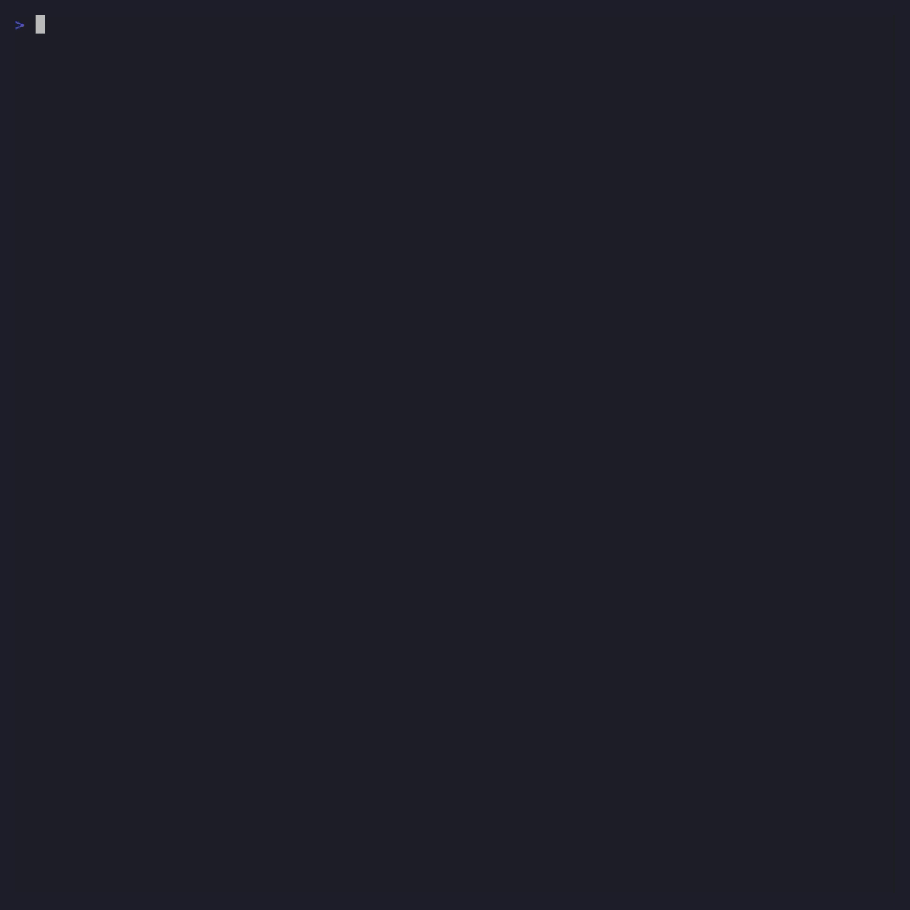
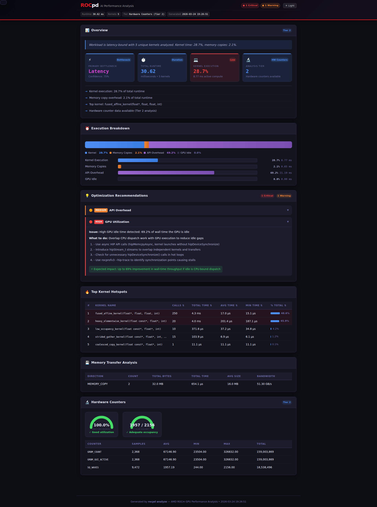
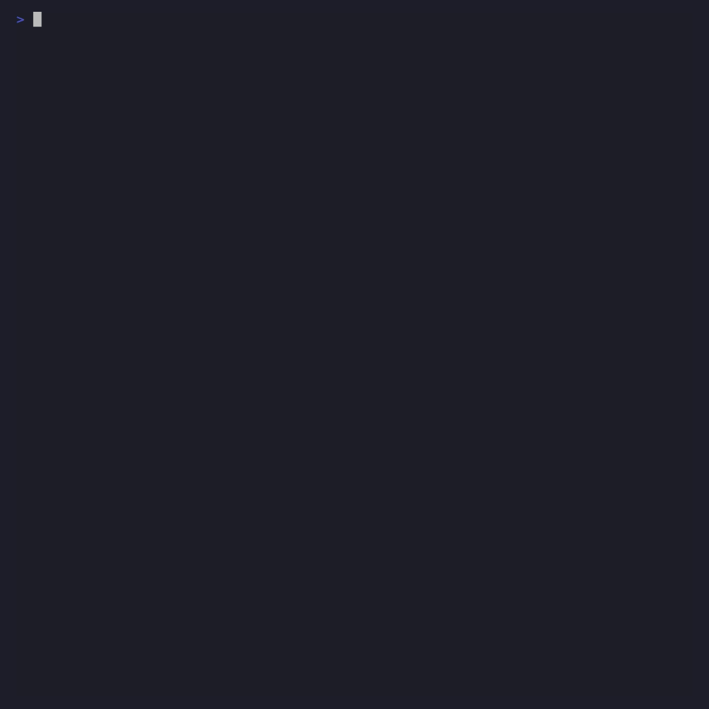

# ROCInsight Getting Started Guide

A visual, step-by-step guide to using ROCInsight for AMD GPU performance analysis. Each section includes an animated demo showing exactly what to type and what to expect.

---

## Overview

ROCInsight reads ROCPD GPU trace databases from any AMD profiling & tracing tool such as `rocprofv3` and turns raw profiling data into prioritized, actionable recommendations. It works across five analysis tiers — from static source scanning (no GPU needed) through instruction-level stall analysis.

The core workflow is: **Profile -> Analyze -> Optimize -> Verify**. ROCInsight's interactive mode automates this entire loop with AI-powered code editing.

---

## 1. Installation

Install ROCInsight with a single pip command. The `[all]` extra includes LLM support (Anthropic, OpenAI) and rich terminal output.

```bash
pip install "rocinsight[all]"

# Or from source (development mode)
cd experimental/python/rocinsight && pip install -e ".[all]"

# Verify
rocinsight --version
```


**Supported GPUs**: MI100 (gfx908), MI200 series (gfx90a), MI300 series (gfx942), MI350 series (gfx950), RDNA2 (gfx1030), RDNA3 (gfx1100).

**Dependencies**: Core analysis is pure Python (zero deps). LLM extras add `anthropic` and `openai` SDKs. `rich` adds colored terminal output.

---

## 2. Quick Start: One-Shot Analysis

The simplest workflow is two commands: collect a trace with `rocprofv3`, then analyze it.

```bash
# Step 1: Collect a system trace
rocprofv3 --sys-trace --kernel-trace --memory-copy-trace --stats \
  -d ./out -o results -- ./my_app

# Step 2: Analyze
rocinsight analyze -i ./out/results_results.db
```

The output shows a time breakdown (kernel / memcpy / overhead / idle), top kernels ranked by GPU time, and prioritized recommendations with specific actions.


### Output Formats

Generate reports in four formats:

```bash
# Text (default) — for terminals and logs
rocinsight analyze -i trace.db

# JSON — for CI/CD pipelines
rocinsight analyze -i trace.db --format json -d ./out -o analysis

# Markdown — for pull requests and docs
rocinsight analyze -i trace.db --format markdown -d ./out -o analysis

# Webview — self-contained interactive HTML
rocinsight analyze -i trace.db --format webview -d ./out -o analysis
```



The webview generates a self-contained HTML file with the AMD dark theme, SVG gauge charts, collapsible recommendation cards, and a light/dark mode toggle:



---

## 3. Tier 0: Source Code Scanning

Analyze your source code before profiling — no GPU or trace database needed.

```bash
# Scan source directory
rocinsight analyze --source-dir ./my_app

# Combined: source scan + trace analysis
rocinsight analyze -i trace.db --source-dir ./my_app
```

ROCInsight scans `.hip`, `.cpp`, `.cu`, `.cl`, `.py`, `.h`, `.hpp` files and detects:
- GPU kernel definitions and launch patterns
- Memory operations (hipMemcpy, hipMemcpyAsync)
- Synchronization points (hipDeviceSynchronize)
- Stream usage (or lack thereof)
- Framework usage (PyTorch, JAX, TensorFlow)
- ROCTx markers

The output includes a profiling plan with the exact `rocprofv3` command to run, with counters pre-selected based on what was found in the source.



---

## 4. Interactive Workflow (The Star Feature)

The interactive mode automates the full optimization loop: profile, analyze, AI-edit code, recompile, re-profile, compare.

```bash
rocinsight analyze \
  --source-dir ./my_app \
  --llm claude-code \
  --interactive "./my_app"
```

### What happens:

1. **Phase 1b** — Workload detection: identifies your binary type (HIP, Python ML, MPI) and selects optimal profiling flags
2. **Phase 2** — Shows the generated `rocprofv3` command for your approval
3. **Phase 3** — Runs the profiler with real-time output streaming
4. **Phase 4** — Analyzes the trace, shows findings with AI-refined recommendations
5. **Phase 5** — Recommendations menu: address with AI, skip, or re-profile
6. **Phase 6** — AI edits your source files using precise SEARCH/REPLACE blocks
7. **Phase 7** — Re-profile with the optimized code and compare results


### AI Code Editing

When you select `[a] Address all with AI optimization`, the LLM generates targeted code changes as SEARCH/REPLACE blocks — not full-file rewrites. This prevents truncation on large files and makes the diff easy to review:

```
<<<<<<< SEARCH
    for(int i = 0; i < CHUNKS; i++) {
        HIP_CHECK(hipMemcpy(d_in + i * chunk, ...));
    }
=======
    HIP_CHECK(hipMemcpyAsync(d_in, h_in.data(),
                 N * sizeof(float),
                 hipMemcpyHostToDevice, stream1));
>>>>>>> REPLACE
```

If the edit causes compilation errors, type `revert` to undo. The LLM analyzes the failure and proposes an alternative fix with full error context.

---

## 5. MPI Multi-GPU Profiling

ROCInsight auto-detects MPI launchers and restructures the profiling command so each rank gets its own profiler instance.

```bash
rocinsight analyze \
  --llm claude-code \
  --source-dir ./src \
  --interactive "mpirun -n 8 ./multi_gpu_demo"
```

The tool:
- Detects `mpirun`/`srun`/`jsrun` and wraps each rank: `mpirun -n 8 rocprofv3 <flags> -- ./binary`
- Uses `%nid%` per-rank output naming to avoid SQLite collisions
- Auto-merges all per-rank databases into a single `merged_processes.db`
- Analyzes the unified trace across all GPUs


> **Note**: `--process-sync` (used for Python DDP/torchrun) is NOT used for MPI because OpenMPI strips LD_PRELOAD from child processes. ROCInsight handles this automatically.

---

## 6. LLM Providers

Five LLM providers are supported. LLM is optional — all analysis runs locally without internet.

```bash
# Anthropic Claude
export ANTHROPIC_API_KEY="sk-ant-..."
rocinsight analyze -i trace.db --llm anthropic

# OpenAI
export OPENAI_API_KEY="sk-..."
rocinsight analyze -i trace.db --llm openai --llm-model gpt-4o

# Private endpoint (any OpenAI-compatible server)
export ROCINSIGHT_LLM_PRIVATE_URL="https://llm.corp.internal/v1"
export ROCINSIGHT_LLM_PRIVATE_MODEL="llama-3-70b"
rocinsight analyze -i trace.db --llm private

# Local Ollama (air-gapped, zero internet)
rocinsight analyze -i trace.db --llm local

# Claude Code (API key or stored CLI OAuth — no key needed)
rocinsight analyze -i trace.db --llm claude-code
```


**Privacy**: When LLM is enabled, sensitive data is sanitized before transmission — kernel names, grid sizes, and file paths are redacted. Only aggregated metrics and bottleneck classifications are sent.

---

## 7. Intelligence Features

ROCInsight goes beyond simple threshold rules with four intelligence features:

### Counter-Aware Recommendations

When hardware counters are in the trace, recommendations use actual GPU utilization instead of generic advice:

```
# With counters (GPU util 94%):
[HIGH] GPU utilization is 94.3% — kernel is compute-bound.
       Focus on algorithmic optimization: reduce transcendentals, use FMA.

# Without counters:
[HIGH] Profile this kernel with hardware counters to identify its bottleneck.
```

### Plateau Detection

After 2+ iterations with <2% improvement, the tool stops repeating and suggests escalation:

```
Optimization plateau detected: <1.2% change over 3 iterations
Consider deeper analysis: ATT (instruction stalls) or rocprof-compute (roofline)
(2 previously-seen recommendations suppressed)
```

### Init-Overhead Awareness

For short workloads where ROCm initialization dominates:

```
[INFO] Short workload (43ms) with 2.1% GPU compute — overhead is
       ROCm runtime initialization. GPU code is already well-optimized.
```

### LLM-Refined Recommendations

When an LLM is connected, rule-based recommendations are refined with full context — edit history, prior suggestions, and the AMD GPU reference guide:

```
AI-Refined Analysis (context-aware):
  Async streams already applied in prior edit. Next step: use ATT
  to identify which VALU instructions dominate the compute kernel.
```


---

## 8. ATT Tier 3: Instruction-Level Analysis

For the deepest analysis, collect an AMD Thread Trace to see per-instruction stall data:

```bash
# Collect ATT trace
rocprofv3 --att \
  --att-library-path /opt/rocm/lib \
  --att-target-cu 0 \
  -d ./att_output -o trace -- ./my_app

# Analyze (auto-detects stats_*.csv alongside the .db)
rocinsight analyze -i ./att_output/trace*.db
```

The output classifies each high-stall instruction into bottleneck categories: VMEM latency, LDS bank conflict, dependency chain, or branch divergence.


In interactive mode, when plateau detection triggers, the `[t]` option builds the ATT collection command automatically.

---

## 9. Python API

Every capability is available as a Python API for programmatic use and CI/CD integration:

```python
from pathlib import Path
from rocinsight.ai_analysis import analyze_database, analyze_source

# Analyze a trace database
result = analyze_database(Path("trace.db"))
print(result.summary.primary_bottleneck)
print(f"Confidence: {result.summary.confidence:.0%}")

for rec in result.recommendations.high_priority:
    print(f"[HIGH] {rec.title}: {rec.description}")

# Export to JSON / HTML
json_output = result.to_json()
html_output = result.to_webview()

# Source-only analysis (Tier 0)
src = analyze_source(Path("./my_app"))
print(src.plan.suggested_first_command)
```


---

## 10. The Fence Document (LLM Reference Guide)

The LLM reference guide controls AI behavior. It ships with the package and contains AMD GPU specs, performance models, and analysis guidelines. Edit it to customize the LLM:

```bash
# Override with your own version
export ROCINSIGHT_LLM_REFERENCE_GUIDE="/path/to/my-guide.md"
```

Add company-specific guidelines:

```markdown
## Our Team's Standards
<!-- rocinsight-context: always -->
- We use MI300X exclusively — skip non-MI300X advice
- Flag any kernel launching fewer than 64 wavefronts
- Target: >80% GPU utilization on inference workloads
```

No code changes needed — the guide is reloaded on every analysis run.


---

## 11. Session Persistence

Sessions auto-save to `~/.rocinsight/sessions/`. Resume any session with full context:

```bash
# Resume a prior session
rocinsight analyze --source-dir ./src --interactive "./my_app" \
  --resume-session ~/.rocinsight/sessions/workflow_2026-03-26_14-30-12___my_app.json
```

The checkpoint system tracks every code edit. Roll back to any prior state during a session with `[b] Roll back to a checkpoint`.


---

## Quick Reference

| Task | Command |
|---|---|
| Install | `pip install "rocinsight[all]"` |
| Analyze trace | `rocinsight analyze -i trace.db` |
| HTML report | `rocinsight analyze -i trace.db --format webview -d ./out -o report` |
| Source scan | `rocinsight analyze --source-dir ./src` |
| Interactive | `rocinsight analyze --source-dir ./src --llm claude-code --interactive ./my_app` |
| MPI profiling | `rocinsight analyze --source-dir ./src --interactive "mpirun -n 4 ./my_app"` |
| Resume session | `rocinsight analyze --source-dir ./src --interactive -- ./my_app --resume-session <path>` |
| ATT analysis | `rocinsight analyze -i att_output/trace*.db --att-dir ./att_output` |

---

*Generated for ROCInsight v0.1.0 — AMD ROCm AI-Powered GPU Trace Analysis*
