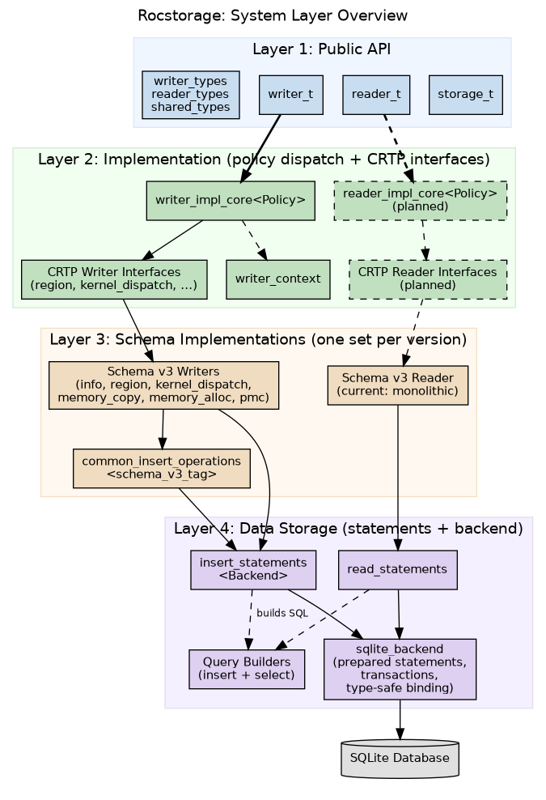
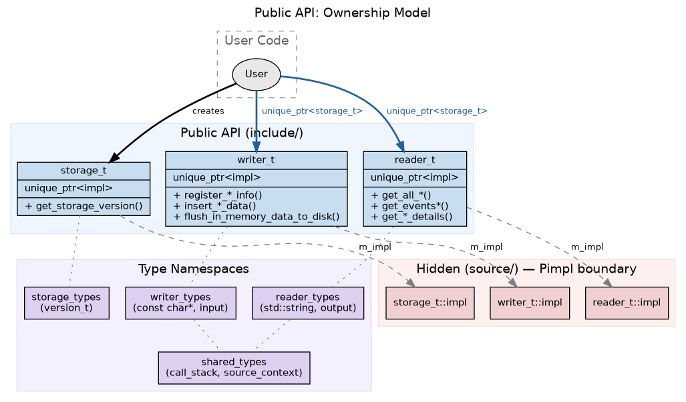
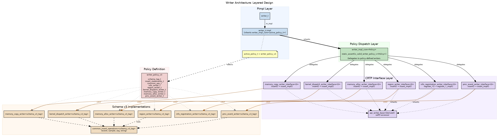
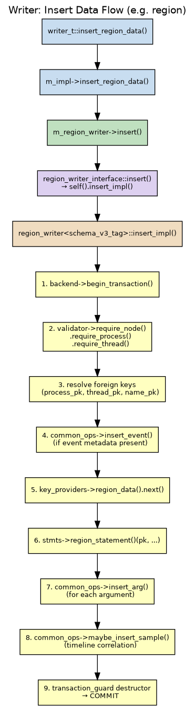
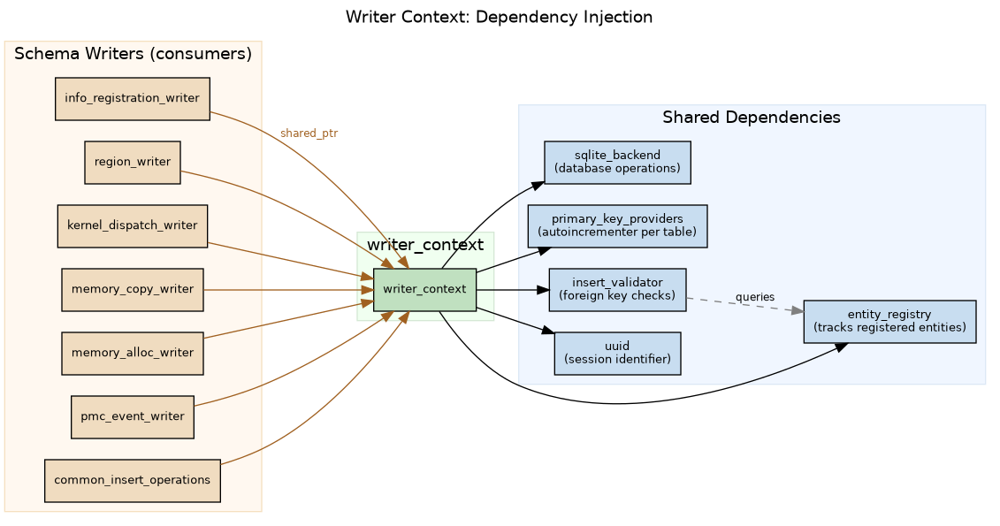
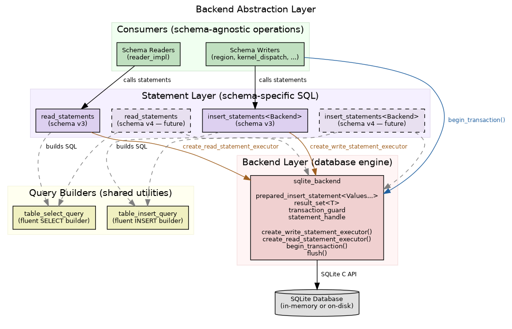
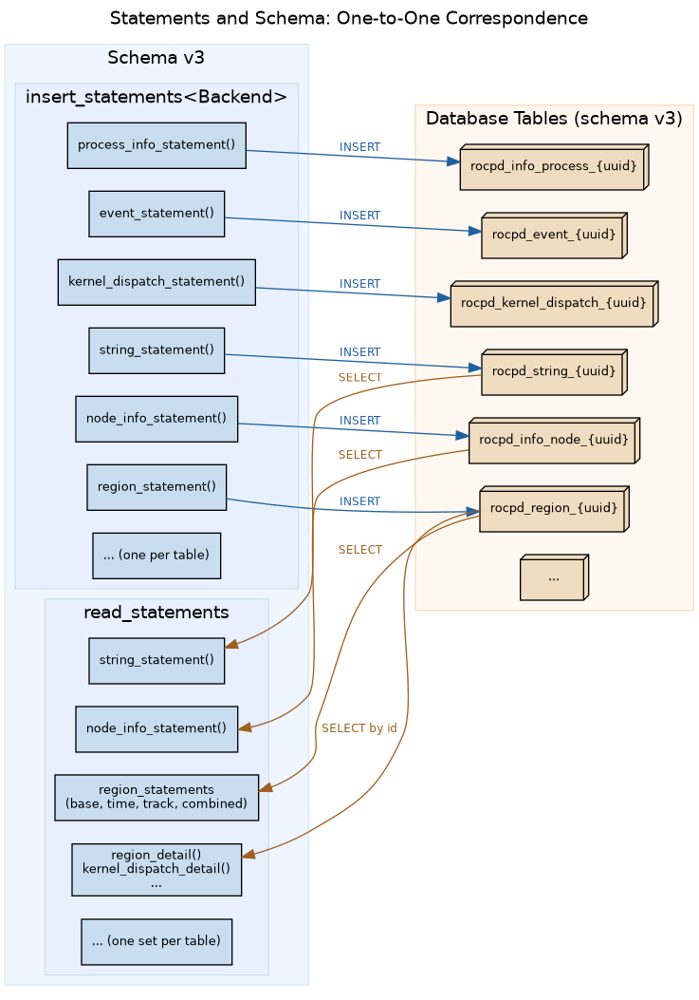

# Profiler-hub Architecture

## Chapter 1: Public API Design

The profiler-hub public API consists of three classes -- storage_t, writer_t, and reader_t -- a version_t struct, and three type namespaces -- writer_types, reader_types, and shared_types. Together they form the only surface that users interact with. Everything behind these headers is hidden and must remain hidden.

### The Pimpl Boundary

Each of the three classes declares a private nested struct called impl, held through a unique pointer. The public header contains no includes from the source directory, no references to the SQLite backend, no mention of query builders, entity registries, validators, or any other internal component. The only headers a user sees are the public type definitions and the standard library.

This means that the public headers are a complete compilation firewall. A user who includes storage.hpp, writer.hpp, or reader.hpp gains no visibility into what database engine is used, how statements are prepared, how schema versions are selected, or how entities are validated. The implementation can change freely -- switching backends, reorganizing internal class hierarchies, adding new schema versions -- without requiring users to recompile.

### Why This Must Be Preserved

The Pimpl boundary is not a convenience. It is an architectural constraint that enables the rest of the system to evolve.

The writer and reader subsystems use template-heavy designs internally: policy-based dispatch, CRTP interfaces, compile-time trait validation. These patterns produce complex type hierarchies and long template instantiation chains. If any of this leaked into the public headers, users would be forced to include those internal headers transitively. Every internal refactor -- adding a new schema version, changing a writer interface, restructuring the backend -- would break user builds and force recompilation of all downstream code.

The Pimpl boundary prevents this. The public classes are simple structs with a unique pointer to an opaque impl. Their method implementations live in translation units that the user never compiles against. This isolates the entire internal template machinery behind a stable ABI surface.

Removing or weakening this boundary -- for example, by exposing internal types in public method signatures, or by making impl a public member -- would couple every user to the internal architecture. That coupling would then constrain internal evolution, making it difficult to add new schema versions, change the backend, or refactor the writer hierarchy without coordinating with all downstream consumers.

### Ownership Model

The three classes form a strict ownership chain. A user creates a storage_t, which represents a connection to a database path. The user then transfers ownership of that storage_t into either a writer_t or a reader_t by passing a unique pointer. The writer or reader takes exclusive ownership and the user can no longer access the storage_t directly.

This design enforces a rule: a storage instance is used for either writing or reading, never both simultaneously. The storage_t tracks this through an internal storage type state that transitions from none to either read or write when the database connection is first created by the owning writer or reader.

All three classes delete their copy constructors, move constructors, copy assignment operators, and move assignment operators. A storage, writer, or reader cannot be copied or moved. Once created, it lives in one place until destroyed. This eliminates an entire category of lifetime and aliasing bugs.

### The Type Namespaces

The public API defines data types in separate namespaces that reflect the direction of data flow.

The writer_types namespace contains input structures. These use const char pointers for string fields rather than owned strings. This is a deliberate performance decision: the caller typically holds the string data in its own buffers (from the profiling runtime, for example), and copying every string into a std::string before passing it to the writer would be wasteful. The writer consumes these values during insertion and does not need them to outlive the call.

The reader_types namespace contains output structures. These use std::string for string fields because the reader must return data that the caller owns. The caller does not know how long the data lives in the database layer, so the reader copies strings into owned values that the caller controls.

The shared_types namespace contains structures used by both directions, such as call stack entries and source context records. These structures describe data that has the same logical shape regardless of whether it is being written or read.

The version_t struct exposes the schema version of the underlying storage. It is the only piece of storage-system metadata in the public surface.

This separation means that a user who only writes never includes reader type definitions, and vice versa. It also means that the type representations can evolve independently: the writer types can be optimized for ingestion speed while the reader types can be optimized for caller convenience, without either constraining the other.

### The Public Method Surface

The writer_t exposes two categories of methods. The register methods accept info structures and record metadata entities such as nodes, processes, threads, agents, and tracks. The insert methods accept data structures and record profiling events such as regions, kernel dispatches, memory copies, and memory allocations. This separation reflects the entity hierarchy in the underlying schema: metadata entities must be registered before events that reference them can be inserted.

The reader_t exposes four categories of methods. Info accessors return cached metadata that was eagerly loaded when the reader was constructed. Track accessors return track definitions, also eagerly loaded. Timeline event queries perform on-demand database queries and return lightweight event representations suitable for display. Event detail accessors take a timeline event and return the full data for that specific event, querying the database on demand.

The storage_t exposes only version information. Its purpose is to hold the database path and connection state, not to provide functionality directly. It is a resource handle that the writer or reader consumes.

## Chapter 2: Writer Architecture

The writer subsystem transforms public API calls into database rows. It is organized in layers: a policy-based dispatch mechanism at the top, CRTP interfaces in the middle, and schema-specific implementations at the bottom. This layering exists to allow new schema versions to be introduced without modifying existing code.

### Policy-Based Dispatch

The central class in the writer subsystem is writer_impl_core, a template parameterized by a policy type. The policy is a plain struct that contains only type aliases. It names the schema tag, the insert statements type, the common operations type, and one writer type for each data category: info registration, region, kernel dispatch, memory copy, memory allocation, and PMC event.

The writer_impl_core class uses these type aliases to declare its member writers. It does not know which schema it operates on. It holds one instance of each writer type and delegates each public method to the corresponding writer instance. When a region insertion is requested, writer_impl_core forwards the call to its region writer. When a kernel dispatch insertion is requested, it forwards to its kernel dispatch writer. The template parameter determines which concrete writers are instantiated.

A static assertion at the top of writer_impl_core validates the policy at compile time. The trait is_valid_writer_policy checks two things: that the policy provides all required type aliases, and that each writer type inherits from its corresponding CRTP interface. If either check fails, the build produces a clear error message rather than a cascade of template instantiation failures.

The active policy is selected by a single type alias, active_policy_t, which currently points to writer_policy_v3. The Pimpl impl struct for writer_t inherits from writer_impl_core instantiated with this active policy. Changing the active schema version means changing one type alias.

### CRTP Interfaces

Each data category has a corresponding interface template. The interface is parameterized by the derived writer class using the Curiously Recurring Template Pattern. The interface provides a public method -- insert for data writers, or register methods for the info writer -- and delegates to an implementation method on the derived class. For example, the region writer interface provides an insert method that calls insert_impl on the derived type. The kernel dispatch writer interface does the same with its own insert method.

All interfaces inherit from a common base, api_writer_base, which provides the self accessor that performs the static downcast from the base to the derived type.

This design serves two purposes. First, it establishes a compile-time contract: any class that claims to be a region writer must provide an insert_impl method with the correct signature, or the build fails. Second, it decouples the dispatch layer from the implementation. The writer_impl_core calls insert on an interface, and the interface calls insert_impl on whatever concrete class was provided by the policy. The dispatch layer never names the concrete class directly.

### Schema-Specific Implementations

Each schema version provides a complete set of writer implementations. Currently, schema v3 provides six writer classes, each specialized on the schema_v3_tag type: info_registration_writer, region_writer, kernel_dispatch_writer, memory_copy_writer, memory_alloc_writer, and pmc_event_writer. A seventh class, common_insert_operations, provides shared logic used by all data writers.

Each writer class inherits from its corresponding CRTP interface, passing itself as the template argument. It implements the required insert_impl (or register_*_impl for info registration) methods. These methods contain the schema-specific logic: which prepared statements to call, which foreign keys to resolve, which validations to perform, and how to serialize complex fields.

The typical insert_impl method follows a consistent pattern. It begins a transaction through the backend. It validates that all required entities have been registered, using the insert validator. It resolves foreign keys from user-facing identifiers to database primary keys. It optionally inserts an event record if event metadata is present. It executes the prepared insert statement for its table. It optionally inserts argument records and sample records for timeline correlation. The transaction commits automatically when the scope exits.

Common insert operations is a utility class shared by all data writers within a schema version. It handles event insertion, sample insertion, argument insertion, and string registration. These operations are factored out because they are identical across all data types within the same schema: an event row has the same structure whether it belongs to a region or a kernel dispatch.

### Writer Context

The writer context is a dependency injection container that holds everything the writer implementations need. It contains the database backend, the entity registry, the primary key providers, the insert validator, and the session UUID. Each writer receives a shared pointer to this context and uses it to access these shared resources.

This design avoids passing multiple dependencies through each writer constructor. When a writer needs to validate an entity, it accesses the validator through the context. When it needs a primary key, it accesses the key providers through the context. When it needs to execute a statement, it accesses the backend through the context.

### Entity Registry and Validation

The entity registry tracks every metadata entity registered during the current session. It maps user-facing identifiers (process IDs, thread IDs, agent unique IDs) to database primary keys. Some entity types use sets when only existence needs to be tracked (nodes, code objects, kernel symbols). Others use maps when the primary key must be retrievable later (processes, threads, agents, tracks, strings).

The insert validator checks foreign key dependencies before insertion. When a region is about to be inserted, the validator confirms that the referenced node, process, and thread have been registered. It provides a fluent interface where requirement checks can be chained. If any check fails, the validator throws immediately rather than allowing the database to reject the row.

The validator also resolves primary keys. After confirming that a process has been registered, the caller can ask the validator to return the primary key for that process. This combines validation and resolution into a single step, avoiding redundant registry lookups.

### Primary Key Generation

The primary key providers hold one autoincrementer per table type. An autoincrementer is an atomic counter that produces sequential primary keys. Each time a writer inserts a row, it requests the next key from the corresponding autoincrementer. The keys are generated in the application rather than by the database, which allows the writer to know the primary key before executing the insert statement. This is necessary because some rows reference other rows inserted in the same transaction.

### Expansion Points

The writer architecture provides three categories of expansion points.

**Adding a new schema version.** Create a new schema tag type. Implement all six writer classes specialized on that tag, plus a common_insert_operations for the new schema. Create a new insert_statements class for the schema (covered in chapter 5). Bundle everything into a new writer policy struct. The trait validation will confirm that the new policy satisfies all requirements at compile time. Change active_policy_t to the new policy struct.

**Adding a new data type within an existing schema.** Define a new CRTP interface in the interfaces directory with the appropriate insert method. Implement a schema-specific writer that inherits from that interface. Add the new writer type alias to the policy struct. Add a corresponding member and delegation method to writer_impl_core. Update the policy trait to check the new interface. Add the public method to writer_t and its Pimpl impl.

**Modifying an existing data type.** Because each schema version has its own complete set of writers, modifying how a data type is written for a new schema does not affect the old schema. The old schema's writers remain unchanged. The new schema's writers implement the new behavior. The policy type alias determines which set is active.

## Chapter 3: Reader Architecture

The reader subsystem retrieves data from the database and presents it through the public reader_t interface. Unlike the writer, the reader does not currently follow the policy-based, interface-driven architecture. Its implementation is a single monolithic class that directly references schema v3 types. This chapter describes the current structure, the loading strategy it uses, and how the reader should be restructured to mirror the writer's architecture so that it can support multiple schema versions.

### Current Structure

The reader_t Pimpl impl is a flat struct. It directly holds a shared pointer to the schema v3 read_statements class and stores all cached metadata, utility maps, and topology lookups as direct members. All query logic -- metadata loading, timeline event retrieval, event detail resolution, call stack parsing, and correlated event lookup -- lives in methods on this single struct.

The impl constructor eagerly loads all metadata by calling initialization methods that execute read statements and populate cached lists and lookup maps. After construction, metadata accessors return pre-built lists without touching the database. Event queries and detail accessors perform on-demand database queries through the read_statements object.

### Loading Strategy

The reader uses two distinct strategies for different categories of data.

Metadata is eagerly loaded. When the reader is constructed, it queries every info table -- nodes, processes, threads, agents, streams, queues, code objects, kernel symbols, PMC info, and tracks -- and stores the results in cached lists. It also builds utility maps that associate database primary keys with shared pointers to the cached objects. This allows the reader to resolve foreign key references in constant time when processing event query results. The string table is also loaded eagerly into a map from primary key to string value.

Events are lazily loaded. Timeline event queries and event detail queries execute against the database on demand. The reader does not cache events because the event set can be large and the caller typically filters by track or time window. Timeline event queries return lightweight representations containing only the information needed for display: timestamps, a display name, a category, and a track reference. When the caller needs full details for a specific event, it calls a detail accessor that queries the database by the event's database ID.

This two-tier strategy reflects a practical trade-off. Metadata tables are small relative to event tables and are needed for every operation that resolves foreign keys. Caching them avoids repeated database queries. Event tables can be large and are typically accessed through filtered views, making caching impractical.

### How the Reader Should Mirror the Writer

The reader should adopt the same policy-based architecture as the writer. This means introducing reader interfaces, schema-specific reader implementations, a reader policy struct, and compile-time policy validation.

The reader requires this structure for the same reason the writer does: schema versions change the database layout. A schema v4 database may store call stacks in separate tables rather than as serialized JSON in the event row. It may rename columns, split tables, or add new entity types. The reader must know how to query each schema version correctly, and it must be possible to add a new schema version without modifying existing reader code.

The intended architecture has the following layers.

A reader_impl_core template, parameterized by a reader policy, would hold one reader instance per data category. It would delegate public method calls to the appropriate reader instance, exactly as writer_impl_core delegates to its writers.

Reader interfaces, using CRTP, would define the contract for each category of read operation. An info_reader_interface would define methods for loading metadata tables. A region_reader_interface would define methods for querying region timeline events and region details. Similar interfaces would exist for kernel dispatch, memory copy, memory allocation, and PMC events.

Schema-specific reader implementations would inherit from these interfaces and provide the query logic for their schema version. A schema v3 region reader would know how to join the rocpd_region table with rocpd_event and rocpd_sample. A schema v4 region reader would know the v4 table layout and join structure.

A reader policy struct -- for example, reader_policy_v3 -- would bundle all the type aliases together: the schema tag, the read statements type, and all reader implementation types. A compile-time trait, analogous to is_valid_writer_policy, would validate that the policy satisfies all requirements.

The reader_t Pimpl impl would inherit from reader_impl_core instantiated with the active reader policy, just as the writer_t impl inherits from writer_impl_core with the active writer policy.

### Multi-Schema Support

Unlike the writer, the reader must support all schema versions simultaneously. The writer only writes to one schema version because it creates the database. The reader opens existing databases that may have been created by any prior version of the library.

This means the reader cannot use a single compile-time active_policy_t alias the way the writer does. Instead, the reader must detect the schema version of the database at construction time and instantiate the correct policy. The schema version can be determined by querying a metadata table or inspecting the table structure.

One approach is for reader_t impl to hold a variant or type-erased pointer to a reader_impl_core instantiated with different policies. The construction logic would detect the schema version and construct the appropriate specialization. The public methods on reader_t would dispatch through this indirection.

The key constraint is that the public reader_t interface does not change between schema versions. The reader_types namespace defines output structures that are schema-independent. A region_data_t in reader_types has the same fields regardless of whether the underlying database is v3 or v4. The schema-specific reader implementations are responsible for mapping schema-specific query results into these common output types. This is the same separation the writer achieves: writer_types are schema-independent input structures, and the schema-specific writers know how to map them into schema-specific database rows.

### Eager Loading in the Restructured Reader

The eager loading strategy should be preserved in the restructured reader. The info reader implementation for each schema version would handle loading all metadata tables at construction and building the utility maps. The caching containers and lookup maps would live in the info reader or in a shared reader context analogous to the writer context.

Event reader implementations would continue to perform on-demand queries. Each schema-specific event reader would hold its schema-specific read statements and execute them when the caller requests timeline events or event details.

## Chapter 4: Backend Abstraction Layer

The backend layer isolates the rest of the system from the specifics of the database engine. All database operations -- statement preparation, value binding, column extraction, transaction management, and schema initialization -- pass through the sqlite_backend class. No other component in the system references SQLite directly.

### Separation from Schema Logic

The backend knows nothing about profiler-hub's domain. It does not know what a region is, what a kernel dispatch contains, or how entities relate to each other. It provides general-purpose primitives: prepare a statement from a SQL string, bind typed values to parameter positions, execute a statement, extract typed values from result columns, and manage transactions. The schema logic -- which tables exist, which columns they have, what SQL to use -- lives entirely in the statement classes (covered in chapter 5). The backend is the execution engine; the statements are the instructions.

This separation means the backend can be reused across schema versions without modification. Schema v3 and a future schema v4 both use the same backend to prepare and execute statements. They differ only in what SQL they ask the backend to execute.

### Factory and Lifetime Management

The backend enforces shared pointer ownership through a static factory method. Direct construction is private. The factory returns a shared pointer, which is required because the backend uses enable_shared_from_this to hand out references of itself to the objects it creates.

Every prepared statement and transaction guard captures a shared pointer to the backend that created it. This guarantees that the database connection remains open as long as any statement or transaction exists. The connection cannot be closed prematurely because the backend cannot be destroyed while statements hold references to it. This eliminates a class of use-after-free bugs that would otherwise be possible when statements outlive their connection.

### Prepared Statements

The backend provides two categories of prepared statements: write executors and read executors.

A write executor is a prepared_insert_statement, a template class parameterized by the types of values it accepts. When called, it binds the provided values to the statement's parameter positions in order, executes the statement, and resets it for reuse. The type parameters are fixed at creation time, so every call is type-checked at compile time. A write executor that expects an integer, a string, and a double will not compile if given arguments of different types.

A read executor is a callable that returns a result_set. The result_set is a template class parameterized by the result struct type. It knows which struct members correspond to which columns, established at creation time through member pointers. When the caller iterates the result set, it steps through rows and extracts each column into the corresponding member of the result struct. Read executors can optionally accept bind parameters for filtered queries, specified through the bind_types template.

Both categories capture the backend shared pointer and the prepared statement handle, ensuring lifetime safety.

### Type-Safe Value Binding and Extraction

The backend routes value binding through a single template method that dispatches based on the C++ type of the argument. Integer types bind as 64-bit or 32-bit integers. Pointer-to-char and std::string types bind as text. Double types bind as floating point. Optional types check whether a value is present: if present, the inner value is bound; if absent, a SQL NULL is bound. Null pointers for text types also bind as NULL.

Column extraction follows the same pattern in reverse. The backend examines the C++ type of the target member and calls the appropriate SQLite extraction function. Optional members check for SQL NULL before extracting the inner type.

Both binding and extraction use a static assertion as a fallback. If a type does not match any supported category, the build fails with a clear error rather than producing silent data corruption.

### Transaction Guard

The transaction guard is an RAII object that begins a transaction on construction and commits or rolls back on destruction. It records the count of uncaught exceptions at entry. On destruction, if the count has increased -- meaning an exception is propagating -- it rolls back. Otherwise, it commits.

This design means that writers do not need explicit commit or rollback calls. A writer begins a transaction by constructing a guard, performs its insertions, and lets the guard go out of scope. If the insertions succeed, the transaction commits. If any insertion throws, the transaction rolls back automatically.

### Storage Modes

The backend supports two storage modes: in-memory and on-disk. The mode is selected at creation time through the factory method. When the writer creates a backend, it uses in-memory mode for performance during high-throughput data ingestion. The flush operation writes the in-memory database to disk. When the reader creates a backend, it uses on-disk mode because it reads from an existing database file.

The storage_t impl mediates this through a database factory. The factory selects the mode based on whether the storage is being used for writing or reading. This decision is made once, when the writer or reader first accesses the backend, and cannot be changed afterward.

### Backend Substitutability

The backend is currently the only database implementation. However, its position in the architecture makes substitution possible. The backend is accessed through shared pointers and provides a defined set of operations: statement preparation, typed binding, typed extraction, transactions, and schema initialization. The statement classes and writer/reader implementations interact with the backend through these operations.

Replacing SQLite with a different engine would require implementing the same set of operations -- prepared statement creation, value binding by type, column extraction by type, and RAII transaction management -- against the new engine's API. The statement classes would need to be parameterized by backend type (the insert_statements class already takes the backend as a template parameter). The writer and reader implementations would not need to change, because they interact with the backend only through the statement classes and the transaction guard.

## Chapter 5: Statements and Schema Correspondence

The statement classes define every SQL query the system executes. There is one insert_statements class and one read_statements class per schema version. Each class contains exactly one prepared statement per database table or query pattern, and the type signature of each statement matches the column layout of the table it targets. This one-to-one correspondence between statements and schema is deliberate and must be maintained.

### Why Statements Match the Schema

A statement class is the source of truth for what the database looks like from the application's perspective. Each insert statement lists the columns of one table in order, and its type signature encodes the type of each column. An insert statement for the region table accepts a primary key, foreign keys for node, process, and thread, two timestamps, a name foreign key, an optional event foreign key, and extdata. These parameters correspond exactly to the columns of the rocpd_region table in schema v3.

This correspondence is enforced at compile time. The type signature of a prepared_insert_statement is a variadic template parameter pack. If a writer passes a value of the wrong type, or passes too many or too few values, the call does not compile. The statement type signature acts as a compile-time schema contract.

Read statements follow the same principle. Each read statement defines a result struct whose fields correspond to the columns being selected. The backend's column extraction maps result set columns to struct members by position. If the query selects nine columns, the result struct must have nine members passed to the executor constructor, and their types must match what the database returns.

This design means that if a schema changes -- a column is added, removed, renamed, or retyped -- the corresponding statement must change to match, and any code that calls the statement must be updated as well. The compiler enforces this. A schema change that is not reflected in the statement class produces a build failure, not a runtime error or silent data corruption.

### Structure of an Insert Statements Class

The insert_statements class is a template parameterized by the backend type. It receives a shared pointer to the backend and a session UUID at construction. During construction, it initializes every statement by building a SQL query string using the query builder and passing it to the backend to create a prepared statement.

Each initialization method follows the same pattern. It constructs a table_insert_query, sets the table name (incorporating the UUID for table scoping), lists the column names, sets parameter placeholders, obtains the final SQL string, and creates a prepared statement through the backend. The resulting statement object is stored as a member and exposed through an accessor.

The class provides one accessor per table. The string_statement accessor returns the prepared statement for inserting into the string table. The region_statement accessor returns the prepared statement for inserting into the region table. Each accessor returns a const reference to the stored statement, so callers execute the statement but cannot replace it.

The type aliases at the top of the class document the column types for each table. For example, the region_statement_func_t alias lists the types in column order: primary key, three foreign keys (node, process, thread), two unsigned 64-bit timestamps, a name foreign key, an optional event foreign key, and a string for extdata. These aliases serve as documentation and as the concrete type for the stored member.

### Structure of a Read Statements Class

The read_statements class follows the same structural principle but for SELECT queries. It defines result structs for each query, where each struct field corresponds to a selected column. It initializes prepared read executors using the query builder's select method and the backend's create_read_statement_executor.

Read statements are more varied than insert statements because reading involves multiple query patterns per table. Timeline event queries, for example, exist in four variants: unfiltered, time-filtered, track-filtered, and combined track-and-time-filtered. These variants are grouped in a statement set struct and initialized together from a shared base query. Detail queries select all columns of a specific row by primary key. Event ID resolution queries join an event-specific table with the event table to retrieve event metadata.

Despite this variety, the principle holds: each statement corresponds to one query against the schema, and the result struct matches the selected columns.

### Why Each Schema Version Needs Its Own Statements

Statements encode schema-specific knowledge: table names, column names, column order, column types, and join relationships. When a schema version changes any of these, the statements must change to match.

Consider what happens when a new schema version adds a column to the region table. The insert statement must include the new column in its column list and add a parameter of the correct type to its type signature. The read statement result struct must gain a new field. The query string must include the new column. All writers and readers that use these statements must pass or consume the new value. None of this can be retrofitted into the existing schema v3 statements without breaking schema v3 compatibility.

The same applies to structural changes. If a new schema stores call stacks in a separate table rather than as a serialized JSON column in the event table, the event insert statement loses its call_stack column, a new call_stack insert statement appears, and the read statements gain a join against the new table. These are different SQL queries requiring different prepared statements with different type signatures.

By maintaining a complete, independent set of statements per schema version, each version is self-contained. The schema v3 statements continue to work correctly against schema v3 databases. A future schema v4 statements class works correctly against schema v4 databases. They do not interfere with each other, and adding a new schema version does not risk breaking an existing one.

### Relationship to Query Builders

The query builder classes are shared utilities, not schema-specific components. The table_insert_query and table_select_query builders provide a fluent API for constructing SQL strings. They know how to format INSERT and SELECT syntax, how to add WHERE clauses, JOINs, ORDER BY, and parameter placeholders. They do not know anything about profiler-hub's tables or columns.

The statement classes use the query builders to construct their SQL strings during initialization. The statement decides what table, what columns, and what conditions to use. The builder formats those decisions into valid SQL. This separation keeps the builders reusable across schema versions and keeps schema knowledge concentrated in the statement classes where it belongs.

### Relationship to the Backend

The statement classes depend on the backend for two things: creating prepared statements and defining the prepared statement types. The insert_statements class uses a template alias, statement_t, that resolves to the backend's prepared_insert_statement type. This means the statement class does not hardcode the backend type. If the backend changes, the statement class adapts automatically as long as the backend provides the same prepared_insert_statement template.

The read_statements class similarly depends on the backend's result_set and create_read_statement_executor. The backend provides the execution machinery. The statement class provides the schema knowledge. Neither depends on the other's internal implementation.

### Relationship to Writers and Readers

Writers and readers access statements through the policy. The writer policy for schema v3 names the insert_statements class as its insert_statements_t type alias. The writer_impl_core creates an instance of this class and passes it to each schema-specific writer. Each writer calls the specific statement it needs: the region writer calls region_statement, the kernel dispatch writer calls kernel_dispatch_statement, and so on.

Readers currently hold a direct reference to the read_statements class. When the reader is restructured to follow the policy pattern (as described in chapter 3), the reader policy will name the read_statements class as a type alias, and schema-specific reader implementations will access their statements through it.

In both cases, the flow is the same: the policy selects the statement class, the statement class encodes the schema, and the writers or readers execute the statements through the backend. Each layer has a single responsibility, and schema knowledge never leaks outside the statement and writer/reader implementation layers.
