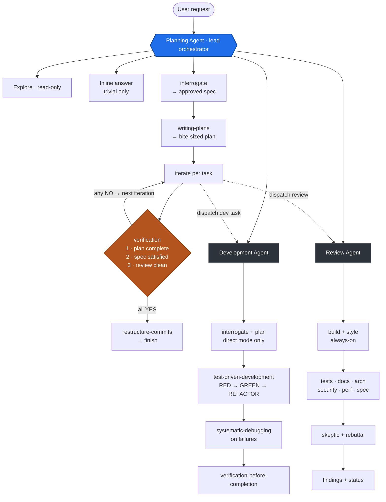

# AMD-SMI Agent Flow

Top-down view of how a user request travels through the agent system: the
**Planning agent** is the lead orchestrator and entry point. It triages intent,
then either answers inline, dispatches **Explore** for read-only investigation,
routes straight to **Development** or **Review**, or owns the goal end-to-end
through the plan → dev↔review loop. Solid arrows are sequential skill flow within
an agent; dashed arrows are agent-to-agent dispatch (Planning calls down into the
shared Development and Review agents).

**Verification gate (Planning):** all three must be YES to finish —
1. **Plan complete** — every plan task has a committed change.
2. **Spec satisfied** — every spec requirement is observable (cascade grep + smoke commands).
3. **Review clean** — no ❌ BLOCKING findings in the most recent comprehensive review.
