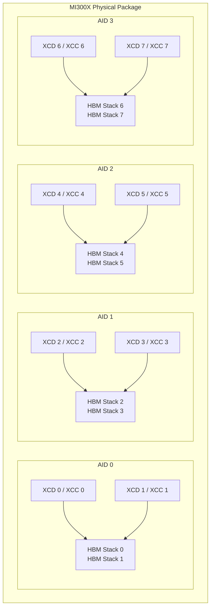
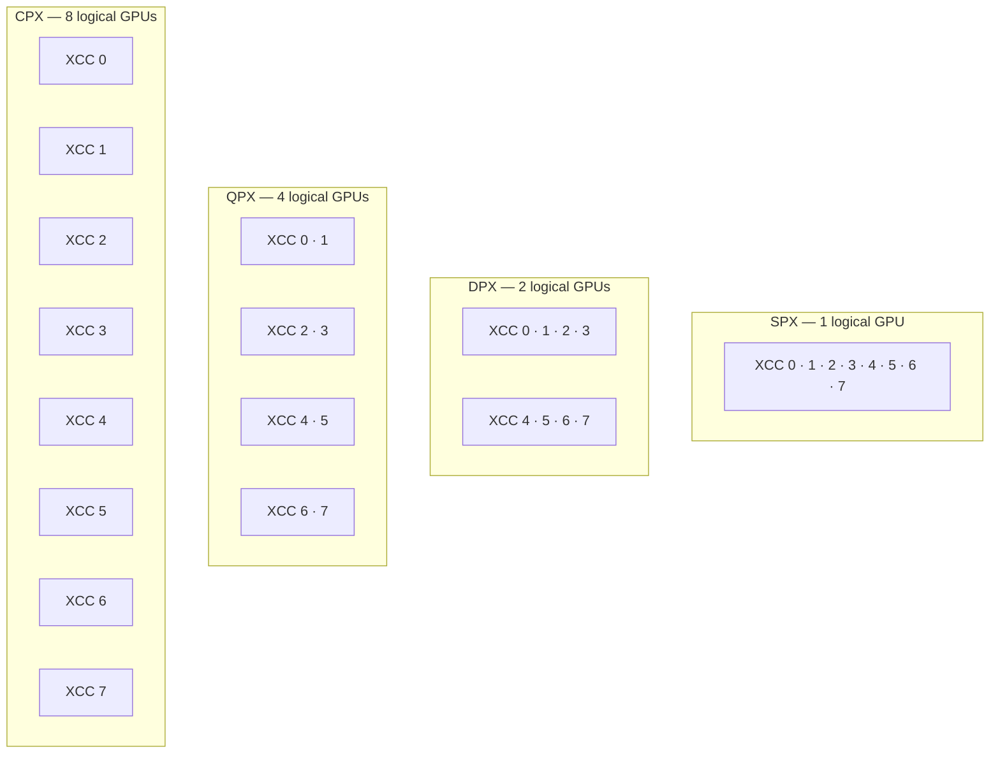

---
myst:
  html_meta:
    "description lang=en": "AMD SMI conceptual guide for GPU accelerator and memory partitioning."
    "keywords": "system, management, instinct, accelerator, interface, partition, compute, memory, NPS, SPX, DPX, TPX, QPX, CPX, XCC, amd-smi"
---

# GPU partitioning

GPU partitioning allows a single physical AMD Instinct GPU to be split into multiple logical
devices. This enables workloads to share GPU resources in an isolated and configurable way.
There are two independent partitioning dimensions: **accelerator partitioning** (how compute
resources are divided) and **memory partitioning** (how HBM memory is allocated).

```{note}
GPU partitioning is supported on select AMD Instinct GPUs (CDNA 3 and later, such as MI300X).
Support for specific partition modes depends on the ASIC and firmware. Attempting to change
partitions on unsupported hardware (for example, Navi/RDNA GPUs) returns
`AMDSMI_STATUS_NOT_SUPPORTED`.
```

## Architecture background

AMD Instinct CDNA 3 GPUs (MI300 series) are built from multiple chiplet dies connected
through an active interposer. Understanding the role of each die type is essential for
understanding how partitioning works.

### Physical die types

- **XCD (Accelerator Complex Die)** -- The GPU compute die. Each XCD contains:
  - Shader arrays (Compute Units) organized as Compute Units (CUs)
  - ACEs (Asynchronous Compute Engines) for scheduling compute dispatches
  - Fixed-function media engines: video decode (DECODER) and JPEG engines
  - DMA (Direct Memory Access) engines for memory copy operations
  - A local L2 cache

  An **MI300X** has **8 XCDs**. An **MI300A** has **6 XCDs**.

- **CCD (CPU Core Complex Die)** -- Present on APU variants. On the MI300A, CCDs contain
  CPU cores and their associated L3 cache. CCDs are not involved in GPU accelerator
  partitioning, but NPS mode descriptions account for CCD memory placement in addition to
  XCD placement on APU platforms.

- **AID (Active Interposer Die)** -- The base die that ties everything together, also
  referred to as "IOD" (I/O Die) in some older documentation. Each AID provides:
  - PCIe host connectivity
  - xGMI links for multi-GPU communication
  - HBM memory controllers for the attached HBM stacks
  - The interconnect fabric connecting XCDs to each other and to memory

  An **MI300X** has **4 AIDs**, each connected to 2 XCDs and 2 HBM stacks (8 HBM stacks
  total).

### Logical units

- **XCC (Accelerated Compute Core)** -- The logical compute unit as seen by the driver and
  AMD SMI APIs. An XCC is the collection of CUs, ACEs, caches, and global resources from
  one XCD, organized as a single schedulable unit. On current Instinct GPUs (MI300X,
  MI300A), there is exactly **one XCC per XCD**, so the terms are often used
  interchangeably. Partition modes operate by grouping XCCs into logical partitions — not
  XCDs directly — which is why the AMD SMI API uses XCC terminology.

- **XCP (Accelerated Compute Processor)** -- Also called a Graphics Compute Partition. The
  logical GPU device that results from applying an accelerator partition. Each XCP is
  enumerated by the OS and HIP runtime as an independent GPU device. In SPX mode the entire
  physical GPU is one XCP. In CPX mode on an MI300X, there are 8 XCPs (one per XCC).

### Physical GPU, socket, and logical device hierarchy

Understanding the relationship between the physical package, the AMD SMI socket model, and
the logical devices that appear to software is essential for using the partition APIs
correctly.

**Physical GPU (the package)**
: One physical GPU is one OAM module (or PCIe card). It contains all the XCDs, AIDs, and
  HBM stacks described above. The physical GPU is identified by a single PCIe BDF and a
  single UUID. Partition settings are configured at this level — one partition mode applies
  to the whole physical GPU.

**Socket (`amdsmi_socket_handle`)**
: In the AMD SMI API, a *socket* represents one physical GPU package. It is the top-level
  enumeration unit returned by `amdsmi_get_socket_handles()`. On a server with eight
  MI300X cards, there are eight socket handles. Sockets do not map to CPU sockets — the
  term refers to the GPU OAM/card slot. On APU variants (MI300A) a socket contains both
  GPU and CPU processors.

**Processor / logical device (`amdsmi_processor_handle`)**
: A *processor handle* is what AMD SMI calls a logical GPU — an XCP. Under
  `amdsmi_get_processor_handles(socket)`, the library returns one handle per XCP that
  the current partition mode exposes. In SPX mode, one socket yields one processor handle.
  In CPX mode on an MI300X, the same socket yields eight processor handles, one per XCC.

The relationship is therefore:

```text
System
 └── Socket 0  (physical GPU / OAM)      ← amdsmi_socket_handle
      ├── Processor 0  (XCP 0 / logical GPU / primary)    ← amdsmi_processor_handle: gpu_metrics + xcp_metrics (e.g. renderD128)
      ├── Processor 1  (XCP 1 / logical GPU / secondary)  ← amdsmi_processor_handle: xcp_metrics only         (e.g. renderD129)
      └── ...  (count depends on active partition mode)
 └── Socket 1  (physical GPU / OAM)
      └── ...
```

AMD SMI treats Processor 0 (XCP 0) as the device's **primary partition**. The primary
partition has full visibility into **both device-level and partition-level metrics** and can
manage the whole physical GPU. All other partitions are **secondary partitions**, scoped to
their own resources.

**Practical implications**

- Partition mode is a property of the **socket** (physical GPU). Changing it affects all
  processor handles under that socket — existing handles become invalid after a mode change
  and must be re-enumerated via `amdsmi_get_processor_handles()`.
- All processor handles (XCPs) within one socket share the same physical hardware
  resources (HBM, thermal budget, PCIe bandwidth). They are *logical* partitions of one
  physical device, not independent cards.
- Metrics such as socket power (`socket_power`, `average_socket_power`) are reported at
  the socket level and reflect the total physical GPU. Per-XCP metrics (clocks, utilization,
  violations) are reported at the processor handle level.
- Partition (XCP) and device-level metrics come from **separate sysfs sources**. The
  device-wide `gpu_metrics` node exists only on the **primary partition** (XCP 0, e.g.
  `renderD128/device/gpu_metrics`), so only the primary partition can report whole-GPU
  values such as board power. **Secondary partitions** expose only their own `xcp_metrics`
  (e.g. `renderD129/device/xcp/xcp_metrics`) and therefore report metrics scoped to that
  partition — the device-wide set is not present on their node.
- On a bare-metal system `amdsmi_get_socket_handles()` returns one handle per physical
  GPU. On a hypervisor host the socket model reflects the physical topology. Inside an
  SR-IOV guest, each assigned VF appears as a separate processor handle, but the socket
  and physical-GPU-level information may be limited by the hypervisor.

### Default configuration

In the default (SPX) mode, all XCCs are grouped into a single XCP and the OS sees one
logical GPU. Partition modes rearrange XCCs into multiple XCPs, each appearing as an
independent logical device.



```{note}
The exact partition profiles and logical GPU counts available depend on the physical GPU
model. Run `sudo amd-smi partition --accelerator` on the target system to confirm profile
count and partition limits for your hardware.
```

## Accelerator partitioning

Accelerator partitioning controls how the GPU's XCCs (Accelerated Compute Cores) are grouped
into XCPs (Accelerated Compute Processors). By grouping XCCs differently, the physical GPU is
presented to the operating system as one or more independent logical GPU devices.

### Accelerator partition modes

| Mode | Name | Description |
| :--- | :--- | :--- |
| `SPX` | Single GPU mode | All XCCs work together as one logical GPU |
| `DPX` | Dual GPU mode | Half the XCCs form each of 2 logical GPUs |
| `TPX` | Triple GPU mode | One-third of the XCCs form each of 3 logical GPUs |
| `QPX` | Quad GPU mode | One-quarter of the XCCs form each of 4 logical GPUs |
| `CPX` | Core GPU mode | Each XCC is its own logical GPU |

On an MI300X (8 XCDs), this translates to:

| Mode | Logical GPUs | XCCs per logical GPU |
| :--- | :---: | :---: |
| SPX | 1 | 8 |
| DPX | 2 | 4 |
| TPX | N/A | N/A |
| QPX | 4 | 2 |
| CPX | 8 | 1 |

```{note}
**Why partition support differs between MI300X and MI300A:** A partition mode is only
valid on an ASIC when the XCC count divides evenly by the number of partitions the mode
creates. The two ASICs have different XCD counts, so each supports a different subset of
modes:

| Mode | Partitions | MI300X (8 XCDs) | MI300A (6 XCDs) |
| :--- | :---: | :---: | :---: |
| SPX  | 1 | ✅ (8 XCCs) | ✅ (6 XCCs) |
| DPX  | 2 | ✅ (4 XCCs each) | ✅ (3 XCCs each) |
| TPX  | 3 | ❌ (8 ÷ 3) | ✅ (2 XCCs each) |
| QPX  | 4 | ✅ (2 XCCs each) | ❌ (6 ÷ 4) |
| CPX  | XCC count | ✅ (8 partitions) | ✅ (6 partitions) |

CPX is always available because each XCC simply becomes its own partition. As we mention in later sections, mode availablilty is controlled by firmware, so availability may vary by system and driver version. Always verify available modes on your specific device by running `sudo amd-smi partition --accelerator` (or the equivalent API query).
```

Each box below represents one logical GPU (XCP). The same 8 XCCs are present in every mode
— only how they are grouped changes:



```{note}
The number of logical GPUs and XCCs per logical GPU depends on the physical GPU model.
Each model has a different number of XCDs:

- **MI300X / MI325X** (CDNA 3, gfx942): 8 XCDs. In CPX mode, 8 logical GPUs are reported.
- **MI300A** (CDNA 3, gfx942): 6 XCDs. In CPX mode, 6 logical GPUs are reported.
- **MI350X / MI355X** (CDNA 4, gfx950): Refer to the [AMD Instinct MI300 Series
  microarchitecture](https://rocm.docs.amd.com/en/latest/conceptual/gpu-arch/mi300.html)
  documentation and the product data sheet for XCD counts.

To see the exact partition profiles and partition counts available on your system, run
`sudo amd-smi partition --accelerator`. Not all modes (for example, TPX) are available on all ASICs.
```

### Workgroup scheduling in SPX vs CPX

The accelerator partition mode also affects how the kernel driver schedules work:

- **SPX mode** -- Workgroups launched to the device are distributed round-robin across all
  XCCs. The programmer cannot control which XCC a workgroup runs on.
- **CPX mode** -- Each XCC is its own XCP (logical device). Workgroups are launched to a
  single XCC, giving the programmer explicit control over work placement and enabling better
  cache locality and potential power savings.

## Memory partitioning

Memory partitioning controls how the GPU's HBM (High Bandwidth Memory) stacks are allocated
across the logical partitions. This is expressed as NPS (NUMA Per Socket) mode, which
determines how memory is interleaved and assigned across NUMA domains.

### Memory partition modes

| Mode | Name | HBM allocation |
| :--- | :--- | :--- |
| `NPS1` | 1 NUMA node | All 8 HBM stacks are interleaved across the entire GPU |
| `NPS2` | 2 NUMA nodes | 2 sets of 4 HBM stacks, one per AID pair |
| `NPS4` | 4 NUMA nodes | Each XCD's data interleaved across its local AID's HBM stacks |
| `NPS8` | 8 NUMA nodes | Each XCD uses a single dedicated HBM stack |

### Compatibility matrix

Not every accelerator partition mode can be combined with every memory partition mode. The
following table reflects MI300X support:

| | NPS1 | NPS2 | NPS4 |
| :--- | :---: | :---: | :---: |
| **SPX** | ✅ | -- | -- |
| **DPX** | ✅ | ✅ | -- |
| **QPX** | ✅ | -- | ✅ |
| **CPX** | ✅ | -- | ✅ |

```{note}
NPS8 is defined in the API but is not a supported configuration on MI300X and is
omitted from this matrix.
```

```{note}
NPS4 requires QPX or CPX mode, and NPS2 requires DPX mode, because the number of memory
partitions cannot exceed the number of compute partitions. See the
[AMD CDNA 3 Architecture White Paper](https://www.amd.com/content/dam/amd/en/documents/instinct-tech-docs/white-papers/amd-cdna-3-white-paper.pdf)
for further details.

Supported combinations vary by GPU model and firmware. Always verify available configurations
on your specific device by running `sudo amd-smi partition --accelerator`. The output includes
a **Memory Caps** column listing the memory partition modes compatible with each accelerator
profile.
```

### Performance trade-offs

- **NPS1** provides a uniform, single-pool memory view. Each XCD has access to all HBM
  stacks interleaved across all AIDs, which gives consistent bandwidth regardless of which
  XCDs are active. It is simpler to program but has higher inter-AID traffic.
- **NPS4** localizes memory to each AID. When a single XCD is the only active XCD on its
  AID, it can achieve the full AID bandwidth (~1 TB/s on MI300X). This makes CPX/NPS4 well
  suited for bandwidth-bound workloads with sufficient parallelism to use multiple partitions.
  CPX/NPS4 reduces cross-AID traffic and can improve both memory bandwidth and compute
  throughput compared to SPX/NPS1. For measured benchmark data, see the
  [Deep dive into MI300 partition modes](https://rocm.blogs.amd.com/software-tools-optimization/compute-memory-modes/README.html).

## Device enumeration

### How logical GPUs are numbered

When you change the accelerator partition mode, the number of logical GPUs visible to the OS
changes. On an 8×MI300X system in CPX mode, 64 logical GPUs are reported (`amd-smi` IDs 0–63).
On a single MI300X in CPX mode, 8 logical GPUs are reported (IDs 0–7).

```{note}
When using `amd-smi list`, all logical GPUs from the same physical GPU share the same
physical PCIe Bus:Device address. The function field in the displayed BDF (Bus:Device.Function) encodes the
partition number — for example, `0000:0c:00.0` through `0000:0c:00.7` for an 8-partition
CPX device. Each partition has its own `UUID` and `PARTITION_ID`.
See [BDF encoding](#bdf-encoding) for details.
```

### BDF encoding

BDF (Bus:Device.Function) addresses uniquely identify PCI devices. For partitioned GPUs,
the **partition ID is primarily encoded in bits [31:28]** of the full 64-bit BDF ID.
Due to driver changes within KFD, some devices report the partition ID in **bits [2:0]**
(the PCIe function field) instead. AMD SMI falls back to bits [2:0] when bits [31:28] are
zero and bits [2:0] are non-zero (common in non-SPX modes on certain driver versions):

```text
BDFID = ((DOMAIN & 0xFFFFFFFF) << 32) | ((Partition & 0xF) << 28)
        | ((BUS & 0xFF) << 8) | ((DEVICE & 0x1F) << 3) | (FUNCTION & 0x7)
```

| Field | Bits | Source |
| :--- | :--- | :--- |
| Domain | [63:32] | PCIe domain |
| **Partition ID (primary)** | **[31:28]** | KFD location ID upper nibble |
| Bus | [15:8] | PCIe bus number |
| Device | [7:3] | PCIe device number |
| **Partition ID (fallback)** / Function | **[2:0]** | PCIe function number; also carries partition ID on non-SPX driver versions where bits [31:28] are zero |

In `amd-smi list`, the function field of the displayed BDF encodes the partition number
(for example, `.0` through `.7` for an 8-partition CPX device). All partitions of the same
physical GPU share the same Bus:Device address; the `PARTITION_ID` field in the output is
decoded from bits [31:28] of the internal BDFID, falling back to bits [2:0] if bits [31:28]
are zero.

### UUID behavior

Starting with **ROCm 7.0**, the driver assigns each logical partition (XCP) its own unique
UUID, aligning with the CUDA specification for partitioned devices. In **ROCm 7.13.0**, AMD
SMI further aligned `amdsmi_get_gpu_device_uuid()` with the HIP and `rocminfo` UUID format,
so the UUID reported by AMD SMI now matches what HIP and `rocminfo` show for the same
partition. See the [ROCm 7.13.0 changelog entry](https://github.com/ROCm/rocm-systems/blob/develop/projects/amdsmi/CHANGELOG.md#amd_smi_lib-for-rocm-7130) for details.

Prior to ROCm 7.0 (for example, ROCm 6.4.3), all logical partitions of the same physical
GPU shared a single UUID reflecting the physical GPU identity. If you are running an older
driver, use the partition ID or the HIP device index alongside the UUID to distinguish
partitions.

**Relevant APIs and CLI**

- `amdsmi_get_gpu_device_uuid(processor_handle, &uuid_length, uuid)` -- Returns the UUID for
  the given processor handle (XCP). Each partition has a distinct value from ROCm 7.0 onward,
  in the HIP/rocminfo-aligned format from ROCm 7.13.0.
- `amdsmi_get_gpu_enumeration_info(processor_handle, &info)` -- Returns
  `amdsmi_enumeration_info_t`, which includes `hip_uuid` (the HIP unique identifier for the
  partition), `hip_id`, `hsa_id`, `drm_render`, `drm_card`, and `oam_id`. This is the
  preferred way to retrieve the HIP UUID alongside other per-partition enumeration details.
- `amdsmi_get_gpu_asic_info(processor_handle, &info)` -- Returns `amdsmi_asic_info_t`,
  which includes `asic_serial` (the per-socket serial from KFD's `unique_id`).
- `amd-smi list` -- Shows `UUID` per logical GPU. Use `-e` / `--enumeration` to also show
  `HIP_ID` and `HIP_UUID` for each partition.

```shell
# Show UUID and HIP_UUID for all logical GPUs
amd-smi list -e
```

### Enumeration changes in ROCm 6.4.1

Prior to ROCm 6.4.1, the `drm_card` and `drm_render` fields in `amdsmi_enumeration_info_t`
(returned by `amdsmi_get_gpu_enumeration_info()`) incorrectly reported the primary node's DRM
render minor for all partitions, causing all partition nodes to mirror `renderD128`'s
information. Starting with ROCm 6.4.1, each partition correctly maps to its own DRM render
minor path. This affects what data is readable and writable per partition node. See the
[ROCm 6.4.1 changelog entry](https://github.com/ROCm/rocm-systems/blob/develop/projects/amdsmi/CHANGELOG.md#amd_smi_lib-for-rocm-641) for details.

In `/dev/dri`, each XCD partition appears as a separate render device. On an MI300X in CPX
mode, render devices start at `renderD128` and go up to `renderD135` (one per XCD). The next
physical GPU starts at `renderD136`, and so on.

## Platform support

| Operation | Bare Metal / Host | Linux Guest (SR-IOV VF) |
| :--- | :---: | :---: |
| Query accelerator partition | ✅ | ✅ |
| Query memory partition | ✅ | ✅ |
| Set accelerator partition | ✅ | ❌ |
| Set memory partition | ✅ | ❌ |

```{note}
Changing partition settings is only supported on bare metal or host systems. Guest
environments (SR-IOV VFs) can query the current partition configuration but cannot modify it.
Future driver changes are planned to allow changing accelerator partition mode while other
workloads are active. This documentation will be updated when that support is released.
```

```{note}
Inside a virtualized guest (SR-IOV VF / mVF), the partition mode reported by query APIs and
the `amd-smi partition` command will **not** reflect the actual accelerator partition mode
configured on the host (for example, SPX, DPX, QPX, TPX, or CPX). This is intentional: the
hypervisor withholds host partition details from guest VMs for security reasons.
```

## Operational requirements

Changing partition settings has strict requirements:

- **Root/sudo privileges** are required to change any partition setting.
- **The GPU must be idle** -- no active workloads may be running on any partition of the
  physical GPU when performing a set operation.
- **Memory partition changes require a driver reload** to take effect. After successfully
  calling `amdsmi_set_gpu_memory_partition()` or `amdsmi_set_gpu_memory_partition_mode()`, all GPU processes must be stopped,
  then run:

  ```shell
  sudo modprobe -r amdgpu && sudo modprobe amdgpu
  ```

  Alternatively, call `amdsmi_gpu_driver_reload()` from the library.

- A driver reload affects **all GPUs in the hive** -- every GPU in the system is reconfigured
  to the new memory partition configuration at once.

```{warning}
Calling `amdsmi_set_gpu_memory_partition()` or `amdsmi_set_gpu_memory_partition_mode()` alone does not apply the change.
The driver reload step is mandatory. If the reload is skipped, the system continues using the old
configuration until the next driver load.

This two-step workflow was introduced in [**ROCm 7.0**](https://github.com/ROCm/rocm-systems/blob/develop/projects/amdsmi/CHANGELOG.md#amd_smi_lib-for-rocm-700). Prior to that release, the
set API automatically triggered an immediate driver reload on invocation; the CLI only
reloaded after the user explicitly requested the partition change. The API-level reload was
separated to give applications control over when the disruptive reload occurs. Additionally,
as of [**ROCm 7.13.0**](https://github.com/ROCm/rocm-systems/blob/develop/projects/amdsmi/CHANGELOG.md#amd_smi_lib-for-rocm-7130), `amd-smi reset -r` is no longer available for driver reloading — use
`sudo modprobe -r amdgpu && sudo modprobe amdgpu` or `amdsmi_gpu_driver_reload()` instead.
```

## Workload isolation and assignment

When running multiple workloads across partitions, each logical partition behaves as an
independent GPU to the runtime. Environment variables such as `HIP_VISIBLE_DEVICES` and
`ROCR_VISIBLE_DEVICES` apply only to HIP workloads and are not recognized by amd-smi.
Container `--device` flags and cgroup rules do restrict what amd-smi sees, because those
operate at the kernel level. To assign a workload to specific partitions:

- **`HIP_VISIBLE_DEVICES`** or **`ROCR_VISIBLE_DEVICES`** -- environment variables that
  restrict which logical GPU IDs an application can see. For example, to expose only CPX
  partitions 0 and 1 of an MI300X:

  ```shell
  export HIP_VISIBLE_DEVICES=0,1
  ```

- **MPI launchers** -- Use `-x ROCR_VISIBLE_DEVICES=<ids>` per MPI process rank to give each
  rank a dedicated set of partitions:

  ```shell
  mpirun \
    -np 1 -x ROCR_VISIBLE_DEVICES=0,8,16,24 ./my_app : \
    -np 1 -x ROCR_VISIBLE_DEVICES=1,9,17,25 ./my_app
  ```

- **Containers** -- Pass individual render devices to each container using `--device`.
  Each XCD in CPX mode has its own `/dev/dri/renderD<N>` entry, starting at `renderD128`.
  The next physical GPU's XCDs start at `renderD128 + (8 × gpu_index)`:

  ```shell
  # CPX partition 0 from physical GPU 0 only
  docker run --device=/dev/kfd --device=/dev/dri/renderD128 rocm/pytorch

  # All CPX partitions of physical GPU 0 (MI300X)
  docker run --device=/dev/kfd \
    --device=/dev/dri/renderD128 --device=/dev/dri/renderD129 \
    --device=/dev/dri/renderD130 --device=/dev/dri/renderD131 \
    --device=/dev/dri/renderD132 --device=/dev/dri/renderD133 \
    --device=/dev/dri/renderD134 --device=/dev/dri/renderD135 \
    rocm/pytorch

  # CPX partition 0 from each of 8 physical GPUs (8×MI300X system)
  docker run --device=/dev/kfd \
    --device=/dev/dri/renderD128 --device=/dev/dri/renderD136 \
    --device=/dev/dri/renderD144 --device=/dev/dri/renderD152 \
    --device=/dev/dri/renderD160 --device=/dev/dri/renderD168 \
    --device=/dev/dri/renderD176 --device=/dev/dri/renderD184 \
    rocm/pytorch
  ```

  See [Using AMD SMI in a Docker container](/how-to/setup-docker-container.md) for additional
  requirements when managing memory partitions from inside a container
  (`--cap-add=SYS_MODULE` and `-v /lib/modules:/lib/modules`).

- **Linux cgroups** -- Use cgroup device allow/deny rules to restrict access to specific
  render minor IDs at the kernel level:

  ```shell
  # Deny access to renderD128 (CPX partition 0 of GPU 0)
  echo "c 226:128 rwm" > /sys/fs/cgroup/devices/devices.deny
  ```

  ```{note}
  This uses the cgroup v1 API. On cgroup v2 systems (RHEL 9, Ubuntu 22.04+, Fedora 31+),
  `/sys/fs/cgroup/devices/` does not exist. Refer to your distribution's cgroup v2 BPF
  device controller documentation, or use container `--device` flags instead.
  ```

  See [Using Linux control groups](https://rocm.blogs.amd.com/software-tools-optimization/compute-memory-modes/README.html#using-linux-control-groups)
  for a detailed walkthrough of major/minor device IDs and cgroup rules for partitioned GPUs.

```{note}
When a workload is assigned to a logical GPU in CPX or DPX mode, it runs **only** on that
partition's XCDs. It does not automatically spill onto other partitions. Use multi-GPU
programming APIs (`hipSetDevice`, `torch.cuda.set_device`) or job scheduler environment
variables to distribute work explicitly across partitions.
```

## API generations

AMD SMI has two generations of partition APIs. Understanding the difference helps you choose
the right API for your use case and platform.

### Original compute partition APIs

The original APIs represent partition mode as a named type — either a string (for queries) or
an enum (for set operations):

| API | Description |
| :--- | :--- |
| `amdsmi_get_gpu_compute_partition()` | Returns the current compute partition as a string (`"SPX"`, `"CPX"`, etc.) |
| `amdsmi_set_gpu_compute_partition()` | Sets the compute partition by enum (`amdsmi_compute_partition_type_t`) |
| `amdsmi_get_gpu_memory_partition()` | Returns the current memory partition as a string (`"NPS1"`, `"NPS4"`, etc.) |
| `amdsmi_set_gpu_memory_partition()` | Sets the memory partition by enum (`amdsmi_memory_partition_type_t`) |

These APIs are straightforward but have several limitations:

- **No capability discovery.** There is no way to enumerate which partition modes are valid
  on a given ASIC before attempting to set one. An unsupported mode returns
  `AMDSMI_STATUS_NOT_SUPPORTED` at set time.
- **No resource visibility.** The APIs do not expose how many XCCs, encoder engines, decoder
  engines, DMA engines, or JPEG engines each partition contains.
- **No memory compatibility information.** There is no indication of which NPS memory modes
  are valid for a given compute partition mode.
- **Bare-metal only.** These APIs are limited to `gpu_bm_linux` (direct bare-metal access).
  They are not available on hypervisor hosts or inside SR-IOV guest VMs.

### Accelerator partition profile APIs

The newer APIs are aligned with the SRIOV host team's partition management model and are
designed to work across bare metal, hypervisor host, and SR-IOV guest platforms.

Instead of named partition types, these APIs work with **profile indexes** — opaque integers
that identify a specific, hardware-validated partition configuration on the current ASIC.
Profiles and their indexes are enumerated at runtime from the device itself, so only
configurations the hardware actually supports can be set.

#### Capability discovery

`amdsmi_get_gpu_accelerator_partition_profile_config()` returns an
`amdsmi_accelerator_partition_profile_config_t` struct that describes all supported
accelerator partition profiles for the device:

- **`num_profiles`** — total number of valid profiles.
- **`default_profile_index`** — the hardware default profile (restored on driver reset).
- **`profiles[]`** — one entry per supported profile, each containing:
  - `profile_type` — partition mode (`SPX`, `DPX`, `QPX`, `CPX`, etc.).
  - `num_partitions` — how many logical GPU partitions this profile creates.
  - `memory_caps` — a bitmask (`amdsmi_nps_caps_t`) indicating which NPS memory partition
    modes are compatible with this accelerator profile (`nps1_cap`, `nps2_cap`, `nps4_cap`,
    `nps8_cap`).
  - `profile_index` — the index value to pass to `amdsmi_set_gpu_accelerator_partition_profile()`.
  - `resources[]` — a 2-D array describing which hardware resource IDs (XCC indexes) are
    assigned to each logical partition under this profile.
- **`resource_profiles[]`** — one entry per resource type, each containing:
  - `resource_type` — one of `AMDSMI_ACCELERATOR_XCC`, `AMDSMI_ACCELERATOR_ENCODER`,
    `AMDSMI_ACCELERATOR_DECODER`, `AMDSMI_ACCELERATOR_DMA`, or `AMDSMI_ACCELERATOR_JPEG`.
  - `partition_resource` — the count of that resource type available per partition.
  - `num_partitions_share_resource` — if greater than 1, the resource is shared across
    that many partitions rather than dedicated per partition.

`amdsmi_get_gpu_memory_partition_config()` returns an `amdsmi_memory_partition_config_t`
struct with:

- **`partition_caps`** — bitmask of NPS modes the device supports.
- **`mp_mode`** — the currently active NPS memory partition mode.
- **`num_numa_ranges`** — number of NUMA memory ranges visible in this partition.
- **`numa_range[]`** — per-range entries with `memory_type`, `start`, and `end` addresses,
  describing the physical HBM layout as seen from the current partition context.

#### Setting partitions by profile index

`amdsmi_set_gpu_accelerator_partition_profile()` accepts a `profile_index` obtained from
`amdsmi_get_gpu_accelerator_partition_profile_config()`. Because profile indexes are tied to
device capability discovery rather than a static enum, this API rejects any configuration the
hardware does not support without needing a trial set.

`amdsmi_set_gpu_memory_partition_mode()` provides a newer alternative to
`amdsmi_set_gpu_memory_partition()` for setting the NPS mode, and is compatible with the
host/SR-IOV management model.

#### Querying the current profile

`amdsmi_get_gpu_accelerator_partition_profile()` returns the currently active
`amdsmi_accelerator_partition_profile_t` (same structure as one entry from the config array)
plus an array of **partition IDs** identifying which logical partition nodes belong to the
current physical GPU.

#### Platform support comparison

| API | Bare Metal | Host (hypervisor) | Guest (SR-IOV VF / mVF) |
| :--- | :---: | :---: | :---: |
| `amdsmi_get_gpu_compute_partition()` | ✅ | ❌ | ❌ |
| `amdsmi_set_gpu_compute_partition()` | ✅ | ❌ | ❌ |
| `amdsmi_get_gpu_memory_partition()` | ✅ | ❌ | ❌ |
| `amdsmi_set_gpu_memory_partition()` | ✅ | ❌ | ❌ |
| `amdsmi_get_gpu_accelerator_partition_profile_config()` | ✅ | ✅ | ✅ |
| `amdsmi_get_gpu_accelerator_partition_profile()` | ✅ | ✅ | ✅ |
| `amdsmi_set_gpu_accelerator_partition_profile()` | ✅ | ✅ | ❌ |
| `amdsmi_get_gpu_memory_partition_config()` | ✅ | ✅ | ✅ |
| `amdsmi_set_gpu_memory_partition_mode()` | ✅ | ✅ | ❌ |

```{note}
The original compute partition APIs (`amdsmi_get_gpu_compute_partition`,
`amdsmi_set_gpu_compute_partition`) are not removed or deprecated, but the accelerator
partition profile APIs are preferred for new integrations because they support capability
discovery, expose per-partition resource details, and work across all platform contexts
(bare metal, host, and SR-IOV guests).
```

## From concept to action

AMD SMI provides tools to query and configure accelerator and memory partitioning.

:::::{tab-set}
::::{tab-item} C/C++
The AMD SMI library provides APIs to query and set both compute and memory partition modes.

```{code-block} cpp
#include "amd_smi/amdsmi.h"

// Partition changes alter device topology -- AMD SMI must re-initialize after
// each change to obtain a valid handle list reflecting the new device count.
int main() {
    amdsmi_init(AMDSMI_INIT_AMD_GPUS);
    // ... enumerate sockets and processor handles ...

    // Steps 1-2: Query current settings and available modes (always run first)
    amdsmi_get_gpu_accelerator_partition_profile(gpu, &cur_profile, partition_ids);
    amdsmi_get_gpu_memory_partition_config(gpu, &mem_config);              // current mode + supported NPS modes
    amdsmi_get_gpu_accelerator_partition_profile_config(gpu, &acc_config); // supported profiles

    // Step 3: Set memory partition (use a mode reported as supported in step 2)
    amdsmi_set_gpu_memory_partition_mode(gpu, AMDSMI_MEMORY_PARTITION_NPS4);

    // Step 4: Reload the driver -- required to apply the memory partition change.
    // Stop all GPU workloads first. The reload may reset the accelerator partition.
    amdsmi_gpu_driver_reload();

    // Step 5: Re-initialize to pull in the updated topology (new device count/handles)
    amdsmi_shut_down();
    amdsmi_init(AMDSMI_INIT_AMD_GPUS);
    // ... re-enumerate sockets and processor handles ...

    // Step 6: Set accelerator partition by profile index (must be valid for active NPS mode)
    amdsmi_set_gpu_accelerator_partition_profile(gpu, target_profile_index);

    // Step 7: Re-initialize again -- accelerator partition changes the logical device count
    amdsmi_shut_down();
    amdsmi_init(AMDSMI_INIT_AMD_GPUS);
    // ... re-enumerate and verify partition settings and device count ...

    amdsmi_shut_down();
    return 0;
}
```

For a complete, self-contained example including enumeration, capability discovery, and
re-initialization handling, see
[`example/amd_smi_partition_example.cc`](https://github.com/ROCm/rocm-systems/blob/develop/projects/amdsmi/example/amd_smi_partition_example.cc).
For usage of the older `amdsmi_get_gpu_compute_partition` / `amdsmi_set_gpu_compute_partition`
APIs, see
[`example/amd_smi_drm_example.cc`](https://github.com/ROCm/rocm-systems/blob/develop/projects/amdsmi/example/amd_smi_drm_example.cc).

**Bare metal and SR-IOV host:**
- {c:func}`amdsmi_get_gpu_accelerator_partition_profile_config` -- Get all supported accelerator
  partition profiles and their valid profile indexes.
- {c:func}`amdsmi_get_gpu_accelerator_partition_profile` -- Get the current accelerator partition
  profile and partition IDs.
- {c:func}`amdsmi_set_gpu_accelerator_partition_profile` -- Set an accelerator partition by profile
  index (obtained from {c:func}`amdsmi_get_gpu_accelerator_partition_profile_config`).
- {c:func}`amdsmi_get_gpu_memory_partition_config` -- Query the current NPS mode and supported NPS modes.
- {c:func}`amdsmi_set_gpu_memory_partition_mode` -- Set the NPS memory partition mode.
- {c:func}`amdsmi_gpu_driver_reload` -- Reload the amdgpu driver to apply memory partition changes.

**Bare metal only:**
- {c:func}`amdsmi_get_gpu_compute_partition` -- Query the current compute partition setting as a string.
- {c:func}`amdsmi_set_gpu_compute_partition` -- Set the compute partition mode by enum.
- {c:func}`amdsmi_get_gpu_memory_partition` -- Query the current memory partition mode as a string.
- {c:func}`amdsmi_set_gpu_memory_partition` -- Set the memory partition mode by enum.

See {ref}`Compute Partition Functions <tagComputePartition>`,
{ref}`Memory Partition Functions <tagMemoryPartition>`, and
{ref}`Accelerator Partition Profile Functions <tagAcceleratorPartition>`
for the full API reference.
::::

::::{tab-item} Python
The Python API mirrors the C API. For a complete, self-contained example including
enumeration, capability discovery, and re-initialization handling, see
[`example/amd_smi_partition_example.py`](https://github.com/ROCm/rocm-systems/blob/develop/projects/amdsmi/example/amd_smi_partition_example.py).

```{code-block} python
import amdsmi

# Partition changes alter device topology -- AMD SMI must re-initialize after
# each change to obtain a valid handle list reflecting the new device count.

amdsmi.amdsmi_init()
# ... enumerate processor handles ...

# Steps 1-2: Query current settings and available modes (always run first)
cur_profile = amdsmi.amdsmi_get_gpu_accelerator_partition_profile(gpu)
mem_config  = amdsmi.amdsmi_get_gpu_memory_partition_config(gpu)              # current mode + supported NPS modes
acc_config  = amdsmi.amdsmi_get_gpu_accelerator_partition_profile_config(gpu) # supported profiles

# Step 3: Set memory partition (use a mode reported as supported in step 2)
amdsmi.amdsmi_set_gpu_memory_partition_mode(gpu, amdsmi.AmdSmiMemoryPartitionType.NPS4)

# Step 4: Reload the driver -- required to apply the memory partition change.
# Stop all GPU workloads first. The reload may reset the accelerator partition.
amdsmi.amdsmi_gpu_driver_reload()

# Step 5: Re-initialize to pull in the updated topology (new device count/handles)
amdsmi.amdsmi_shut_down()
amdsmi.amdsmi_init()
# ... re-enumerate processor handles ...

# Step 6: Set accelerator partition by profile index (must be valid for active NPS mode)
amdsmi.amdsmi_set_gpu_accelerator_partition_profile(gpu, target_profile_index)

# Step 7: Re-initialize again -- accelerator partition changes the logical device count
amdsmi.amdsmi_shut_down()
amdsmi.amdsmi_init()
# ... re-enumerate and verify partition settings and device count ...

amdsmi.amdsmi_shut_down()
```

See related APIs:

**Bare metal and SR-IOV host:**
- [`amdsmi_get_gpu_accelerator_partition_profile_config()`](/reference/amdsmi-py-api.md#amdsmi_get_gpu_accelerator_partition_profile_config)
- [`amdsmi_get_gpu_accelerator_partition_profile()`](/reference/amdsmi-py-api.md#amdsmi_get_gpu_accelerator_partition_profile)
- [`amdsmi_set_gpu_accelerator_partition_profile()`](/reference/amdsmi-py-api.md#amdsmi_set_gpu_accelerator_partition_profile)
- [`amdsmi_get_gpu_memory_partition_config()`](/reference/amdsmi-py-api.md#amdsmi_get_gpu_memory_partition_config)
- [`amdsmi_set_gpu_memory_partition_mode()`](/reference/amdsmi-py-api.md#amdsmi_set_gpu_memory_partition_mode)

**Bare metal only:**
- [`amdsmi_get_gpu_compute_partition()`](/reference/amdsmi-py-api.md#amdsmi_get_gpu_compute_partition)
- [`amdsmi_set_gpu_compute_partition()`](/reference/amdsmi-py-api.md#amdsmi_set_gpu_compute_partition)
- [`amdsmi_get_gpu_memory_partition()`](/reference/amdsmi-py-api.md#amdsmi_get_gpu_memory_partition)
- [`amdsmi_set_gpu_memory_partition()`](/reference/amdsmi-py-api.md#amdsmi_set_gpu_memory_partition)
::::

::::{tab-item} amd-smi CLI
See [`amd-smi partition --help`](/how-to/amdsmi-cli-tool.md#amd-smi-partition) and
[`amd-smi set --help`](/how-to/amdsmi-cli-tool.md#amd-smi-set) for details and available
options.

```shell
# Step 1: View current partition settings
sudo amd-smi partition --current

# Step 2: View available modes -- important to run BEFORE making any partition changes.
# Only set modes that appear as supported here.
sudo amd-smi partition --memory
sudo amd-smi partition --accelerator -g 0

# Step 3: Set memory partition mode (must be a supported mode from step 2)
sudo amd-smi set -M <NPS1|NPS2|NPS4|NPS8>

# Step 4: Reload the driver (required -- must be triggered manually after set)
sudo modprobe -r amdgpu && sudo modprobe amdgpu

# Step 5: Wait for the driver to come back up, then verify
# Confirm the memory partition changed as expected
sudo amd-smi partition --current
# Check that the expected number of devices is present
amd-smi list

# Step 6: Set compute (accelerator) partition mode if needed
# (must be a supported mode from step 2; no driver reload required)
# Accepts either the partition TYPE or profile INDEX shown by --accelerator in step 2
sudo amd-smi set -C <SPX|DPX|TPX|QPX|CPX|INDEX>

# Step 7: Verify
sudo amd-smi partition --current
amd-smi list
```
::::
:::::

## Further reading

- [Deep dive into the MI300 compute and memory partition modes (ROCm blog)](https://rocm.blogs.amd.com/software-tools-optimization/compute-memory-modes/README.html)
- [GPU isolation techniques (ROCm documentation)](https://rocm.docs.amd.com/en/latest/conceptual/gpu-isolation.html)
- [AMD CDNA 3 Architecture White Paper](https://www.amd.com/content/dam/amd/en/documents/instinct-tech-docs/white-papers/amd-cdna-3-white-paper.pdf)
- [AMDGPU Documentation](https://docs.kernel.org/gpu/amdgpu/index.html)
