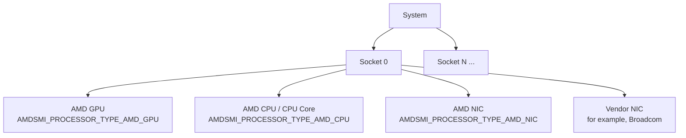
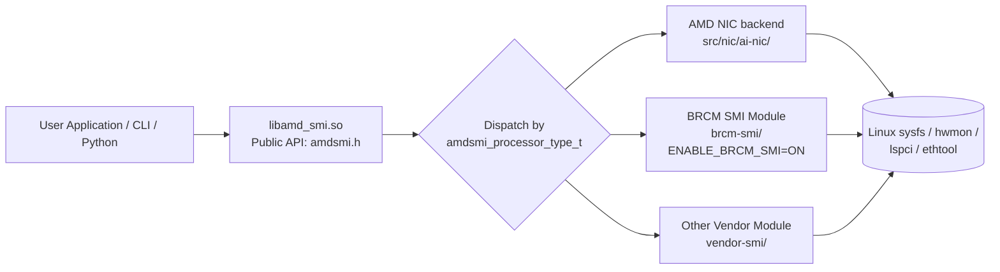

<!--
  Copyright (c) Advanced Micro Devices, Inc. All rights reserved.

  Permission is hereby granted, free of charge, to any person obtaining a copy
  of this software and associated documentation files (the "Software"), to deal
  in the Software without restriction, including without limitation the rights
  to use, copy, modify, merge, publish, distribute, sublicense, and/or sell
  copies of the Software, and to permit persons to whom the Software is
  furnished to do so, subject to the following conditions:

  The above copyright notice and this permission notice shall be included in
  all copies or substantial portions of the Software.

  THE SOFTWARE IS PROVIDED "AS IS", WITHOUT WARRANTY OF ANY KIND, EXPRESS OR
  IMPLIED, INCLUDING BUT NOT LIMITED TO THE WARRANTIES OF MERCHANTABILITY,
  FITNESS FOR A PARTICULAR PURPOSE AND NONINFRINGEMENT. IN NO EVENT SHALL THE
  AUTHORS OR COPYRIGHT HOLDERS BE LIABLE FOR ANY CLAIM, DAMAGES OR OTHER
  LIABILITY, WHETHER IN AN ACTION OF CONTRACT, TORT OR OTHERWISE, ARISING FROM,
  OUT OF OR IN CONNECTION WITH THE SOFTWARE OR THE USE OR OTHER DEALINGS IN
  THE SOFTWARE.
-->

# AMD SMI NIC integration guide

**Purpose**: This is a **contribution guide** for adding NIC device support to
the AMD SMI bare-metal (BM) library. It is *not* a Broadcom-specific guide and
it is *not* an end-user reference for the `amd-smi` CLI or Python interface;
BRCM SMI is referenced only as a working example of the vendor-integration
pattern. This document is intended for developers extending AMD SMI with new
NIC backends (AMD or third-party).

This document describes the AMD SMI public APIs, data structures, interfaces,
and conventions for integrating Network Interface Card (NIC) device support
into the [AMD SMI](https://github.com/ROCm/rocm-systems/tree/develop/projects/amdsmi)
framework.

**Scope**: This guide covers the **bare-metal (BM) AMD SMI** library only.
The Host AMD SMI library is a separate codebase with its own rules,
conventions, build system, and contribution process; the only components it
shares with the BM library are the public AMD SMI header (`amdsmi.h`, common
API subset) and the NIC library sources. Anything outside those two shared
components is BM-specific. For the host library, see:

- Source: [amd/MxGPU-Virtualization — `smi-lib`](https://github.com/amd/MxGPU-Virtualization/tree/staging/smi-lib)
- User guide: [AMD SMI for virtualization (Instinct docs)](https://instinct.docs.amd.com/projects/amd-smi-virt/en/latest/)

AMD SMI provides a unified management interface for AMD accelerators (GPUs,
CPUs), and is extended to support NIC devices via its public C API. This
document covers:

- [Architecture and device model](#architecture)
- [Public API conventions and naming](#public-api-conventions)
- [Data structures and type definitions](#data-structures)
- [Device discovery and initialization](#public-api-reference)
- [NIC Information APIs](#nic-information-apis) (ASIC, bus, NUMA, ports, driver, RDMA, statistics, vendor statistics)
- [Sysfs data source mapping](#sysfs-data-source-reference)
- [Code organization and integration points](#code-organization)
- Example usage ([C](#example-querying-nic-information-c) and [Python](#example-querying-nic-information-python))
- [Vendor SMI module integration pattern (with BRCM SMI as reference)](#vendor-smi-module-architecture)
- [CLI commands for NIC management](#amd-smi-cli-commands-for-nic)
- [Build configuration for vendor support](#build-system)

---

## Architecture

### Device model

AMD SMI uses a hierarchical device model:

```
System
└── Socket(s)
    └── Processor(s)
        ├── GPU    (AMDSMI_PROCESSOR_TYPE_AMD_GPU)
        ├── CPU    (AMDSMI_PROCESSOR_TYPE_AMD_CPU / _AMD_CPU_CORE)
        └── NIC    (AMDSMI_PROCESSOR_TYPE_AMD_NIC)
```

Vendor-specific processor types for third-party NICs are also supported and are
assigned distinct `amdsmi_processor_type_t` identifiers during device discovery (see
the [Processor types](#processor-types) section).

Each NIC is represented as a **processor handle** (`amdsmi_processor_handle`).
Handles are obtained via the standard AMD SMI discovery APIs and are then
passed to device-specific query functions.



### Processor types

The `amdsmi_processor_type_t` enum defines all device types detectable by AMD SMI.
The values relevant to NIC devices are:

```c
typedef enum {
    AMDSMI_PROCESSOR_TYPE_UNKNOWN = 0,   // Unknown processor type
    AMDSMI_PROCESSOR_TYPE_AMD_GPU,       // AMD GPU
    AMDSMI_PROCESSOR_TYPE_AMD_CPU,       // AMD CPU
    AMDSMI_PROCESSOR_TYPE_NON_AMD_GPU,   // Non-AMD GPU
    AMDSMI_PROCESSOR_TYPE_NON_AMD_CPU,   // Non-AMD CPU
    AMDSMI_PROCESSOR_TYPE_AMD_CPU_CORE,  // AMD CPU Core
    AMDSMI_PROCESSOR_TYPE_AMD_APU,       // AMD APU (GPU + CPU on a single die)
    AMDSMI_PROCESSOR_TYPE_AMD_NIC,       // AMD NIC (for example, Pensando)
    // Additional vendor-specific NIC types follow here
} amdsmi_processor_type_t;
```

Third-party NIC vendors are assigned their own processor type values appended
to this enum, enabling the dispatch layer to route API calls to the correct
device implementation.

### Initialization flags

To discover **AMD** NIC devices specifically, pass the `AMDSMI_INIT_AMD_NICS` flag during initialization:

```c
#define AMDSMI_INIT_AMD_NICS  (1 << 4)   // Initialize AMD NIC discovery only
```

:::{note}
`AMDSMI_INIT_AMD_NICS` only enables discovery of **AMD** NIC devices. You can
also discover NIC devices (AMD or vendor) by passing
`AMDSMI_INIT_ALL_PROCESSORS`, or by OR-ing `AMDSMI_INIT_AMD_NICS` with other
initialization flags (for example,
`AMDSMI_INIT_AMD_NICS | AMDSMI_INIT_AMD_GPUS`). Vendor NIC modules (for
example, BRCM SMI) perform their own discovery when their respective build
option is enabled (see
[Vendor SMI module architecture](#vendor-smi-module-architecture)).
:::

### Vendor SMI module architecture

Third-party vendors (for example, Broadcom) can integrate their NIC support via
a standalone **Vendor SMI Module** — a self-contained library that lives under a
dedicated directory (for example, `brcm-smi/`) and is conditionally compiled
into the main `amd_smi` library.

**Module structure:**

```
<vendor>-smi/
├── include/<vendor>_smi/
│   ├── <vendor>smi.h            # Vendor's public C API header (internal use)
│   └── impl/                    # Internal implementation headers
│       ├── <vendor>_smi_nic_device.h
│       └── <vendor>_smi_discovery.h
├── src/
│   ├── <vendor>_smi.cc          # Core init/shutdown/discovery, getString
│   ├── <vendor>_smi_discovery.cc
│   └── <vendor>_smi_nic_device.cc
├── cmake/
│   └── <vendor>_smi_config.cmake.in
├── CMakeLists.txt
└── <VENDOR>_SMI_DOCUMENTATION.md
```

**Key design principles:**

1. **Compile-time flag**: Vendor modules are enabled via a CMake option
   (for example, `ENABLE_BRCM_SMI=ON`). Vendor modules are off by default.

2. **Vendor types are internal to the vendor module**: A vendor module may
   define internal types prefixed with the vendor name (for example,
   `brcmsmi_status_t`, `brcmsmi_nic_info_t`, `brcmsmi_bdf_t`) for use inside
   its own sources. **These types must not appear in the public AMD SMI
   header (`amdsmi.h`).** The public surface uses only `amdsmi_status_t`,
   `amdsmi_bdf_t`, `amdsmi_processor_handle`, and the standard
   `amdsmi_nic_*` structures. Keep vendor data structures (for example, the
   vendor's `nic_info`) as close as possible to the corresponding
   `amdsmi_nic_*` structures so the wrapper layer is a straight field copy.

3. **Unified public API — no vendor-specific wrapper symbols**: A vendor
   backend is consumed through the standard AMD SMI dispatch. Discovery uses
   `amdsmi_get_processor_handles_by_type()`; queries use the existing
   `amdsmi_get_nic_*` APIs. The dispatch layer (`src/amd_smi/amd_smi.cc`)
   forwards calls to the vendor module's implementation and converts any
   vendor status code or BDF to the AMD SMI equivalents at that boundary.
   Add new vendor-specific `amdsmi_<vendor>_*` symbols only when a piece of
   functionality genuinely cannot be expressed through the existing public API.

4. **Generic string retrieval (vendor-internal)**: A vendor module may expose
   a `<vendor>smi_getString()` helper for retrieving string-based information
   from devices using method names (for example, `"get_nic_info"`,
   `"get_nic_metrics"`). This is an internal convenience for the wrapper
   layer and is not part of the public AMD SMI surface.

5. **Python interface uses the public AMD SMI API only**: All Python
   bindings live in `py-interface/amdsmi_interface.py` and
   `py-interface/amdsmi_wrapper.py` and bind only to the public `amdsmi.h`
   symbols. No vendor-specific Python wrapper module is needed.

6. **Unified CLI**: The AMD SMI CLI (`amdsmi_cli/amdsmi_commands.py`) lists
   and queries all NIC backends through the same code path. For example,
   `amd-smi list` and `amd-smi monitor -nic` enumerate every NIC processor
   handle returned by the public API — AMD AI NIC and vendor NICs alike —
   with no per-vendor delegation class.

### Building with vendor SMI support

To build AMD SMI with Broadcom NIC support:

```bash
mkdir build && cd build
cmake .. -DENABLE_BRCM_SMI=ON
make -j$(nproc)
```

When `ENABLE_BRCM_SMI=OFF` (the default), all BRCM-specific code is excluded
and the NIC CLI commands display:
```
ERROR | NIC monitoring requires BRCM SMI support. Rebuild with -DENABLE_BRCM_SMI=ON
```

---

## Public API conventions

### Naming

All public AMD SMI functions follow this pattern:

```
amdsmi_get_<device_type>_<data_category>(processor_handle, output_struct*)
```

Examples:
- `amdsmi_get_nic_asic_info()`
- `amdsmi_get_nic_bus_info()`
- `amdsmi_get_nic_port_info()`
- `amdsmi_get_nic_rdma_port_statistics()`

### Parameter conventions

| Parameter | Convention |
|-----------|-----------|
| `processor_handle` | Always the first parameter. Obtained from discovery APIs. |
| Output structs | Pointer to caller-allocated struct. Must not be `NULL`. |
| Two-call pattern | For variable-length data: first call with `data=NULL` returns count; second call fills the array. |

### Return values

All APIs return `amdsmi_status_t`:

| Status | Meaning |
|--------|---------|
| `AMDSMI_STATUS_SUCCESS` | Operation completed successfully |
| `AMDSMI_STATUS_INVAL` | Invalid argument (for example, `NULL` pointer) |
| `AMDSMI_STATUS_NOT_SUPPORTED` | Feature not supported on this device |
| `AMDSMI_STATUS_FILE_ERROR` | Failed to read sysfs file |
| `AMDSMI_STATUS_NO_PERM` | Insufficient permissions |
| `AMDSMI_STATUS_INIT_ERROR` | Library not initialized |
| `AMDSMI_STATUS_BUSY` | Device mutex could not be acquired |

### Unsupported or unavailable fields

When a device or driver does not provide a value for a particular field within
a larger output struct, AMD SMI uses the following conventions instead of
failing the entire call:

| Field type | Sentinel value for unsupported / unavailable |
|------------|----------------------------------------------|
| Unsigned integers (`uint8_t`, `uint16_t`, `uint32_t`, `uint64_t`) | The maximum value of the type (for example, `UINT32_MAX`, `UINT64_MAX`) |
| Signed integers | `INT32_MIN` / `INT64_MIN` |
| Floating-point | `NaN` |
| Strings (`char[]`) | The literal string `"N/A"`, or an empty string (`""`) when the field is structurally absent |
| Bitmask / flag fields | `0` (no flags set) |

Treat these sentinel values as "not reported" rather than as valid data. The
overall API call still returns `AMDSMI_STATUS_SUCCESS` provided at least one
field in the struct was populated; per-field availability is encoded via the
sentinels above. If *no* field can be populated, the API returns
`AMDSMI_STATUS_NOT_SUPPORTED`.

---

## Data structures

### Size constants

```c
#define AMDSMI_MAX_STRING_LENGTH       256  // Max string buffer length
#define AMDSMI_MAX_NIC_PORTS            32  // Max NIC ports
#define AMDSMI_MAX_NIC_RDMA_DEV         32  // Max RDMA devices
```

### NIC ASIC information

```c
typedef struct {
    uint16_t vendor_id;
    uint16_t subvendor_id;
    uint16_t device_id;
    uint16_t subsystem_id;
    uint8_t  revision;
    char     permanent_address[AMDSMI_MAX_STRING_LENGTH];
    char     product_name[AMDSMI_MAX_STRING_LENGTH];
    char     part_number[AMDSMI_MAX_STRING_LENGTH];
    char     serial_number[AMDSMI_MAX_STRING_LENGTH];
    char     vendor_name[AMDSMI_MAX_STRING_LENGTH];
} amdsmi_nic_asic_info_t;
```

**Sysfs sources:**
- `vendor_id`: `/sys/bus/pci/devices/<BDF>/vendor`
- `device_id`: `/sys/bus/pci/devices/<BDF>/device`
- `subvendor_id`: `/sys/bus/pci/devices/<BDF>/subsystem_vendor`
- `subsystem_id`: `/sys/bus/pci/devices/<BDF>/subsystem_device`
- `revision`: `/sys/bus/pci/devices/<BDF>/revision`
- `product_name`, `part_number`, `serial_number`: VPD data, read from `/sys/bus/pci/devices/<BDF>/vpd` when present, with `lspci -vvv -s <BDF>` as a fallback for devices that don't expose the sysfs VPD entry.

### NIC bus information

```c
typedef struct {
    amdsmi_bdf_t bdf;
    uint8_t  max_pcie_width;
    uint32_t max_pcie_speed;  // in GT/s
    char     pcie_interface_version[AMDSMI_MAX_STRING_LENGTH];
    char     slot_type[AMDSMI_MAX_STRING_LENGTH];
} amdsmi_nic_bus_info_t;
```

**Sysfs sources:**
- `bdf`: Parsed from PCI enumeration
- `max_pcie_width`: `/sys/bus/pci/devices/<BDF>/max_link_width`
- `max_pcie_speed`: `/sys/bus/pci/devices/<BDF>/max_link_speed`

### BDF (Bus-Device-Function)

`amdsmi_bdf_t` is a union that provides three ways to access the BDF:

```c
typedef union {
    struct bdf_ {
        uint64_t function_number : 3;
        uint64_t device_number   : 5;
        uint64_t bus_number      : 8;
        uint64_t domain_number   : 48;
    } bdf;
    struct {  // anonymous access (same layout)
        uint64_t function_number : 3;
        uint64_t device_number   : 5;
        uint64_t bus_number      : 8;
        uint64_t domain_number   : 48;
    };
    uint64_t as_uint;  // raw 64-bit value
} amdsmi_bdf_t;
```

Fields can be accessed directly (for example, `bdf.function_number`) or via the
named struct (for example, `bdf.bdf.function_number`). The `as_uint` member
provides the packed 64-bit representation.

### NIC NUMA information

```c
typedef struct {
    uint8_t node;
    char    affinity[AMDSMI_MAX_STRING_LENGTH];
} amdsmi_nic_numa_info_t;
```

**Sysfs sources:**
- `node`: `/sys/bus/pci/devices/<BDF>/numa_node`
- `affinity`: `/sys/devices/system/node/node<N>/cpulist` (where `<N>` is the value read from `numa_node`)

### NIC port information

```c
typedef struct {
    amdsmi_bdf_t bdf;
    uint32_t port_num;
    char     type[AMDSMI_MAX_STRING_LENGTH];
    char     flavour[AMDSMI_MAX_STRING_LENGTH];
    char     netdev[AMDSMI_MAX_STRING_LENGTH];
    uint8_t  ifindex;
    char     mac_address[AMDSMI_MAX_STRING_LENGTH];
    uint8_t  carrier;
    uint16_t mtu;
    char     link_state[AMDSMI_MAX_STRING_LENGTH];
    uint32_t link_speed;
    uint32_t active_fec;   // Active FEC modes bitmask
    char     autoneg[AMDSMI_MAX_STRING_LENGTH];
    char     pause_autoneg[AMDSMI_MAX_STRING_LENGTH];
    char     pause_rx[AMDSMI_MAX_STRING_LENGTH];
    char     pause_tx[AMDSMI_MAX_STRING_LENGTH];
} amdsmi_nic_port_t;

typedef struct {
    uint32_t        num_ports;
    amdsmi_nic_port_t ports[AMDSMI_MAX_NIC_PORTS];
} amdsmi_nic_port_info_t;
```

**Active FEC bitmask values** (example mapping from `ethtool_fecparam`):

:::{note}
The values below are a representative example. The exact bit values and the set
of supported modes may differ between Linux kernel and `ethtool` versions. Refer
to the `ethtool_fecparam` definitions in the kernel UAPI headers
(`<linux/ethtool.h>`) of the target system rather than treating the table below
as a fixed contract.
:::

| Value | Mode |
|-------|------|
| 0x01 | `ETHTOOL_FEC_NONE` |
| 0x02 | `ETHTOOL_FEC_AUTO` |
| 0x04 | `ETHTOOL_FEC_RS` |
| 0x08 | `ETHTOOL_FEC_BASER` |
| 0x10 | `ETHTOOL_FEC_LLRS` |
| 0x20 | `ETHTOOL_FEC_OFF` |

### NIC driver information

```c
typedef struct {
    char name[AMDSMI_MAX_STRING_LENGTH];
    char version[AMDSMI_MAX_STRING_LENGTH];
} amdsmi_nic_driver_info_t;
```

### NIC RDMA device information

```c
typedef struct {
    char    netdev[AMDSMI_MAX_STRING_LENGTH];
    char    state[AMDSMI_MAX_STRING_LENGTH];
    uint8_t rdma_port;
    uint16_t max_mtu;
    uint16_t active_mtu;
} amdsmi_nic_rdma_port_info_t;

typedef struct {
    char    rdma_dev[AMDSMI_MAX_STRING_LENGTH];
    char    node_guid[AMDSMI_MAX_STRING_LENGTH];
    char    node_type[AMDSMI_MAX_STRING_LENGTH];
    char    sys_image_guid[AMDSMI_MAX_STRING_LENGTH];
    char    fw_ver[AMDSMI_MAX_STRING_LENGTH];
    uint8_t num_rdma_ports;
    amdsmi_nic_rdma_port_info_t rdma_port_info[AMDSMI_MAX_NIC_PORTS];
} amdsmi_nic_rdma_dev_info_t;

typedef struct {
    uint8_t num_rdma_dev;
    amdsmi_nic_rdma_dev_info_t rdma_dev_info[AMDSMI_MAX_NIC_RDMA_DEV];
} amdsmi_nic_rdma_devices_info_t;
```

### NIC statistics

```c
typedef struct {
    char     name[AMDSMI_MAX_STRING_LENGTH];
    uint64_t value;
} amdsmi_nic_stat_t;
```

Used by both `amdsmi_get_nic_rdma_port_statistics()` and
`amdsmi_get_nic_vendor_statistics()`.

---

## Public API reference

The canonical reference for every AMD SMI public API is the header
[`projects/amdsmi/include/amd_smi/amdsmi.h`](../../include/amd_smi/amdsmi.h)
and the rendered Sphinx documentation at the
[AMD SMI documentation](https://rocm.docs.amd.com/projects/amdsmi/en/latest/).
For end-to-end usage examples, see
[`amd_smi_nic.cc`](../../example/amd_smi_nic.cc) for NIC queries and the BRCM
examples listed in the [Code organization](#code-organization) section. The
summaries below provide a NIC-focused subset of that reference; use the header
and the in-tree examples as the source of truth.

:::{note}
The signatures listed in this section reflect the **bare-metal (BM) AMD SMI**
library. The host AMD SMI library is a separate codebase with its own user
guide; see
[amd/MxGPU-Virtualization — `smi-lib`](https://github.com/amd/MxGPU-Virtualization/tree/staging/smi-lib)
and the
[AMD SMI for virtualization user guide](https://instinct.docs.amd.com/projects/amd-smi-virt/en/latest/).
:::

### Initialization and shutdown

```c
// Initialize AMD SMI with NIC support
amdsmi_status_t amdsmi_init(uint64_t init_flags);
// Use: amdsmi_init(AMDSMI_INIT_AMD_NICS);

// Shutdown AMD SMI
amdsmi_status_t amdsmi_shut_down(void);
```

### Device discovery

```c
// Get socket handles
amdsmi_status_t amdsmi_get_socket_handles(uint32_t *socket_count,
                                          amdsmi_socket_handle *socket_handles);

// Get processor handles filtered by type
// Supports: AMDSMI_PROCESSOR_TYPE_AMD_NIC and other vendor-specific NIC types
amdsmi_status_t amdsmi_get_processor_handles_by_type(
    amdsmi_socket_handle socket_handle,
    amdsmi_processor_type_t processor_type,
    amdsmi_processor_handle *processor_handles,
    uint32_t *processor_count);
```

**Two-call pattern for discovery:**

1. Call with `processor_handles = NULL` to get `processor_count`.
2. Allocate an array of `processor_count` handles.
3. Call again with the allocated array.

### NIC information APIs

The following APIs are implemented and available in the current AMD SMI release:

```c
// NIC ASIC Information
amdsmi_status_t amdsmi_get_nic_asic_info(
    amdsmi_processor_handle processor_handle,
    amdsmi_nic_asic_info_t *info);

// NIC Bus Information
amdsmi_status_t amdsmi_get_nic_bus_info(
    amdsmi_processor_handle processor_handle,
    amdsmi_nic_bus_info_t *info);

// NIC NUMA Information
amdsmi_status_t amdsmi_get_nic_numa_info(
    amdsmi_processor_handle processor_handle,
    amdsmi_nic_numa_info_t *info);

// NIC Driver Information
amdsmi_status_t amdsmi_get_nic_driver_info(
    amdsmi_processor_handle processor_handle,
    amdsmi_nic_driver_info_t *info);

// NIC Port Information
amdsmi_status_t amdsmi_get_nic_port_info(
    amdsmi_processor_handle processor_handle,
    amdsmi_nic_port_info_t *info);

// NIC RDMA Device Information
amdsmi_status_t amdsmi_get_nic_rdma_dev_info(
    amdsmi_processor_handle processor_handle,
    amdsmi_nic_rdma_devices_info_t *info);
```

### NIC RDMA port statistics

This API uses a **two-call pattern**:

```c
amdsmi_status_t amdsmi_get_nic_rdma_port_statistics(
    amdsmi_processor_handle processor_handle,
    uint32_t rdma_port_index,
    uint32_t *num_stats,
    amdsmi_nic_stat_t *stats);
```

**Usage:**

1. Call with `stats = NULL` to get `num_stats` (count of available statistics).
2. Allocate an array of `num_stats` elements.
3. Call again with the allocated array.

### NIC vendor statistics

This API uses a **two-call pattern**. It returns vendor-specific NIC counters
for the requested NIC port. The vendor driver defines the exact set of counters.

```c
amdsmi_status_t amdsmi_get_nic_vendor_statistics(
    amdsmi_processor_handle processor_handle,
    uint32_t port_index,
    uint32_t *num_stats,
    amdsmi_nic_stat_t *stats);
```

**Usage:**

1. Call with `stats = NULL` to get `num_stats` (count of available statistics for the port).
2. Allocate an array of `num_stats` elements.
3. Call again with the allocated array.

---

## BRCM SMI integration in AMD SMI

When built with `ENABLE_BRCM_SMI=ON`, Broadcom NIC support is compiled into
`libamd_smi.so` and exposed **through the standard public AMD SMI API — no
parallel `amdsmi_brcm_*` symbols are added to `amdsmi.h`**. You discover and
query Broadcom NICs the same way as AMD NICs:

- **Discovery**: `amdsmi_get_processor_handles_by_type(socket, AMDSMI_PROCESSOR_TYPE_AMD_NIC, ...)`
  returns processor handles for every NIC backend registered with the
  dispatch layer (AMD AI NIC and any enabled vendor NICs such as BRCM).
  Where a backend distinction is needed, vendor processor types may be
  appended to `amdsmi_processor_type_t` (for example, a `*_BRCM_NIC` value) and
  used as the type argument; the public query APIs remain the same.
- **Queries**: the existing `amdsmi_get_nic_asic_info()`,
  `amdsmi_get_nic_bus_info()`, `amdsmi_get_nic_numa_info()`,
  `amdsmi_get_nic_port_info()`, `amdsmi_get_nic_rdma_dev_info()`,
  `amdsmi_get_nic_rdma_port_statistics()`, and
  `amdsmi_get_nic_vendor_statistics()` are dispatched to the BRCM backend
  when the handle belongs to a Broadcom device.
- **Status and BDF**: all public-facing return codes and bus identifiers use
  `amdsmi_status_t` and the standard `amdsmi` BDF representation. Vendor
  status codes and BDFs are an implementation detail of the vendor module
  and are converted by the dispatch or wrapper layer at the public boundary
  (see [BRCM SMI native C API](#brcm-smi-native-c-api-brcmsmih)).

The public AMD SMI surface for Broadcom NIC support is the same as for AMD
NICs; no Broadcom-specific examples are needed at this level. See
[Example: Querying NIC information \(C)](#example-querying-nic-information-c)
and [Example: Querying NIC information (Python)](#example-querying-nic-information-python).

---

## BRCM SMI native C API (`brcmsmi.h`)

The standalone BRCM SMI library (`brcm-smi/include/brcm_smi/brcmsmi.h`) is the
**internal** C API used by the AMD SMI dispatch layer when forwarding NIC
queries to the Broadcom backend. This section is for contributors working on
the vendor module itself; **use the `amdsmi_*` API for all public access**
(see [BRCM SMI integration in AMD SMI](#brcm-smi-integration-in-amd-smi)).

:::{note}
`brcmsmi_status_t`, `brcmsmi_bdf_t`, and the `brcmsmi_processor_handle` and
`brcmsmi_socket_handle` opaque handle types are **internal to this vendor
module**. The wrapper layer in `src/amd_smi/amd_smi.cc` converts them to
`amdsmi_status_t` and the standard `amdsmi` BDF representation at the public
boundary. None of these vendor types appear in `amdsmi.h`.
:::

### Key types (internal)

```c
#define BRCMSMI_MAX_STRING_LENGTH 256

typedef enum {
    BRCMSMI_STATUS_SUCCESS = 0,
    BRCMSMI_STATUS_INVALID_ARGS,
    BRCMSMI_STATUS_NOT_SUPPORTED,
    BRCMSMI_STATUS_FILE_ERROR,
    BRCMSMI_STATUS_PERMISSION,
    BRCMSMI_STATUS_OUT_OF_RESOURCES,
    BRCMSMI_STATUS_INTERNAL_EXCEPTION,
    BRCMSMI_STATUS_INIT_ERROR,
    BRCMSMI_STATUS_NOT_INITIALIZED,
    BRCMSMI_STATUS_ALREADY_INITIALIZED,
    BRCMSMI_STATUS_INSUFFICIENT_SIZE,
    BRCMSMI_STATUS_NOT_FOUND
} brcmsmi_status_t;            // converted to amdsmi_status_t at the wrapper

typedef enum {
    BRCMSMI_PROCESSOR_TYPE_NIC,
    BRCMSMI_PROCESSOR_TYPE_ALL
} brcmsmi_processor_type_t;

typedef void* brcmsmi_processor_handle;   // never exposed in amdsmi.h
typedef void* brcmsmi_socket_handle;      // never exposed in amdsmi.h

typedef struct {                          // converted to amdsmi BDF at the wrapper
    uint64_t domain_number;
    uint64_t bus_number;
    uint64_t device_number;
    uint64_t function_number;
} brcmsmi_bdf_t;
```

### Key structures (internal)

Keep vendor structures as close as possible to the corresponding public
`amdsmi_nic_*` structures so the wrapper layer is a straight field copy:

```c
typedef struct {
    char nic_device_name[BRCMSMI_MAX_STRING_LENGTH];
    char nic_part_number[BRCMSMI_MAX_STRING_LENGTH];
    char nic_firmware_version[BRCMSMI_MAX_STRING_LENGTH];
    char nic_uuid[BRCMSMI_MAX_STRING_LENGTH];
    brcmsmi_bdf_t nic_bdf;
} brcmsmi_nic_info_t;

typedef struct {
    uint32_t nic_temp_input;
    uint32_t nic_temp_max;
    uint32_t nic_temp_crit;
    uint32_t nic_temp_emergency;
    uint32_t nic_temp_shutdown;
    // alarm fields
} brcmsmi_nic_temperature_metric_t;
```

### Key functions (internal)

```c
// Lifecycle
brcmsmi_status_t brcmsmi_init(uint64_t init_flags);
brcmsmi_status_t brcmsmi_shutdown();

// Discovery
brcmsmi_status_t brcmsmi_discover_devices(brcmsmi_discovery_result_t *result);
brcmsmi_status_t brcmsmi_get_socket_handles(uint32_t *socket_count,
                                            brcmsmi_socket_handle *socket_handles);

// Processor handles
brcmsmi_status_t brcmsmi_get_nic_processor_handles(
    brcmsmi_socket_handle socket_handle,
    uint32_t *processor_count,
    brcmsmi_processor_handle **processor_handles);

// NIC queries
brcmsmi_status_t brcmsmi_get_nic_info(brcmsmi_processor_handle handle,
                                      brcmsmi_nic_info_t *info);
brcmsmi_status_t brcmsmi_get_nic_temp_info(brcmsmi_processor_handle handle,
                                           brcmsmi_nic_temperature_metric_t *info);
brcmsmi_status_t brcmsmi_get_nic_power_info(brcmsmi_processor_handle handle,
                                            brcmsmi_nic_hwmon_power_t *info);
brcmsmi_status_t brcmsmi_get_nic_device_info(brcmsmi_processor_handle handle,
                                             brcmsmi_nic_hwmon_device_t *info);
brcmsmi_status_t brcmsmi_get_nic_fw_info(brcmsmi_processor_handle handle,
                                         brcmsmi_nic_firmware_t *info);
brcmsmi_status_t brcmsmi_get_nic_device_bdf(brcmsmi_processor_handle handle,
                                            brcmsmi_bdf_t *bdf);

// Generic string retrieval (internal helper)
brcmsmi_status_t brcmsmi_getString(brcmsmi_processor_handle handle,
                                   const char *method_name,
                                   unsigned int value_length,
                                   char *value);
```

:::{note}
For full API documentation, see `brcm-smi/BRCM_SMI_DOCUMENTATION.md` in the
repository.
:::

### BRCM device discovery details

BRCM devices are discovered via sysfs:

| Device type | Discovery path | Identification |
|-------------|---------------|----------------|
| NIC | `/sys/class/hwmon/` | Vendor ID `0x14e4` (via `<path>/device/vendor`) |

The BRCM NIC driver must be loaded for NIC devices to appear under
`/sys/class/hwmon`. Without the BRCM driver, NIC devices won't be discovered.

### NIC monitor attributes

| Attribute | Sysfs File | Description |
|-----------|-----------|-------------|
| `NIC_TEMP_CURRENT` | `temp1_input` | Current temperature (millidegrees) |
| `NIC_TEMP_CRIT_ALARM` | `temp1_crit_alarm` | Critical temperature alarm |
| `NIC_TEMP_EMERGENCY_ALARM` | `temp1_emergency_alarm` | Emergency temperature alarm |
| `NIC_TEMP_SHUTDOWN_ALARM` | `temp1_shutdown_alarm` | Shutdown temperature alarm |
| `NIC_TEMP_MAX_ALARM` | `temp1_max_alarm` | Max temperature alarm |

---

## AMD SMI CLI commands for NIC

The `amd-smi` CLI is **unified across all NIC backends**: the same commands
operate on AMD AI NIC and any enabled vendor NICs (for example, Broadcom when
built with `ENABLE_BRCM_SMI=ON`). There is no per-vendor CLI delegation —
every NIC processor handle returned by the public API is enumerated through the
same code path.

### List devices

```bash
# List all devices (GPUs and all NIC backends: AMD + vendor NICs)
amd-smi list
```

Output includes every discovered NIC — AMD AI NIC and Broadcom NIC alike —
with its BDF and UUID.

### Monitor NIC devices

```bash
# Monitor NIC temperature and alarm attributes (all NIC backends)
amd-smi monitor -nic
```

Displays real-time NIC temperature readings (current, critical alarm,
emergency alarm, shutdown alarm, max alarm) for every NIC device.

### NIC metrics

```bash
# Get NIC metrics (power, temperature, errors) for all NIC backends
amd-smi metric -nic
```

### NIC topology

```bash
# Show NIC topology information
amd-smi topology -nic
```

Shows the relationship between NIC devices, GPU devices, and NUMA nodes.

### Dump NIC information

```bash
# Dump comprehensive NIC information (all backends) to file
amd-smi dump --nic --file output.txt
```

Collects PCI device information, lspci output, and detailed device data.

---

## Sysfs data source reference

### Base paths

| Type | Base Path |
|------|-----------|
| PCI device | `/sys/bus/pci/devices/<BDF>/` |
| Network interface | `/sys/class/net/<iface>/device/` |
| Hwmon (via net iface) | `/sys/class/net/<iface>/device/hwmon/hwmonX/` |
| PCI power runtime | `/sys/bus/pci/devices/<BDF>/power/` |

### NIC sysfs mapping

| Data Category | Sysfs Files |
|--------------|-------------|
| Temperature | `temp1_input`, `temp1_max`, `temp1_crit`, `temp1_emergency`, `temp1_shutdown`, `temp1_*_alarm` |
| Power Runtime | `power/async`, `power/control`, `power/runtime_status`, `power/runtime_active_time`, `power/runtime_suspended_time`, `power/runtime_usage`, `power/runtime_active_kids`, `power/runtime_enabled` |
| PCI Device Info | `vendor`, `device`, `subsystem_vendor`, `subsystem_device`, `revision`, `class`, `modalias`, `reset_method` |
| PCIe Link | `current_link_speed`, `max_link_speed`, `current_link_width`, `max_link_width` |
| DMA | `dma_mask_bits`, `consistent_dma_mask_bits` |
| Interrupt | `irq`, `msi_bus` |
| AER Errors | `aer_dev_correctable`, `aer_dev_fatal`, `aer_dev_nonfatal` |
| SR-IOV | `sriov_numvfs`, `sriov_totalvfs`, `sriov_offset`, `sriov_stride`, `sriov_vf_device`, `sriov_vf_total_msix`, `sriov_drivers_autoprobe` |
| ARI | `ari_enabled` |
| PCI Power State | `power_state`, `d3cold_allowed`, `broken_parity_status` |
| Wakeup | `power/wakeup`, `power/wakeup_count`, `power/wakeup_active_count`, `power/wakeup_abort_count`, `power/wakeup_expire_count`, `power/wakeup_last_time_ms`, `power/wakeup_max_time_ms`, `power/wakeup_total_time_ms` |
| NUMA | `numa_node` |
| CPU Affinity | `/sys/devices/system/node/node<N>/cpulist` |
| VPD Data | Via `lspci -vvv -s <BDF>` (part number, serial number, firmware version) |

---

## Code organization

**Scope**: The directory layout below describes the **bare-metal (BM) AMD SMI**
build under ROCm, which is the focus of this contribution guide. The Host AMD
SMI library is a **separate codebase** with its own rules, conventions, and
build system (see
[amd/MxGPU-Virtualization — `smi-lib`](https://github.com/amd/MxGPU-Virtualization/tree/staging/smi-lib)
and the
[AMD SMI for virtualization user guide](https://instinct.docs.amd.com/projects/amd-smi-virt/en/latest/)).
The only components shared between the two are:

- the **public header** `include/amd_smi/amdsmi.h` (the common API subset), and
- the **NIC library** sources under `src/nic/` (and any associated headers
  under `include/amd_smi/impl/nic/`).

Vendor SMI modules such as `brcm-smi/` are part of the BM tree shown below.
When modifying the NIC library or the public header, contributors should keep
in mind that those changes are consumed by both the BM build and the host
build and must remain compatible across them. Anything outside the two shared
components above is BM-specific.

The AMD SMI NIC implementation (BM build) follows this directory structure:

```
projects/amdsmi/
├── include/amd_smi/
│   ├── amdsmi.h                          # Public API header (structs + function declarations)
│   └── impl/
│       ├── amd_smi_common.h              # Internal common definitions
│       ├── amd_smi_utils.h               # Utility functions (sysfs readers, helpers)
│       └── nic/
│           ├── amd_smi_ainic_device.h    # AMD NIC device class
│           └── <vendor>_device.h         # Vendor-specific NIC device class(es)
├── src/
│   ├── amd_smi/
│   │   ├── amd_smi.cc                   # Main API implementation (dispatch layer)
│   │   ├── amd_smi_system.cc            # System-level init, device discovery
│   │   └── amd_smi_utils.cc             # Sysfs reading utilities
│   └── nic/
│       ├── ai-nic/                       # AMD NIC (Pensando/ionic) implementation
│       │   ├── inc/                      # Internal headers
│       │   ├── src/                      # Implementation sources
│       │   └── interface/                # Library API exposed to AMD SMI dispatch
│       └── <vendor>/                     # Vendor-specific NIC implementation
│           ├── <vendor>_nic_device.cc    # NIC device methods
│           └── <vendor>_sysfs.cc         # Sysfs/data-source queries
├── brcm-smi/                             # Broadcom vendor SMI module (self-contained)
│   ├── include/brcm_smi/
│   │   ├── brcmsmi.h                     # BRCM SMI internal C header (vendor types + APIs)
│   │   ├── brcm_smi_device.h             # Device management classes
│   │   ├── brcm_smi_discovery.h          # Device discovery interface
│   │   └── impl/                         # Internal implementation headers
│   │       ├── brcm_smi_nic_device.h
│   │       ├── brcm_smi_lspci_commands.h
│   │       ├── brcm_smi_processor.h
│   │       ├── brcm_smi_socket.h
│   │       └── brcm_smi_system.h
│   ├── src/
│   │   ├── brcm_smi.cc                  # Core init/shutdown/queries/getString
│   │   ├── brcm_smi_discovery.cc         # Device discovery (sysfs scanning)
│   │   ├── brcm_smi_device.cc            # Device manager
│   │   ├── brcm_smi_nic_device.cc        # NIC device methods
│   │   ├── brcm_smi_lspci_commands.cc    # lspci data extraction
│   │   ├── brcm_smi_socket.cc
│   │   ├── brcm_smi_processor.cc
│   │   ├── brcm_smi_system.cc
│   │   └── brcm_smi_utils.cc
│   ├── cmake/
│   │   └── brcm_smi_config.cmake.in
│   ├── CMakeLists.txt
│   └── BRCM_SMI_DOCUMENTATION.md         # Full BRCM SMI documentation
├── py-interface/
│   ├── amdsmi_interface.py               # Python wrapper (high-level, public AMD SMI API only)
│   └── amdsmi_wrapper.py                 # Python ctypes bindings to amdsmi.h
├── amdsmi_cli/
│   ├── amdsmi_commands.py                # Unified CLI command implementations (all NIC backends)
│   └── amdsmi_parser.py                  # CLI argument parsing
├── example/
│   ├── amd_smi_nic.cc                   # AMD NIC C++ example (public AMD SMI API)
│   ├── brcm_smi_discovery_example.cc     # BRCM device discovery example (internal vendor API)
│   ├── brcm_smi_nic_example.cc           # BRCM NIC monitoring example (internal vendor API)
│   ├── brcm_smi_unified_example.cc       # Unified AMD SMI + BRCM integration example
│   └── BRCM_SMI_EXAMPLES_README.md       # BRCM examples documentation
└── tests/
    └── amd_smi_test/functional/
        ├── sys_info_read.cc              # NIC integration tests
        └── brcm_smi_read.cc              # BRCM SMI functional tests
```

### Vendor SMI module integration (visualization)

The diagram below shows how a vendor SMI module (BRCM SMI shown as the
reference) plugs into the AMD SMI dispatch layer. The same pattern applies to
any future vendor module.



### Key integration points

1. **Public header** (`include/amd_smi/amdsmi.h`): Contains all public data
   structures and API declarations. Add new structs and functions here. Vendor
   modules do **not** add parallel `amdsmi_<vendor>_*` symbols here — the
   public surface stays unified.

2. **Dispatch layer** (`src/amd_smi/amd_smi.cc`): Routes API calls to the
   correct device implementation based on processor type. Vendor-specific code
   is compiled conditionally. The dispatch layer converts any vendor-internal
   status code or BDF to `amdsmi_status_t` or `amdsmi_bdf_t` at the public
   boundary.

3. **Vendor SMI module** (`brcm-smi/`): Self-contained Broadcom SMI library
   with its own internal header (`brcmsmi.h`), type system, and implementation.
   Built into `libamd_smi.so` when `ENABLE_BRCM_SMI=ON`. Its types are not
   exposed in `amdsmi.h`.

4. **Device classes** (under `include/amd_smi/impl/nic/` and
   `brcm-smi/include/brcm_smi/impl/`): Each device type has a class that
   implements device-specific queries.

5. **Sysfs readers** (under `src/nic/<vendor>/` and `brcm-smi/src/`):
   The sysfs file reading logic. Utility functions read sysfs values as
   integers or strings.

6. **Discovery** (`src/amd_smi/amd_smi_system.cc` and
   `brcm-smi/src/brcm_smi_discovery.cc`): Device enumeration and handle
   creation during initialization.

7. **Python interface** (`py-interface/amdsmi_interface.py`,
   `py-interface/amdsmi_wrapper.py`): Python bindings to the public
   `amdsmi.h` only. There is no vendor-specific Python wrapper module —
   you access Broadcom NICs via the same `amdsmi_interface` calls as AMD NICs.

8. **CLI** (`amdsmi_cli/amdsmi_commands.py`): Unified command-line interface.
   Commands such as `amd-smi list -nic`, `monitor -nic`, and `metric -nic`
   enumerate every NIC backend through the public API — there is no per-vendor
   delegation class.

9. **Examples** (`example/amd_smi_nic.cc`, `example/brcm_smi_*_example.cc`):
   The `amd_smi_nic.cc` example uses the public AMD SMI API and covers
   Broadcom NICs as well when `ENABLE_BRCM_SMI=ON`. The
   `brcm_smi_*_example.cc` files exercise the internal BRCM SMI library and
   are intended for vendor-module contributors.

---

(example-querying-nic-information-c)=
## Example: Querying NIC information \(C)

A complete, build-tested C/C++ example for querying AMD NIC ASIC, bus, NUMA,
port, and RDMA statistics is maintained in the repository at
[projects/amdsmi/example/amd_smi_nic.cc](../../example/amd_smi_nic.cc). It is
compiled as part of the `BUILD_EXAMPLES=ON` CMake target.

The abbreviated snippet below illustrates the canonical init → discover →
query → shutdown flow. See that file for the full implementation, including
error handling and all supported queries.

```c
#include <amd_smi/amdsmi.h>
#include <stdio.h>
#include <stdlib.h>
#include <inttypes.h>

int main() {
    amdsmi_status_t status;

    // Initialize with AMD NIC support (use AMDSMI_INIT_ALL_PROCESSORS to also
    // include GPUs, CPUs, and vendor NICs in the same process).
    status = amdsmi_init(AMDSMI_INIT_AMD_NICS);
    if (status != AMDSMI_STATUS_SUCCESS) {
        fprintf(stderr, "Failed to initialize AMD SMI: %d\n", status);
        return 1;
    }

    // Discover sockets
    uint32_t socket_count = 0;
    status = amdsmi_get_socket_handles(&socket_count, NULL);
    amdsmi_socket_handle *sockets = malloc(socket_count * sizeof(amdsmi_socket_handle));
    status = amdsmi_get_socket_handles(&socket_count, sockets);

    // Discover NIC processors
    for (uint32_t s = 0; s < socket_count; s++) {
        uint32_t nic_count = 0;
        status = amdsmi_get_processor_handles_by_type(
            sockets[s], AMDSMI_PROCESSOR_TYPE_AMD_NIC, NULL, &nic_count);

        amdsmi_processor_handle *nic_handles = malloc(nic_count * sizeof(amdsmi_processor_handle));
        status = amdsmi_get_processor_handles_by_type(
            sockets[s], AMDSMI_PROCESSOR_TYPE_AMD_NIC, nic_handles, &nic_count);

        for (uint32_t n = 0; n < nic_count; n++) {
            // Query ASIC info
            amdsmi_nic_asic_info_t asic = {0};
            status = amdsmi_get_nic_asic_info(nic_handles[n], &asic);
            if (status == AMDSMI_STATUS_SUCCESS) {
                printf("NIC %u:\n", n);
                printf("  Vendor ID:    0x%04x\n", asic.vendor_id);
                printf("  Device ID:    0x%04x\n", asic.device_id);
                printf("  Product:      %s\n", asic.product_name);
                printf("  Part Number:  %s\n", asic.part_number);
                printf("  Serial:       %s\n", asic.serial_number);
            }

            // Query Bus info
            amdsmi_nic_bus_info_t bus = {0};
            status = amdsmi_get_nic_bus_info(nic_handles[n], &bus);
            if (status == AMDSMI_STATUS_SUCCESS) {
                printf("  BDF:          %04lx:%02x:%02x.%lx\n",
                    (unsigned long)bus.bdf.domain_number,
                    (unsigned)bus.bdf.bus_number,
                    (unsigned)bus.bdf.device_number,
                    (unsigned long)bus.bdf.function_number);
                printf("  Max PCIe Width: %u\n", bus.max_pcie_width);
                printf("  Max PCIe Speed: %u GT/s\n", bus.max_pcie_speed);
            }

            // Query NUMA info
            amdsmi_nic_numa_info_t numa = {0};
            status = amdsmi_get_nic_numa_info(nic_handles[n], &numa);
            if (status == AMDSMI_STATUS_SUCCESS) {
                printf("  NUMA Node:    %u\n", numa.node);
                printf("  CPU Affinity: %s\n", numa.affinity);
            }

            // Query Port info
            amdsmi_nic_port_info_t ports = {0};
            status = amdsmi_get_nic_port_info(nic_handles[n], &ports);
            if (status == AMDSMI_STATUS_SUCCESS) {
                for (uint32_t p = 0; p < ports.num_ports; p++) {
                    printf("  Port %u:\n", p);
                    printf("    Netdev:     %s\n", ports.ports[p].netdev);
                    printf("    MAC:        %s\n", ports.ports[p].mac_address);
                    printf("    Link State: %s\n", ports.ports[p].link_state);
                    printf("    Link Speed: %u Mb/s\n", ports.ports[p].link_speed);
                    printf("    MTU:        %u\n", ports.ports[p].mtu);
                }
            }

            // Query RDMA port statistics (two-call pattern)
            uint32_t num_stats = 0;
            status = amdsmi_get_nic_rdma_port_statistics(
                nic_handles[n], 0, &num_stats, NULL);
            if (status == AMDSMI_STATUS_SUCCESS && num_stats > 0) {
                amdsmi_nic_stat_t *stats = malloc(num_stats * sizeof(amdsmi_nic_stat_t));
                status = amdsmi_get_nic_rdma_port_statistics(
                    nic_handles[n], 0, &num_stats, stats);
                if (status == AMDSMI_STATUS_SUCCESS) {
                    printf("  RDMA Port 0 Statistics (%u):\n", num_stats);
                    for (uint32_t i = 0; i < num_stats; i++) {
                        printf("    %s = %" PRIu64 "\n", stats[i].name, stats[i].value);
                    }
                }
                free(stats);
            }
        }
        free(nic_handles);
    }

    free(sockets);
    amdsmi_shut_down();
    return 0;
}
```

(example-querying-nic-information-python)=
## Example: Querying NIC information (Python)

```python
import amdsmi

# Initialize with NIC support
amdsmi.amdsmi_init(amdsmi.AmdSmiInitFlags.INIT_AMD_NICS)

try:
    # Discover sockets
    sockets = amdsmi.amdsmi_get_socket_handles()

    for socket in sockets:
        # Discover NIC processors
        nic_handles = amdsmi.amdsmi_get_processor_handles_by_type(
            socket, amdsmi.AmdSmiProcessorType.AMD_NIC
        )

        for idx, nic in enumerate(nic_handles):
            # Query ASIC info
            asic = amdsmi.amdsmi_get_nic_asic_info(nic)
            print(f"NIC {idx}:")
            print(f"  Vendor ID:   0x{asic['vendor_id']:04x}")
            print(f"  Device ID:   0x{asic['device_id']:04x}")
            print(f"  Product:     {asic['product_name']}")
            print(f"  Part Number: {asic['part_number']}")

            # Query Bus info
            bus = amdsmi.amdsmi_get_nic_bus_info(nic)
            print(f"  BDF:         {bus['bdf']}")
            print(f"  Max PCIe Width: {bus['max_pcie_width']}")

            # Query Port info
            ports = amdsmi.amdsmi_get_nic_port_info(nic)
            for p_idx, port in enumerate(ports['ports']):
                print(f"  Port {p_idx}:")
                print(f"    Netdev:     {port['netdev']}")
                print(f"    MAC:        {port['mac_address']}")
                print(f"    Link State: {port['link_state']}")
                print(f"    Link Speed: {port['link_speed']} Mb/s")

            # Query RDMA port statistics (two-call pattern)
            stats = amdsmi.amdsmi_get_nic_rdma_port_statistics(nic, rdma_port_index=0)
            print(f"  RDMA Port 0 Statistics ({len(stats)}):")
            for stat in stats:
                print(f"    {stat['name']} = {stat['value']}")
finally:
    amdsmi.amdsmi_shut_down()
```

---

## Integration guidelines for external contributors

### Adding a new NIC vendor

To add support for a new NIC vendor (for example, a new network card), you can
choose from two integration approaches:

#### Approach A: Direct integration (inline with AMD SMI)

Suitable for simpler implementations:

1. **Define a processor type** in `amdsmi.h`:
   ```c
   AMDSMI_PROCESSOR_TYPE_<VENDOR>_NIC,
   ```

2. **Create a device class** under `include/amd_smi/impl/nic/`:
   - Inherit from `AMDSmiProcessor`.
   - Implement device query methods.

3. **Create a sysfs reader class** under `include/amd_smi/impl/nic/`:
   - Implement `init()`, `cleanup()`, and query methods.
   - Read data from sysfs files or other standard Linux interfaces.

4. **Implement source files** under `src/nic/<vendor>/`:
   - Map sysfs files to AMD SMI struct fields.
   - Use the provided sysfs utility functions for reading integer and string values, or implement equivalent readers.

5. **Register device discovery** in `amd_smi_system.cc`:
   - Add PCI vendor and device ID matching.
   - Create processor handles during `amdsmi_init()`.

6. **Add API dispatch** in `amd_smi.cc`:
   - Map public API calls to the new device class methods.
   - Use compile-time guards or runtime processor type checks for vendor-specific routing.

7. **Map to public structs**:
   - All public-facing data must use standard `amdsmi_nic_*` structures.
   - Do **not** expose vendor-specific types in the public API.
   - Internal vendor-specific structures may be used in implementation files.

8. **Add Python bindings** in `amdsmi_wrapper.py` and `amdsmi_interface.py`.

#### Approach B: Vendor SMI module (recommended for complex implementations)

This is the approach used by Broadcom in PR #71. It is suitable for vendors
with extensive hardware monitoring or existing libraries that warrant a separate
module. The vendor module stays self-contained and is plugged into the unified
AMD SMI dispatch — **no new vendor-specific symbols are added to the public
`amdsmi.h`**.

1. **Create a vendor SMI module** under `<vendor>-smi/`:
   - Define an internal header (`<vendor>smi.h`) with device-specific types
     and APIs for use *inside* the module only.
   - Keep vendor data structures (for example, `<vendor>smi_nic_info_t`) as
     close as possible to the corresponding public `amdsmi_nic_*` structures
     so the wrapper layer is a straight field copy.
   - Implement device discovery via sysfs scanning.
   - Optionally implement a `<vendor>smi_getString()` helper for internal use.
   - Include your own `CMakeLists.txt` and documentation.

2. **Add CMake integration**:
   - Add `option(ENABLE_<VENDOR>_SMI "Build <Vendor> SMI Library" OFF)` to
     the root `CMakeLists.txt`.
   - When enabled, add your sources to `CMN_SRC_LIST` and your headers to
     `CMN_INC_LIST`.
   - Define `ENABLE_<VENDOR>_SMI=1` as a compile definition.

3. **Register with the dispatch layer** in `src/amd_smi/amd_smi.cc`:
   - If needed, add a vendor processor-type value to `amdsmi_processor_type_t` in
     `amdsmi.h` (for example, `AMDSMI_PROCESSOR_TYPE_<VENDOR>_NIC`).
   - Wire device discovery into `amdsmi_init()` so the backend's handles are
     returned by `amdsmi_get_processor_handles_by_type()`.
   - In the dispatch for each `amdsmi_get_nic_*` public API, forward to the
     vendor library function and **convert the vendor status code or BDF to
     `amdsmi_status_t` or `amdsmi_bdf_t` at this boundary**. Don't propagate
     vendor types past the wrapper.
   - Add a new `amdsmi_<vendor>_*` public symbol only when the functionality
     genuinely cannot be expressed through an existing or extended
     `amdsmi_get_nic_*` API.

4. **CLI**: No changes are needed. The unified CLI in
   `amdsmi_cli/amdsmi_commands.py` automatically picks up your backend
   through the public discovery API. Don't create a per-vendor
   `<Vendor>SMICommands` delegation class.

5. **Python interface**: No changes are needed. `py-interface/amdsmi_interface.py`
   binds only to public `amdsmi.h` symbols, so your backend is reachable from
   Python as soon as it is reachable from C. Don't create a
   `<vendor>smi_interface.py`.

6. **Add examples and tests**:
   - Use the existing public-API example (`example/amd_smi_nic.cc`) for
     end-to-end demonstrations — it exercises every NIC backend.
   - Internal vendor-library examples (`example/<vendor>_smi_*.cc`) are
     optional and intended for vendor-module contributors only.
   - Add functional tests under `tests/`.

### Data source strategy

The following rules govern *where* a backend should read its data from. They
are the single most important guideline for keeping the public API surface
generic across vendors.

1. **sysfs first — for everything common.** Read all metrics, identifiers,
   link state, hwmon sensor values, AER counters, SR-IOV state, power-runtime
   state, and any other attribute exposed by the standard Linux PCI, hwmon,
   netdev, or RDMA subsystems from sysfs:
   - `/sys/bus/pci/devices/<BDF>/...`
   - `/sys/bus/pci/devices/<BDF>/hwmon/hwmon<N>/...`
   - `/sys/class/net/<iface>/...`
   - `/sys/class/infiniband/<dev>/ports/<N>/...`

   Backends must use sysfs as the source for any field declared in `amdsmi.h`.

2. **VPD via sysfs `vpd` when available; `lspci -vvv` only as a fallback.**
   Parse product name, part number, and serial number from
   `/sys/bus/pci/devices/<BDF>/vpd` when the binary VPD blob is exposed.
   Falling back to `lspci -vvv` parsing is acceptable but discouraged for
   long-running daemons because it forks a process per query.

3. **ioctl or vendor RPC — only for vendor-specific data.** A backend may
   use a vendor ioctl, netlink, or vendor library call **only** when the
   needed data is not available via sysfs (for example, vendor counters that
   the kernel driver doesn't export to sysfs). Keep such code paths behind
   the backend's vendor-specific files (`src/nic/<vendor>/...`) and
   **don't** leak vendor types into the public header.

4. **No synthesized data.** If a sysfs attribute (or vendor source) doesn't
   exist for a given device, return the documented "unsupported" sentinel
   (see [Unsupported or unavailable fields](#unsupported-or-unavailable-fields))
   or omit the entry from the variable-length list — never substitute zero.

### Key principles

- **Use standard AMD SMI naming conventions**: `amdsmi_get_nic_*()`.
- **All output structs are caller-allocated**: You allocate the struct and pass a pointer.
- **Two-call pattern for variable-length data**: First call with `NULL` to get size, second call to fill.
- **sysfs is the primary data source for common metrics; use vendor ioctl only for vendor-specific data** (see [Data source strategy](#data-source-strategy)).
- **Generic over vendor-specific**: Prefer reusable APIs (for example, `amdsmi_get_nic_asic_info()`) over vendor-locked APIs. Vendor-specific naming must not appear in the public API.
- **Thread safety**: Use per-device mutexes for concurrent access.
- **Error handling**: Always validate pointers, check init state, and return appropriate status codes.
- **No vendor-specific types in public headers**: Don't expose internal vendor-specific structures through the public API header (`amdsmi.h`).

---

## Appendix: Environment and build

### Repositories and public documentation

This contribution guide targets the **bare-metal (BM) AMD SMI** library.
The Host AMD SMI library is a **separate codebase** with its own repository,
user guide, and contribution process; the only components it shares with the
BM library are the common subset of the public `amdsmi.h` header and the NIC
library sources.

| Surface | Source location | Public docs |
|---------|----------------|-------------|
| **Bare-metal (BM) under ROCm** | [`rocm-systems/projects/amdsmi`](https://github.com/ROCm/rocm-systems/tree/develop/projects/amdsmi) | [ROCm AMD SMI documentation](https://rocm.docs.amd.com/projects/amdsmi/en/latest/) |
| **Host AMD SMI** (virtualization host) | [amd/MxGPU-Virtualization — `smi-lib`](https://github.com/amd/MxGPU-Virtualization/tree/staging/smi-lib) | [AMD SMI for virtualization user guide](https://instinct.docs.amd.com/projects/amd-smi-virt/en/latest/) |

External contributions described in this guide target the **bare-metal** AMD
SMI library; see
[CONTRIBUTING.md](https://github.com/ROCm/rocm-systems/blob/develop/projects/amdsmi/CONTRIBUTING.md)
for guidelines. The host AMD SMI library has its own contribution process,
documented in its repository and user guide linked above.

### Supported platforms

- **Bare-metal (BM) under ROCm** — Linux bare-metal with ROCm installed; primary deployment surface and the focus of this guide.
- **Host AMD SMI (virtualization host)** — Linux virtualization host (KVM/QEMU) managing AMD devices passed through to guests; maintained in its own repository (linked above).

NIC APIs documented in this guide are part of the shared public header and
are exposed by both libraries. Vendor SMI modules (for example, BRCM SMI)
require the relevant vendor kernel driver to be loaded on the platform
performing the queries.

### Build system

The BM AMD SMI library uses CMake (≥ 3.15) with a C++17-compatible compiler.
Vendor-specific NIC support is enabled via CMake options at build time.
The host AMD SMI library has its own build system, documented in its
repository linked above.

| CMake Option | Default | Description (BM build) |
|--|--|--|
| `BUILD_TESTS` | `OFF` | Build test suite |
| `BUILD_EXAMPLES` | `OFF` | Build example programs |
| `ENABLE_BRCM_SMI` | `OFF` | Build with Broadcom NIC support |
| `ENABLE_ESMI_LIB` | `ON` | Build ESMI Library |

### Dependencies

The following runtime dependencies are required by the BM AMD SMI library:

- Linux kernel sysfs (PCIe device info)
- hwmon subsystem (temperature, power)
- `lspci` / `pciutils` (VPD data extraction; sysfs `vpd` is preferred when present)
- ethtool (FEC mode data, optional)
- Broadcom NIC driver (required for BRCM NIC device discovery)

---

## Revision history

| Version | Date | Description |
|---------|------|-------------|
| 1.0 | April 26, 2026 | Initial public release. Covers AMD SMI bare-metal (BM) NIC public APIs (ASIC, bus, NUMA, ports, driver, RDMA, RDMA port statistics, vendor statistics), data structures, conventions, sysfs data sources, code organization, the BRCM SMI vendor module integration pattern, CLI commands, and external contribution guidelines for adding new NIC vendors. |
