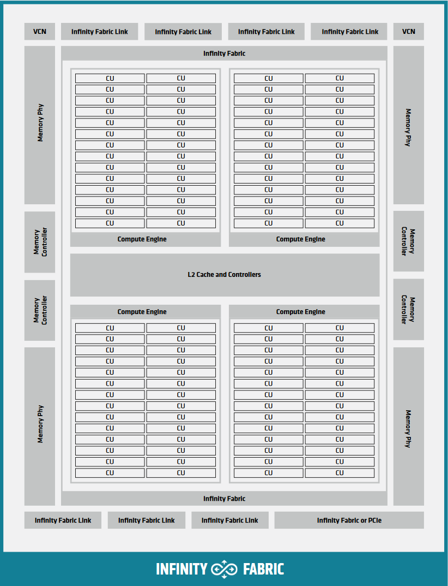
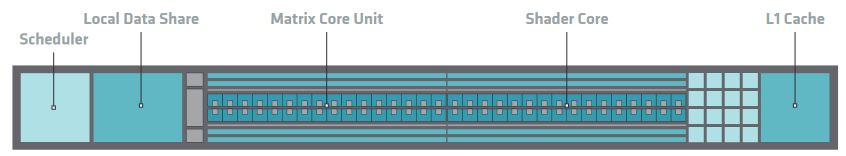

.. meta::
  :description: This chapter describes the hardware implementation of AMD GPUs supported by HIP.
  :keywords: AMD, ROCm, HIP, hardware, GPU, architecture, compute unit, VALU, SALU, cache, memory hierarchy, CDNA, RDNA

.. _hardware_implementation:

*******************************************************************************
Hardware implementation
*******************************************************************************

This topic describes the hardware architecture of AMD GPUs supported by HIP,
focusing on the internal organization and operation of GPU hardware components.
Understanding these hardware details helps you optimize GPU applications and
achieve maximum performance.

Overall GPU architecture
========================

AMD GPUs consist of interconnected blocks of digital circuits that work
together to execute complex parallel computing tasks. Unlike central
processing units (CPUs), which dedicate significant silicon area to
instruction flow control, branch prediction, and complex caching hierarchies,
GPUs allocate the majority of their die area to arithmetic pipelines. This
design choice enables extreme throughput density for data-parallel workloads.
The architecture is organized hierarchically to enable massive parallelism
while efficiently managing resources.

Command processor and control
-----------------------------

The command processor (CP) serves as the primary interface between the CPU and
GPU, receiving and distributing commands for execution. The CP consists of two
main components:

* **Command processor fetcher (CPF)**: Fetches commands from memory and passes
  them to the command processor packet processor (CPC) for processing.
* **Command processor packet processor (CPC)**: A microcontroller that decodes
  the fetched commands and dispatches kernels to the workgroup processors for
  scheduling.

The command processor handles several types of operations:

* Kernel launches, which are forwarded to asynchronous compute engines (ACEs)
* Memory transfers, which are delegated to direct memory access (DMA) engines
* Synchronization operations and memory fences

**DMA engines** handle memory transfers between CPU and GPU memory without CPU
involvement after initialization. Most GPUs contain two DMA engines, enabling
concurrent bidirectional transfers to better utilize PCIe bandwidth. The DMA
engines fetch data in small chunks and can process transfers in parallel but
cannot handle multiple copy commands on the same engine simultaneously.

**Asynchronous compute engines (ACEs)** break down kernels into workgroups for
distribution to shader processor input (SPI) blocks. Multiple ACEs enable
concurrent kernel execution, with each ACE capable of dispatching one kernel
at a time. ACEs process commands from different queues asynchronously,
enabling overlap between different kernel executions and memory operations.

Hierarchical organization
-------------------------

The GPU organizes compute resources in a three-level hierarchy that enables
modular design and resource sharing:

1. **Shader engines (SE)**: Top-level organizational units containing multiple
   shader arrays and shared resources
2. **Shader arrays**: Groups of compute units (CUs) sharing instruction and
   scalar caches
3. **Compute units (CU)**: Basic execution units containing the arithmetic
   logic units (ALUs) and registers for thread execution

.. figure:: ../data/understand/hardware_implementation/selayout.png
   :align: center
   :alt: Diagram showing the hierarchical organization of compute units
         grouped into shader engines on AMD GPUs
   :width: 800

   Hierarchical organization of compute units into shader engines

This hierarchical design allows different GPU configurations using the same
underlying architecture.

Shader engine components
========================

Shader engines group multiple compute units together, sharing resources to improve efficiency and reduce redundancy. Each shader engine contains
several key components shared across its compute units.

Workgroup manager (SPI)
-----------------------

The workgroup manager, also called the shader processor input (SPI), bridges
the command processor and compute units. After the CP processes a kernel
dispatch, the SPI:

* Receives workgroups from the ACEs
* Schedules workgroups onto available compute units
* Initializes registers with kernel parameters
* Ensures all warps of a workgroup execute on the same CU for synchronization
* Monitors resource availability and queues workgroups when resources are
  exhausted

The SPI tracks four critical resources that limit concurrent execution:

* warp slots (execution contexts)
* Vector general-purpose registers (VGPRs)
* Scalar general-purpose registers (SGPRs)
* Local data share (LDS) memory

Workgroup-to-CU mapping is non-deterministic and based on available resources.
You should not assume any specific mapping pattern, as the same kernel
launched multiple times can have different workgroup distributions.

.. _sl1:

Scalar L1 data cache (sL1D)
---------------------------

The scalar L1 data cache (sL1D) serves scalar memory operations from multiple
CUs within a shader array. The sL1D is shared between CUs and caches data that
is uniform across a warp, including:

* Kernel arguments and pointers
* Grid and block dimensions
* Constants accessed uniformly across threads
* Data from ``__constant__`` memory when accessed uniformly

Unlike the vector L1 cache, the sL1D doesn't use a "hit-on-miss" approach,
meaning subsequent requests to the same pending cache line count as duplicated
misses rather than hits.

L1 instruction cache (L1I)
--------------------------

The L1 instruction cache (L1I) is a read-only cache shared between multiple
CUs in a shader array. Like the sL1D, it's backed by the L2 cache and doesn't
use the "hit-on-miss" approach. The L1I stores kernel instructions fetched by
the compute units, reducing instruction fetch latency and L2 cache pressure.

.. _compute_unit:

Compute unit architecture
=========================

The compute unit (CU) is the fundamental execution block of AMD GPUs, serving
as the atomic building block for massive parallelism. Each CU is responsible
for executing kernels through its various specialized components and
pipelines. Data flows into these pipelines, undergoes arithmetic
transformation, and exits as results, to maximize the number
of such transformations per clock cycle.

CUs enable latency hiding through massive hardware multithreading. A single CU
can manage thousands of concurrent threads organized as a number of warps, each
containing 32 (RDNA) or 64 (CDNA) threads. This massive concurrency allows the
hardware to hide memory access latency by executing other warps while some wait
for data.

.. figure:: ../data/understand/hardware_implementation/gcn_compute_unit.png
   :align: center
   :alt: Detailed diagram of an AMD CDNA compute unit showing internal
         components and data flow
   :width: 800

   Internal architecture of an AMD CDNA compute unit

.. _wave-scheduling:

Sequencer and scheduling
------------------------

The instruction sequencer (SQ) serves as the control center of each compute
unit, managing instruction flow through the execution pipelines. The sequencer
maintains warp state and coordinates instruction execution across different
functional units.

**Warp organization**: The sequencer organizes active warps into four pools,
each containing slots for up to ten warps (eight on the CDNA2 MI200 Series).
Each slot includes:

* Warp-level registers (program counter, execution mask, and others)
* Instruction buffer for prefetched instructions
* State information for scheduling decisions

This organization theoretically allows up to 40 concurrent warps per CU, though
actual occupancy is typically limited by register and LDS usage.

**Instruction fetching**: The fetch arbiter selects one warp per cycle to fetch
instructions from memory, prioritizing the oldest warps. Each CU can fetch up to
32 bytes (4-8 instructions) per cycle.

**Instruction issuing**: The issue arbiter determines which instructions
execute each cycle, selecting warps from one pool per cycle in round-robin
fashion. The arbiter can issue multiple instructions per cycle to different
execution units, with a theoretical maximum of five instructions per cycle:

* One VALU instruction
* One vector memory operation
* One SALU and/or scalar memory operation
* One LDS operation
* One branch operation

Instructions always issue at warp granularity, with all threads in the warp
executing the same instruction in lockstep. The hardware can perform
single-cycle context switching between warps with zero overhead, as all warp
contexts remain resident on the CU. This enables efficient latency hiding,
allowing the CU to switch to another warp immediately when the current warp
encounters a stall condition such as a memory access.

Execution pipelines
-------------------

Each CU contains multiple specialized execution pipelines that
process different types of instructions in parallel, enabling efficient
utilization of the hardware resources.

.. _valu:

Vector arithmetic logic unit (VALU)
^^^^^^^^^^^^^^^^^^^^^^^^^^^^^^^^^^^

The VALU executes vector instructions across entire warps, with each thread
potentially operating on different data. For CDNA architectures, the VALU
consists of:

* **Four SIMD processors**: Each containing 16 single-precision ALUs (or
  equivalent), for 64 total ALUs per CU. In CDNA3, these are SIMD64 pipelines
  that can execute 256 operations per cycle per CU.
* **Vector register files**: 256-512 KiB of VGPR storage split across the
  four SIMDs. VGPRs are organized as 32-bit lanes, providing flexibility for
  mixed-precision computations.
* **Instruction buffers**: Storage for up to 8-10 warps per SIMD

On architectures with 64-thread warps and 16-instruction wide SIMD units,
executing one instruction takes four cycles (one cycle per 16 threads). The
four SIMD design ensures full utilization when sufficient warps are available,
as a new instruction can issue to each SIMD every cycle.

The VALU serves as the primary arithmetic engine, executing the majority of
computation in GPU kernels. Data flows into these pipelines, undergoes
arithmetic transformation, and exits as results, with the goal of maximizing
the number of such transformations per clock cycle.

For CDNA architectures with matrix operations, the VALU also dispatches matrix
fused multiply-add (MFMA) instructions to specialized matrix units.

Register pressure and occupancy
^^^^^^^^^^^^^^^^^^^^^^^^^^^^^^^

Register usage directly impacts CU occupancy. Each warp requires a
portion of the finite VGPR and SGPR pools. Higher register usage per thread
reduces the maximum number of concurrent warps, potentially limiting the CU's
ability to hide latency. Mixed-precision workloads can optimize register usage
by storing lower-precision values in fewer registers.

Scalar arithmetic logic unit (SALU)
^^^^^^^^^^^^^^^^^^^^^^^^^^^^^^^^^^^

The SALU executes instructions uniformly across all threads in a warp, handling
operations such as:

* Control flow (branches, loops)
* Address calculations
* Loading kernel arguments and constants
* Managing warp-uniform values

The SALU includes:

* A scalar processor for arithmetic and logic operations
* 12.5 KiB of SGPR storage per CU
* A scalar memory (SMEM) unit for memory operations

Scalar operations reduce pressure on vector units and registers by handling
uniform computations efficiently.

Vector memory unit (VMEM)
^^^^^^^^^^^^^^^^^^^^^^^^^

The VMEM unit handles all vector memory operations, including loads, stores,
and atomic operations. Each thread supplies its own address and data, though
the hardware optimizes access through memory coalescing when threads access
nearby addresses. The VMEM unit connects to the vector L1 cache and implements
both address generation and coalescing logic.

Branch unit
^^^^^^^^^^^

The branch unit executes jumps and branches for control flow changes affecting
entire warps. Note that the branch unit handles warp-level control flow, not
execution mask updates for thread divergence, which are handled through
predication.

.. _sfu:

Special function unit (SFU)
^^^^^^^^^^^^^^^^^^^^^^^^^^^^

The special function units accelerate certain arithmetic operations that are
too complex and/or costly to implement purely within the standard vector ALUs.

SFUs are responsible for executing transcendental and reciprocal mathematical
functions, operations such as ``exp``, ``log``, ``sin``, ``cos``, ``rcp``
(reciprocal), and ``rsqrt`` (reciprocal square root). These are heavily used
in scientific, physics, and machine learning workloads, particularly in
activation functions such as GELU, sigmoid, and/or softmax.

Each CU includes a set of specialized pipelines and/or transcendental
function units (TFUs) that handle these operations with dedicated hardware.
While their throughput is lower than that of the primary SIMD pipelines, they
enable these functions to execute efficiently without consuming general ALU
bandwidth.

From the compiler's perspective, these operations map to specific AMDGPU ISA
instructions, such as:

* ``v_exp_f32`` - compute exponential base e
* ``v_log_f32`` - compute natural logarithm
* ``v_sin_f32``, ``v_cos_f32`` - compute sine and/or cosine
* ``v_rsq_f32``, ``v_rcp_f32`` - compute reciprocal and/or reciprocal square
  root

In CDNA3-based GPUs (such as MI300), SFU throughput and latency have been
tuned for deep learning primitives. For instance, exponentiation (``exp``) and
logarithm (``log``) functions are now pipelined to complete in a few cycles
per lane, allowing vectorized activation functions in large-scale matrix
workloads to execute without significant stalls.

For programmers targeting ROCm and/or HIP, these SFU-accelerated operations
are typically accessed through math intrinsics such as ``__expf``, ``__logf``,
and/or ``__sinf``, which the compiler lowers to the corresponding AMDGPU ISA
instructions at compile time.

.. _lsu:

Load/store unit (LSU)
^^^^^^^^^^^^^^^^^^^^^

The load/store units handle the transfer of data between the compute units and
the GPU's memory subsystems. They are responsible for issuing, tracking, and
retiring memory operations, including loads from and stores to global memory,
local shared memory, and caches, for thousands of concurrent threads.

Each CU includes a set of LSUs tightly integrated with its vector
and scalar pipelines. These units handle memory instructions generated by
active warps, such as ``buffer_load``, ``buffer_store``, and
``flat_load_dword``, and route them through the GPU's hierarchical memory
system.

The LSU's responsibilities include:

* Managing vector memory accesses for SIMD instructions
* Coordinating local data share (LDS) reads and writes
* Accessing the L0 and/or L1 caches and forwarding requests to the L2 cache
  and high-bandwidth memory (HBM)
* Handling synchronization and atomic operations between threads and workgroups

LSUs manage thousands of outstanding memory requests per GPU, dynamically
scheduling them to hide memory latency. While arithmetic pipelines continue
executing other warps, the LSUs maintain queues of pending transactions and
reorder responses as data returns from memory.

.. _mfma_units:

Matrix fused multiply-add (MFMA)
^^^^^^^^^^^^^^^^^^^^^^^^^^^^^^^^

CDNA architectures (MI100 and newer) include specialized matrix acceleration
units for high-throughput matrix operations. These units execute independently
from other VALU operations, allowing overlap between matrix and vector
computations. MFMA units support various data types including ``INT8``,
``FP16``, ``BF16``, and ``FP32``, with different throughput characteristics
for each.

Matrix cores are GPU execution units that perform large-scale matrix
operations in a single instruction. In AMD architectures, these units are
formally known as MFMA (matrix fused multiply-add) units, the core hardware
blocks responsible for accelerating deep learning, high-performance computing
(HPC), and dense linear-algebra workloads on modern Instinct GPUs.

Operating on entire tiles of matrices per instruction allows MFMA units to
deliver far greater arithmetic throughput and energy efficiency than scalar
and/or vector ALUs. Rather than fetching and decoding thousands of per-element
multiply-add instructions, each MFMA instruction processes an entire matrix
fragment, drastically reducing power per operation and increasing overall
throughput. The MFMA units implement a mini-systolic array design that
efficiently processes matrix tiles.

An example MFMA instruction from the AMDGPU ISA is:

.. code-block:: amdgpu

   v_mfma_f32_16x16x4f16 v[0:15], v[16:31], v[32:47], v[0:15]

This instruction performs a matrix multiplication and accumulation
:math:`\pmb{D}=\pmb{A} \times \pmb{B} + \pmb{C}`, where the fragments
:math:`\pmb{A}`, :math:`\pmb{B}`, and :math:`\pmb{C}` are stored in VGPRs.
The suffix ``16x16x4f16`` indicates a tile size of :math:`16 \times 16`, with
an inner dimension of :math:`4`, operating on half-precision (FP16) inputs and
accumulating into 32-bit floating-point outputs.

Programmers can access MFMA functionality at multiple levels: through
optimized libraries, compiler intrinsics, and/or inline assembly, providing
flexibility for different use cases.

The MFMA units use both standard VGPRs and additional accumulation VGPRs
(AGPRs) on supported architectures, providing up to 512 KiB of combined
register storage per CU.

.. _dme:

Data movement engine (CDNA 3 / CDNA 4)
^^^^^^^^^^^^^^^^^^^^^^^^^^^^^^^^^^^^^^

CDNA 3 and CDNA 4 architectures include specialized Data Movement Engine (DME)
hardware units designed to accelerate access to multi-dimensional tensor data
in GPU memory. DMEs perform high-throughput, low-overhead copies between
global memory (HBM) and the on-chip memory hierarchy, particularly the Local
Data Share (LDS) and L0 and/or L1 caches, without consuming compute resources.

A DME issues bulk memory transactions for contiguous and/or affine data
regions, such as tensors laid out as multi-dimensional arrays in global
memory. The hardware computes memory addresses for large block transfers in
parallel, offloading this work from the SIMD pipelines and reducing pressure
on both the register file and the instruction scheduler. This enables higher
sustained bandwidth and lower latency for operations involving tiled matrix
and/or tensor data.

In practice, DMEs handle transfers of the form
:math:`\text{addr}=\text{stride} \times \text{index} + \text{offset}` across
many threads and dimensions simultaneously. By performing these affine address
calculations directly in hardware, the DME avoids the need for per-thread
address arithmetic, freeing up scalar ALUs and registers for computation.

The DME design provides two key advantages:

* **Resource decoupling**: By removing large tensor copies from the main
  execution pipelines, the CU can continue executing arithmetic instructions
  while data movement occurs in the background.
* **Asynchronous execution model**: A single warp can issue a DME copy command,
  immediately resume computation, and later synchronize only when the transfer
  has completed. This enables producer-consumer parallelism.

Programmers can access this functionality through asynchronous copy intrinsics
in ROCm, such as ``__builtin_amdgcn_async_work_group_copy``, which map
directly to hardware-level DME operations. These intrinsics allow explicit
control over data transfer overlap, synchronization, and cache placement.

.. _lds:

Local data share (LDS)
----------------------

The local data share provides fast on-CU scratchpad memory for communication
between threads in a workgroup.

.. figure:: ../data/understand/hardware_implementation/lds.svg
   :align: center
   :alt: Diagram showing the organization of local data share with banks and
         connections to SIMD units
   :width: 800

   Local data share organization and SIMD connections

**Organization**: The LDS contains 32 (CDNA, CDNA 2, and CDNA 3) or 64 (CDNA 4
and RDNA 2, RDNA 3, and RDNA 4) banks, each 4-bytes wide, providing 128 (CDNA,
CDNA 2, and CDNA 3) or 256 (CDNA 4 and RDNA 2, RDNA 3, and RDNA 4) bytes per
cycle total bandwidth. Each bank can be accessed independently every cycle for
reads, writes, and/or atomic operations. The SIMDs connect to the LDS in pairs,
with each pair sharing a 64-byte bidirectional port.

**Access patterns**: A single warp can achieve up to 64 bytes per cycle
throughput (16 lanes per cycle). The actual bandwidth depends on data size and
access patterns:

* 4-byte values: 8 cycles for 64 threads (50% peak bandwidth)
* 16-byte values: 20 cycles for 64 threads (80% peak bandwidth)

**Conflict resolution**: The LDS includes hardware to detect and resolve bank
conflicts when multiple threads access different addresses in the same bank.
Conflicts are resolved by serializing accesses across multiple cycles. Address
conflicts (multiple threads atomically updating the same address) are similarly
serialized. Broadcasting from the same address to multiple threads is handled
efficiently without conflicts.

.. _vl1:

Vector L1 cache
---------------

Each CU contains a dedicated vector L1 data cache (vL1D) serving vector memory
operations. Key characteristics include:

* Write-through design (writes go directly to L2)
* Optimization for high-bandwidth streaming access patterns
* Coherent with other CUs through software management
* Typical size of 16 KB per CU

The vector cache tags are checked for all vector memory operations, with
misses forwarded to the L2 cache. The write-through design simplifies
coherence at the cost of write bandwidth.

Memory hierarchy and system
===========================

The GPU memory system provides the bandwidth and capacity needed for massive
parallel computation while managing data coherence and access efficiency.

.. _hbm:

Memory organization
-------------------

        controllers, and Infinity Fabric interconnect on CDNA2
  :width: 800

  CDNA2 Graphics Compute Die organization showing memory subsystem

AMD GPUs typically use high-bandwidth memory (HBM) for data-intensive
workloads, providing significantly higher bandwidth than traditional GDDR
memory at the cost of slightly higher latency. HBM achieves this through
vertical stacking of memory dies and wide memory buses, enabling massive
parallel access to memory channels.

The memory system includes:

* **Memory channels**: Multiple independent memory controllers (typically 8-16)
* **L2 cache banks**: Distributed cache banks serving as the coherence point
* **Infinity Fabric**: High-speed interconnect for data routing

L2 cache architecture
---------------------

The L2 cache serves as the coherence point for all GPU memory accesses and is
shared by all compute units. The L2 consists of multiple independent channels
(32 on CDNA GPUs at 256-byte interleaving) that operate in parallel.

.. figure:: ../data/understand/hardware_implementation/l2perf_model.png
   :align: center
   :alt: Diagram showing L2 cache to Infinity Fabric transaction flow with
         request categorization and routing
   :width: 800

   L2 cache to Infinity Fabric transaction flow

**Key characteristics**:

* **Channel organization**: Each channel handles a portion of the address
  space, with addresses interleaved across channels for load balancing.
* **Hit-on-miss behavior**: If a request arrives for a pending cache line
  fill, it counts as a hit, improving the effective hit rate.
* **Write coalescing**: Multiple writes to the same cache line are combined.
* **Atomic operation support**: Atomics execute directly in the L2 cache for
  coherence.

**L2-Fabric interface**: Requests missing in L2 are routed through Infinity
Fabric to the appropriate memory location, which could be:

* Local HBM on the same GPU
* Remote GPU memory (in multi-GPU systems)
* System memory (CPU DRAM)

The interface categorizes requests by type (read and/or write), size (32B
and/or 64B), and destination for optimal routing.

.. _memory_coherence:

Memory coherence
----------------

GPU memory coherence differs significantly from CPU designs to optimize for
throughput over latency:

**Write-through L1 caches**: All writes update both L1 and L2, ensuring L2
always has the latest data. This eliminates the need for complex coherence
protocols between L1 caches but requires higher write bandwidth.

**Software-managed coherence**: Coherence between CUs requires explicit
synchronization through:

* Memory fences for ordering
* Cache invalidation instructions
* Atomic operations (executed at L2 level)
* Kernel boundaries (implicit synchronization)

**Write combining**: To handle partial cache line updates from different CUs,
the GPU uses write masks indicating which bytes to update. This prevents false
sharing issues while maintaining correctness.

Memory coalescing
-----------------

Memory coalescing combines memory accesses from multiple threads into fewer
transactions, significantly improving bandwidth utilization. The coalescing
hardware in the VMEM unit analyzes addresses from all threads in a warp and
groups them into the minimum number of cache line requests.

**Coalesced access pattern**: When consecutive threads access consecutive
memory addresses, the hardware can combine all 64 thread requests into as few
as 4-8 cache line requests (depending on data size and alignment).

**Non-coalesced access pattern**: When threads access widely separated
addresses, each thread can generate a separate memory transaction, reducing
effective bandwidth by up to 16x or more.

To achieve optimal memory performance:

* Ensure consecutive threads access consecutive memory addresses
* Align data structures to cache line boundaries (64B and/or 128B)
* Use structure-of-arrays rather than array-of-structures layouts
* Consider padding to avoid bank conflicts

Architecture variants
=====================

AMD supports multiple GPU architecture families optimized for different use
cases while maintaining HIP compatibility.

.. _cdna_architecture:

CDNA architecture
-----------------

CDNA (Compute DNA) specializes in high-performance computing and machine
learning workloads. Key features include:

        cores, L1 cache, and local data share
  :width: 800

  CDNA3 compute unit with matrix acceleration

**Matrix Core Unit**: Specialized hardware for matrix multiply-accumulate
operations, providing significantly more throughput than vector units for
supported operations. Matrix cores support multiple precisions (``INT8``,
``FP16``, ``BF16``, ``FP32``) with varying performance characteristics.

**Accumulation VGPRs (AGPRs)**: Additional register file space (up to 256 KB)
dedicated to matrix accumulation, doubling the available register storage for
matrix operations. Data movement between VGPRs and AGPRs uses specialized
instructions (``v_accvgpr_*``).

**Enhanced memory bandwidth**: CDNA GPUs typically use HBM2, HBM2e, and/or
HBM3 memory technology.

**Multi-die designs**: CDNA2 (MI250) and CDNA3 (MI300) use chiplet
architectures with multiple dies connected through high-speed links, scaling
to higher compute and memory capacities.

.. _rdna_architecture:

RDNA architecture
-----------------

RDNA optimizes for graphics and lower-latency compute workloads through
fundamental architectural changes:

.. figure:: ../data/understand/hardware_implementation/rdna3_cu.png
  :alt: Block diagram showing RDNA3 work group processor with dual compute
        units, shared caches, and 32-wide SIMD units
  :width: 800

  RDNA3 work group processor architecture

**Wave32 execution**: Primary execution mode uses 32-thread warps, reducing
divergence penalties and register pressure.

**Dual compute units**: The work group processor (WGP) replaces standalone
CUs, containing two closely coupled compute units sharing resources:

* Each CU has two 32-wide SIMD units
* Warps execute in a single cycle on 32-wide SIMDs
* Reduced instruction latency improves responsiveness

**Three-level cache hierarchy**:

* **L0 cache**: Per-CU cache
* **L1 cache**: Shared between CUs in a WGP (new intermediate level)
* **L2 cache**: Global cache shared across all WGPs

**128-byte cache lines**: Aligning with Wave32 access patterns (32 threads × 4
bytes = 128 bytes).

These RDNA optimizations target gaming workloads where latency matters more
than pure throughput, though the architecture remains capable for general
compute tasks.

Performance considerations
==========================

Understanding hardware characteristics helps you optimize GPU applications for
maximum performance.

Occupancy and resource limits
-----------------------------

Occupancy measures the ratio of active warps to maximum possible
warps on a CU. Higher occupancy generally improves latency hiding but is
limited by:

* **Register usage**: Each warp requires VGPRs and SGPRs from finite
  pools
* **LDS allocation**: Shared memory used per workgroup
* **warp slots**: Fixed number of execution contexts per CU
* **Workgroup size**: Smaller workgroups can waste resources

Balancing these resources is critical for achieving optimal occupancy. Tools
such as ``rocprofv3`` can help analyze occupancy and identify limiting
factors.

Latency hiding through multithreading
-------------------------------------

GPUs hide memory and instruction latency through massive hardware multithreading
rather than complex CPU techniques such as out-of-order execution and/or
speculation. With sufficient warps:

* Memory latency is hidden by executing other warps during waits
* Pipeline latencies are covered by round-robin warp scheduling
* No context switch overhead as all contexts remain resident

The hardware can switch between warps every cycle, maintaining high ALU
utilization even with long-latency operations in flight.

Memory bandwidth utilization
----------------------------

Effective memory bandwidth depends on access patterns:

* **Coalesced access**: Can achieve 70-90% of peak bandwidth
* **Random access**: Might achieve only 5-15% of peak bandwidth
* **Bank conflicts**: Can serialize LDS access, reducing throughput

Memory-bound kernels should focus on:

* Maximizing coalescing through proper data layout
* Prefetching and data reuse in LDS
* Balancing computation with memory access
* Using appropriate cache policies

Hardware-specific optimizations
-------------------------------

Different AMD GPU architectures benefit from tailored optimizations:

**For CDNA**:

* Optimize for 64-thread warp granularity
* Leverage matrix cores for applicable algorithms
* Consider AGPR usage for register spilling

**For RDNA**:

* Design for 32-thread warp execution
* Utilize improved divergence handling
* Take advantage of additional cache level

**Architecture-agnostic**:

* Minimize divergent control flow
* Ensure memory access coalescing
* Balance resource usage for occupancy
* Overlap computation with memory access

Summary
=======

AMD GPU hardware architecture provides massive parallelism through
hierarchical organization of compute resources, specialized execution units,
and a sophisticated memory system. Understanding these hardware details, from
the command processor through shader engines to individual compute units and
the memory hierarchy, enables you to write more efficient GPU applications.

Key hardware concepts for optimization include:

* Workgroup scheduling and resource management by the SPI
* Instruction scheduling and warp execution in compute units
* Memory coalescing and cache behavior
* Architecture-specific features (matrix cores, Wave32 and/or Wave64 modes)
* Resource limits affecting occupancy

For details on mapping parallel algorithms to this hardware, see the
:ref:`programming_model` chapter. For specific optimization techniques,
consult the performance optimization guides in the ROCm documentation.
