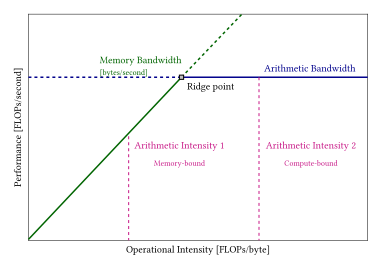

.. meta::
  :description: This chapter explains performance concepts and theoretical
    models for understanding AMD GPU performance
  :keywords: AMD, ROCm, HIP, performance, theory, roofline, occupancy,
    bandwidth, arithmetic intensity

.. _performance_optimization:

*******************************************************************************
Understanding GPU performance
*******************************************************************************

This topic explains the theoretical foundations of GPU performance on AMD
hardware. Understanding these concepts helps you analyze performance
characteristics, identify bottlenecks, and make informed optimization
decisions.

For practical optimization techniques and step-by-step guidance, see
:doc:`../how-to/performance_guidelines`.

.. _performance_bottlenecks:

Performance bottlenecks
=======================

The neck of a bottle limits the rate at which liquid can be poured.
A performance bottleneck in a computing system similarly limits the rate at
which work can be completed.

A performance bottleneck is the limiting factor that prevents a GPU kernel
from achieving higher performance. Understanding which bottleneck applies
helps identify the appropriate optimization approach.

Performance bottlenecks for GPU kernels fall into three main categories:

* **Compute-bound**: The kernel is limited by arithmetic throughput (the
  arithmetic bandwidth of compute units)
* **Memory-bound**: The kernel is limited by memory bandwidth (how quickly
  data can move between High Bandwidth Memory (HBM) and on-chip caches or
  Local Data Share (LDS))
* **Overhead-bound**: The kernel is limited by latency (host-side
  scheduling, kernel launch overhead, or small array operations)

This categorization aligns with the textbook approach to optimization:
determine the bottleneck, elevate the bottleneck until it is no longer
limiting, and repeat on the new bottleneck.

:ref:`Roofline model analysis <roofline_model>` helps quickly identify whether a
kernel's performance is bottlenecked by compute throughput or memory bandwidth.

.. _roofline_model:

Roofline model
==============

The roofline model is a simplified, visual model of performance used to
quickly determine whether a program is limited by memory bandwidth or
arithmetic bandwidth.

In the roofline model, two hardware-derived "roofs" place upper bounds—or
ceilings—on achievable performance:

* **Compute roof**: The peak arithmetic rate of the target hardware (vector
  Arithmetic Logic Units (ALUs) or :ref:`Matrix Fused Multiply-Add (MFMA)
  units <mfma_units>`), sometimes referred to as its arithmetic bandwidth
* **Memory roof**: The peak data transfer rate of the memory subsystem, or
  memory bandwidth

These are plotted on a plane with arithmetic intensity (operations per
byte) on the x-axis and performance (operations per second) on the y-axis.

The compute roof is a horizontal line at a height equal to the hardware's
maximum arithmetic throughput. The memory roof is a slanted line whose
slope equals the memory bandwidth (in bytes per second). Because slope is
"rise over run," its units correspond to throughput per intensity.

         compute ceiling
   :align: center
   :width: 100%

   Roofline model showing the relationship between arithmetic intensity
   and achievable performance. The memory bandwidth ceiling represents
   the GPU's memory bandwidth limit, while the compute ceiling shows the
   maximum achievable TFLOPs. Kernels falling into the area to the left
   of the ridge point are memory-bound, while they are compute-bound if they
   fall into the right area.

A kernel's position on the x-axis indicates whether it is fundamentally
compute-bound (beneath the flat roof) or memory-bound (beneath the slanted
roof). In practice, few kernels ever fully reach either roof due to
overhead, latency, and control-divergence effects.

The point where the diagonal and horizontal roofs intersect is called the
ridge point. Its x-coordinate gives the minimum arithmetic intensity
required to escape the memory bottleneck. Systems with ridge points farther
to the left are easier to saturate, but over time, improvements in compute
throughput have far outpaced memory growth—pushing ridge points steadily to
the right.

On AMD platforms, roofline analysis is built into ROCm's profiling and
performance visualization ecosystem.
:doc:`rocprofv3 <rocprofiler-sdk:how-to/using-rocprofv3>` can be used to gather
achieved FLOPs, memory transactions, and operational intensity.

The roofline model's elegance lies in its simplicity—but also in its
deliberate omissions. It ignores latency entirely, focusing only on
sustained throughput limits. Understanding those assumptions—and when they
hold—is essential to applying the model correctly.

.. _compute_bound:

Compute-bound performance
=========================

A kernel is compute-bound when its performance is limited by the GPU's
arithmetic throughput rather than memory bandwidth. These kernels have high
:ref:`arithmetic intensity <arithmetic_intensity>`, spending most cycles
executing arithmetic operations.

Kernels that are compute-bound are limited by the arithmetic bandwidth of
the GPU's :ref:`Compute Units (CUs) <compute_unit>`—on AMD architectures, this
means the :ref:`vector ALUs <valu>` and :ref:`MFMA units <mfma_units>` within
each :ref:`CU <compute_unit>` or Single Instruction Multiple Data (SIMD) unit.

Characteristics of compute-bound kernels:

* High ratio of arithmetic operations to memory accesses (high arithmetic
  intensity)
* Performance scales with GPU compute capacity
* Limited benefit from memory bandwidth optimization
* Can often achieve a high percentage of peak theoretical FLOPS
* The limiting factor is utilization of arithmetic pipelines: the number of
  concurrent floating-point or integer operations the GPU can sustain per
  clock

The theoretical maximum is determined by:

* Number of compute units and SIMD lanes
* Clock frequency
* Instruction throughput per cycle
* Specialized unit capabilities (:ref:`matrix cores <mfma_units>`, Special
  Function Units (SFUs))

.. _memory_bound:

Memory-bound performance
========================

A kernel is memory-bound when its performance is limited by memory
bandwidth rather than compute capacity. These kernels have low
:ref:`arithmetic intensity <arithmetic_intensity>` and spend significant time
waiting for memory operations.

Kernels that are memory-bound are limited by the memory bandwidth of the
GPU—that is, by how quickly data can move between :ref:`HBM <hbm>` and the
on-chip caches or :ref:`LDS <lds>` of the GPU's
:ref:`compute units <compute_unit>`.

Memory-bound kernels are limited by the bandwidth between GPU RAM and local
caches because the working sets of most real-world GPU workloads are far
larger than any higher level of the memory hierarchy. When data reuse is
low and arithmetic operations per byte are few, the speed of computation is
dominated by how quickly memory can feed operands to the arithmetic units.

Characteristics of memory-bound kernels:

* Low ratio of arithmetic operations to memory accesses (low arithmetic
  intensity)
* Performance scales with memory bandwidth
* Sensitive to memory access patterns
* Typically achieve lower percentage of peak FLOPS
* Fall to the left of the ridge point on the roofline diagram

The theoretical maximum is determined by:

* HBM bandwidth capacity
* Memory controller efficiency
* Cache hierarchy effectiveness
* Memory access pattern efficiency

.. _arithmetic_intensity:

Arithmetic intensity
====================

Arithmetic intensity is the ratio of arithmetic operations to memory
operations in a kernel. It is the ratio of floating-point operations
(FLOPs) to memory traffic (bytes) for a given kernel or algorithm.

.. math::

   \text{Arithmetic Intensity} = \frac{\text{FLOPs}}{\text{Bytes Transferred}}

This metric determines whether a kernel is compute-bound or memory-bound.

Key points:

* Higher arithmetic intensity indicates more computation per byte
  transferred
* A high arithmetic intensity indicates that a kernel performs many
  arithmetic operations per byte loaded
* The balance point (ridge point) depends on the GPU's
  compute-to-bandwidth ratio
* It can be calculated theoretically or measured empirically
* Different precision types affect both FLOPs and bytes

For modern AMD GPUs:

* The compute-to-bandwidth ratio varies by GPU generation
* Higher-end models have higher ratios
* Kernels above the GPU's specific ratio (ridge point) are compute-bound
* Because modern GPUs deliver far more arithmetic throughput than memory
  bandwidth, the most efficient kernels are those with high arithmetic
  intensity

Algorithmic complexity and intensity scaling
---------------------------------------------

Because algorithms have different operational and memory complexities, they
scale differently in arithmetic intensity:

* An algorithm with :math:`\mathcal{O}(1)` operations and :math:`\mathcal{O}(N)`
  memory has :math:`\mathcal{O}(\frac{1}{N})` intensity (decreasing with size)
* One with :math:`\mathcal{O}(N)` operations and :math:`\mathcal{O}(1)` memory
  has :math:`\mathcal{O}(N)` intensity (increasing with size)

Examples of kernel complexity scaling:

* **SAXPY** (:math:`y = ax + y`): :math:`2N \text{ FLOPs}`,
  :math:`8N \text{ bytes}` → intensity :math:`\frac{1}{4}` →
  :math:`\mathcal{O}(1)` scaling
* **Single-Precision Real Fast Fourier Transform (FFT)**:
  :math:`\frac{5}{2} N \log N \text{ FLOPs}`, :math:`16N \text{ bytes}` →
  intensity :math:`\frac{5}{32} \log N` → :math:`\mathcal{O}(\log N)` scaling
* **SGEMM** (matrix multiplication): :math:`2N^3 \text{ FLOPs}`,
  :math:`6N^2 \text{ bytes}` → :math:`\mathcal{O}(N)` scaling

Matrix multiplication scales linearly in arithmetic intensity—
:math:`\mathcal{O}(N^3)` operations versus :math:`\mathcal{O}(N^2)`
memory—making it an ideal match for high-throughput architectures. This
favorable scaling is a key reason why many machine-learning algorithms built
around dense linear algebra achieve high GPU utilization.

Techniques that shift memory transfers to additional compute operations
reduce memory traffic but increase arithmetic load, thereby raising the
arithmetic intensity. For example:

* Compressing data in :ref:`global memory <hbm>` reduces bytes transferred
  but adds decompression arithmetic—raising arithmetic intensity
* In training and inference of neural networks, techniques like gradient
  checkpointing reduce memory storage of activations (fewer bytes stored
  and loaded) but add recompute work—again increasing arithmetic intensity

.. _latency_hiding:

Latency hiding mechanisms
==========================

GPUs hide memory and instruction latency through massive hardware
multithreading rather than complex CPU techniques like out-of-order
execution.

Latency hiding is the strategy of masking long-latency operations by
running them concurrently. On AMD GPUs, performant kernels
interleave the execution of many threads across :ref:`warps <wavefront>` keeping
overall throughput high even when individual instructions take many cycles. When
one warp stalls on a slow :ref:`global-memory <hbm>` access, the
:ref:`scheduler <wave-scheduling>` immediately issues instructions from another
eligible warp.

How latency hiding works:

* **warp switching**: Context switches occur every cycle with zero overhead
* **Multiple warps per CU**: Many concurrent warps supported
* **Instruction-level parallelism**: Multiple independent instructions in
  flight

This keeps the :ref:`compute units <compute_unit>` busy: while one
warp drives :ref:`MFMA matrix ops <mfma_units>`, another runs scalar and vector
ALU work (e.g., quantize and dequantize), and a third issues loads and stores
through the memory pipeline (:ref:`LDS <lds>`, L1, and L2 ↔ :ref:`HBM <hbm>`).

The hardware can completely hide memory latency if there are enough active
warps with independent work. The number of instructions required from other
warps to hide latency depends on the GPU's specific memory latency and
instruction throughput characteristics.

.. _littles_law:

Little's Law
------------

Little's Law relates concurrency (how much work is in flight) to latency
and throughput:

.. math::

   \text{concurrency (ops)} = \text{latency (s)} \times \text{throughput (ops/s)}

In GPU terms, it tells you how much independent work you must have in
flight to hide latency via fine-grained scheduling. On AMD GPUs,
:ref:`warp <wavefront>` switching by the warp schedulers is the primary
latency-hiding mechanism.

Little's Law determines how many independent memory transactions or
instructions must be outstanding across active warps to keep the
compute units busy.

Concretely, consider a simple sequence in AMD CDNA terms:

.. code-block:: amdgpu

   global_load_dword    v1, v[2:3], off   ; long-latency global load (hundreds of cycles)
   v_mul_lo_u32         v2, v1, 0xBEEF    ; integer multiply
   v_add_u32            v4, v2, 0xAFFE    ; integer add
   v_mul_lo_u32         v6, v4, 0x1337    ; integer multiply

Executed strictly serially, the total time is dominated by the global load.
Using Little's Law, if your effective issue rate is ~1 inst/cycle and the
load takes hundreds of cycles, you need hundreds of independent in-flight
operations to finish, on average, one such sequence per cycle—hiding the
memory latency from consumers.

Issuance occurs at the warp granularity (64 threads per warp on CDNA). When
latency hiding is successful, the CU maintains enough active warps and rapidly
context-switches among them whenever one blocks, so execution units don't sit
idle waiting on memory or other long-latency events.

Requirements for effective latency hiding:

* Sufficient occupancy (active warps)
* Independent instructions to overlap
* Balanced resource usage
* Minimal divergence

.. _wavefront_execution:

Warp (Wavefront) execution states
=================================

The state of the :ref:`warps <wavefront>` executing a kernel on an AMD GPU
can be described using several non-exclusive terms—active, stalled, eligible,
and selected.

A warp is considered **active** from the time its threads begin executing until
all threads in that warp have completed the kernel. The
:ref:`warp schedulers <wave-scheduling>` select warps from the active pool each
cycle; the selected warps then issue their instructions.

An **eligible** warp is an active warp ready to issue its next instruction. For
a warp to be eligible:

* Its next instruction has been fetched
* The required pipeline (vector ALU, :ref:`MFMA <mfma_units>`, or memory) is
  available
* All data dependencies have been resolved
* No synchronization barriers (for example, ``s_barrier``) are pending

Eligible warps are the immediate candidates for issue. A lack of eligible warps
often indicates dependency or memory stalls—a key target in performance tuning.

A **stalled** warp is active but unable to issue its next instruction due to
resource or data hazards. Common causes include:

* Execution dependencies: waiting for results from previous ALU or
  :ref:`MFMA <mfma_units>` operations
* Memory dependencies: waiting for global or :ref:`LDS <lds>` memory fetches
* Pipeline conflicts: required execution units are occupied

AMD hardware uses a scoreboard mechanism to track outstanding dependencies
per warp. When waiting on :ref:`LDS <lds>` or ALU results, a warp is said to be
on the short scoreboard; when waiting on off-chip :ref:`HBM <hbm>` accesses, it
is on the long scoreboard. This scoreboarding approach—originally from the CDC
6600 supercomputer—allows dynamic scheduling across warps (thread-level
parallelism) rather than within them (instruction-level parallelism).

A **selected** warp is an eligible one chosen by the warp scheduler to issue an
instruction in the current cycle. Each :ref:`CU <compute_unit>` typically has
multiple schedulers that can each issue one instruction per cycle from their
eligible pool.

Understanding these states helps explain GPU utilization metrics:

* **Active cycles**: Percentage of cycles with at least one instruction
  executing
* **Stall cycles**: Percentage of cycles waiting for resources
* **Idle cycles**: No warps available to execute

Maximizing active cycles while minimizing stall and idle cycles improves
performance. Effective latency hiding on AMD hardware relies on keeping
enough active and eligible warps resident so that the schedulers always have
work to select, ensuring the CU pipelines remain fully utilized.

.. _occupancy:

Occupancy theory
================

Occupancy measures the ratio of active :ref:`warp <wavefront>` to the maximum
possible warps on a :ref:`compute unit <compute_unit>`.

.. math::

   \text{Occupancy} = \frac{\text{Active warps}}{\text{Max warps per CU}}

There are two common ways to measure it:

* **Theoretical occupancy**: The upper limit determined by the kernel's
  launch configuration (threads per block, register use, LDS use) and the
  hardware limits of the CU
* **Achieved occupancy**: The actual number of warps active during kernel
  execution, i.e., on active cycles

As part of the AMD execution model, all threads in a
:ref:`block <inherent_thread_hierarchy_block>` are scheduled to the same CU.
Each CU has finite resources—Vector General-Purpose Registers (VGPRs), Scalar
General-Purpose Registers (SGPRs), :ref:`LDS <lds>` (shared memory), and wave
slots—that must be shared among all resident blocks. These constraints jointly
determine the maximum number of active warps.

Why occupancy matters:

* Higher occupancy improves :ref:`latency hiding <latency_hiding>`
* More concurrent warps mask memory and instruction latency
* Enables better utilization of execution units

Limiting factors:

* **Register usage**: VGPRs and SGPRs per thread
* **Shared memory (LDS)**: Allocation per block
* **Warp slots**: Hardware limit on concurrent warps
* **Block size**: Small blocks may waste resources

Trade-offs:

* Higher occupancy improves latency hiding but reduces resources per thread
* Lower occupancy allows more resources per thread but may expose latency
* Optimal occupancy depends on kernel characteristics
* Memory-bound kernels benefit more from high occupancy

Low occupancy often reduces performance when there aren't enough eligible warps
to hide memory or arithmetic latency, causing low issue efficiency and
underutilized pipelines. However, once occupancy is sufficient for 
latency hiding, increasing it further can hurt performance by reducing the
number of available registers or LDS per warp—both of which can limit
:ref:`arithmetic intensity <arithmetic_intensity>`.

In short, occupancy measures how fully a :ref:`CU <compute_unit>` is loaded, not
how efficiently it is utilized. High-performance kernels (for example,
:ref:`MFMA <mfma_units>`-based GEMMs on :ref:`CDNA <cdna_architecture>`) often
operate at low occupancy because only a few warps are needed to fully saturate
the MFMA and memory pipelines.

.. _memory_hierarchy_theory:

Memory hierarchy impact on performance
=======================================

The GPU memory hierarchy has different bandwidths and latencies:

Memory types by speed:

1. **Registers**: Fastest, lowest latency (per-thread storage)
2. **LDS (shared memory)**: Very fast, on-chip (per-block storage)
3. **L1 cache**: Fast, on-chip (per-CU cache)
4. **L2 cache**: Moderate, on-chip (shared across CUs)
5. **HBM (global memory)**: Slower, off-chip but high bandwidth

.. _memory_coalescing_theory:

Memory coalescing theory
-------------------------

Memory coalescing is a hardware technique that improves effective memory
bandwidth by servicing many logical loads or stores with a small number of
physical memory transactions.

Memory coalescing combines memory accesses from multiple threads into fewer
transactions. When consecutive threads access consecutive memory addresses,
the hardware can merge requests into efficient cache line accesses.

Memory coalescing is relevant when accessing :ref:`global memory <hbm>`
(:ref:`HBM <hbm>` and GDDR attached to the GPU). For efficient access to
LDS and shared memory, see the discussion of bank conflicts below.

On AMD GPUs, global memory is backed by HBM (in data-center parts) or GDDR
(on many client parts). These Dynamic Random-Access Memory (DRAM)
technologies provide very high bandwidth but have relatively long access
latency. If each thread's load or store were always turned into its own
physical DRAM transaction, the GPU would leave a large fraction of that raw
bandwidth unused.

Coalescing takes advantage of how DRAM is organized internally. When a DRAM
address is accessed, the hardware actually fetches or writes a burst: a run
of consecutive addresses fetched together in a single transaction. If
multiple threads in a :ref:`warp <wavefront>` access addresses that fall into
the same burst, those logical accesses can be coalesced into that single
transaction.

This fits naturally with the warp execution model: in normal
execution, all threads in a warp execute the same instruction at the
same time. If each lane in the warp loads or stores a value from a
contiguous region (e.g., lane *i* accesses ``base + i``), the memory system
can typically serve the entire warp's request with a small number of
large, aligned bursts. When addresses are scattered (e.g., large strides or
irregular indexing), more bursts are needed, and effective bandwidth drops.

Why coalescing matters:

* Reduces number of memory transactions
* Improves memory bandwidth utilization
* Decreases memory access latency

**Coalesced pattern**: Consecutive threads accessing consecutive addresses
achieve high bandwidth utilization.

**Non-coalesced pattern**: Random or strided addresses result in many
separate transactions and low bandwidth utilization.

Example: strided access pattern
~~~~~~~~~~~~~~~~~~~~~~~~~~~~~~~~

Consider this kernel that reads from an input array with a configurable
stride (distance between consecutive elements accessed by each thread):

.. code-block:: cuda

   __global__ void strided_read_kernel(const float* __restrict__ in,
                                       float* __restrict__ out,
                                       std::size_t N, std::size_t stride)
   {
       const std::size_t t  = blockIdx.x * blockDim.x + threadIdx.x;
       const std::size_t T  = gridDim.x * blockDim.x;

       float acc = 0.f;

       for (std::size_t j = t * stride; j < N; j += T * stride)
       {
           // across a warp, addresses differ by (stride * sizeof(float))
           float v = in[j]; // perfectly coalesced for stride == 1
           acc = acc * 1.000000119f + v;  // force compiler to keep the load
       }

       // one write per thread (negligible vs reads)
       if (t < N) out[t] = acc;
   }

When ``stride == 1``, threads in the same warp access consecutive 4-byte
elements (``in[j]``, ``in[j+1]``, ``in[j+2]``, …). These accesses fall into a
small number of aligned DRAM bursts, so the memory system can coalesce them
efficiently and deliver high bandwidth.

As stride increases:

* The addresses accessed by neighboring threads move farther apart
* Each warp's loads spread across more bursts
* The number of physical transactions per logical access increases
* Effective bandwidth drops

.. _bank_conflicts_theory:

Bank conflict theory
--------------------

Shared memory (LDS) is organized into banks that can be accessed
independently. Bank conflicts occur when multiple threads access different
addresses in the same bank.

A bank conflict occurs when multiple threads in a :ref:`warp <wavefront>`
simultaneously access different addresses that reside in the same
:ref:`LDS <lds>` bank. When that happens, the accesses to that bank must be
serialized, reducing effective LDS throughput by an integer factor and
preventing full utilization of the on-chip memory bandwidth.

On AMD GPUs, the on-chip LDS (HIP's "shared memory") inside each compute unit is
physically organized into banks. These banks can be accessed in parallel, which
is how LDS achieves very high bandwidth. On CDNA and RDNA architectures, LDS
is divided into 32 (CDNA, CDNA2 and CDNA3) or 64 (CDNA4+ and RDNA2+) banks, each
4 bytes wide. Conceptually, addresses map to banks like this (low bits only, in
bytes):

.. code-block:: text

   Address: 0x00 0x04 0x08 0x0C 0x10 0x14 0x18 0x1C ... 0x7C
   Bank:       0    1    2    3    4    5    6    7 ...   31

   Address: 0x80 0x84 0x88 0x8C 0x90 0x94 0x98 0x9C ... 0xFC
   Bank:       0    1    2    3    4    5    6    7 ...   31

Any two addresses that differ by :math:`32 \times 4 = 128 \text{bytes}` map to
the same bank.

Why bank conflicts matter:

* Conflicts serialize accesses, reducing throughput
* LDS bandwidth drops proportionally to conflict degree
* Can turn parallel operations into sequential ones

Common patterns:

* **No conflict**: Each thread accesses a different bank (full bandwidth)
* **Broadcast**: Multiple threads read the same address (no conflict)
* **N-way conflict**: N threads access the same bank (1/N bandwidth)

Example: conflict-free access
~~~~~~~~~~~~~~~~~~~~~~~~~~~~~~

If you access sequential elements of a float array in LDS, different lanes
in a warp naturally land in different banks:

.. code-block:: cuda

   __shared__ float data[1024];  // in HIP, __shared__ maps to LDS

   int tid = threadIdx.x;
   float value = data[tid];  // addresses: 0x00, 0x04, 0x08, ...

For 32 consecutive float elements, this maps cleanly: each 4-byte word goes
to a different bank (0–31). All these accesses can be serviced in one LDS
transaction, so there are no bank conflicts. This is the "good" pattern.

Example: pathological strided access (conflict-heavy)
~~~~~~~~~~~~~~~~~~~~~~~~~~~~~~~~~~~~~~~~~~~~~~~~~~~~~~

Now consider a pattern that walks down a column of a row-major LDS array
where each row has 32 floats:

.. code-block:: cuda

   __shared__ float data[32 * 32];  // 32 columns per row

   int tid = threadIdx.x;
   float value = data[tid * 32];    // addresses: 0x00, 0x80, 0x100, ...
   // recall: sizeof(float) == 4 bytes

Here, each successive access is offset by :math:`32 \times 4 = 128 \text{bytes}`
—exactly one full bank span. So:

* ``data[0]`` → bank 0
* ``data[32]`` → bank 0
* ``data[64]`` → bank 0

Every lane in the warp is hitting bank 0, but at different addresses, all in the
same cycle. These accesses must be serialized by the LDS hardware, which can
turn a fast LDS access into a slow operation.

When conflicts don't happen
~~~~~~~~~~~~~~~~~~~~~~~~~~~~

If all threads in a warp access the exact same address in a bank (e.g., all
lanes reading the same control value from LDS), hardware can often broadcast
that value. In that case, the request is not treated as a conflict—it's one
read, fanned out to many lanes.

.. _register_pressure_theory:

Register pressure theory
=========================

Register pressure refers to a situation where the register file becomes a
performance bottleneck due to excessive demand for registers by active
threads.

Register pressure occurs when a kernel requires more registers than optimal
for the target occupancy.

In GPU programming, registers are the fastest level of the memory
hierarchy, holding per-thread variables for arithmetic and address
computation. However, while the compiler (`amdclang++` for ROCm) works with an
unbounded set of virtual registers, the hardware has only a finite number
of physical registers per compute unit.

How register pressure arises
-----------------------------

Each thread in a :ref:`warp <wavefront>` consumes a number of registers as
determined by the compiled Instruction Set Architecture (ISA) code (AMD CDNA or
RDNA assembly). All threads in a work-group share the same CU, so the total
register file usage per work-group depends on both:

* The number of threads per work-group (launch configuration), and
* The number of registers required per thread (kernel complexity)

As the register footprint per work-group increases, fewer work-groups can
be resident on a CU at once. This directly reduces occupancy, which in turn
limits the ability of the GPU to hide latency through thread-level
parallelism. In extreme cases, the compiler may even "spill" register
values into :ref:`global memory <hbm>`—orders of magnitude slower than
register access.

Why register pressure matters:

* Reduces maximum occupancy
* May cause register spilling to memory
* Decreases ability to hide latency
* Lowers overall throughput

The relationship between registers and occupancy:

* More registers per thread → fewer concurrent warps
* Fewer registers per thread → higher occupancy but may need memory spills
* Optimal balance depends on kernel memory access patterns

.. _performance_metrics_theory:

Performance metrics explained
==============================

Understanding performance metrics is essential for analyzing GPU behavior:

Peak rate
---------

Peak rate is the theoretical maximum throughput a hardware system can achieve. It represents the absolute upper bound of GPU performance—the architecture’s effective ‘speed of light.’

Peak rate assumes ideal conditions: every compute unit is fully active, all
execution pipelines are perfectly fed, and no constraints (e.g., register
pressure, memory stalls, synchronization, or bandwidth limits) impede
progress.

The theoretical maximum performance of a GPU:

* **Peak FLOPS**: Maximum floating-point operations per second
* **Peak bandwidth**: Maximum memory throughput
* **Peak instruction rate**: Maximum instructions per cycle

In performance analysis, peak rate serves several roles:

* It defines the compute-bound "roof" in a roofline model
* It forms the denominator for utilization metrics such as pipe utilization
  or CU utilization
* It provides the theoretical yardstick against which achieved performance
  (measured FLOPs per second) is compared

Actual performance is always below peak due to various inefficiencies.

Utilization metrics
-------------------

.. _pipe_utilization:

Pipe utilization
~~~~~~~~~~~~~~~~

Pipe utilization measures how effectively a kernel uses the execution
pipelines within each compute unit.

Each CU contains multiple independent execution pipes, each specialized for
a different class of operations—for example:

* VALU pipes handle general vector arithmetic (add, multiply, Fused
  Multiply-Add (FMA))
* MFMA pipes handle matrix operations on :ref:`matrix-fused
  multiply–accumulate units <mfma_units>`
* SALU pipes handle scalar operations
* Load and Store (LDS and VMEM) units handle memory access instructions
* Branch and Control units handle program flow

Pipe utilization quantifies the percentage of each pipeline's peak
theoretical throughput that is being achieved, averaged over all active CUs
and cycles in which the pipeline is active.

**Pipe utilization**: The percentage of execution cycles where the pipeline
is actively processing instructions. Low utilization indicates stalls or
insufficient work.

Before analyzing performance at the level of pipe utilization, you should
first examine kernel utilization (how often CUs are busy) and CU
utilization (how evenly work is distributed across CUs). Once those are
sufficient, per-pipe metrics reveal whether the performance limit is
arithmetic, memory, or control-bound.

On AMD GPUs, these measurements are exposed through ROCm profiling tools
such as ``rocprofv3``.

Relevant counters include:

* ``SQ_ACCUM_PREV_HI_BUSY`` (VALU pipeline busy percentage)
* ``SQ_ACCUM_MFMA_BUSY`` (MFMA utilization)
* ``SQ_ACCUM_LDS_BUSY`` and ``SQ_ACCUM_VMEM_BUSY`` (memory pipelines)
* ``SQ_ACCUM_SALU_BUSY`` (scalar ALU activity)

Together, these form the pipe utilization profile—showing how well each
instruction pipeline is being fed with eligible :ref:`warps <wavefront>` and how
close the kernel is to saturating the hardware's arithmetic or memory
throughput.

.. _issue_efficiency:

Issue efficiency
~~~~~~~~~~~~~~~~

Issue efficiency measures how effectively the warp scheduler on each compute
unit keeps the execution pipelines busy by issuing instructions from eligible
warps. In a perfectly efficient kernel, the scheduler issues one instruction
every cycle for every active CU.

An issue efficiency of 100% means that on every active cycle, at least one warp
was eligible and an instruction was successfully issued. Lower values indicate
that during some cycles, all active warps were stalled—waiting on memory,
dependencies, or resources—and the scheduler was idle, reducing total
instruction throughput.

**Issue efficiency**: The ratio of issued instructions to the maximum
possible. Low efficiency can indicate instruction cache misses, scheduling
inefficiencies, or resource conflicts.

On AMD GPUs, issue efficiency can be measured using hardware performance
counters exposed through ROCProfiler or Omnitrace, such as:

* ``SQ_WAVES_BUSY`` — percentage of cycles where any warp was actively executing
* ``SQ_WAVES_ISSUED`` — number of issued waves per cycle
* ``SQ_ACCUM_INSTS_ISSUED`` — total instructions issued per CU
* ``SQ_ACCUM_CYCLES_BUSY`` — number of cycles the CU was active

By combining these metrics, you can estimate how efficiently the scheduler
keeps the CU's pipelines fed. Low issue efficiency typically signals
insufficient concurrency (low occupancy) or high memory latency, both of
which prevent the hardware from issuing instructions continuously.

.. _cu_utilization:

CU utilization
~~~~~~~~~~~~~~

CU utilization measures the percentage of time that compute units on an AMD
GPU are actively executing instructions.

Instead of reporting the fraction of time a kernel is executing somewhere on the
GPU, CU utilization reports the fraction of time all CUs spend executing warps.

**CU utilization**: The percentage of compute units actively executing
work. Low utilization suggests insufficient parallelism, load imbalance, or
synchronization overhead.

As with GPU utilization, high CU utilization is generally desirable. It
indicates that most CUs are busy executing instructions across the device.
However, high CU utilization alone does not guarantee full performance.

If CU utilization is high but throughput remains low, the kernel may not be
effectively using the functional pipelines within each CU—such as
:ref:`vector ALUs <valu>`, :ref:`MFMA tensor cores <mfma_units>`, or
:ref:`load and store units <lsu>`. In that case, you should examine pipe
utilization, which measures how fully those individual execution paths are being
used.

CU utilization can be observed with AMD's profiling and monitoring tools:

* ``amd-smi metric --usage`` — reports overall GPU activity percentage
* ``rocprofv3`` — provides performance counters like
  ``SQ_WAVE_CYCLES``, ``SQ_BUSY_CYCLES``, and per-pipe instruction metrics
* ``rocminfo`` — shows the number of CUs available per GPU

In summary, CU utilization captures how actively the GPU's compute units are
engaged in running warps. High CU utilization indicates good parallel workload
distribution, while low CU utilization may point to poor occupancy, launch
configuration limits, or insufficient concurrency.

.. _branch_efficiency:

Branch efficiency
~~~~~~~~~~~~~~~~~

Branch efficiency measures how often all threads within a
:ref:`warp <wavefront>` take the same execution path when encountering
conditional statements.

It quantifies control-flow uniformity—that is, how often all lanes in a
:ref:`warp <wavefront>` evaluate a conditional identically. It is calculated as
the ratio of uniform branch decisions to total branch instructions executed.
High branch efficiency indicates little to no warp divergence, while low branch
efficiency means many lanes are masked off due to diverging control flow.

**Branch efficiency**: The ratio of non-divergent to total branches. Low
efficiency indicates significant divergence overhead.

Not all conditionals reduce branch efficiency. The common "bounds check"
pattern found in most GPU kernels, for instance:

.. code-block:: cuda

   int idx = blockIdx.x * blockDim.x + threadIdx.x;
   if (idx < n)

usually has very high branch efficiency, since nearly all warps consist entirely
of threads that either satisfy ``idx < n`` or not—except perhaps for the last
partial warp, which straddles the boundary of ``n``.

While CPUs also optimize branch behavior, they focus on temporal
uniformity—predicting whether the same branch will be taken or not over repeated
iterations. GPUs, on the other hand, care about spatial uniformity: whether all
lanes in the warp take the same branch at the same time.

On AMD architectures, this spatial uniformity is tracked via the EXEC mask.
Divergence forces EXEC to toggle individual bits to deactivate lanes
following a different control path. High branch efficiency implies minimal
EXEC manipulation, meaning nearly all lanes execute the same instruction
stream simultaneously—maximizing SIMD efficiency and overall throughput.

.. _theoretical_performance_limits:

Theoretical performance limits
==============================

Understanding theoretical limits helps set realistic performance
expectations.

Peak performance bounds
-----------------------

Every GPU has theoretical maximum performance determined by:

* Clock frequency and number of compute units
* Instruction throughput per clock cycle
* Memory bandwidth capacity
* Specialized unit capabilities (:ref:`matrix cores <mfma_units>`, SFUs)

Achievable performance
----------------------

Real applications typically achieve a fraction of theoretical peak due to:

* Imperfect resource utilization
* Memory access inefficiencies
* Control flow divergence
* Synchronization overhead
* Launch and scheduling costs

The gap between theoretical and achieved performance reveals optimization
opportunities. The roofline model provides a framework for understanding
these limits and identifying which factor (compute or memory) constrains
performance.

Summary
=======

Understanding GPU performance requires knowledge of several interconnected
concepts:

* **Performance bottlenecks**: Whether compute, memory, or overhead limits
  performance
* **Roofline model**: Visual framework for analyzing performance limits
  based on arithmetic intensity
* **Arithmetic intensity**: The compute-to-memory ratio of algorithms
* **Latency hiding**: How concurrent execution masks delays through warp
  switching
* **Occupancy**: How warp concurrency affects resource utilization
* **Memory hierarchy**: How different memory types affect bandwidth and the
  importance of coalescing
* **Performance metrics**: Quantitative measures for analysis including
  pipe utilization, issue efficiency, CU utilization, and branch efficiency

These theoretical foundations inform practical optimization decisions. For
step-by-step optimization techniques and practical guidance, see
:doc:`../how-to/performance_guidelines`.
