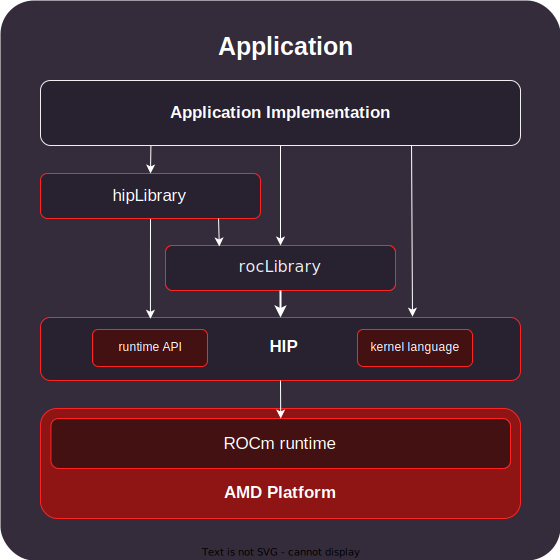

.. meta::
  :description: This chapter provides an introduction to the HIP API.
  :keywords: AMD, ROCm, HIP, C++ language extensions

.. _intro-to-hip:

*******************************************************************************
What is HIP?
*******************************************************************************

The Heterogeneous-computing Interface for Portability (HIP) API, part of AMD's
ROCm platform, is a C++ runtime API and kernel language that lets developers
create portable applications that run on heterogeneous systems, using CPUs and
AMD GPUs from a single source code base.

* HIP is a thin API with little or no performance impact over coding directly
  in AMD :doc:`ROCm <rocm:what-is-rocm>`.

* HIP enables coding in a single-source C++ programming language, including
  features such as templates, C++11 lambdas, classes, namespaces, and more.

* Developers can tune for performance or handle tricky cases via HIP.

ROCm offers compilers (``clang``, ``hipcc``), code profilers (``rocprofv3``),
debugging tools (``rocgdb``), libraries and HIP with the runtime
API and kernel language, to create heterogeneous applications running on both
CPUs and GPUs. ROCm provides marshalling libraries like
:doc:`hipFFT <hipfft:index>` or :doc:`hipBLAS <hipblas:index>` that act as a
thin programming layer over AMD ROCm and offer API compatibility with the
equivalent Nvidia CUDA libraries. These libraries provide pointer-based memory
interfaces and can be easily integrated into your applications.

HIP supports building and running on both AMD GPUs or NVIDIA GPUs.
GPU Programmers familiar with NVIDIA CUDA or OpenCL will find the HIP API
familiar and easy to use. You can quickly port your application to run on the
available hardware while maintaining a single codebase. The :doc:`HIPify <hipify:index>`
tools, based on the clang front-end and Perl language, can convert CUDA API
calls into the corresponding HIP API calls. However, HIP is not intended to be a
drop-in replacement for CUDA, and developers should expect to do some manual
coding and performance tuning work for AMD GPUs to port existing projects as
described :doc:`HIP porting guide <how-to/hip_porting_guide>`.

HIP provides two components: those that run on the CPU, also known as host
system, and those that run on GPUs, also referred to as device. The host-based
code is used to create device buffers, move data between the host application
and a device, launch the device code (also known as kernel), manage streams and
events, and perform synchronization. The kernel language provides a way to
develop massively parallel programs that run on GPUs, and provides access to GPU
specific hardware capabilities.

In summary, HIP simplifies cross-platform development, maintains performance,
and provides a familiar C++ experience for GPU programming that runs seamlessly.

HIP components
===============================================

HIP consists of the following components. For information on the license
associated with each component, see :doc:`HIP licensing <license>`.

C++ runtime API
-----------------------------------------------

HIP provides headers and a runtime library built on top of HIP-Clang compiler in
the repository :doc:`Compute Language Runtime (CLR) <understand/amd_clr>`. The
HIP runtime implements HIP streams, events, and memory APIs, and is an object
library that is linked with the application. The source code for all headers and
the library implementation is available on GitHub.

For further details, check :ref:`HIP Runtime API Reference <runtime_api_reference>`.

Kernel language
-----------------------------------------------

HIP provides a C++ syntax that is suitable for compiling most code that commonly appears in
compute kernels (classes, namespaces, operator overloading, and templates). HIP also defines other
language features that are designed to target accelerators, such as:

* Short-vector headers that can serve on a host or device
* Math functions that resemble those in ``math.h``, which is included with standard C++ compilers
* Built-in functions for accessing specific GPU hardware capabilities

For further details, check :doc:`HIP C++ language extensions <how-to/hip_cpp_language_extensions>`
and :doc:`Kernel language C++ support <how-to/kernel_language_cpp_support>`.
