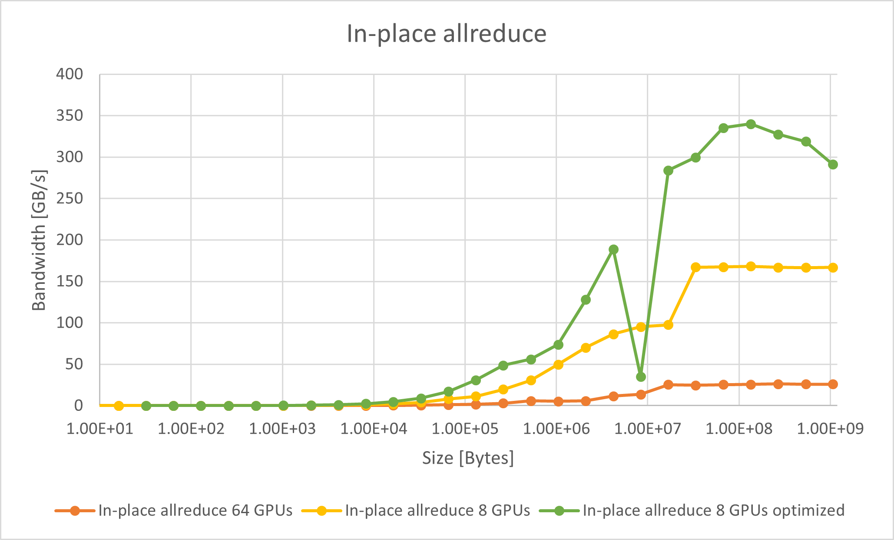
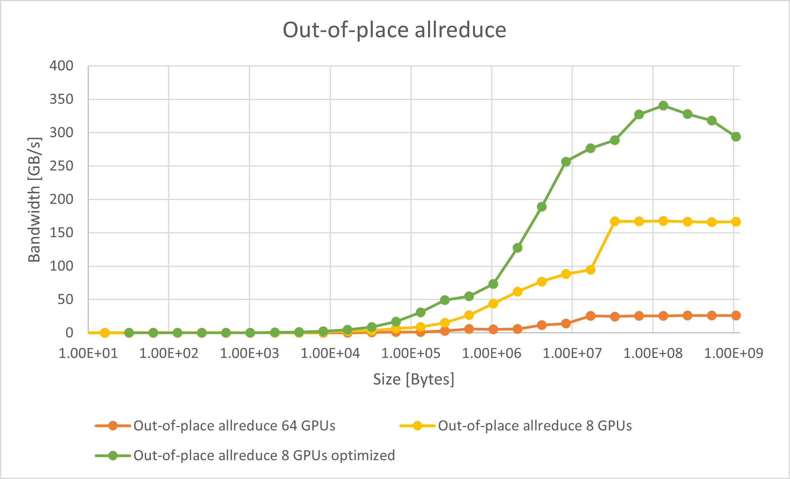

.. meta::
   :description: Usage tips for the RCCL library of collective communication primitives
   :keywords: RCCL, ROCm, library, API, peer-to-peer, transport

.. _rccl-usage-tips:

*****************************************
RCCL usage tips
*****************************************

This topic describes common RCCL configuration options and usage tips.

Profiling
=========

For fine-grained profiling of collective operations, use the RCCL **profiler plugin** API and related tooling rather than legacy in-tree profilers.

MSCCL and MSCCL++ integration has been removed from RCCL. The legacy API symbols ``mscclLoadAlgo``,
``mscclRunAlgo``, and ``mscclUnloadAlgo`` remain as no-ops for link compatibility.

Enabling peer-to-peer transport
===============================

To enable peer-to-peer access on machines with PCIe-connected GPUs,
set the HSA environment variable as follows:

.. code-block:: shell

   HSA_FORCE_FINE_GRAIN_PCIE=1

This feature requires GPUs that support peer-to-peer access along with
proper large BAR addressing support.

Symmetric memory and ``NCCL_P2P_LEVEL``
=======================================

RCCL can accelerate some collectives (for example, allreduce, allgather, and
reduce-scatter) through a *symmetric memory* path. This path uses
:doc:`Virtual Memory Management <../api-reference/api-library>`-backed
buffers that are registered as symmetric windows
(``ncclCommWindowRegister`` with the ``NCCL_WIN_COLL_SYMMETRIC`` flag, or
buffers allocated with ``ncclMemAlloc``) so that every participating rank can
address the buffer directly.

Whether a communicator can use symmetric memory is decided once at
``ncclCommInitRank`` time. The prerequisites are:

- All local ranks are **peer-to-peer capable** with each other (on AMD
  GPUs this means they are on the same host over PCIe or XGMI,
  or are reachable through a Multi-Node Infinity Fabric clique).
- Virtual Memory Management is enabled (``NCCL_CUMEM_ENABLE=1``).
- Symmetric windows are enabled (``NCCL_WIN_ENABLE=1``, the default).
- Either GPU-Initiated Networking (GIN) is available, or the communicator is a
  single locality (one-LSA) team.

.. note::

   Symmetric-memory availability does **not** depend on the
   ``NCCL_P2P_LEVEL`` distance setting. This matches the behavior introduced in
   upstream NCCL 2.28.7, which removed the topology-distance check from the
   symmetric-memory decision. Restricting peer-to-peer reach with a value such
   as ``NCCL_P2P_LEVEL=PHB`` (or even disabling distance-based P2P entirely with
   ``NCCL_P2P_DISABLE=1``) changes how the *flat* P2P transport schedule is
   built, but it does **not** by itself turn off the symmetric path: as long as
   the GPUs are CUDA peer-to-peer capable, symmetric memory remains eligible.

To confirm whether symmetric memory was enabled for a run, inspect the init
logs:

.. code-block:: shell

   NCCL_DEBUG=INFO NCCL_DEBUG_SUBSYS=INIT ./your_app

When symmetric memory is **not** available, RCCL logs a line that begins with
``Symmetric memory is not supported`` and reports which prerequisite was
missing (for example, ``cuMemEnable`` or ``globalGinSupport``). If you expect
the symmetric path but it is disabled, check those prerequisites rather than
``NCCL_P2P_LEVEL``.

Ignoring CPU affinity with multi-node
=====================================

Depending on the job launcher and the requirements of your workload, performance as the communication workload scales
can be improved by setting ``NCCL_IGNORE_CPU_AFFINITY``.  This allows the RCCL communication library to 
ignore the job's supplied CPU affinity and use the GPU affinity only.

.. code-block:: shell

   NCCL_IGNORE_CPU_AFFINITY=1

For general usage, this environment variable is not set so it doesn't interfere with the user or launcher
supplied preferences.

Improving performance on the MI300X 
===================================

This section outlines ways to improve RCCL performance on MI300X systems,
including guidelines for systems with fewer than eight GPUs and the most efficient
GPU partition modes.

Configuration with fewer than eight GPUs
----------------------------------------

On a system with eight MI300X accelerators, each pair of accelerators is
connected with dedicated Infinity Fabric™ links in a fully connected topology.
For collective operations, this can achieve good performance when all eight
accelerators (and all Infinity Fabric links) are used. When fewer than eight
GPUs are used, however, this can only achieve a fraction of the potential
bandwidth on the system. However, if your workload warrants using fewer than
eight MI300X accelerators on a system, you can set the run-time variable
``NCCL_MIN_NCHANNELS`` to increase the number of channels. For example:

.. code-block:: shell

   export NCCL_MIN_NCHANNELS=32

Increasing the number of channels can benefit performance, but it also increases
GPU utilization for collective operations.
Additionally, RCCL pre-defines a higher number of channels when only two or four
accelerators are in use on a 8\*MI300X system. In this situation, RCCL uses 32
channels with two MI300X accelerators and 24 channels for four MI300X
accelerators.

.. _nps4_cpx_mi300_rccl:

NPS4 and CPX partition modes
----------------------------

The term compute partitioning modes, or Modular Chiplet Platform (MCP), refers to the
logical partitioning of XCDs into devices in the ROCm stack. The names are
derived from the number of logical partitions that are created out of the eight
XCDs. In the default mode, SPX (Single Partition X-celerator), all eight XCDs are
viewed as a single logical compute element, meaning that the :doc:`amd-smi <amdsmi:index>`
utility will show a single MI300X device. In CPX (Core Partitioned X-celerator)
mode, each XCD appears as a separate logical GPU, for example, as eight separate
GPUs in :doc:`amd-smi <amdsmi:index>` per MI300X. CPX mode can be viewed as
having explicit scheduling privileges for each individual compute element (XCD).

While compute partitioning modes change the space on which you can assign work
to compute units, the memory partitioning modes (known as Non-Uniform Memory
Access (NUMA) Per Socket (NPS)) change the number of NUMA domains that a device
exposes. In other words, it changes the number of HBM stacks which are
accessible to a compute unit, and therefore the size of its memory space. However,
for the MI300X, the number of memory partitions must be less than or equal to
the number of compute partitions. NPS4 (viewing pairs of HBM stacks as a
disparate element), for example, is only enabled when in CPX mode (viewing each
XCD as a disparate element).

- Compute partition modes 

  - In SPX mode, workgroups launched to the device are distributed
    round-robin to the XCDs in the device, meaning that the programmer cannot
    have explicit control over which XCD a workgroup is assigned to.

  - In CPX mode, workgroups are launched to a single XCD, meaning the
    programmer has explicit control over work placement onto the XCDs.
  
- Memory partition modes 

  - In NPS1 mode (compatible with CPX and SPX), the entire memory is accessible
    to all XCDs.

  - In NPS4 mode (compatible with CPX), each memory quadrant of the memory is
    directly visible to the logical devices in its quadrant. An XCD can still
    access all portions of memory through multi-GPU programming techniques.

The MI300 CPX mode can be accessed using the following :doc:`amdsmi:index`
commands.

.. code-block:: shell

   amd-smi set --gpu all --compute-partition CPX
   amd-smi set --gpu all --memory-partition NPS4

RCCL performance with CPX and NPS4
^^^^^^^^^^^^^^^^^^^^^^^^^^^^^^^^^^

To run RCCL allreduce on 64 GPUs with CPX+NPS4 mode on the MI300X, use this
example:

.. code-block:: shell

   mpirun -np 64 --bind-to numa rccl-tests/build/all_reduce_perf -b 8 -e 1G -f 2 -g 1

To run RCCL allreduce on 8 GPUs in the same OAM with CPX+NPS4 mode on the
MI300X, use this example:

.. code-block:: shell

   export ROCR_VISIBLE_DEVICES=0,1,2,3,4,5,6,7

   mpirun -np 8 --bind-to numa rccl-tests/build/all_reduce_perf -b 8 -e 1G -f 2 -g 1

RCCL delivers improved allreduce performance in CPX mode for TP=8 (8 GPUs in
the same OAM) on the MI300X.

.. code-block:: shell

   export HIP_FORCE_DEV_KERNARG=1
   export ROCR_VISIBLE_DEVICES=0,1,2,3,4,5,6,7

   mpirun -np 8 --bind-to numa rccl-tests/build/all_reduce_perf -b 32 -e 1G -f 2 -g 1 -G 2 -w 20 -n 50

Here are the benchmark results for in-place (where the output buffer is used as
the input buffer) and out-of-place allreduce bus bandwidth.

A significant performance improvement is achievable with optimized CPX mode,
which peaks at ~340 GB/s with a single OAM. The difference in bus bandwidth
between the unoptimized and optimized modes increases as the buffer size grows.

Using RCCL and CPX in PyTorch
^^^^^^^^^^^^^^^^^^^^^^^^^^^^^

The PyTorch all_reduce benchmark is used to reproduce the performance reported
by RCCL-Tests with the RCCL and CPX optimizations.

.. note::

   To use RCCL with CPX mode in PyTorch, check the RCCL version used by PyTorch.

   For a virtualenv with a .whl-based PyTorch setup (such as nightly/rocm6.2),
   this would be in 
   ``<path-to-your-venv>/lib/<python-version>/site-packages/torch/lib/librccl.so``
   This is the version of RCCL that is packaged as part of ROCm version 6.2.

   RCCL for CPX mode was enabled in ROCm 6.3.0. To use the CPX features, replace
   the existing ``librccl.so`` with one from ROCm 6.3.0 or newer or from a local
   build of the RCCL develop branch.

To test the effects of RCCL on PyTorch, the `stas00 all reduce benchmark <https://github.com/stas00/ml-engineering/blob/master/network/benchmarks/all_reduce_bench.py>`_
was used. The following command is used to run a single OAM allreduce
benchmark:

.. code-block:: shell

   export ROCR_VISIBLE_DEVICES=0,1,2,3,4,5,6,7
   python -u -m torch.distributed.run --nproc_per_node=8 --rdzv_endpoint localhost:6000  --rdzv_backend c10d all_reduce_bench.py

For better performance, the ``HIP_FORCE_DEV_KERNARG`` and
``TORCH_NCCL_USE_TENSOR_REGISTER_ALLOCATOR_HOOK`` environment variables are
set during the benchmark in the following manner:

.. code-block:: shell

   export TORCH_NCCL_USE_TENSOR_REGISTER_ALLOCATOR_HOOK=1
   export HIP_FORCE_DEV_KERNARG=1
   export ROCR_VISIBLE_DEVICES=0,1,2,3,4,5,6,7
   python -u -m torch.distributed.run --nproc_per_node=8 --rdzv_endpoint localhost:6000  --rdzv_backend c10d all_reduce_bench.py

The default allreduce PyTorch benchmark peak bus bandwidth performance is
~170 GB/s on a single OAM with ROCm 6.2.4, while the optimized run for CPX on a
single OAM peaks at ~315 GB/s.

Context tracking on GPUs
----------------------------------------
Context tracking is disabled by default for optimal performance. However, enabling of context tracking can significantly improve performance
in certain scenarios. To enable context tracking, set the following environment variable:

.. code-block:: shell

   export RCCL_ENABLE_CONTEXT_TRACKING=1

.. _suspend-resume:

Suspending and resuming a communicator
======================================

A long-lived application can hold several RCCL communicators that are only used
during specific phases. While a communicator is idle, the GPU memory it holds
for channel buffers, transport FIFOs, and similar resources stays reserved and
is unavailable to the rest of the application. RCCL provides an API to release
those resources while a communicator is idle and to reacquire them later,
without destroying and recreating the communicator.

The relevant functions, declared in ``rccl.h``, are described in full in
:ref:`communicator-suspend-resume`:

- ``ncclCommSuspend`` releases the resources selected by its ``flags``
  argument. Pass ``NCCL_SUSPEND_MEM`` to release dynamic GPU memory
  allocations. After this call the communicator cannot be used until it is
  resumed.
- ``ncclCommResume`` reacquires every resource that the matching
  ``ncclCommSuspend`` call released, after which the communicator can run
  collectives again.
- ``ncclCommMemStats`` reports per-communicator memory counters, such as the
  amount of GPU memory that can be suspended and whether the communicator is
  currently suspended.

Requirements
------------

Releasing the physical backing of a suspended communicator while keeping its
GPU virtual address space requires cuMem virtual memory management (VMM)
support. VMM is available only when all of the following conditions are met:

- ``NCCL_CUMEM_ENABLE`` is set to ``1`` (or to ``-2`` to enable VMM
  automatically when the platform supports it). It is ``0`` (disabled) by
  default.
- The HIP/ROCm runtime provides the cuMem VMM APIs: ROCm 7.12 or later, or a
  ROCm 7.0.x build that includes the cuMem backport.
- The Linux kernel is version 6.8 or later.
- The GPU and driver report VMM support.

Without VMM support, ``ncclCommSuspend`` and ``ncclCommResume`` still succeed,
but they cannot release the physical GPU memory, so the operation is
effectively a no-op.

Example
-------

The following example suspends an idle communicator, queries how much GPU
memory was freed, and later resumes it:

.. code-block:: cpp

   // comm is an initialized ncclComm_t that is currently idle.
   uint64_t suspendable = 0, suspended = 0;

   NCCLCHECK(ncclCommMemStats(comm, ncclStatGpuMemSuspend, &suspendable));

   // Release dynamic GPU memory held by the communicator.
   NCCLCHECK(ncclCommSuspend(comm, NCCL_SUSPEND_MEM));

   NCCLCHECK(ncclCommMemStats(comm, ncclStatGpuMemSuspended, &suspended));
   // suspended == 1 while the communicator is suspended.

   // ... run other work that needs the freed GPU memory ...

   // Reacquire the resources before using the communicator again.
   NCCLCHECK(ncclCommResume(comm));

To suspend or resume several communicators atomically, wrap the calls in
``ncclGroupStart`` and ``ncclGroupEnd``:

.. code-block:: cpp

   NCCLCHECK(ncclGroupStart());
   NCCLCHECK(ncclCommSuspend(commA, NCCL_SUSPEND_MEM));
   NCCLCHECK(ncclCommSuspend(commB, NCCL_SUSPEND_MEM));
   NCCLCHECK(ncclGroupEnd());

