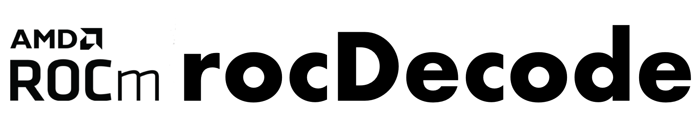

[](https://opensource.org/licenses/MIT)

<p align="center"></p>

rocDecode is a high-performance video decode SDK for AMD GPUs. Using the rocDecode API, you can
access the video decoding features available on your GPU.

> [!NOTE]
> The published documentation is available at [rocDecode](https://rocm.docs.amd.com/projects/rocDecode/en/latest/index.html) in an organized, easy-to-read format, with search and a table of contents. The documentation source files reside in the `rocDecode/docs` folder of this repository. As with all ROCm projects, the documentation is open source. For more information on contributing to the documentation, see [Contribute to ROCm documentation](https://rocm.docs.amd.com/en/latest/contribute/contributing.html).

## Supported codecs
* H.265 (HEVC) - 8 bit, and 10 bit
* H.264 (AVC) - 8 bit
* AV1 - 8 bit, and 10 bit
* VP9 - 8 bit, and 10 bit

## Prerequisites

### Hardware
* **GPU**: [AMD Radeon&trade; Graphics](https://rocm.docs.amd.com/projects/install-on-linux/en/latest/reference/system-requirements.html) / [AMD Instinct&trade; Accelerators](https://rocm.docs.amd.com/projects/install-on-linux/en/latest/reference/system-requirements.html)

> [!IMPORTANT] 
> `gfx908` or higher GPU required

### ROCm via TheRock

rocDecode is built and installed as part of [TheRock](https://github.com/ROCm/TheRock). All core dependencies are provided by the TheRock build, including:

* HIP runtime and development libraries
* AMD Clang++ compiler (C++17 required)
* Libva and VA-API drivers
* Libdrm (amdgpu)
* CMake and pkg-config

### FFmpeg (required for samples and tests)

[FFmpeg](https://github.com/FFmpeg/FFmpeg) development libraries must be installed separately to build and run samples and extended tests:

  ```shell
  sudo apt install libavcodec-dev libavformat-dev libavutil-dev
  ```

## Build and install

rocDecode is built as part of [TheRock](https://github.com/ROCm/TheRock). To build standalone from source:

```shell
mkdir build && cd build
cmake ../
make -j8
sudo make install
```

### Run tests

  ```shell
  make test
  ```
  > [!IMPORTANT] 
  > `make test` requires FFmpeg dev libraries to be installed

  >[!NOTE]
  > To run tests with verbose option, use `make test ARGS="-VV"`.

## Verify installation

After installation, the following files are available:

* Libraries in `/opt/rocm/lib`
* Header files in `/opt/rocm/include/rocdecode`
* Samples in `/opt/rocm/share/rocdecode`
* Documents in `/opt/rocm/share/doc/rocdecode`

### Using sample application

To verify your installation using a sample application, run:

  ```shell
  mkdir rocdecode-sample && cd rocdecode-sample
  cmake /opt/rocm/share/rocdecode/samples/videoDecode/
  make -j8
  ./videodecode -i /opt/rocm/share/rocdecode/video/AMD_driving_virtual_20-H265.mp4
  ```

### Using CTest

To verify your installation using CTest, run:

  ```shell
  mkdir rocdecode-test && cd rocdecode-test
  cmake /opt/rocm/share/rocdecode/test/
  ctest -VV
  ```

## Samples

You can access samples to decode your videos in the
[samples](https://github.com/ROCm/rocm-systems/tree/develop/projects/rocdecode/samples) directory. Refer to the
individual folders to build and run the samples.

[FFmpeg](https://ffmpeg.org/about.html) is required for sample applications and `make test`:

  ```shell
  sudo apt install libavcodec-dev libavformat-dev libavutil-dev
  ```

## Tested configurations

* Linux
  * Ubuntu - `22.04` / `24.04`
* FFmpeg - `4.4.2` / `6.1.1`
