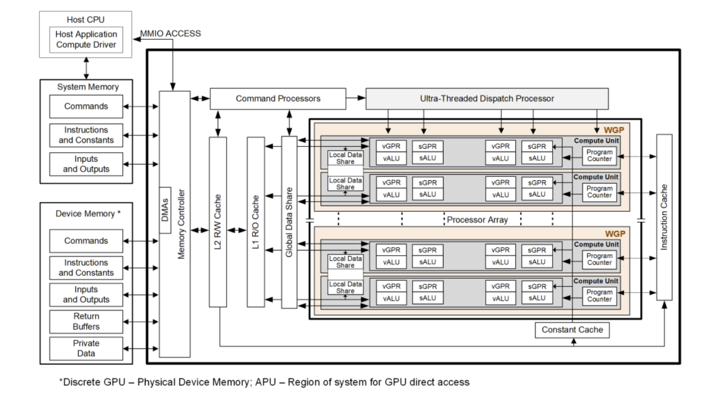

.. meta::
   :description: Understand the AMD RDNA architectures and hardware blocks with ROCm Compute Profiler to analyze and optimize performance on AMD Ryzen APUs.
   :keywords: ROCm Compute Profiler, RDNA, RDNA3, gfx1151, Radeon, ROCm, Ryzen

.. _rdna-performance-model:

********
RDNA3
********

ROCm Compute Profiler makes available an extensive list of metrics to better understand achieved application performance on RDNA3.5 architecture based AMD Ryzen™ APUs like AMD Ryzen AI Max Series - Strix Halo (gfx1151).

To best use profiling data, it’s important to understand the role of various hardware blocks of AMD RDNA3 architecture. Refer to the following top-level block diagram to understand the hardware blocks of RDNA3 architecture.

For more details on AMD RDNA3 architecture, see page 5 of `RDNA3 shader instruction set architecture <https://docs.amd.com/v/u/en-US/rdna3-shader-instruction-set-architecture-feb-2023_0#page=5>`__.

.. Note::

   * For top-level metrics details on CDNA and RDNA architecture, see :doc:`../performance-model`.

   * For details on metrics available for CDNA-CDNA4 based Instinct GPUs, see :doc:`../cdna/cdna-performance-model`.

   * For details on packaging, SIMD width, and generational differences between RDNA3, RDNA3.5, and later APUs, refer to :doc:`GPU hardware specifications <rocm:reference/gpu-arch-specs>` and the public architecture summaries.

ROCm Compute Profiler includes analysis panels targeting RDNA3.5 parts reporting as
gfx1151 - for example, integrated graphics on AMD Ryzen AI Max Series (Strix Halo)
processors.

Memory hierarchy in the tool
==============================

For gfx1151, the Memory Chart panel walks the path from instruction and scalar
paths, GL0 (TCP), LDS, interfaces to GL1 Cache, GL2 Cache, and GCEA toward
system memory.

Workgroups and execution
==============================

RDNA3 architecture-based APUs organize compute around **Workgroup Processors (WGPs)** and **Compute Units (CUs)**-on gfx1151 each WGP pairs two CUs that share resources.
Wavefronts are typically wave32-oriented in this configuration.
The Workgroup processor (WGP), Shader Processor Input (SPI), and Command Processor Compute (CPC) panels in gfx1151 expose dispatch, occupancy, and command-processor metrics for this RDNA execution model (see the nested chapters under :doc:`shader-engine` and :doc:`command-processor`).

Hardware block chapters
========================

Profiler chapters follow the RDNA3 gfx1151 block hierarchy below (roofline and Memory Chart walkthroughs live elsewhere in this manual).

Shader engine
-------------

Within each shader engine, gfx1151 metric tables group under:

* :doc:`spi` - **Workgroup Manager (SPI).** Schedules wavefronts onto WGPs after the command processor dispatches work; SPI utilization and wave-dispatch statistics.

* :doc:`wgp` - **Workgroup Processor (WGP).** CU-pair execution: occupancy, waves, instruction mix, and WGP instruction/data caches.

* :doc:`gl0-cache` - **GL0 (TCP vector cache).** Vector L0 immediately before GL1; TCP-named counters through the TCP-GL1 boundary.

* :doc:`gl1-cache` - **GL1 Cache.** Shared L1 utilization, requests, cache performance, and the GL1-GL2 interface.

See :doc:`shader-engine` for a short overview tying these blocks together.

Last-level cache and memory paths
----------------------------------

* :doc:`gl2-cache` - **GL2 Cache.** Last-level GFX on-chip cache performance, requests, and bandwidth.

* :doc:`gcea` - **GCEA.** DRAM read/write interfaces, system arbiter (SARB), and return traffic after GL2.

Host-side control and coarse utilization
-----------------------------------------

* :doc:`command-processor` - **Command processor.** CPC / MEC panels from packet handling through dispatch toward SPI.

* :doc:`grbm` - **Graphics Register Bus Manager (GRBM).** GPU-wide and per-shader-engine utilization from GRBM-derived counters.

Additional reference material
-----------------------------

* :doc:`system-speed-of-light` - System Speed-of-Light table using the same gfx1151 metric keys as the analysis panel.

* :doc:`references` - Public references and links to complementary Instinct documentation.

.. Note::

   ROCm Compute Profiler currently has limited support for WMMA on Strix Halo.
