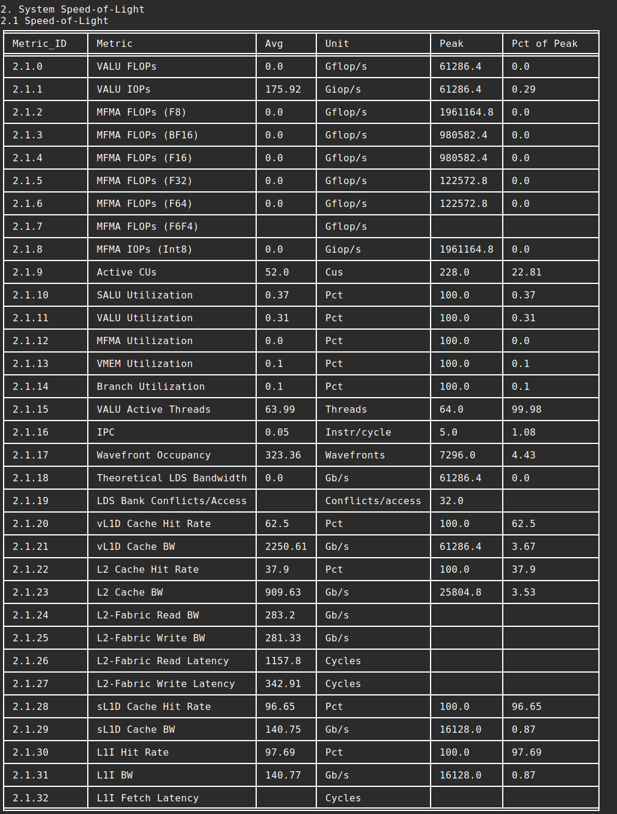
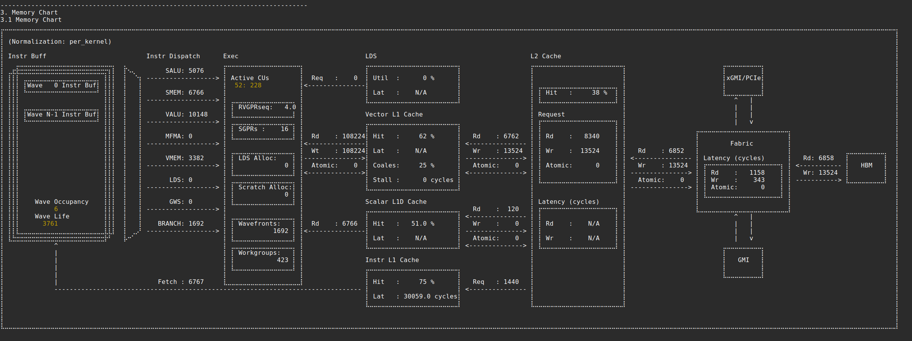
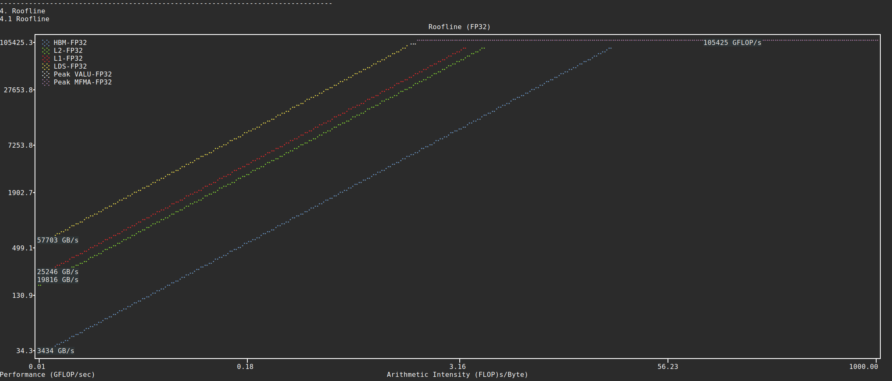
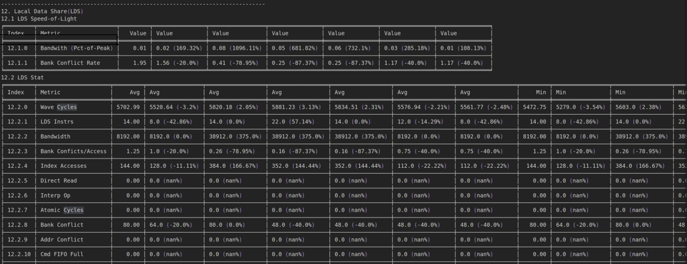
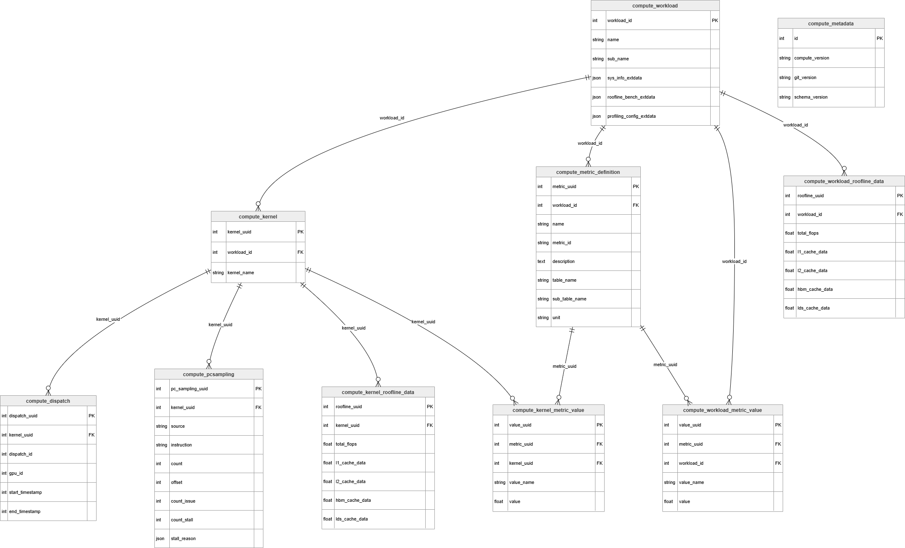
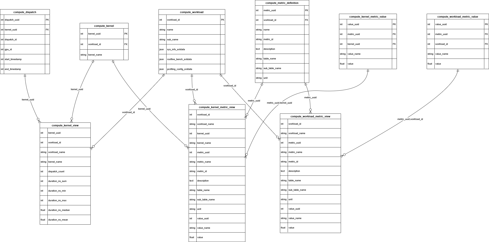

.. meta::
   :description: ROCm Compute Profiler analysis: CLI analysis
   :keywords: ROCm Compute Profiler, ROCm, profiler, tool, Instinct, accelerator, command line, analyze, filtering, metrics, baseline, comparison

************
CLI analysis
************

This section provides an overview of ROCm Compute Profiler's CLI analysis features.

* :ref:`Derived metrics <cli-list-available-metrics>`: All of ROCm Compute Profiler's built-in metrics.

* :ref:`Baseline comparison <analysis-baseline-comparison>`: Compare multiple runs in a side-by-side manner.

* :ref:`Metric customization <cli-analysis-options>`: Isolate a subset of built-in metrics or build your own profiling configuration.

* :ref:`Filtering <cli-analysis-options>`: Hone in on a particular kernel, GPU ID, or dispatch ID via post-process filtering.

* :ref:`Per-kernel roofline analysis <per-kernel-roofline>`: Detailed arithmetic intensity and performance analysis for individual kernels.

* :ref:`Roofline HTML generation <roofline-html-generation>`: Generate interactive HTML roofline charts from profiling data.

Run ``rocprof-compute analyze -h`` for more details.

.. _cli-walkthrough:

Walkthrough
===========

1. To begin, generate a high-level analysis report using ROCm Compute Profiler's ``-b`` (or ``--block``) flag.

There are three high-level GPU analysis views:

* System Speed-of-Light: Key GPU performance metrics to show overall GPU performance and utilization.
* Memory chart: Shows memory transactions and throughput on each cache hierarchical level.
* Empirical hierarchical roofline: Roofline model that compares achieved throughput with attainable peak hardware limits, more specifically peak compute throughput and memory bandwidth (on L1/LDS/L2/HBM). When combined with kernel filtering, provides detailed per-kernel arithmetic intensity analysis and performance breakdowns.

**System Speed-of-Light:**

.. code-block:: shell-session

   $ rocprof-compute analyze -p workloads/vcopy/MI200/ -b 2

**Memory chart:**

.. code-block:: shell-session

   $ rocprof-compute analyze -p workloads/vcopy/MI200/ -b 3

**Empirical hierarchical roofline:**

.. code-block:: shell-session

   $ rocprof-compute analyze -p workloads/vcopy/MI200/ -b 4

.. note::
   * Visualized memory chart and Roofline chart are only supported in single run analysis. In multiple runs comparison mode, both are switched back to basic table view.
   * Visualized memory chart requires the width of the terminal output to be greater than or equal to 234 to display the whole chart properly.
   * Visualized Roofline chart is adapted to the initial terminal size only. If it is not clear, you may need to adjust the terminal size and regenerate it to check the display effect. Roofline analysis provides detailed, structured table output with measured empirical peak values for comparison.

.. _cli-list-available-metrics:

2. Use ``--list-available-metrics`` to generate a list of available metrics for inspection.

   .. code-block:: shell-session

      $ rocprof-compute analyze -p workloads/vcopy/MI200/ --list-available-metrics

                                       __                                       _
       _ __ ___   ___ _ __  _ __ ___  / _|       ___ ___  _ __ ___  _ __  _   _| |_ ___
      | '__/ _ \ / __| '_ \| '__/ _ \| |_ _____ / __/ _ \| '_ ` _ \| '_ \| | | | __/ _ \
      | | | (_) | (__| |_) | | | (_) |  _|_____| (_| (_) | | | | | | |_) | |_| | ||  __/
      |_|  \___/ \___| .__/|_|  \___/|_|        \___\___/|_| |_| |_| .__/ \__,_|\__\___|
                     |_|                                           |_|

      Analysis mode = cli
      [analysis] deriving rocprofiler-compute metrics...
      0 -> Top Stats
      1 -> System Info
      2 -> System Speed-of-Light
              2.1 -> Speed-of-Light
                      2.1.0 -> VALU FLOPs
                      2.1.1 -> MFMA FLOPs (BF16)
                      2.1.2 -> MFMA FLOPs (F16)
                      2.1.3 -> MFMA FLOPs (F32)
                      2.1.4 -> MFMA FLOPs (F64)
                      2.1.5 -> MFMA IOPs (Int8)
                      2.1.6 -> Active CUs
                      2.1.7 -> SALU Utilization
                      2.1.8 -> VALU Utilization
                      2.1.9 -> MFMA Utilization
                      2.1.10 -> VMEM Utilization
                      2.1.11 -> Branch Utilization
                      2.1.12 -> VALU Active Threads
                      2.1.13 -> IPC
                      2.1.14 -> Wavefront Occupancy
                      2.1.15 -> Theoretical LDS Bandwidth
                      2.1.16 -> LDS Bank Conflicts/Access
                      2.1.17 -> vL1D Cache Hit Rate
                      2.1.18 -> vL1D Cache BW
                      2.1.19 -> L2 Cache Hit Rate
                      2.1.20 -> L2 Cache BW
                      2.1.21 -> L2-Fabric Read BW
                      2.1.22 -> L2-Fabric Write BW
                      2.1.23 -> L2-Fabric Read Latency
                      2.1.24 -> L2-Fabric Write Latency
                      2.1.25 -> sL1D Cache Hit Rate
                      2.1.26 -> sL1D Cache BW
                      2.1.27 -> L1I Hit Rate
                      2.1.28 -> L1I BW
                      2.1.29 -> L1I Fetch Latency
      ...

3. Choose your own customized subset of metrics with the ``-b`` (or ``--block``)
   option. Or, build your own configuration following
   `config_template <https://github.com/ROCm/rocm-systems/blob/develop/projects/rocprofiler-compute/src/rocprof_compute_soc/analysis_configs/panel_config_template.yaml>`_.
   The following snippet shows how to generate a report containing only metric 2
   (:doc:`System Speed-of-Light </conceptual/cdna/system-speed-of-light>`).

   .. code-block:: shell-session

      $ rocprof-compute analyze -p workloads/vcopy/MI200/ -b 2

      --------
      Analyze
      --------

      --------------------------------------------------------------------------------
      1. Top Stat
      ╒════╤══════════════════════════════════════════╤═════════╤═══════════╤════════════╤══════════════╤════════╕
      │    │ KernelName                               │   Count │   Sum(ns) │   Mean(ns) │   Median(ns) │    Pct │
      ╞════╪══════════════════════════════════════════╪═════════╪═══════════╪════════════╪══════════════╪════════╡
      │  0 │ vecCopy(double*, double*, double*, int,  │       1 │  20000.00 │   20000.00 │     20000.00 │ 100.00 │
      │    │ int) [clone .kd]                         │         │           │            │              │        │
      ╘════╧══════════════════════════════════════════╧═════════╧═══════════╧════════════╧══════════════╧════════╛

      --------------------------------------------------------------------------------
      2. System Speed-of-Light
      ╒═════════╤═══════════════════════════╤═══════════════════════╤══════════════════╤════════════════════╤════════════════════════╕
      │ Index   │ Metric                    │ Value                 │ Unit             │ Peak               │ PoP                    │
      ╞═════════╪═══════════════════════════╪═══════════════════════╪══════════════════╪════════════════════╪════════════════════════╡
      │ 2.1.0   │ VALU FLOPs                │ 0.0                   │ Gflop            │ 22630.4            │ 0.0                    │
      ├─────────┼───────────────────────────┼───────────────────────┼──────────────────┼────────────────────┼────────────────────────┤
      │ 2.1.1   │ MFMA FLOPs (BF16)         │ 0.0                   │ Gflop            │ 90521.6            │ 0.0                    │
      ├─────────┼───────────────────────────┼───────────────────────┼──────────────────┼────────────────────┼────────────────────────┤
      │ 2.1.2   │ MFMA FLOPs (F16)          │ 0.0                   │ Gflop            │ 181043.2           │ 0.0                    │
      ├─────────┼───────────────────────────┼───────────────────────┼──────────────────┼────────────────────┼────────────────────────┤
      │ 2.1.3   │ MFMA FLOPs (F32)          │ 0.0                   │ Gflop            │ 45260.8            │ 0.0                    │
      ├─────────┼───────────────────────────┼───────────────────────┼──────────────────┼────────────────────┼────────────────────────┤
      │ 2.1.4   │ MFMA FLOPs (F64)          │ 0.0                   │ Gflop            │ 45260.8            │ 0.0                    │
      ├─────────┼───────────────────────────┼───────────────────────┼──────────────────┼────────────────────┼────────────────────────┤
      │ 2.1.5   │ MFMA IOPs (Int8)          │ 0.0                   │ Giop             │ 181043.2           │ 0.0                    │
      ├─────────┼───────────────────────────┼───────────────────────┼──────────────────┼────────────────────┼────────────────────────┤
      │ 2.1.6   │ Active CUs                │ 74                    │ Cus              │ 104                │ 71.15384615384616      │
      ├─────────┼───────────────────────────┼───────────────────────┼──────────────────┼────────────────────┼────────────────────────┤
      │ 2.1.7   │ SALU Util                 │ 4.016057506716307     │ Pct              │ 100                │ 4.016057506716307      │
      ├─────────┼───────────────────────────┼───────────────────────┼──────────────────┼────────────────────┼────────────────────────┤
      │ 2.1.8   │ VALU Util                 │ 5.737225009594725     │ Pct              │ 100                │ 5.737225009594725      │
      ├─────────┼───────────────────────────┼───────────────────────┼──────────────────┼────────────────────┼────────────────────────┤
      │ 2.1.9   │ MFMA Util                 │ 0.0                   │ Pct              │ 100                │ 0.0                    │
      ├─────────┼───────────────────────────┼───────────────────────┼──────────────────┼────────────────────┼────────────────────────┤
      │ 2.1.10  │ VALU Active Threads/Wave  │ 64.0                  │ Threads          │ 64                 │ 100.0                  │
      ├─────────┼───────────────────────────┼───────────────────────┼──────────────────┼────────────────────┼────────────────────────┤
      │ 2.1.11  │ IPC - Issue               │ 1.0                   │ Instr/cycle      │ 5                  │ 20.0                   │
      ├─────────┼───────────────────────────┼───────────────────────┼──────────────────┼────────────────────┼────────────────────────┤
      │ 2.1.12  │ LDS BW                    │ 0.0                   │ Gb/sec           │ 22630.4            │ 0.0                    │
      ├─────────┼───────────────────────────┼───────────────────────┼──────────────────┼────────────────────┼────────────────────────┤
      │ 2.1.13  │ LDS Bank Conflict         │                       │ Conflicts/access │ 32                 │                        │
      ├─────────┼───────────────────────────┼───────────────────────┼──────────────────┼────────────────────┼────────────────────────┤
      │ 2.1.14  │ Instr Cache Hit Rate      │ 99.91306912556854     │ Pct              │ 100                │ 99.91306912556854      │
      ├─────────┼───────────────────────────┼───────────────────────┼──────────────────┼────────────────────┼────────────────────────┤
      │ 2.1.15  │ Instr Cache BW            │ 209.7152              │ Gb/s             │ 6092.8             │ 3.442016806722689      │
      ├─────────┼───────────────────────────┼───────────────────────┼──────────────────┼────────────────────┼────────────────────────┤
      │ 2.1.16  │ Scalar L1D Cache Hit Rate │ 99.81986908342313     │ Pct              │ 100                │ 99.81986908342313      │
      ├─────────┼───────────────────────────┼───────────────────────┼──────────────────┼────────────────────┼────────────────────────┤
      │ 2.1.17  │ Scalar L1D Cache BW       │ 209.7152              │ Gb/s             │ 6092.8             │ 3.442016806722689      │
      ├─────────┼───────────────────────────┼───────────────────────┼──────────────────┼────────────────────┼────────────────────────┤
      │ 2.1.18  │ Vector L1D Cache Hit Rate │ 50.0                  │ Pct              │ 100                │ 50.0                   │
      ├─────────┼───────────────────────────┼───────────────────────┼──────────────────┼────────────────────┼────────────────────────┤
      │ 2.1.19  │ Vector L1D Cache BW       │ 1677.7216             │ Gb/s             │ 11315.199999999999 │ 14.82714932126697      │
      ├─────────┼───────────────────────────┼───────────────────────┼──────────────────┼────────────────────┼────────────────────────┤
      │ 2.1.20  │ L2 Cache Hit Rate         │ 35.55067615693325     │ Pct              │ 100                │ 35.55067615693325      │
      ├─────────┼───────────────────────────┼───────────────────────┼──────────────────┼────────────────────┼────────────────────────┤
      │ 2.1.21  │ L2-Fabric Read BW         │ 419.8496              │ Gb/s             │ 1638.4             │ 25.6255859375          │
      ├─────────┼───────────────────────────┼───────────────────────┼──────────────────┼────────────────────┼────────────────────────┤
      │ 2.1.22  │ L2-Fabric Write BW        │ 293.9456              │ Gb/s             │ 1638.4             │ 17.941015625           │
      ├─────────┼───────────────────────────┼───────────────────────┼──────────────────┼────────────────────┼────────────────────────┤
      │ 2.1.23  │ L2-Fabric Read Latency    │ 256.6482321288385     │ Cycles           │                    │                        │
      ├─────────┼───────────────────────────┼───────────────────────┼──────────────────┼────────────────────┼────────────────────────┤
      │ 2.1.24  │ L2-Fabric Write Latency   │ 317.2264255699014     │ Cycles           │                    │                        │
      ├─────────┼───────────────────────────┼───────────────────────┼──────────────────┼────────────────────┼────────────────────────┤
      │ 2.1.25  │ Wave Occupancy            │ 1821.723057333852     │ Wavefronts       │ 3328               │ 54.73927455931046      │
      ├─────────┼───────────────────────────┼───────────────────────┼──────────────────┼────────────────────┼────────────────────────┤
      │ 2.1.26  │ Instr Fetch BW            │ 4.174722306564298e-08 │ Gb/s             │ 3046.4             │ 1.3703789084047721e-09 │
      ├─────────┼───────────────────────────┼───────────────────────┼──────────────────┼────────────────────┼────────────────────────┤
      │ 2.1.27  │ Instr Fetch Latency       │ 21.729248046875       │ Cycles           │                    │                        │
      ╘═════════╧═══════════════════════════╧═══════════════════════╧══════════════════╧════════════════════╧════════════════════════╛

   Alternatively, use the option ``-b`` (or ``--block``) with block alias(es).
   The following snippet shows how to generate a report containing only metric 2 with the alias equivalent of ``sol``

   .. code-block:: shell-session

      $ rocprof-compute analyze -p workloads/vcopy/MI200/ -b sol

      --------
      Analyze
      --------

      --------------------------------------------------------------------------------
      1. Top Stat
      ╒════╤══════════════════════════════════════════╤═════════╤═══════════╤════════════╤══════════════╤════════╕
      │    │ KernelName                               │   Count │   Sum(ns) │   Mean(ns) │   Median(ns) │    Pct │
      ╞════╪══════════════════════════════════════════╪═════════╪═══════════╪════════════╪══════════════╪════════╡
      │  0 │ vecCopy(double*, double*, double*, int,  │       1 │  20000.00 │   20000.00 │     20000.00 │ 100.00 │
      │    │ int) [clone .kd]                         │         │           │            │              │        │
      ╘════╧══════════════════════════════════════════╧═════════╧═══════════╧════════════╧══════════════╧════════╛

      --------------------------------------------------------------------------------
      2. System Speed-of-Light
      ╒═════════╤═══════════════════════════╤═══════════════════════╤══════════════════╤════════════════════╤════════════════════════╕
      │ Index   │ Metric                    │ Value                 │ Unit             │ Peak               │ PoP                    │
      ╞═════════╪═══════════════════════════╪═══════════════════════╪══════════════════╪════════════════════╪════════════════════════╡
      │ 2.1.0   │ VALU FLOPs                │ 0.0                   │ Gflop            │ 22630.4            │ 0.0                    │
      ├─────────┼───────────────────────────┼───────────────────────┼──────────────────┼────────────────────┼────────────────────────┤
      │ 2.1.1   │ MFMA FLOPs (BF16)         │ 0.0                   │ Gflop            │ 90521.6            │ 0.0                    │
      ├─────────┼───────────────────────────┼───────────────────────┼──────────────────┼────────────────────┼────────────────────────┤
      │ 2.1.2   │ MFMA FLOPs (F16)          │ 0.0                   │ Gflop            │ 181043.2           │ 0.0                    │
      ├─────────┼───────────────────────────┼───────────────────────┼──────────────────┼────────────────────┼────────────────────────┤
      │ 2.1.3   │ MFMA FLOPs (F32)          │ 0.0                   │ Gflop            │ 45260.8            │ 0.0                    │
      ├─────────┼───────────────────────────┼───────────────────────┼──────────────────┼────────────────────┼────────────────────────┤
      │ 2.1.4   │ MFMA FLOPs (F64)          │ 0.0                   │ Gflop            │ 45260.8            │ 0.0                    │
      ├─────────┼───────────────────────────┼───────────────────────┼──────────────────┼────────────────────┼────────────────────────┤
      │ 2.1.5   │ MFMA IOPs (Int8)          │ 0.0                   │ Giop             │ 181043.2           │ 0.0                    │
      ├─────────┼───────────────────────────┼───────────────────────┼──────────────────┼────────────────────┼────────────────────────┤
      │ 2.1.6   │ Active CUs                │ 74                    │ Cus              │ 104                │ 71.15384615384616      │
      ├─────────┼───────────────────────────┼───────────────────────┼──────────────────┼────────────────────┼────────────────────────┤
      │ 2.1.7   │ SALU Util                 │ 4.016057506716307     │ Pct              │ 100                │ 4.016057506716307      │
      ├─────────┼───────────────────────────┼───────────────────────┼──────────────────┼────────────────────┼────────────────────────┤
      │ 2.1.8   │ VALU Util                 │ 5.737225009594725     │ Pct              │ 100                │ 5.737225009594725      │
      ├─────────┼───────────────────────────┼───────────────────────┼──────────────────┼────────────────────┼────────────────────────┤
      │ 2.1.9   │ MFMA Util                 │ 0.0                   │ Pct              │ 100                │ 0.0                    │
      ├─────────┼───────────────────────────┼───────────────────────┼──────────────────┼────────────────────┼────────────────────────┤
      │ 2.1.10  │ VALU Active Threads/Wave  │ 64.0                  │ Threads          │ 64                 │ 100.0                  │
      ├─────────┼───────────────────────────┼───────────────────────┼──────────────────┼────────────────────┼────────────────────────┤
      │ 2.1.11  │ IPC - Issue               │ 1.0                   │ Instr/cycle      │ 5                  │ 20.0                   │
      ├─────────┼───────────────────────────┼───────────────────────┼──────────────────┼────────────────────┼────────────────────────┤
      │ 2.1.12  │ LDS BW                    │ 0.0                   │ Gb/sec           │ 22630.4            │ 0.0                    │
      ├─────────┼───────────────────────────┼───────────────────────┼──────────────────┼────────────────────┼────────────────────────┤
      │ 2.1.13  │ LDS Bank Conflict         │                       │ Conflicts/access │ 32                 │                        │
      ├─────────┼───────────────────────────┼───────────────────────┼──────────────────┼────────────────────┼────────────────────────┤
      │ 2.1.14  │ Instr Cache Hit Rate      │ 99.91306912556854     │ Pct              │ 100                │ 99.91306912556854      │
      ├─────────┼───────────────────────────┼───────────────────────┼──────────────────┼────────────────────┼────────────────────────┤
      │ 2.1.15  │ Instr Cache BW            │ 209.7152              │ Gb/s             │ 6092.8             │ 3.442016806722689      │
      ├─────────┼───────────────────────────┼───────────────────────┼──────────────────┼────────────────────┼────────────────────────┤
      │ 2.1.16  │ Scalar L1D Cache Hit Rate │ 99.81986908342313     │ Pct              │ 100                │ 99.81986908342313      │
      ├─────────┼───────────────────────────┼───────────────────────┼──────────────────┼────────────────────┼────────────────────────┤
      │ 2.1.17  │ Scalar L1D Cache BW       │ 209.7152              │ Gb/s             │ 6092.8             │ 3.442016806722689      │
      ├─────────┼───────────────────────────┼───────────────────────┼──────────────────┼────────────────────┼────────────────────────┤
      │ 2.1.18  │ Vector L1D Cache Hit Rate │ 50.0                  │ Pct              │ 100                │ 50.0                   │
      ├─────────┼───────────────────────────┼───────────────────────┼──────────────────┼────────────────────┼────────────────────────┤
      │ 2.1.19  │ Vector L1D Cache BW       │ 1677.7216             │ Gb/s             │ 11315.199999999999 │ 14.82714932126697      │
      ├─────────┼───────────────────────────┼───────────────────────┼──────────────────┼────────────────────┼────────────────────────┤
      │ 2.1.20  │ L2 Cache Hit Rate         │ 35.55067615693325     │ Pct              │ 100                │ 35.55067615693325      │
      ├─────────┼───────────────────────────┼───────────────────────┼──────────────────┼────────────────────┼────────────────────────┤
      │ 2.1.21  │ L2-Fabric Read BW         │ 419.8496              │ Gb/s             │ 1638.4             │ 25.6255859375          │
      ├─────────┼───────────────────────────┼───────────────────────┼──────────────────┼────────────────────┼────────────────────────┤
      │ 2.1.22  │ L2-Fabric Write BW        │ 293.9456              │ Gb/s             │ 1638.4             │ 17.941015625           │
      ├─────────┼───────────────────────────┼───────────────────────┼──────────────────┼────────────────────┼────────────────────────┤
      │ 2.1.23  │ L2-Fabric Read Latency    │ 256.6482321288385     │ Cycles           │                    │                        │
      ├─────────┼───────────────────────────┼───────────────────────┼──────────────────┼────────────────────┼────────────────────────┤
      │ 2.1.24  │ L2-Fabric Write Latency   │ 317.2264255699014     │ Cycles           │                    │                        │
      ├─────────┼───────────────────────────┼───────────────────────┼──────────────────┼────────────────────┼────────────────────────┤
      │ 2.1.25  │ Wave Occupancy            │ 1821.723057333852     │ Wavefronts       │ 3328               │ 54.73927455931046      │
      ├─────────┼───────────────────────────┼───────────────────────┼──────────────────┼────────────────────┼────────────────────────┤
      │ 2.1.26  │ Instr Fetch BW            │ 4.174722306564298e-08 │ Gb/s             │ 3046.4             │ 1.3703789084047721e-09 │
      ├─────────┼───────────────────────────┼───────────────────────┼──────────────────┼────────────────────┼────────────────────────┤
      │ 2.1.27  │ Instr Fetch Latency       │ 21.729248046875       │ Cycles           │                    │                        │
      ╘═════════╧═══════════════════════════╧═══════════════════════╧══════════════════╧════════════════════╧════════════════════════╛
   .. note::

      Some cells may be blank indicating a missing or unavailable hardware
      counter or NULL value.

4. Optimize the application, iterate, and re-profile to inspect performance
   changes.

5. Redo a comprehensive analysis with ROCm Compute Profiler CLI at any optimization
   milestone.

.. _cli-analysis-options:

More analysis options
=====================

**Single run**

.. code-block:: shell

   $ rocprof-compute analyze -p workloads/vcopy/MI200/

**List top kernels and dispatches**

.. code-block:: shell

   $ rocprof-compute analyze -p workloads/vcopy/MI200/  --list-stats

**List metrics**

.. code-block:: shell

   $ rocprof-compute analyze -p workloads/vcopy/MI200/  --list-metrics gfx90a

**List IP blocks**

.. code-block:: shell

   $ rocprof-compute analyze -p workloads/vcopy/MI200/  --list-blocks gfx90a

**Show Description column which is excluded by default in cli output**

.. code-block:: shell

   $ rocprof-compute analyze -p workloads/vcopy/MI200/  --list-metrics gfx90a --include-cols Description

**TTY output view (plain tables)**

Use ``--view table`` to force plain tabular output for all sections and ignore ``cli_style`` from the analysis YAML (for example, memory charts and Roofline charts are shown as tables). Additional ``--view`` values may be added in future releases.

.. code-block:: shell

   $ rocprof-compute analyze -p workloads/vcopy/MI200/ -b 3 --view table

**Show System Speed-of-Light and CS_Busy blocks only**

.. code-block:: shell

   $ rocprof-compute analyze -p workloads/vcopy/MI200/  -b 2  5.1.0

.. note::

   You can filter a single metric or the whole hardware component by its ID. In
   this case, ``1`` is the ID for System Speed-of-Light and ``5.1.0`` the ID for
   GPU Busy Cycles metric.

**Filter kernels**

First, list the top kernels in your application using `--list-stats`.

.. code-block::

   $ rocprof-compute analyze -p workloads/vcopy/MI200/ --list-stats

   Analysis mode = cli
   [analysis] deriving rocprofiler-compute metrics...

   --------------------------------------------------------------------------------
   Detected Kernels (sorted descending by duration)
   ╒════╤══════════════════════════════════════════════╕
   │    │ Kernel_Name                                  │
   ╞════╪══════════════════════════════════════════════╡
   │  0 │ vecCopy(double*, double*, double*, int, int) │
   ╘════╧══════════════════════════════════════════════╛

   --------------------------------------------------------------------------------
   Dispatch list
   ╒════╤═══════════════╤══════════════════════════════════════════════╤══════════╕
   │    │   Dispatch_ID │ Kernel_Name                                  │   GPU_ID │
   ╞════╪═══════════════╪══════════════════════════════════════════════╪══════════╡
   │  0 │             0 │ vecCopy(double*, double*, double*, int, int) │        0 │
   ╘════╧═══════════════╧══════════════════════════════════════════════╧══════════╛

Second, select the index of the kernel you would like to filter; for example,
``vecCopy(double*, double*, double*, int, int) [clone .kd]`` at index ``0``.
Then, use this index to apply the filter via ``-k`` or ``--kernels``.

.. code-block:: shell-session

   $ rocprof-compute analyze -p workloads/vcopy/MI200/ -k 0

   Analysis mode = cli
   [analysis] deriving rocprofiler-compute metrics...

   --------------------------------------------------------------------------------
   0. Top Stats
   0.1 Top Kernels
   ╒════╤══════════════════════════════════════════╤═════════╤═══════════╤════════════╤══════════════╤════════╤═════╕
   │    │ Kernel_Name                              │   Count │   Sum(ns) │   Mean(ns) │   Median(ns) │    Pct │ S   │
   ╞════╪══════════════════════════════════════════╪═════════╪═══════════╪════════════╪══════════════╪════════╪═════╡
   │  0 │ vecCopy(double*, double*, double*, int,  │    1.00 │  18560.00 │   18560.00 │     18560.00 │ 100.00 │ *   │
   │    │ int)                                     │         │           │            │              │        │     │
   ╘════╧══════════════════════════════════════════╧═════════╧═══════════╧════════════╧══════════════╧════════╧═════╛
   ...

You should see your filtered kernels indicated by an asterisk in the **Top
Stats** table.

.. _per-kernel-roofline:

**Per-kernel roofline analysis**

When analyzing specific kernels, the roofline analysis provides detailed metrics for each filtered kernel:

.. code-block:: shell-session

   $ rocprof-compute analyze -p workloads/vcopy/MI200/ -k 0 -b 4

This generates enhanced roofline output showing per-kernel performance rates and arithmetic intensity calculations:

.. code-block:: text

   ================================================================================
   4. Roofline
   ================================================================================
   (4.1) Per-Kernel Roofline Metrics and (4.2) AI Plot Points
   --------------------------------------------------------------------------------
   Kernel 0: vecCopy(double*, double*, double*, int, int) (100.0%)
      |
      ├─ 4.1 Roofline Rate Metrics:
      |   ╒═════════════╤════════════════════╤═══════════════════╤═════════╤════════════════════╕
      |   │ Metric_ID   │ Metric             │ Value             │ Unit    │   Peak (Empirical) │
      |   ╞═════════════╪════════════════════╪═══════════════════╪═════════╪════════════════════╡
      |   │ 4.1.0       │ VALU FLOPs         │                   │ Gflop/s │           61286.40 │
      |   ├─────────────┼────────────────────┼───────────────────┼─────────┼────────────────────┤
      |   │ 4.1.1       │ MFMA FLOPs (F64)   │                   │ Gflop/s │          108544.33 │
      |   ├─────────────┼────────────────────┼───────────────────┼─────────┼────────────────────┤
      |   │ 4.1.2       │ MFMA FLOPs (F32)   │                   │ Gflop/s │          104531.42 │
      |   ├─────────────┼────────────────────┼───────────────────┼─────────┼────────────────────┤
      |   │ 4.1.3       │ MFMA FLOPs (F16)   │                   │ Gflop/s │          709169.38 │
      |   ├─────────────┼────────────────────┼───────────────────┼─────────┼────────────────────┤
      |   │ 4.1.4       │ MFMA FLOPs (BF16)  │ 0.0               │ Gflop/s │          388161.09 │
      |   ├─────────────┼────────────────────┼───────────────────┼─────────┼────────────────────┤
      |   │ 4.1.5       │ MFMA FLOPs (F8)    │ 0.0               │ Gflop/s │         1446089.60 │
      |   ├─────────────┼────────────────────┼───────────────────┼─────────┼────────────────────┤
      |   │ 4.1.6       │ MFMA IOPs (Int8)   │                   │ Giop/s  │          737317.94 │
      |   ├─────────────┼────────────────────┼───────────────────┼─────────┼────────────────────┤
      |   │ 4.1.7       │ HBM Bandwidth      │                   │ Gb/s    │            3231.95 │
      |   ├─────────────┼────────────────────┼───────────────────┼─────────┼────────────────────┤
      |   │ 4.1.8       │ L2 Cache Bandwidth │                   │ Gb/s    │           19096.81 │
      |   ├─────────────┼────────────────────┼───────────────────┼─────────┼────────────────────┤
      |   │ 4.1.9       │ L1 Cache Bandwidth │ 3880.358726762844 │ Gb/s    │           25006.24 │
      |   ├─────────────┼────────────────────┼───────────────────┼─────────┼────────────────────┤
      |   │ 4.1.10      │ LDS Bandwidth      │                   │ Gb/s    │           54920.88 │
      |   ╘═════════════╧════════════════════╧═══════════════════╧═════════╧════════════════════╛
      ├─ 4.2 Roofline AI Plot Points:
      |   ╒═════════════╤══════════════════════╤═════════╤════════════╕
      |   │ Metric_ID   │ Metric               │ Value   │ Unit       │
      |   ╞═════════════╪══════════════════════╪═════════╪════════════╡
      |   │ 4.2.0       │ AI HBM               │         │ Flops/byte │
      |   ├─────────────┼──────────────────────┼─────────┼────────────┤
      |   │ 4.2.1       │ AI L2                │         │ Flops/byte │
      |   ├─────────────┼──────────────────────┼─────────┼────────────┤
      |   │ 4.2.2       │ AI L1                │         │ Flops/byte │
      |   ├─────────────┼──────────────────────┼─────────┼────────────┤
      |   │ 4.2.3       │ Performance (GFLOPs) │         │ Gflop/s    │
      |   ╘═════════════╧══════════════════════╧═════════╧════════════╛

The per-kernel analysis uses YAML-based metric evaluation for accurate calculations.

Analyze multiple kernels for comparison:

.. code-block:: shell-session

   $ rocprof-compute analyze -p workloads/vcopy/MI200/ -k 0 1 2 -b 4

.. _roofline-html-generation:

**Roofline HTML generation**

Roofline HTML plots are generated during analyze mode. Profile mode creates
``roofline.csv`` containing microbenchmark data, and analyze mode uses this
data to produce interactive HTML roofline charts.

Two-step workflow:

.. code-block:: shell-session

   # Step 1: Profile to generate roofline.csv
   $ rocprof-compute profile --name vcopy --roof-only -- tests/vcopy -n 1048576 -b 256

   # Step 2: Analyze to generate HTML roofline plots
   $ rocprof-compute analyze -p workloads/vcopy/MI300A_A1/ -b 4

Roofline visualization options (available only in analyze mode):

* ``--sort``: Overlay top kernels or top dispatches (default: kernels)
* ``--mem-level``: Filter by memory level -- HBM, L2, vL1D, LDS (default: ALL)
* ``--roofline-data-type``: Choose datatypes for roofline visualization (default: FP32)

Example with multiple options:

.. code-block:: shell-session

   $ rocprof-compute analyze -p workloads/vcopy/MI200/ --sort dispatches --mem-level HBM L2 --roofline-data-type FP32 FP16

.. _analysis-baseline-comparison:

**Baseline comparison**

Baseline comparison allows for checking A/B effect. Currently baseline comparison is limited to the same :ref:`SoC <def-soc>`. Cross-comparison between SoCs is in development.

For both the Current Workload and the Baseline Workload, you can independently setup the following filters to allow fine grained comparisons:

* Workload Name with ``--path``
* GPU ID filtering (multi-selection) with ``--gpu-id``
* Kernel Name filtering (multi-selection) with ``--kernel``
* Dispatch ID filtering (regex filtering) with ``--dispatch``
* ROCm Compute Profiler panels/blocks (multi-selection) with ``--block``

.. code-block:: shell

   rocprof-compute analyze -p [path1] [path2] … [pathN]

.. code-block:: shell

   rocprof-compute analyze -p [path1] [options for path1] ... -p [pathN] [options for pathN]

Examples:

.. code-block:: shell

   rocprof-compute analyze -p workloads/workload_1/gpu_arch/ -k 0 -b 2 -p workloads/workload_2/gpu_arch/ -k 1 -b 2

.. code-block:: shell

   rocprof-compute analyze -p workloads/workload_1/gpu_arch/ workloads/workload_2/gpu_arch/ ... workloads/workload_7/gpu_arch/ -b 12

Analysis output format
======================

Use the ``--output-format <format>`` analyze mode option to specify the output format of the
analysis report. Supported formats are ``stdout``, ``txt``, ``csv``, and ``db``. The default output
format is ``stdout``.

* ``stdout`` format:
   * Print analysis report to the terminal.
   * NOTE: This option will not generate any file or folder.

* ``txt`` format:
   * Generate a file named ``rocprof_compute_<uuid>.txt`` in the current working directory.
   * This file contains the entire analysis report as printed on the terminal.
   * This is useful in case of searching across long analysis reports.
   * NOTE: This option will disable output of analysis report to terminal.

* ``csv`` format:
   * NOTE: This only works when provided workload paths are created using ``--format-rocprof-output rocpd`` profile mode option.
   * Generate a folder named ``rocprof_compute_<uuid>`` in the current working directory.
   * This folder contains one CSV file per view defined in the :ref:`analysis database schema <analysis-database>`.
   * This is useful for further programmatic analysis of analysis reports.
   * NOTE: This option will disable output of analysis report to terminal.

* ``db`` format:
   * NOTE: This only works when provided workload paths are created using ``--format-rocprof-output rocpd`` profile mode option.
   * Generate a file named ``rocprof_compute_<uuid>.db`` in the current working directory.
   * This is a SQLite database file containing all the data in the analysis report structured according to :ref:`analysis database schema <analysis-database>`.
   * This is useful for further programmatic analysis of analysis reports.
   * NOTE: This option will disable output of analysis report to terminal.

Default file/folder name ``rocprof_compute_<uuid>`` can be overridden using ``--output-name <name>`` analyze mode option. For ``csv`` format the name is used as the output folder; for ``db`` format the name is used with a ``.db`` suffix.

.. _analysis-database:

Analysis database schema
========================

Analysis database tables

Analysis database views

Analysis database example

.. note::

   Some metrics cannot be calculated when corresponding counters are missing as shown in the warnings below

.. note::

   It is possible to merge the analysis data dump for multiple workload folders (resulting from multiple profiles) by repeating ``-p`` option for each workload

.. code-block:: shell-session

   $ rocprof-compute analyze --verbose --output-name test --output-format db -p workloads/nbody/MI300X_A1 -p workloads/nbody1/MI300X_A1
   DEBUG Execution mode = analyze

                                    __                                       _
   _ __ ___   ___ _ __  _ __ ___  / _|       ___ ___  _ __ ___  _ __  _   _| |_ ___
   | '__/ _ \ / __| '_ \| '__/ _ \| |_ _____ / __/ _ \| '_ ` _ \| '_ \| | | | __/ _ \
   | | | (_) | (__| |_) | | | (_) |  _|_____| (_| (_) | | | | | | |_) | |_| | ||  __/
   |_|  \___/ \___| .__/|_|  \___/|_|        \___\___/|_| |_| |_| .__/ \__,_|\__\___|
                  |_|                                           |_|

      INFO Analysis mode = db
      INFO ed45b0b189
   DEBUG [omnisoc init]
      INFO ed45b0b189
   DEBUG [omnisoc init]
   DEBUG [analysis] prepping to do some analysis
      INFO [analysis] deriving rocprofiler-compute metrics...
   DEBUG Collected roofline ceilings
   WARNING PC sampling data not found for /app/projects/rocprofiler-compute/workloads/nbody/MI300X_A1.
   WARNING PC sampling data not found for /app/projects/rocprofiler-compute/workloads/nbody1/MI300X_A1.
   DEBUG Collected dispatch data
   DEBUG Applied analysis mode filters
   DEBUG Calculated dispatch data
   DEBUG Collected metrics data
   WARNING Failed to evaluate expression for 3.1.39 - Value: to_round((to_avg(
      (pmc_df.get("pmc_perf_ACCUM") / pmc_df.get("SQC_ICACHE_REQ")).where((pmc_df.get("SQC_ICACHE_REQ") != 0), None)) * 100), 0) - unsupported operand type(s) for /: 'NoneType' and 'float'
   WARNING Failed to evaluate expression for 3.1.39 - Value: to_round((to_avg(
      (pmc_df.get("pmc_perf_ACCUM") / pmc_df.get("SQC_ICACHE_REQ")).where((pmc_df.get("SQC_ICACHE_REQ") != 0), None)) * 100), 0) - unsupported operand type(s) for /: 'NoneType' and 'float'
   DEBUG Calculated metric values
   DEBUG Calculated roofline data points
   DEBUG [analysis] generating analysis
   DEBUG SQLite database initialized with name: test.db
   DEBUG Initialized database: test.db
      INFO ed45b0b189
      INFO ed45b0b189
   DEBUG Completed writing database
   WARNING Created file: test.db

PyTorch Operator Analysis
=========================

.. warning::

   PyTorch operator analysis is currently available only in CLI mode. GUI and TUI
   will provide different interfaces for operator selection and visualization.

   These options require ``--experimental``. After profiling with
   ``--experimental --torch-trace`` (see :ref:`torch-operator-profiling`),
   use ``rocprof-compute --experimental analyze ...`` with
   ``--list-torch-operators`` or ``--torch-operator`` as needed.

Listing All Operators
---------------------

Display all PyTorch operators captured during profiling:

.. code-block:: shell-session

   $ rocprof-compute --experimental analyze --path ./workload --list-torch-operators

   ================================================================================
   PyTorch Operator Call Tree: ./workload
   Grouped by source location, sorted by total GPU kernel duration.
   ================================================================================

   main.py:60 (dispatches: 90, total: 42.80 ms, dispatch_mean: 0.48 ms, dispatch_min: 0.01 ms, dispatch_max: 2.10 ms)
   └─ nn.Module.Net.forward (calls: 10, dispatches: 90, total: 42.80 ms, dispatch_mean: 0.48 ms, dispatch_min: 0.01 ms, dispatch_max: 2.10 ms)
      ├─ torch.nn.functional.conv2d (calls: 20)
      |  └─ conv2d_fwd (dispatches: 40, total: 27.08 ms)
      ├─ torch.nn.functional.linear (calls: 20)
      |  └─ gemm (dispatches: 20, total: 15.41 ms)
      └─ torch.nn.functional.relu (calls: 40)
         └─ relu_kernel (dispatches: 30, total: 0.31 ms)

   Operator summary (Min/Max/Mean are per-dispatch over the subtree; sorted by Total):
   ╒══════════════════════════════════════════════════╤═════════╤══════════════╤══════════╤═══════════╤═════════════╤═════════╤═════════╤═════════╕
   │ Operator                                         │   Calls │   Dispatches │    Total │   % Total │   Mean/Call │    Mean │     Min │     Max │
   ╞══════════════════════════════════════════════════╪═════════╪══════════════╪══════════╪═══════════╪═════════════╪═════════╪═════════╪═════════╡
   │ nn.Module.Net.forward                            │      10 │           90 │ 42.80 ms │    100.00 │     4.28 ms │ 0.48 ms │ 0.01 ms │ 2.10 ms │
   ├──────────────────────────────────────────────────┼─────────┼──────────────┼──────────┼───────────┼─────────────┼─────────┼─────────┼─────────┤
   │ nn.Module.Net.forward/torch.nn.functional.conv2d │      20 │           40 │ 27.08 ms │     63.27 │     1.35 ms │ 0.68 ms │ 0.21 ms │ 2.10 ms │
   ├──────────────────────────────────────────────────┼─────────┼──────────────┼──────────┼───────────┼─────────────┼─────────┼─────────┼─────────┤
   │ nn.Module.Net.forward/torch.nn.functional.linear │      20 │           20 │ 15.41 ms │     36.00 │     0.77 ms │ 0.77 ms │ 0.13 ms │ 1.82 ms │
   ├──────────────────────────────────────────────────┼─────────┼──────────────┼──────────┼───────────┼─────────────┼─────────┼─────────┼─────────┤
   │ nn.Module.Net.forward/torch.nn.functional.relu   │      40 │           30 │  0.31 ms │      0.72 │     7.70 us │ 0.01 ms │ 0.01 ms │ 0.02 ms │
   ╘══════════════════════════════════════════════════╧═════════╧══════════════╧══════════╧═══════════╧═════════════╧═════════╧═════════╧═════════╛

Output is grouped by source location (``file:line``) and shows full operator
hierarchy (``/``-separated) and kernel stats. A consolidated CSV
(``torch_trace/consolidated.csv``) is written with all operator/kernel data;
see :ref:`torch-operator-profiling` for details.

The flat **Operator summary** table below the call tree has one row per
operator that ran at least one GPU kernel. Time cells auto-switch between
milliseconds and microseconds per cell; missing values render as ``N/A``.

* **Operator** — full operator path (for example
  ``aten::matmul/aten::mm``).
* **Calls** — how many times the operator was invoked. ``N/A`` when the
  trace did not include ``Context_Id`` information to count invocations.
* **Dispatches** — how many GPU kernels ran while the operator was on the
  call stack (kernels launched by operators it called also count).
* **Total** — total GPU time spent while the operator was on the call
  stack.
* **% Total** — share of the workload's total GPU time spent while this
  operator was on the call stack. Because the same kernel time is counted
  for an operator and for any operator that called it, the column can add
  up to more than 100%. ``N/A`` when no GPU time was recorded.
* **Mean/Call** — average GPU time per call to this operator.
* **Mean / Min / Max** — per-kernel-dispatch timings across all kernels
  launched while this operator was on the call stack.

When no operator has any recorded dispatches, the table is replaced by the
line ``Operator summary: (no operators with recorded dispatches)``.

Filtering by Operator
---------------------

``--torch-operator`` uses PurePosixPath glob patterns to select operators.
Operator hierarchies are ``/``-separated (e.g.
``nn.Module.Net.forward/torch.nn.functional.relu``), and patterns are matched
using ``PurePosixPath.match()``:

* **Wildcard** — ``*relu`` (ends with relu), ``*conv*`` (contains conv)
* **Exact** — ``torch.nn.functional.relu``
* **Multi-level** — ``*/torch.nn.functional.relu``, ``*/*functional*/*``
* **Match all** — no arguments, ``all``, ``*``, or ``**``

.. code-block:: shell-session

   # Wildcard match
   $ rocprof-compute --experimental analyze --path ./workload --torch-operator "*relu"

   # Exact match
   $ rocprof-compute --experimental analyze --path ./workload --torch-operator torch.nn.functional.relu

   # Match all operators (no arguments)
   $ rocprof-compute --experimental analyze --path ./workload --torch-operator

**Filter multiple operators** (space or comma separated):

.. code-block:: shell-session

   $ rocprof-compute --experimental analyze --path ./workload \
       --torch-operator "*relu,*conv*,*linear"
