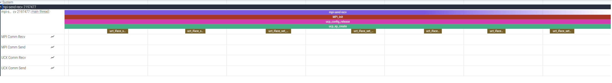

.. meta::
   :description: ROCm Systems Profiler communication runtime profiling documentation
   :keywords: rocprof-sys, rocprofiler-systems, ROCm, MPI, RCCL, UCX, SHMEM, OpenSHMEM, communication, profiler, tracking, distributed, AMD

****************************************************
Communication runtime profiling
****************************************************

`ROCm Systems Profiler <https://github.com/ROCm/rocm-systems/tree/develop/projects/rocprofiler-systems>`_ profiles several widely used communication runtimes and libraries, including MPI, RCCL, UCX, and OpenSHMEM (SHMEM).

These runtimes operate at different layers of the communication stack—from high-level programming models to low-level transport mechanisms. ROCm Systems Profiler provides coordinated tracing across these layers to enable end-to-end analysis of communication behavior, overheads, and performance bottlenecks.

Communication runtime layers
==============================

The supported communication runtimes span multiple layers of the parallel computing stack:

**High-Level Programming Models**

* **MPI (Message Passing Interface)**: The de facto standard for distributed memory parallel programming, providing point-to-point and collective communication primitives for CPU-based applications.

**GPU Collective Communication Libraries**

* **RCCL (ROCm Communication Collectives Library)**: AMD's GPU-aware collective communication library, optimized for multi-GPU communication within and across nodes. RCCL is designed to work seamlessly with ROCm and provides highly optimized implementations of collective operations like AllReduce, AllGather, and Broadcast.

**Low-Level Communication Frameworks**

* **UCX (Unified Communication X)**: A high-performance communication framework that provides low-level abstractions for RDMA, shared memory, and other transport mechanisms. UCX is often used as a backend for higher-level libraries like MPI and RCCL, providing efficient point-to-point communication, RMA (Remote Memory Access) operations, and active messages.

* **OpenSHMEM (SHMEM)**: A standard API for Partitioned Global Address Space (PGAS) programming, providing one-sided RMA (put/get), atomics, collectives, and synchronization across Processing Elements (PEs). Unlike message-passing models such as MPI — where communication is typically two-sided and coordinated — OpenSHMEM exposes remote memory access (RMA) operations that operate on symmetric memory regions (memory allocated identically across all PEs).

.. note::

   **Automatic Detection and Default Behavior:**

   * **MPI** (``ROCPROFSYS_USE_MPIP``): Enabled by default (``ON``). When using binary instrumentation, ROCm Systems Profiler automatically detects MPI symbols in the target application and enables MPI support.
   * **UCX** (``ROCPROFSYS_USE_UCX``): Disabled by default (``OFF``). Must be explicitly enabled to trace UCX operations. This is a runtime user-configurable option.
   * **RCCL** (``ROCPROFSYS_USE_RCCLP``): Disabled by default (``OFF``). Must be explicitly enabled to trace RCCL operations.
   * **SHMEM** (``ROCPROFSYS_USE_SHMEM``): Disabled by default (``OFF``). Must be explicitly enabled to trace OpenSHMEM operations.

   These settings can be controlled at runtime using their respective environment variables to enable or disable tracing as needed.

Profiling MPI
=============

MPI support is enabled through the ``ROCPROFSYS_USE_MPIP`` configuration setting, which is **enabled by default**. ROCm Systems Profiler can be built with full (``ROCPROFSYS_USE_MPI=ON``) or partial (``ROCPROFSYS_USE_MPI_HEADERS=ON``) MPI support using the build-time configuration options. By default, ROCm Systems Profiler uses partial MPI support with the OpenMPI headers. For detailed information on building rocprofiler-systems with MPI support, see the :doc:`installation guide <../install/install>`.

When using binary instrumentation with ``rocprof-sys-instrument``, MPI functions are automatically detected in the target application. If MPI symbols (such as ``MPI_Init``, ``MPI_Init_thread``, ``MPI_Finalize``) are found, MPI support is automatically enabled.

Configuration
-------------

Since MPI profiling is enabled by default, you typically don't need to explicitly set ``ROCPROFSYS_USE_MPIP=ON``. However, if you need to disable MPI tracing, you can do so with:

.. code-block:: shell

   # MPI profiling is enabled by default - no action needed
   export ROCPROFSYS_TRACE=ON
   export ROCPROFSYS_PROFILE=ON

   # To explicitly disable MPI profiling if needed:
   export ROCPROFSYS_USE_MPIP=OFF

When MPI support is enabled, rocprofiler-systems automatically intercepts MPI function calls using GOTCHA wrappers, allowing you to trace MPI communication patterns and timing.

Usage with MPI Applications
----------------------------

When profiling MPI applications, use ``rocprof-sys-sample`` instead of ``rocprof-sys-instrument`` with runtime instrumentation to avoid compatibility issues with MPI process launching:

.. code-block:: shell

   # Recommended: Using rocprof-sys-sample
   mpirun -n 4 rocprof-sys-sample -- ./my_mpi_app

   # Alternative: Binary rewrite approach
   rocprof-sys-instrument -o my_mpi_app.inst -- ./my_mpi_app
   mpirun -n 4 rocprof-sys-run -- ./my_mpi_app.inst

.. note::

   Runtime instrumentation (``rocprof-sys-instrument`` without ``-o``) requires a fork and ``ptrace``, which is generally incompatible with how MPI applications spawn processes, particularly with OpenMPI.

MPI Profiling Output
--------------------

When MPI profiling is enabled, ROCm Systems Profiler generates:

* **ROCm Profiling Data (rocpd)**: When ``ROCPROFSYS_USE_ROCPD=ON`` is set, profiling data is output in a SQLite3 database format for advanced analysis. See :ref:`rocprof_sys_rocpd_output` for details on this output format. You can visualize MPI operations in a timeline view showing communication patterns, operation durations, and concurrency using `ROCm Optiq <https://rocm.docs.amd.com/projects/roc-optiq/en/latest/what-is-optiq.html>`_.
* **Perfetto traces**: Visualize MPI operations on a timeline, showing communication patterns, operation durations, and concurrency
* **Timemory profiles**: Statistical summaries of MPI function call counts, total time, and performance metrics
* **Communication data**: Track message sizes, communication volumes, and data movement patterns for point-to-point and collective operations

The traces include detailed information about:

* MPI ranks and communicators
* Message sizes and datatypes
* Source and destination ranks (for point-to-point operations)
* Root ranks (for collective operations)
* Tags for message matching

ROCm Systems Profiler provides automatic output labeling based on MPI rank IDs:

* When full MPI support is enabled (``ROCPROFSYS_USE_MPI=ON``), output files are labeled with the ``MPI_COMM_WORLD`` rank ID
* The ``ROCPROFSYS_USE_PID`` setting controls whether process IDs or MPI rank IDs are used for output labeling

For detailed information on building rocprofiler-systems with MPI support, see the :doc:`installation guide <../install/install>`.

Selective rank profiling
-------------------------

When running large-scale MPI jobs, collecting profiling data and console output from all ranks is not always desired.
ROCm Systems Profiler provides two independent rank-filtering options:

- ``--rank-filter-output`` (corresponding configuration setting ``ROCPROFSYS_RANK_FILTER_OUTPUT``) — only the listed MPI ranks produce profile and trace output files; other ranks do not.
- ``--rank-filter-logs`` (corresponding configuration setting ``ROCPROFSYS_RANK_FILTER_LOGS``) — only the listed MPI ranks emit console output; other ranks do not.

The ``--rank-filter-output`` option allows you to specify which MPI ranks should provide profile and trace output files.
Below are examples using ``rocprof-sys-sample`` to profile an application using a variety of rank selection syntaxes.

.. code-block:: bash

    # Profile only rank 0
    mpirun -n 16 rocprof-sys-sample --rank-filter-output 0 -- <application_path>

    # Profile ranks 0-3 and rank 8
    mpirun -n 16 rocprof-sys-sample --rank-filter-output 0-3,8 -- <application_path>

    # Profile ranks 0, 4, 8, and 12
    mpirun -n 16 rocprof-sys-sample --rank-filter-output 0,4,8,12 -- <application_path>

The ``--rank-filter-logs`` option allows you to specify which MPI ranks emit console output:

.. code-block:: bash

    # Show console output from ranks 0-3 and rank 8
    mpirun -n 16 rocprof-sys-sample --rank-filter-logs 0-3,8 -- <application_path>

The two filters can be combined together — for example, to write profile data only for rank 0 while keeping console logs visible from ranks 0-3:

.. code-block:: bash

    mpirun -n 16 rocprof-sys-sample --rank-filter-output 0 --rank-filter-logs 0-3 -- <application_path>

Supported rank specification syntax (same for both filters):

- **Individual ranks**: Comma-separated integers (e.g., ``0,1,2,8``)
- **Ranges**: Hyphen-separated start and end values (e.g., ``0-7`` for ranks 0 through 7)
- **Combined**: Mix of individual ranks and ranges (e.g., ``0-3,8,10-15``)
- **Empty value**: Enables output for all ranks (the default).

When the total number of MPI ranks (world size) can be determined from the launcher environment
(``OMPI_COMM_WORLD_SIZE``, ``MV2_COMM_WORLD_SIZE``, ``PMI_SIZE``, ``SLURM_NTASKS``, or ``SLURM_NPROCS``),
any filter value outside the valid range ``[0, world_size - 1]`` triggers a warning and is ignored.
If every value in the filter is out of range, filtering is disabled and output is produced for all ranks.
When the world size cannot be determined, no such validation is performed and specifying correct
rank values is the user's responsibility.

.. code-block:: bash

    # Rank 100 is out of range for a 16-rank job: it is reported and ignored,
    # so only rank 1 produces output
    mpirun -n 16 rocprof-sys-sample --rank-filter-output "1,100" -- <application_path>

Supported rank identification variables:

- **MPI_RANKID**
- **PMI_RANK**
- **MV2_COMM_WORLD_RANK**
- **OMPI_COMM_WORLD_RANK**
- **SLURM_PROCID**

If rank detection fails, both filters are disabled and output is produced for all ranks.
The same applies if the detected rank is itself outside ``[0, world_size - 1]``:
filtering is disabled for that rank and it produces output.

.. note::

   For maximum console output suppression, use the ``ROCPROFSYS_RANK_FILTER_LOGS`` setting instead of ``--rank-filter-logs`` CLI option: the latter allows some log messages to be output due to how CLI options are processed. Also note that errors and critical messages are emitted for all ranks regardless of rank-based filtering option.

   .. code-block:: bash

       # Show console output only from rank 0
       export ROCPROFSYS_RANK_FILTER_LOGS=0
       mpirun -n 16 rocprof-sys-sample -- <application_path>

Custom MPI environment variables
----------------------------------

For mixed environments or non-standard MPI configurations, you can specify custom environment variables for rank detection.
When using custom environment variables, ``--rank-filter-id`` must be specified together with at least one of ``--rank-filter-output`` or ``--rank-filter-logs``.
The ``--rank-filter-id`` will take precedence over automatic detection for both filters.
Below is an example using the ``MY_CUSTOM_RANK`` environment variable with ``rocprof-sys-sample`` to profile ranks 0-3 and 8:

.. code-block:: bash

    # Use custom environment variable MY_CUSTOM_RANK for rank detection (file output filter)
    mpirun -n 16 rocprof-sys-sample --rank-filter-output 0-3,8 --rank-filter-id MY_CUSTOM_RANK -- <application_path>

    # Use custom environment variable MY_CUSTOM_RANK for rank detection (console log filter)
    mpirun -n 16 rocprof-sys-sample --rank-filter-logs 0-3,8 --rank-filter-id MY_CUSTOM_RANK -- <application_path>

If rank detection using the custom variable fails, the above-listed supported variables are used instead.

Profiling RCCL
==============

RCCL profiling provides insights into GPU-to-GPU communication patterns and collective operation performance.

When enabled, rocprofiler-systems captures:

* RCCL API calls (ncclAllReduce, ncclBroadcast, ncclReduce, etc.)
* Communication data volumes and patterns
* Timing information for collective operations

.. important::

   Unlike MPI and UCX, RCCL profiling is **disabled by default** and must be explicitly enabled using ``ROCPROFSYS_USE_RCCLP=ON``.

Configuration
-------------

To enable RCCL tracing and profiling:

.. code-block:: shell

   export ROCPROFSYS_USE_RCCLP=ON
   export ROCPROFSYS_TRACE=ON
   export ROCPROFSYS_PROFILE=ON
   export ROCPROFSYS_ROCM_DOMAINS=hip_runtime_api,kernel_dispatch,memory_copy

RCCL Profiling Output
-------------------------

When RCCL profiling is enabled, rocprofiler-systems generates:

* **ROCm Profiling Data (rocpd)**: When ``ROCPROFSYS_USE_ROCPD=ON`` is set, RCCL profiling
  data is output in a SQLite3 database format with per-GPU device attribution for
  multi-GPU systems. See :ref:`rocprof_sys_rocpd_output` for details on this output
  format. You can visualize RCCL operations in a timeline view showing communication
  patterns, operation durations, and concurrency using `ROCm Optiq
  <https://rocm.docs.amd.com/projects/roc-optiq/en/latest/what-is-optiq.html>`_.
* **Perfetto traces**: Visualize RCCL operations on a timeline, showing communication patterns, operation durations, and concurrency
* **Communication data**: Track send/receive volumes separately for each GPU in multi-GPU configurations

The image below shows an example of a Perfetto trace with RCCL communication data and API tracing enabled:

.. image:: ../data/rccl-comm-recv.png
   :alt: Perfetto tracks with RCCL Communication Data and API tracing

In the Perfetto trace, you can observe:

* RCCL collective operations on dedicated tracks
* Per-GPU communication volume, direction, and patterns in multi-GPU systems
* Overlap between computation and communication
* Synchronization points and barriers

.. note::

   In ROCm versions prior to 7.12.0, there is a known issue which causes the application to exit with an error. However, the trace data can still be found in the output directory. This issue has been resolved in ROCm 7.12.0 and later versions.

Profiling UCX
=============

UCX is a low-level communication framework that provides the foundation for efficient data movement in high-performance computing applications. UCX profiling enables detailed analysis of low-level communication primitives, RDMA operations, and transport-layer behavior.

When enabled, rocprofiler-systems automatically intercepts and traces UCX function calls when an application uses UCX — either directly or indirectly through higher-level libraries like MPI or RCCL.

.. important::

   Unlike MPI, UCX profiling is **disabled by default** and must be explicitly enabled using ``ROCPROFSYS_USE_UCX=ON``.

Configuration
-------------

UCX profiling must be explicitly enabled at runtime. To enable UCX tracing and profiling:

.. code-block:: shell

   # UCX profiling is disabled by default - must be explicitly enabled
   export ROCPROFSYS_USE_UCX=ON
   export ROCPROFSYS_TRACE=ON
   export ROCPROFSYS_PROFILE=ON

   # To explicitly disable UCX profiling (default behavior):
   export ROCPROFSYS_USE_UCX=OFF

UCX Operation Categories
-------------------------

rocprofiler-systems captures the following categories of UCX operations:

**Tag-Matching Communication**

Tag-matching provides a flexible mechanism for point-to-point communication with user-defined tags for message matching:

* ``ucp_tag_send_nbx`` - Non-blocking tagged send
* ``ucp_tag_recv_nbx`` - Non-blocking tagged receive
* ``ucp_tag_send_sync_nbx`` - Synchronous tagged send

**Remote Memory Access (RMA)**

RMA operations enable direct access to remote memory without involving the remote CPU:

* ``ucp_put_nbx`` - Non-blocking remote put operation
* ``ucp_get_nbx`` - Non-blocking remote get operation
* ``ucp_put_nbi``, ``ucp_get_nbi`` - Non-blocking implicit operations

**Active Messages**

Active messages provide low-latency communication with handler execution on the receiver:

* ``ucp_am_send_nbx`` - Non-blocking active message send
* ``ucp_am_recv_data_nbx`` - Non-blocking active message receive

**Atomic Operations**

UCX provides various atomic operations for lock-free algorithms and synchronization:

* ``ucp_atomic_add32``, ``ucp_atomic_add64`` - Atomic addition
* ``ucp_atomic_fadd32``, ``ucp_atomic_fadd64`` - Fetch-and-add
* ``ucp_atomic_swap32``, ``ucp_atomic_swap64`` - Atomic swap
* ``ucp_atomic_cswap32``, ``ucp_atomic_cswap64`` - Compare-and-swap

**Stream Operations**

Stream operations provide ordered, connection-oriented communication:

* ``ucp_stream_send_nbx`` - Non-blocking stream send
* ``ucp_stream_recv_nbx`` - Non-blocking stream receive

Usage with UCX Applications
----------------------------

UCX profiling works transparently with applications that use UCX directly or indirectly through higher-level libraries:

.. code-block:: shell

   # Example 1: Direct UCX application
   rocprof-sys-sample -- ./my_ucx_app

   # Example 2: MPI application using UCX as transport
   export ROCPROFSYS_USE_MPIP=ON
   export ROCPROFSYS_USE_UCX=ON
   mpirun -n 4 rocprof-sys-sample -- ./my_mpi_ucx_app

.. note::

   For MPI applications, the presence of UCX libraries alone does not ensure UCX is used at runtime. When MPI is launched with the UCX PML ( ``-mca pml ucx`` ), initialization may fail due to UCX version or transport capability mismatches, causing MPI to fall back to an alternative (non-UCX) communication path.
   Users can verify that UCX is successfully selected at runtime by enabling MPI PML verbosity, for example using ``--mca pml_base_verbose <level>``, which reports the chosen PML during MPI initialization. Additional UCX-specific logging (e.g., ``UCX_LOG_LEVEL=info``) can also be used to confirm that UCX transports are initialized and active.

UCX Profiling Output
---------------------

When UCX profiling is enabled, rocprofiler-systems generates:

* **ROCm Profiling Data (rocpd)**: When ``ROCPROFSYS_USE_ROCPD=ON`` is set, profiling data is output in a SQLite3 database format for advanced analysis. See :ref:`rocprof_sys_rocpd_output` for details on this output format. You can visualize MPI operations in a timeline view showing communication patterns, operation durations, and concurrency using `ROCm Optiq <https://rocm.docs.amd.com/projects/roc-optiq/en/latest/what-is-optiq.html>`_.
* **Perfetto traces**: Visualize UCX operations on a timeline, showing communication patterns, operation durations, and concurrency
* **Timemory profiles**: Statistical summaries of UCX function call counts, total time, and performance metrics
* **Communication data**: Track message sizes, communication volumes, and data movement patterns

The image below shows an example of a Perfetto trace with UCX communication data and API tracing enabled:

The traces include detailed information about:

* Endpoint handles and worker contexts
* Buffer addresses and data sizes
* Tag values and masks (for tag-matching operations)
* Remote addresses and memory keys (for RMA operations)
* Message IDs and headers (for active messages)

Profiling SHMEM (OpenSHMEM)
===========================

OpenSHMEM provides a PGAS-style API for one-sided RMA, atomics, collectives, and synchronization. When SHMEM tracing is enabled, rocprofiler-systems intercepts OpenSHMEM calls via GOTCHA and records API names, timing, and (where applicable) communication metadata (e.g., sizes, PE ranks).

.. important::

   Like UCX and RCCL, SHMEM profiling is **disabled by default** and must be explicitly enabled using ``ROCPROFSYS_USE_SHMEM=ON``.

Configuration
-------------

Enable SHMEM tracing and profiling at runtime:

.. code-block:: shell

   export ROCPROFSYS_USE_SHMEM=ON
   export ROCPROFSYS_TRACE=ON
   export ROCPROFSYS_PROFILE=ON

   # To disable SHMEM profiling (default):
   export ROCPROFSYS_USE_SHMEM=OFF

Permit and reject lists
-----------------------

You can restrict which OpenSHMEM APIs are traced using **permit** and **reject** lists. Both accept comma-separated tokens. A token may be either a **category name** (see below) or an **API name** (e.g., ``shmem_putmem``, ``shmem_barrier_all``). Category names are expanded to all APIs in that category.

* **ROCPROFSYS_SHMEM_PERMIT_LIST**: If unset or empty, the default is to trace communication and init only: ``init``, ``sync``, ``rma``, ``collective``, and ``reduction``. Set to ``all`` to trace every bound API, or list categories/APIs to trace (e.g., ``init,sync,rma`` or ``rma,atomics``).
* **ROCPROFSYS_SHMEM_REJECT_LIST**: List of categories or API names to exclude from tracing. Reject takes precedence over permit when both apply.

**Categories** (use these names in the permit and reject lists):

* ``init`` — Initialization and query: ``shmem_init``, ``shmem_finalize``, ``start_pes``, ``shmem_my_pe``, ``shmem_n_pes``, ``shmem_num_pes``
* ``sync`` — Synchronization: ``shmem_quiet``, ``shmem_fence``, ``shmem_barrier_all``, ``shmem_barrier``
* ``rma`` — Remote memory access: put/get (e.g., ``shmem_putmem``, ``shmem_getmem``, ``shmem_put_nbi``, ``shmem_get_nbi``, size-suffixed put/get)
* ``collective`` — Collectives: broadcast, collect, fcollect, alltoall
* ``reduction`` — Reductions: sum/min/max/and/or to all
* ``atomics`` — Atomic operations: set, cswap, fadd, finc, add, inc, swap, fetch, etc.
* ``memory`` — Symmetric heap: ``shmem_malloc``, ``shmem_free``, ``shmem_shmalloc``, ``shmem_shfree``, ``shmem_align``, ``shmem_realloc``

By default, ``atomics`` and ``memory`` are **not** traced; add them to ``ROCPROFSYS_SHMEM_PERMIT_LIST`` if needed.

SHMEM profiling output
----------------------

When SHMEM profiling is enabled, rocprofiler-systems generates:

* **ROCm Profiling Data (rocpd)**: When ``ROCPROFSYS_USE_ROCPD=ON`` is set, SHMEM data is written to the SQLite3 rocpd database. You can visualize SHMEM operations in `ROCm Optiq <https://rocm.docs.amd.com/projects/roc-optiq/en/latest/what-is-optiq.html>`_.
* **Perfetto traces**: Visualize SHMEM API on a timeline (e.g., ``shmem_putmem``, ``shmem_barrier_all``).
* **Timemory profiles**: Call counts and timing for traced SHMEM APIs.
* **Communication data**: Message sizes and PE information for RMA and collective operations.

Usage with OpenSHMEM applications
---------------------------------

Run with your OpenSHMEM launcher (e.g., ``oshrun``) and ``rocprof-sys-sample`` or ``rocprof-sys-run``:

.. code-block:: shell

   oshrun -n 4 rocprof-sys-sample -- ./my_shmem_app

.. note::

   PRRTE-based ``oshrun`` (Open MPI 5.0 and later) strips the first literal ``--``
   from the program's argument list before passing it to the target application. This
   breaks commands like ``rocprof-sys-run -- <binary>`` because ``rocprof-sys-run``
   never receives the ``--`` separator and misinterprets its arguments. Older ORTE-based
   ``oshrun`` (4.x and earlier) preserves ``--`` and is not affected.

   As a workaround, pass ``-- --`` (two separate ``--`` delimiters) so that ``oshrun``
   consumes the first one and the second reaches ``rocprof-sys-sample`` or
   ``rocprof-sys-run`` as expected:

   .. code-block:: shell

      oshrun -n 4 rocprof-sys-sample -- -- ./my_shmem_app

Multi-Layer Communication Analysis
===================================

One of the key strengths of ROCm Systems Profiler is the ability to profile multiple communication layers simultaneously, providing a comprehensive view of the communication stack.

Since MPI profiling is enabled by default while UCX, RCCL, and SHMEM require explicit enablement, profiling applications that use multiple layers requires enabling the specific layers you want to trace:

.. code-block:: shell

   # MPI is enabled by default
   # Explicitly enable UCX, RCCL, and/or SHMEM profiling
   export ROCPROFSYS_USE_UCX=ON
   export ROCPROFSYS_USE_RCCLP=ON
   export ROCPROFSYS_USE_SHMEM=ON
   export ROCPROFSYS_TRACE=ON
   export ROCPROFSYS_PROFILE=ON

For complete control over all communication layers:

.. code-block:: shell

   # Explicitly configure all communication runtime profiling
   export ROCPROFSYS_USE_MPIP=ON
   export ROCPROFSYS_USE_RCCLP=ON
   export ROCPROFSYS_USE_UCX=ON
   export ROCPROFSYS_USE_SHMEM=ON
   export ROCPROFSYS_TRACE=ON
   export ROCPROFSYS_PROFILE=ON

This multi-layer profiling enables:

* **Understanding communication hierarchies**: See how high-level MPI calls translate to lower-level UCX operations
* **Identifying optimization opportunities**: Detect inefficiencies at different abstraction layers
* **Analyzing GPU-CPU coordination**: Observe interactions between CPU-based MPI communication and GPU-based RCCL collectives
* **Performance debugging**: Trace the full path of data movement from application-level calls to transport-level operations

Best Practices
==============

When profiling communication-intensive applications, consider the following recommendations:

**Start with High-Level Profiling**

* Begin by enabling only MPI or RCCL profiling to understand the overall communication patterns
* Use flat profiles to identify high-overhead communication operations
* Look for functions with high call counts or large cumulative times

**Add Lower-Level Details**

* Enable UCX profiling (``ROCPROFSYS_USE_UCX=ON``) to understand transport-layer behavior and RDMA utilization
* Use hierarchical profiles to correlate high-level operations with low-level primitives

**Minimize Overhead**

* Tracing communication operations incurs runtime overhead from intercepting each communication call and recording detailed metadata, particularly for high-frequency MPI/UCX/SHMEM communication paths; use sampling mode when precise traces are not required as statistical sampling can provide sufficient insights without the full overhead of complete tracing.
* For large-scale runs, consider enabling profiling on a subset of ranks
* Use ``ROCPROFSYS_SAMPLING_FREQ`` to control sampling rate and balance detail vs. overhead

**Analyze in Context**

* Combine communication profiling with GPU profiling (``ROCPROFSYS_ROCM_DOMAINS``) for heterogeneous applications
* Use ``ROCPROFSYS_TIMEMORY_COMPONENTS`` to add CPU metrics and memory statistics
* Enable process sampling (``ROCPROFSYS_USE_PROCESS_SAMPLING``) for system-level insights

**Leverage Visualization**

* Use the `Rocm Optiq <https://rocm.docs.amd.com/projects/roc-optiq/en/latest/what-is-optiq.html>`_ for rocpd database output and the Perfetto UI for perfetto traces, to visualize communication timelines and identify bottlenecks
* Look for communication/computation overlap opportunities
* Identify load imbalance by comparing traces across ranks

Example Configuration
=====================

Here is a complete configuration example for comprehensive communication profiling:

.. code-block:: shell

   # Enable all communication runtime profiling
   ROCPROFSYS_USE_MPIP                = ON
   ROCPROFSYS_USE_RCCLP               = ON
   ROCPROFSYS_USE_UCX                 = ON
   ROCPROFSYS_USE_SHMEM               = ON

   # Enable tracing and profiling
   ROCPROFSYS_TRACE                   = ON
   ROCPROFSYS_PROFILE                 = ON

   # GPU profiling
   ROCPROFSYS_ROCM_DOMAINS            = hip_runtime_api,kernel_dispatch,memory_copy

   # Sampling configuration
   ROCPROFSYS_USE_SAMPLING            = ON
   ROCPROFSYS_SAMPLING_FREQ           = 50

   # Output configuration
   ROCPROFSYS_OUTPUT_PATH             = comm-profile-output
   ROCPROFSYS_OUTPUT_PREFIX           = %tag%/
   ROCPROFSYS_USE_PID                 = OFF

   # Additional metrics
   ROCPROFSYS_TIMEMORY_COMPONENTS     = wall_clock peak_rss

   # Verbosity
   ROCPROFSYS_VERBOSE                 = 1

This configuration can be saved to a file (for example, ``comm-profile.cfg``) and loaded using:

.. code-block:: shell

   export ROCPROFSYS_CONFIG_FILE=/path/to/comm-profile.cfg

For additional configuration options and details, see :doc:`Configuring runtime options <./configuring-runtime-options>`.
