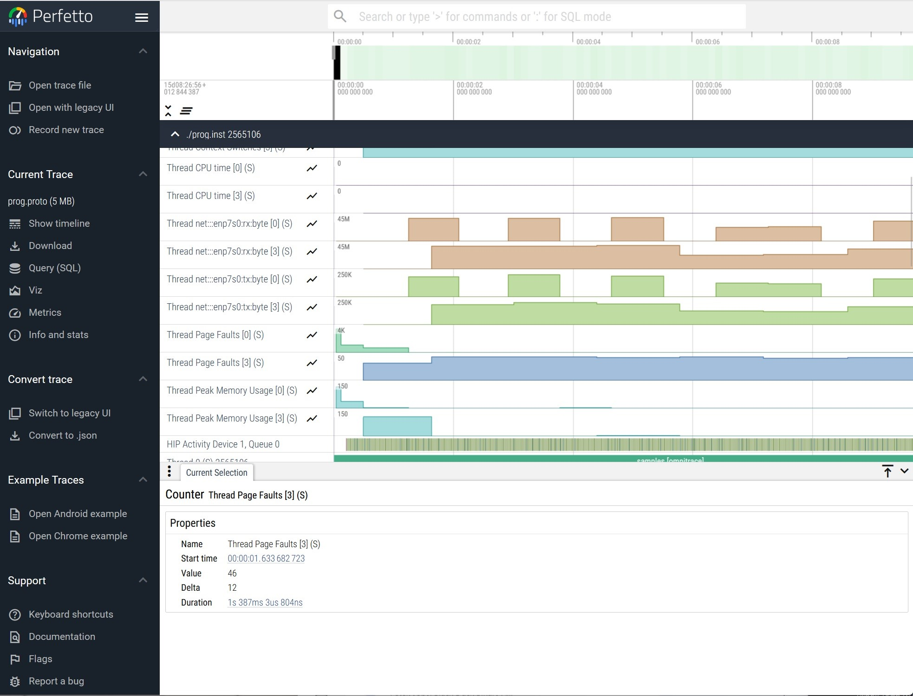
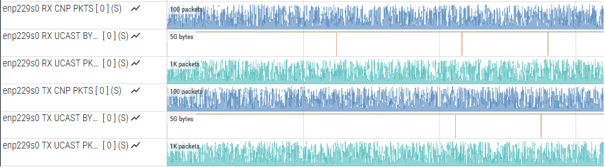
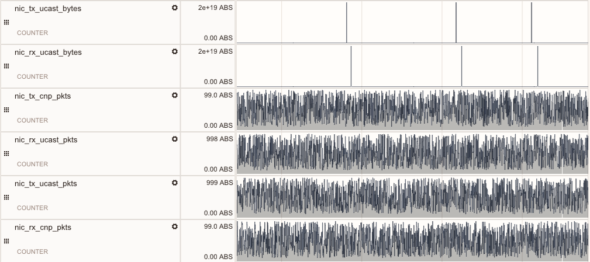

.. meta::
   :description: ROCm Systems Profiler network performance profiling
   :keywords: rocprof-sys, rocprofiler-systems, ROCm, tips, how to, profiler, tracking, NIC, network, AMD

********************************************
Network performance profiling
********************************************

`ROCm Systems Profiler <https://github.com/ROCm/rocm-systems/tree/develop/projects/rocprofiler-systems>`_ supports network performance profiling. It can be performed using two methods:

* :ref:`event-based-profiling`
* :ref:`AINIC-metric-collection`

.. _event-based-profiling:

Sampling conventional NIC metrics using PAPI
============================================

Network performance profiling for conventional network interfaces that support TCP/IP is done using Performance Application Programming Interface (PAPI). This method profiles standard network events. You can sample the events based on standard network interface counters. Follow the steps to list all the network events, sample them using configuration parameters, instrument and run the generated binary, and visualize the Perfetto trace.

List available network events
-------------------------------

List all the network events that can be traced on the system by running the command:

.. code-block:: shell

    rocprof-sys-avail -H -r net

For example, if the name of system's NIC is ``enp7s0``, the output is:

.. code-block:: shell

  |-------------------------------|---------|-----------|-------------------------------|
  |       HARDWARE COUNTER        | DEVICE  | AVAILABLE |            SUMMARY            |
  |-------------------------------|---------|-----------|-------------------------------|
  | net:::enp7s0:rx:byte          |   CPU   |   true    | enp7s0 receive byte           |
  | net:::enp7s0:rx:packet        |   CPU   |   true    | enp7s0 receive packet         |
  | net:::enp7s0:rx:error         |   CPU   |   true    | enp7s0 receive error          |
  | net:::enp7s0:rx:droppe        |   CPU   |   true    | enp7s0 receive droppe         |
  | net:::enp7s0:rx:fif           |   CPU   |   true    | enp7s0 receive fif            |
  | net:::enp7s0:rx:fram          |   CPU   |   true    | enp7s0 receive fram           |
  | net:::enp7s0:rx:compresse     |   CPU   |   true    | enp7s0 receive compresse      |
  | net:::enp7s0:rx:multicas      |   CPU   |   true    | enp7s0 receive multicas       |
  | net:::enp7s0:tx:byte          |   CPU   |   true    | enp7s0 transmit byte          |
  | net:::enp7s0:tx:packet        |   CPU   |   true    | enp7s0 transmit packet        |
  | net:::enp7s0:tx:error         |   CPU   |   true    | enp7s0 transmit error         |
  | net:::enp7s0:tx:droppe        |   CPU   |   true    | enp7s0 transmit droppe        |
  | net:::enp7s0:tx:fif           |   CPU   |   true    | enp7s0 transmit fif           |
  | net:::enp7s0:tx:coll          |   CPU   |   true    | enp7s0 transmit coll          |
  | net:::enp7s0:tx:carrie        |   CPU   |   true    | enp7s0 transmit carrie        |
  | net:::enp7s0:tx:compresse     |   CPU   |   true    | enp7s0 transmit compresse     |
  |-------------------------------|---------|-----------|-------------------------------|

Configure the parameters
---------------------------

To track bytes and packets sent and received by NIC ``enp7s0``, configure the parameters as follows:

.. code-block:: shell

  ROCPROFSYS_PAPI_EVENTS = net:::enp7s0:tx:byte net:::enp7s0:rx:byte net:::enp7s0:tx:packet net:::enp7s0:rx:packet

Sample configuration parameter settings look like:

.. code-block:: shell

  ROCPROFSYS_SAMPLING_FREQ=10
  ROCPROFSYS_USE_SAMPLING=ON
  ROCPROFSYS_TIMEMORY_COMPONENTS=wall_clock papi_array network_stats
  ROCPROFSYS_NETWORK_INTERFACE=enp7s0
  ROCPROFSYS_PAPI_EVENTS=net:::enp7s0:tx:byte net:::enp7s0:rx:byte net:::enp7s0:rx:packet net:::enp7s0:tx:packet
  PAPI_NET_REFRESH_LATENCY=100000

Details of the configuration parameter settings configured in the example are:

* **Sampling Frequency**: 10 samples per second
* **TIMEMORY**:  Outputs the summaries for the ``wall_clock``, ``papi_array``, and ``network_stats`` components.
* **Network Interface**: ``enp7s0`` is the predictable network interface device name.
* **Events for the network device to be sampled**: Bytes transmitted, bytes received, packets transmitted, and packets received.
* **PAPI_NET_REFRESH_LATENCY**: The shortest latency (in microseconds) with which PAPI updates network statistics. The default value is 1000000 (1s).

You can save the configuration parameter settings in a configuration file. For example, ``rocprofsys.cfg``:

.. code-block:: shell

  ROCPROFSYS_VERBOSE=1
  ROCPROFSYS_DL_VERBOSE=1
  ROCPROFSYS_SAMPLING_FREQ=10
  ROCPROFSYS_SAMPLING_DELAY=0.05
  ROCPROFSYS_SAMPLING_CPUS=0-9
  ROCPROFSYS_SAMPLING_GPUS=$env:HIP_VISIBLE_DEVICES
  ROCPROFSYS_TRACE=ON
  ROCPROFSYS_PROFILE=ON
  ROCPROFSYS_USE_SAMPLING=ON
  ROCPROFSYS_USE_PROCESS_SAMPLING=OFF
  ROCPROFSYS_TIME_OUTPUT=OFF
  ROCPROFSYS_FILE_OUTPUT=ON
  ROCPROFSYS_TIMEMORY_COMPONENTS=wall_clock papi_array network_stats
  ROCPROFSYS_USE_PID=OFF
  ROCPROFSYS_OUTPUT_PREFIX=foo/
  ROCPROFSYS_NETWORK_INTERFACE=enp7s0
  ROCPROFSYS_PAPI_EVENTS=net:::enp7s0:tx:byte net:::enp7s0:rx:byte net:::enp7s0:rx:packet net:::enp7s0:tx:packet
  PAPI_NET_REFRESH_LATENCY=100000

To specify the configuration file, use the ``ROCPROFSYS_CONFIG_FILE`` setting:

.. code-block:: shell

  ROCPROFSYS_CONFIG_FILE=/path/to/rocprofsys.cfg

This setting defines the location of the ROCm Systems Profiler configuration file.

.. note::

   To collect network counters using Performance Application Programming Interface (PAPI), ensure that
   ``/proc/sys/kernel/perf_event_paranoid`` has a value <= 2. See
   :ref:`rocprof-sys_papi_events` for details.

Instrument and run the binary
-------------------------------------

1. Instrument the binary file using the ``rocprof-sys-instrument`` command:

.. code-block:: shell

  rocprof-sys-instrument -o foo.inst  \
    --log-file mylog.log --verbose --debug \
    "--print-instrumented" "functions" "-e" "-v" "2" "--caller-include" \
    "inner" "-i" "4096" "--" ./foo

This command generates an instrumented binary ``foo.inst``. 

2. Run the instrumented binary using the following command:

.. code-block:: shell

  rocprof-sys-sample -- ./foo.inst

Visualize the event-based profiling results
---------------------------------------------

To view the generated ``.proto`` file in the browser, follow the steps:

1. Open the `Perfetto UI page <https://ui.perfetto.dev/>`_. 

2. Click ``Open trace file`` and select the ``.proto`` file. In the browser, it looks like:

.. _AINIC-metric-collection:

Sampling AI NIC metrics using amd-smi
=========================================

On a host system that has AI network interface cards, ROCm Systems Profiler can track the following metrics:

* RX congestion notification packets
* TX congestion notification packets
* RX unicast bytes
* TX unicast bytes
* RX unicast packets
* TX unicast packets

AI NIC support in ROCm Systems Profiler
---------------------------------------
AI NIC interfaces support the Remote Direct Memory Access (RDMA) standard. RDMA enables one computer to access another computer’s memory directly, without operating-system involvement. This capability provides high-throughput, low‑latency data transfer, which is needed for large-scale clusters and high-performance networking. You can measure AI NIC network performance by using ``amd-smi``. By default, AI NIC support is enabled in ROCm Systems Profiler. However, you can disable it by setting:

.. code-block:: shell

   -D ROCPROFSYS_USE_AINIC=OFF

List available AI NICs
------------------------

List all the available AI NICs with their unique identifiers by running ``amd-smi list``:

.. code-block:: shell

   $ sudo amd-smi list
   AI_NIC: 0
       BDF: 0000:e2:00.0
       PERMANENT_ADDRESS: 04:90:81:2c:77:b0
       PRODUCT_NAME: POLLARA 1x400G QSFP112
       PART_NUMBER: POLLARA-1Q400P
       SERIAL_NUMBER: FPL250300A1EC0V2
       VENDOR_NAME: AMD Pensando Systems, Inc.

List the NETDEV name and more details of each available AI NIC by running ``amd-smi static``:

.. code-block:: shell

   $ sudo amd-smi static
   AI_NIC: 0
       NIC:
   ...
           RDMA_DEVICES:
               RDMA_DEVICE_0:
                   NAME: rocep229s0
                   NODE_GUID: 0690:81ff:fe2c:77b0
                   NODE_TYPE: CA
                   SYS_IMAGE_GUID: 0690:81ff:fe2c:77b0
                   FW_VER: 1.110.1-a-1
                   PORT_0:
                       NETDEV: enp229s0
                       PORT_NUM: 1
                       STATE: DOWN
                       MAX_MTU: N/A
                       ACTIVE_MTU: N/A

From this output, use the ``NETDEV`` value (here, ``enp229s0``) as the name of
the AI NIC.

Sampling the AI NICs
-----------------------

After the AI NIC support is enabled, specify the names of the AI NICs for which you want
to track the values. For example, if the host has an AI NIC named ``enp229s0`` there are multiple options to track its performance:

* **Option 1:** Set ``ROCPROFSYS_SAMPLING_AINICS`` in the configuration file.

  Example:

  .. code-block:: shell

     ROCPROFSYS_SAMPLING_AINICS=enp229s0

* **Option 2:** Set ``ROCPROFSYS_SAMPLING_AINICS`` as an environment variable.

  Example:

  .. code-block:: shell

     export ROCPROFSYS_SAMPLING_AINICS=enp229s0

.. _ai_nics_option_3:

* **Option 3:** Pass ``--ai-nics`` to ``rocprof-sys-sample`` on the command line. (Preferred)

  Example:

  .. code-block:: shell

     rocprof-sys-sample --ai-nics=enp229s0 -- <your command>

  * If you use ``rocprof-sys-sample`` to profile the AI NIC interface ``enp229s0`` while running the command  
    ``wget -O /dev/null --no-check-certificate https://example.com``, the full command is:

    .. code-block:: shell

       rocprof-sys-sample --ai-nics=enp229s0 --device -- \ wget -O /dev/null --no-check-certificate https://example.com

  * If you want to track multiple NICs on the host, provide them as a comma-separated list:

    .. code-block:: shell

       rocprof-sys-sample --ai-nics=enp229s0,enp229s1 --device -- \ wget -O /dev/null --no-check-certificate https://example.com

  The value of the ``--ai-nics`` parameter can also be:

  * all: tracking all NICs available on the host.
  * none: not tracking any NICs.

Visualize the AI NIC profiling results
------------------------------------------

To view the ``.proto`` file generated by ``rocprof-sys-sample`` in the browser, follow the steps :

1. Open the `Perfetto UI page <https://ui.perfetto.dev/>`_. 

2. Click ``Open trace file`` and select the ``.proto`` file. The tracks for AI NIC in the generated ``.proto`` file look like:

Save the profiling output to rocpd
-------------------------------------

To save the output to ``rocpd``, follow the steps:

1. Set the environment variable ``ROCPROFSYS_USE_ROCPD`` to ``ON``.

   .. code-block:: shell

      export ROCPROFSYS_USE_ROCPD=ON

2. Run ``rocprof-sys-sample`` as described above in :ref:`Option 3 <ai_nics_option_3>`. This generates a ``.db`` file, for example ``rocpd-2594634.db``.

You can view the generated file in `ROCm Optiq <https://rocm.docs.amd.com/projects/roc-optiq/en/latest/what-is-optiq.html>`_.
The AI NIC tracks look like this:

