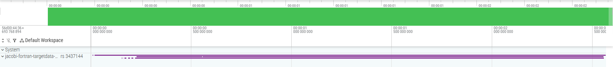
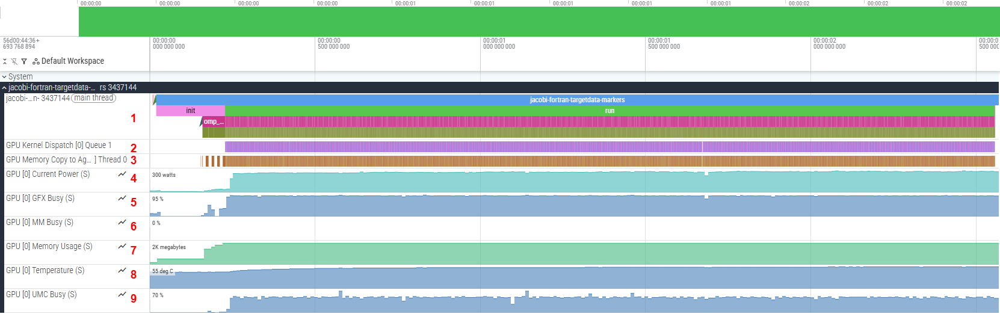
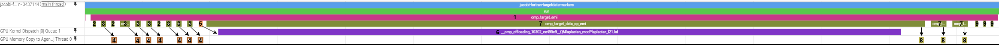
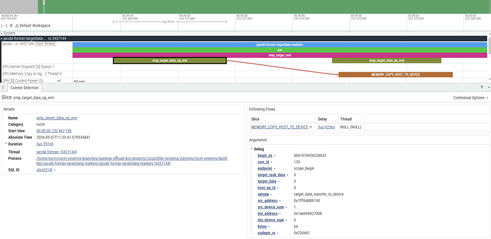

.. meta::
    :description: ROCm Systems Profiler OpenMP performance profiling, including Fortran offloading support
    :keywords: rocprof-sys, rocprofiler-systems, ROCm, tips, how to, profiler, tracking, OpenMP, OMPT, AMD, Offload, Fortran

**************************************************************************
OpenMP performance profiling
**************************************************************************

`ROCm Systems Profiler <https://rocm.docs.amd.com/projects/rocprofiler-systems/en/latest/index.html>`_ supports profiling OpenMP programs starting with ROCm 6.4.0.

It captures OpenMP performance data by intercepting callbacks from the OpenMP Tools Interface (OMPT). It uses `ROCprofiler-SDK <https://rocm.docs.amd.com/projects/rocprofiler-sdk/en/latest/>`_ to perform this interception. ROCm 6.4.0 is the minimum required version, as this release introduced OMPT support in ROCprofiler-SDK.

ROCm Systems Profiler processes only a subset of OMPT callbacks. The list of supported callbacks can be viewed by running the following command:

.. code-block:: shell

    rocprof-sys-avail --list-operations ompt

.. note::

    On versions prior to ROCm 7.14, ``--list-operations ompt`` is not available.
    The list of supported callbacks can instead be obtained by generating a
    configuration file with:

    .. code-block:: shell

        rocprof-sys-avail -G config.cfg --categories settings::rocprofiler-sdk --all --advanced

    After the configuration file ``config.cfg`` is generated, inspect the ``ROCPROFSYS_ROCM_OMPT_OPERATIONS`` entry.

Profiling a Fortran program that uses GPU offloading
=====================================================

.. tip::

   These steps also apply to C and C++ programs.

This sample steps uses the `jacobi-fortran-targetdata-markers example <https://github.com/ROCm/rocm-systems/tree/develop/projects/rocprofiler-systems/examples/hpc/jacobi-fortran-targetdata-markers>`_.

Building the example
---------------------------------------------

This example uses the ``amdflang`` Fortran compiler.

#. Clone the ``rocm-systems`` repository and sparse checkout the necessary examples:

   .. code-block:: shell

       git clone --no-checkout --filter=blob:none --depth=1 --branch develop https://github.com/ROCm/rocm-systems.git
       cd rocm-systems
       git sparse-checkout init --cone
       git sparse-checkout set projects/rocprofiler-systems/examples
       git checkout develop

#. Build only the ``jacobi-fortran-targetdata-markers`` example:

   .. code-block:: shell

       rm -rf build-hpc
       cmake -S projects/rocprofiler-systems/examples/hpc \
           -B build-hpc \
           -DCMAKE_PREFIX_PATH=/opt/rocm
       cmake --build build-hpc --target jacobi-fortran-targetdata-markers
       export JACOBI_FORTRAN_BIN=$PWD/build-hpc/jacobi-fortran-targetdata-markers/jacobi-fortran-targetdata-markers
       cd ..

The resulting binary is at ``rocm-systems/build-hpc/jacobi-fortran-targetdata-markers/jacobi-fortran-targetdata-markers``.

.. note::

    This example requires the ``hipfort`` Fortran module file
    (``hipfort.mod``). Install it through the ``hipfort-dev`` package on
    Debian/Ubuntu or the ``hipfort-devel`` package on RHEL/Rocky/SLES.

Collecting a trace with rocprof-sys-run
------------------------------------------------

Callback APIs, such as OMPT, can be traced using ``rocprof-sys-run`` with the ``--preset=trace-openmp`` option.

#. To collect a trace for the Jacobi example, run the following command:

   .. code-block:: shell

       rocprof-sys-run --preset=trace-openmp -- "$JACOBI_FORTRAN_BIN"

   .. note::

       ``--preset=trace-openmp`` requires ROCm 7.13.0 or later. On earlier
       versions, use the :ref:`openmp-env-var-config`.

#. Once the command completes, an output directory will be generated:

   .. code-block:: shell

       rocprofsys-jacobi-fortran-targetdata-markers-output/<timestamp>/

   By default, a ``.proto`` trace file containing all captured traces from the profiling session is written under this directory.

For more information about presets, see :doc:`Using preset profiles <using-preset-profiles>`.

Understanding the proto file output
-----------------------------------------------

To view the generated ``.proto`` file in a browser, open the `Perfetto UI page <https://ui.perfetto.dev/>`_. Then, click on ``Open trace file`` and select the ``.proto`` file.
The output trace should resemble the following image:

To view the collected traces, click on the drop-down arrow in the ``jacobi-fortran-targetdata-markers`` track. You will then be able to see the full trace, which should resemble:

.. tip::
    You can pin important tracks in Perfetto by hovering over the track name and clicking the pin icon.

Multiple tracks are displayed, each representing different information, such as (in the numbering order from the screenshot):

1. Events captured on the main thread. The main program is executed here (represented by the trace labelled ``jacobi-fortran-targetdata-markers``).
2. GPU kernel executions.
3. Memory copy operations between agents (CPU/GPU).
4. Power being used by the GPU.
5. Graphics engine utilization (in percentage).
6. Multimedia engine activity (in percentage).
7. VRAM consumption.
8. GPU temperature (in Celsius).
9. Memory controller utilization (in percentage).

For this example, the important tracks are ``jacobi-fortran-targetdata-markers`` (1), ``GPU Kernel Dispatch`` (2), and ``GPU Memory Copy to Agent`` (3).

.. tip::

    Certain events have extra information attached to them which can be viewed by selecting the event and looking at its details and argument fields:

    .. image:: ../data/openmp-profiling/perfetto-jacobi-trace-details.png
        :alt: Zoomed in view of the jacobi track showing details for the first ``omp_target_emi`` event
        :width: 800

Visualizing data transfer and kernel execution on the GPU
------------------------------------------------------------

In this program, there are specific OpenMP constructs that offload compute to the GPU. As an example, consider the `laplacian subroutine <https://github.com/ROCm/rocm-systems/blob/develop/projects/rocprofiler-systems/examples/hpc/jacobi-fortran-targetdata-markers/laplacian.f90#L11>`_
in ``laplacian.f90`` which contains the following OpenMP code block:

.. code-block:: fortran

  !$omp target teams distribute parallel do collapse(2)
  do j = 2,mesh%n_y-1
      do i = 2,mesh%n_x-1
      au(i,j) = (-u(i-1,j)+2._RK*u(i,j)-u(i+1,j))*invdx2 &
              + (-u(i,j-1)+2._RK*u(i,j)-u(i,j+1))*invdy2
      end do
  end do

This OpenMP construct offloads the loop to the GPU. Due to the nature of the program, this specific kernel code is executed many times.
The easiest way to locate the events linked to the execution of this code is to find the corresponding kernel dispatch in the ``GPU Kernel Dispatch`` track.
For ``flang`` based compilers (which includes ``amdflang``), the kernel has the following name:

.. code-block:: shell

  __omp_offloading_<Device-ID>_<File-ID>_QMlaplacian_modPlaplacian_l22.kd

``Device-ID`` and ``File-ID`` are unique for each system. You can ignore these values for this instruction.

In general, for ``flang`` compiled code containing modules with subroutines using OpenMP to perform GPU offloading, the kernel's name will be of the following form:

.. code-block:: shell

  __omp_offloading_<Device-ID>_<File-ID>_QM<module-Name>P<subroutine-Name>_l<OpenMP-Pragma-Source-Line>[_<Count-ID>].kd

.. note::

    * The ``<OpenMP-Pragma-Source-Line>`` is the line number corresponding to the OpenMP pragma in the source code.
    * ``Count-ID`` is appended when multiple OpenMP offload constructs exist on the same source line. Since the Jacobi example has only one construct per line, ``Count-ID`` is omitted.

The image below shows a group of events that correspond to the execution of the block above:

The general sequence of events for this code block is as follows (in the numbering order from the screenshot):

1. An ``omp_target_emi`` callback is generated and spans the entire duration of the OpenMP ``target teams`` construct.
2. Memory is allocated on the GPU for variables. This is represented by an ``omp_target_data_op_emi`` event with ``optype = target_data_alloc``.
3. The variables are then transferred to the GPU. This is represented by an ``omp_target_data_op_emi`` event with ``optype = target_data_transfer_to_device``.
4. A corresponding ``MEMORY_COPY_HOST_TO_DEVICE`` is generated in the ``GPU Memory Copy to Agent`` track for each occurrence of (3).
5. Once the necessary data transfers are complete, the kernel can be launched. An ``omp_target_submit_emi`` event is generated and points to the kernel being executed on the GPU.
6. A corresponding ``__omp_offloading`` kernel is generated on the ``GPU Kernel Dispatch`` track for each occurrence of (5), representing the GPU code being executed.
7. Once complete, the data is transferred back to the host. This is represented by an ``omp_target_data_op_emi`` event with ``optype = target_data_transfer_from_device``.
8. A corresponding ``MEMORY_COPY_DEVICE_TO_HOST`` is generated in the ``GPU Memory Copy to Agent`` track for each occurrence of (7).
9. The previously allocated memory is deallocated from the GPU. This is represented by an ``omp_target_data_op_emi`` event with ``optype = target_data_delete``.

In general, if an event directly relates to another event, an arrow will be generated between the two. These arrows are called "flow events". A flow event is visible only when an event on a track is selected.
For the sake of showing all relations at once, black arrows were inserted in the image above.

The image below shows the standard way that flow events are displayed in Perfetto.

Instrumenting the application with rocprof-sys-instrument
----------------------------------------------------------------

The application can be instrumented with ``rocprof-sys-instrument`` to also capture user-defined functions alongside the OMPT events. Expand for step-by-step instructions:

.. dropdown:: Optional: Steps for instrumenting the application with rocprof-sys-instrument
    
    1. Instrument the application to generate an instrumented binary, ``jacobi.inst``:

    .. code-block:: shell

        rocprof-sys-instrument -o jacobi.inst -- "$JACOBI_FORTRAN_BIN"

    2. Profile the instrumented binary with OMPT tracing enabled:

    .. code-block:: shell

        rocprof-sys-run --preset=trace-openmp -- ./jacobi.inst

    3. Once profiling completes, an output directory will be generated:

    .. code-block:: shell

        rocprofsys-jacobi-inst-output/<timestamp>/

    A ``.proto`` trace file is written under this directory, and can be viewed using the same method described in the previous section.
    Compared to the trace from the preset-only run, the instrumented trace additionally surfaces user-defined functions in the ``jacobi-fortran-targetdata-markers`` track,
    allowing application-level call paths to be correlated with OMPT and GPU activity.

    .. important::

        With ``rocprof-sys-instrument``, data on user-defined functions can be gathered. However, default values on certain settings
        may prevent the expected function from being instrumented. For details, see :ref:`selective-instrumentation` section under the :doc:`Instrumenting and rewriting a binary application <instrumenting-rewriting-binary-application>` guide.

For more details on ``rocprof-sys-instrument`` and the data it gathers, see :doc:`data collection modes <../conceptual/data-collection-modes>`. 

.. _openmp-env-var-config:

Environment variable configuration
=============================================

The ``--preset=trace-openmp`` option requires ROCm 7.13.0 or later. On earlier
versions, use the equivalent environment variables. The environment variables provides more granular control over profiling settings. It can ease the process of integrating profiling into automated scripts, or need to maintain consistent configurations across multiple profiling sessions. Expand for detailed steps to configure the environment variable:

.. dropdown:: Optional: Configure environment variable

    .. code-block:: shell

        export ROCPROFSYS_USE_OMPT=true  # enable OMPT callback capture
        export ROCPROFSYS_TRACE=true     # enable the Perfetto tracing backend (produces the .proto trace)
        export ROCPROFSYS_PROFILE=false  # disable the timemory profiling backend (statistical text/JSON summaries)
        export ROCPROFSYS_ROCM_DOMAINS=hip_runtime_api,kernel_dispatch,marker_api,memory_copy  # ROCm API domains to trace

    Once these are set, ``rocprof-sys-run`` can be invoked without ``--preset``:

    .. code-block:: shell

        rocprof-sys-run -- "$JACOBI_FORTRAN_BIN"

    .. tip::

        Creating a default configuration file helps maintain consistent profiling settings across sessions.
        For details, see the :doc:`Configuring runtime options <configuring-runtime-options>` guide.

    .. note::

        If you are interested in seeing how the compiler translates the OpenMP offload
        constructs into ``hsa`` function calls, you can use either the more detailed
        ``--preset=trace-hpc`` preset or add ``hsa_api`` to ``ROCPROFSYS_ROCM_DOMAINS``.
        Because the variable *replaces* the active domain list, include it alongside the
        domains shown above:

        .. code-block:: shell

            export ROCPROFSYS_ROCM_DOMAINS=hip_runtime_api,kernel_dispatch,marker_api,memory_copy,hsa_api
