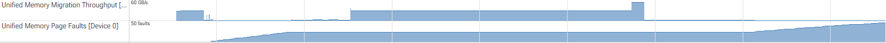

.. meta::
   :description: ROCm Systems Profiler unified memory profiling how-to guide
   :keywords: rocprof-sys, rocprofiler-systems, ROCm, unified memory, managed memory, KFD, XNACK, page fault, page migration, profiling

****************************************************
Unified memory profiling
****************************************************

ROCm Systems Profiler can generate unified-memory profiling reports from KFD
page-fault and page-migration events. Use this feature when a HIP managed-memory
workload uses ``hipMallocManaged`` for dynamic managed-memory allocation,
``__managed__`` variables for static managed memory, or managed-memory
abstractions built on those HIP features, and you want to understand page
faults, migration triggers, and effective migration throughput between host and
device memory.

Unified memory profiling writes two summary files in addition to the usual trace
or database outputs. By default, ROCm Systems Profiler appends the process ID to
output filenames, so these reports are written as ``unified_memory-<pid>.txt``
and ``unified_memory-<pid>.json``:

* ``unified_memory-<pid>.txt``: Human-readable per-GPU migration and page-fault
  summary.
* ``unified_memory-<pid>.json``: Machine-readable equivalent for validation,
  scripting, and dashboards.

Prerequisites
=============

Unified memory profiling requires:

* An XNACK-capable AMD GPU.
* ``HSA_XNACK=1`` in the target application's environment.
* ROCm 7.13 or later. For standalone ROCProfiler-SDK installations,
  ROCProfiler-SDK 1.2.2 or later is required.
* A workload that produces KFD page-fault or page-migration events.

Check XNACK support with ``rocminfo``:

.. code-block:: shell

   rocminfo | grep xnack

If the output contains ``xnack-``, XNACK is available but disabled. Enable it
before launching the profiled application:

.. code-block:: shell

   export HSA_XNACK=1

Quick start
===========

Enable unified memory profiling with
``ROCPROFSYS_USE_UNIFIED_MEMORY_PROFILING=ON``:

.. code-block:: shell

   HSA_XNACK=1 \
   ROCPROFSYS_USE_UNIFIED_MEMORY_PROFILING=ON \
   ROCPROFSYS_TRACE=ON \
   rocprof-sys-run -- ./my_managed_memory_app

.. note::

   ``ROCPROFSYS_TRACE=ON`` enables Perfetto trace generation so you can inspect
   unified-memory page-fault and migration-throughput tracks on a timeline. The
   ``unified_memory.txt`` and ``unified_memory.json`` summary reports are
   enabled by ``ROCPROFSYS_USE_UNIFIED_MEMORY_PROFILING=ON``.

The unified-memory setting automatically enables the required KFD tracing
domains for page faults and page migrations. You don't need to add
``kfd_events`` to ``ROCPROFSYS_ROCM_DOMAINS`` separately.

Example workload
================

The ROCm Systems Profiler repository includes a HIP managed-memory example in
`examples/unified-memory
<https://github.com/ROCm/rocm-systems/tree/develop/projects/rocprofiler-systems/examples/unified-memory>`_.
It runs access patterns that can trigger host-to-device migrations,
device-to-host migrations, prefetch-driven migrations, memory-pressure
behavior, and page faults.

If you don't already have a ``rocm-systems`` checkout, follow the sparse
checkout instructions in the `unified-memory example README
<https://github.com/ROCm/rocm-systems/tree/develop/projects/rocprofiler-systems/examples/unified-memory#readme>`_.
The README also contains the build command and the example's runtime arguments.

After building the example, profile it with unified memory profiling enabled:

.. code-block:: shell

   HSA_XNACK=1 \
   ROCPROFSYS_USE_UNIFIED_MEMORY_PROFILING=ON \
   ROCPROFSYS_TRACE=ON \
   rocprof-sys-run -- ./build-unified-memory/unified-memory -s 32 -p 256 -i 4

.. tip::

   The ``-s``, ``-p``, and ``-i`` options are specific to the unified-memory
   example workload. See the `unified-memory example README
   <https://github.com/ROCm/rocm-systems/tree/develop/projects/rocprofiler-systems/examples/unified-memory#readme>`_
   for the full option table and default values.

Use ``ROCPROFSYS_OUTPUT_PATH`` when you want a predictable output directory:

.. code-block:: shell

   HSA_XNACK=1 \
   ROCPROFSYS_USE_UNIFIED_MEMORY_PROFILING=ON \
   ROCPROFSYS_TRACE=ON \
   ROCPROFSYS_OUTPUT_PATH=ump-output \
   rocprof-sys-run -- ./build-unified-memory/unified-memory -s 32 -p 256 -i 4

Set ``ROCPROFSYS_USE_PID=NO`` if you want stable output filenames without the
process ID suffix:

.. code-block:: shell

   HSA_XNACK=1 \
   ROCPROFSYS_USE_UNIFIED_MEMORY_PROFILING=ON \
   ROCPROFSYS_TRACE=ON \
   ROCPROFSYS_OUTPUT_PATH=ump-output \
   ROCPROFSYS_USE_PID=NO \
   rocprof-sys-run -- ./build-unified-memory/unified-memory -s 32 -p 256 -i 4

Output files
============

After a successful run, look in the ROCm Systems Profiler output directory for:

.. list-table::
   :header-rows: 1
   :widths: 30 70

   * - File
     - Contents
   * - ``unified_memory-<pid>.txt``
     - Text summary with per-device migration rows, total page faults, and
       migration trigger counts.
   * - ``unified_memory-<pid>.json``
     - Structured summary with ``devices`` and ``summary`` objects.
   * - ``perfetto-trace-<pid>.proto``
     - Perfetto trace with unified-memory page-fault counters and migration
       throughput counters when migration events are present.

When ``ROCPROFSYS_USE_PID=NO`` is set, the unified-memory report filenames are
``unified_memory.txt`` and ``unified_memory.json``. The Perfetto trace filename
is also written without a PID suffix as ``perfetto-trace.proto``.

.. note::

   ROCpd database output is optional and is generated only when
   ``ROCPROFSYS_USE_ROCPD=ON`` is set. In that case, the output directory also
   contains ``rocpd-<pid>.db``.

Sample text output
==================

The following sample shows a discrete-memory system where KFD page-migration
events were emitted. The ``12345`` value in the output prefix is a placeholder
for the profiled process ID:

.. code-block:: text

   ==12345== Unified Memory profiling result:
    Device "gfx950 (via AMD EPYC 9655 96-Core Processor) (2)"
       Count  Avg Size  Min Size  Max Size  Total Size  Total Time    Migration Throughput  Name
          36  11.4670MB  2.0000MB  173.4062MB  412.8125MB  827.8592ms       0.52 GB/s  Host To Device
          32   1.9375MB  4.0000KB   2.0000MB   62.0000MB   39.1353ms       1.66 GB/s  Device To Host

    Total Page Faults: 33

    Migration Triggers:
      GPU page fault:         30
      CPU page fault:          2
      Prefetch:                1

``Migration Throughput`` is calculated as migrated bytes divided by KFD
page-migration event duration. It is an end-to-end migration-service metric and
can include page-fault handling, scheduling, replay, and driver overhead. Don't
interpret it as raw PCIe, XGMI, SDMA, HBM, or memory-subsystem bandwidth.

Sample JSON output
==================

The JSON output uses the same information in a stable structure:

.. code-block:: json

   {
     "devices": [
       {
         "device_id": 2,
         "device_name": "gfx950 (via AMD EPYC 9655 96-Core Processor)",
         "migrations": {
           "host_to_device": {
             "count": 36,
             "avg_size_bytes": 12024035.55,
             "min_size_bytes": 2097152,
             "max_size_bytes": 181829632,
             "total_size_bytes": 432865280,
             "total_time_ns": 827859200,
             "migration_throughput_gbps": 0.52
           },
           "device_to_host": {
             "count": 32,
             "avg_size_bytes": 2031616,
             "min_size_bytes": 4096,
             "max_size_bytes": 2097152,
             "total_size_bytes": 65011712,
             "total_time_ns": 39135300,
             "migration_throughput_gbps": 1.66
           },
           "device_to_device": {
             "count": 0,
             "avg_size_bytes": 0,
             "min_size_bytes": 0,
             "max_size_bytes": 0,
             "total_size_bytes": 0,
             "total_time_ns": 0,
             "migration_throughput_gbps": 0
           }
         }
       }
     ],
     "summary": {
       "total_page_faults": 33,
       "xnack_enabled": true,
       "migration_triggers": {
         "gpu_page_fault": 30,
         "cpu_page_fault": 2,
         "prefetch": 1,
         "ttm_eviction": 0,
         "unknown": 0
       }
     }
   }

Perfetto trace output
=====================

When ``ROCPROFSYS_TRACE=ON`` is set, the Perfetto trace can include:

* ``Unified Memory Page Faults [Device N]`` counter tracks.
* ``Unified Memory Migration Throughput [Device N]`` counter tracks when KFD
  page-migration events are present.

Open the generated Perfetto trace file, for example
``perfetto-trace-<pid>.proto``, in the Perfetto UI to compare page-fault
activity, migration-throughput samples, HIP API calls, kernels, and memory
copies on one timeline.

The following screenshot shows unified-memory migration-throughput and
page-fault tracks in Perfetto:

The migration-throughput track appears when KFD page-migration events are
present. Fault-only systems might show only the page-fault track.

Migration events absent on shared-HBM systems
=============================================

On MI300A and other systems where CPU and GPU agents point to the same physical
HBM, page faults can occur without page migrations because there is no separate
CPU memory and GPU memory to migrate between. In that topology, a valid
unified-memory report might not include page migration events:

* ``total_page_faults`` can be nonzero.
* ``devices`` can be empty, or migration direction buckets can have zero counts.
* ``Unified Memory Page Faults`` can appear in Perfetto.
* ``Unified Memory Migration Throughput`` is not shown when no migration events
  are emitted.

Example fault-only text output:

.. code-block:: text

   ==12345== Unified Memory profiling result:
    Total Page Faults: 100

Example fault-only JSON output:

.. code-block:: json

   {
     "devices": [],
     "summary": {
       "total_page_faults": 100,
       "xnack_enabled": true,
       "migration_triggers": {
         "gpu_page_fault": 0,
         "cpu_page_fault": 0,
         "prefetch": 0,
         "ttm_eviction": 0,
         "unknown": 0
       }
     }
   }

Related memory profiling options
================================

Unified memory profiling is focused on KFD page-fault and page-migration
events. Combine it with ROCm API domains when you also need the surrounding
memory operations in the timeline or ROCpd database:

.. list-table::
   :header-rows: 1
   :widths: 25 75

   * - Domain
     - Use
   * - ``memory_copy``
     - Traces asynchronous memory-copy operations. This is useful for comparing
       explicit copies with unified-memory page migrations.
   * - ``memory_allocation``
     - Traces ROCm memory allocation and free operations. With the ROCm 7.13 or
       later prerequisite for this page, this includes virtual memory allocation
       and free records.
   * - ``scratch_memory``
     - Traces kernel scratch-memory allocation activity. Scratch allocation-size
       counter tracks are emitted in ROCm 7.0.2 and later.

For a memory-focused trace, enable the related domains explicitly:

.. code-block:: shell

   HSA_XNACK=1 \
   ROCPROFSYS_USE_UNIFIED_MEMORY_PROFILING=ON \
   ROCPROFSYS_TRACE=ON \
   ROCPROFSYS_USE_ROCPD=ON \
   ROCPROFSYS_ROCM_DOMAINS=hip_runtime_api,marker_api,kernel_dispatch,memory_copy,memory_allocation,scratch_memory \
   rocprof-sys-run -- ./my_managed_memory_app

Troubleshooting
===============

No ``unified_memory-<pid>.txt`` or ``unified_memory-<pid>.json`` file was generated
-----------------------------------------------------------------------------------

Check that ``ROCPROFSYS_USE_UNIFIED_MEMORY_PROFILING=ON`` and ``HSA_XNACK=1``
are set in the environment used to launch the target application. Also, confirm
that the workload actually uses managed memory and produces KFD page-fault or
page-migration events.

Only page faults are shown
--------------------------

On shared-HBM systems such as MI300A, the absence of migration events is
expected. If you expected migration rows on a discrete-memory system, confirm
that XNACK is enabled and that the workload moves managed-memory pages between
CPU and GPU accesses.

No migration-throughput track appears in Perfetto
-------------------------------------------------

The migration-throughput track is emitted only when KFD page-migration events
are present. A trace with page faults but no migration events can still be
valid.

Unexpected overhead
-------------------

KFD event tracing and extra ROCm domains add overhead. Start with
``ROCPROFSYS_USE_UNIFIED_MEMORY_PROFILING=ON`` and add
``memory_copy``, ``memory_allocation``, and ``scratch_memory`` only when those
events are needed for the analysis.

See also
========

* :doc:`Configuring runtime options <./configuring-runtime-options>` for the
  runtime option reference.
* :doc:`Using preset profiles and domain flags <./using-preset-profiles>` for
  ROCm domain flag usage.
* :doc:`Understanding ROCm Systems Profiler output <./understanding-rocprof-sys-output>`
  for output directory and trace-file details.
