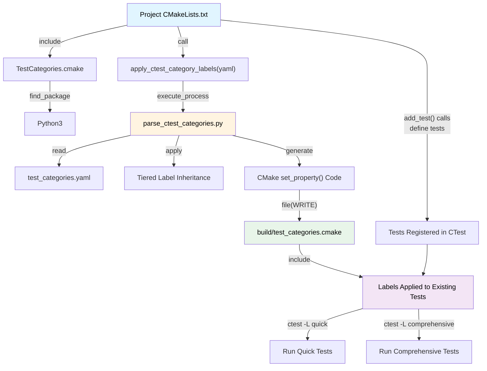

# ROCm Systems CTest Integration Architecture

This directory contains the shared CTest integration files for organizing and executing tests across ROCm system projects using YAML-based test categorization.

## Directory Structure

```
shared/ctest/
├── README.md                      # This file - architecture documentation
├── TestCategories.cmake           # CMake module for test category integration
└── parse_ctest_categories.py      # Python parser for YAML to CMake conversion
```

**Files:**
- [TestCategories.cmake](./TestCategories.cmake) - CMake module with `apply_ctest_category_labels()` function
- [parse_ctest_categories.py](./parse_ctest_categories.py) - Python parser for YAML to CMake conversion

## Architecture Overview

The CTest integration provides a label-based system for organizing **pre-existing CTest tests** into tiered categories. Unlike gtest-filter approaches used in rocm-libraries that create new test targets, this system applies CTest `LABELS` to tests already registered via `add_test()`, enabling flexible filtering with `ctest -L`.

### Core Components

#### 1. **test_categories.yaml** (Project-specific)
Located in each project's test directory (e.g., `projects/rocprofiler-compute/tests/test_categories.yaml`).

Defines test organization:
- Test categories with tiered label inheritance
- Per-category exclusions
- Custom labels per category
- Timeout settings

#### 2. **parse_ctest_categories.py** (Shared)
Python script that:
- Parses YAML configuration files
- Applies tiered label inheritance (quick → standard → comprehensive → full)(so that a test added for quick category will be executed for other categories as well)
- Supports exact test name matching and CMake regex patterns
- Supports matching tests by existing labels (`test_labels`)
- Generates CMake `set_property()` code to apply labels
- Deduplicates labels across all tests
- Optionally appends generated code to an install-time test file

#### 3. **TestCategories.cmake** (Shared)
CMake module providing:
- `apply_ctest_category_labels()` function for projects
- Python3 interpreter detection
- Input validation and error handling
- Optional `install_test_file` parameter for install-time label support

## Execution Flow



## Tiered Label Inheritance

Categories follow a tiered inheritance model where lower tiers automatically include higher-tier labels:

| Category | Labels Applied |
|----------|---------------|
| `quick` | `quick`, `standard`, `comprehensive`, `full` |
| `standard` | `standard`, `comprehensive`, `full` |
| `comprehensive` | `comprehensive`, `full` |
| `full` | `full` |

This means a test in the `quick` category is also included when running `ctest -L standard`, `ctest -L comprehensive`, or `ctest -L full`. Any custom labels defined in the YAML are appended after the tier labels.

## YAML Configuration Format

### Basic Structure

```yaml
test_categories:
  category_name:
    description: "Human-readable description"
    test_patterns:
      - test_exact_name        # Exact CTest test name
      - test_regex.*pattern    # CMake regex pattern (auto-detected)
    test_labels:
      - "existing_label"       # Match tests that already have this label
    exclude:
      - test_to_exclude        # Applied with "{category}_exclude" label
    labels:
      - "custom_label"         # Additional labels beyond tier labels

general_exclude:
  exclude_section_name:
    test_patterns:
      - test_to_exclude
    labels:
      - "exclude_label"

execution_settings:
  default_timeout: 300
  timeout_multiplier: 1
  category_timeouts:
    quick: 300
    standard: 1800
    comprehensive: 7200
```

### Example (rocprofiler-compute)

```yaml
test_categories:
  quick:
    description: "Fast sanity checks - Run pre-commit (target: < 5 min)"
    test_patterns:
      - test_autogen_config
      - test_roofline_calc_ai_analyze
      - test_utils
      - test_tui_components
    exclude:
      - test_profile_live_attach_detach
    labels:
      - "quick"
      - "pre-commit"
      - "smoke"

  standard:
    description: "Core functionality - Run on every PR (target: < 30 min)"
    test_patterns:
      - test_autogen_config
      - test_utils
      - test_analyze_workloads
      - test_metric_validation
    exclude:
      - test_profile_live_attach_detach
    labels:
      - "standard"
      - "pr"

  comprehensive:
    description: "Extended testing - Run nightly (target: < 2 hours)"
    test_patterns:
      - test_profile_dispatch
      - test_profile_kernel_execution
      - test_profile_roofline_1
      # ... all tests
    exclude:
      - test_profile_live_attach_detach
    labels:
      - "comprehensive"
      - "nightly"

execution_settings:
  default_timeout: 300
  timeout_multiplier: 1
  category_timeouts:
    quick: 300
    standard: 1800
    comprehensive: 7200
```

### Field Reference

| Field | Required | Description |
|-------|----------|-------------|
| `test_patterns` | Yes | List of CTest test names or CMake regex patterns to match |
| `test_labels` | No | List of existing labels to match — tests carrying any of these labels get the category's labels |
| `exclude` | No | Test names/patterns to tag with `{category}_exclude` label |
| `labels` | No | Custom labels appended after tier-inherited labels |
| `description` | No | Human-readable description (ignored by parser) |

### Test Matching

The parser supports two matching strategies, auto-detected per pattern:

**Exact match** — test name contains no regex metacharacters:
```yaml
test_patterns:
  - test_utils              # Matches the CTest test named exactly "test_utils"
```
Generated CMake:
```cmake
foreach(_test test_utils)
    if(TEST ${_test})
        set_property(TEST ${_test} APPEND PROPERTY LABELS "quick;standard;comprehensive;full")
    endif()
endforeach()
```

**Regex match** — test name contains regex metacharacters (`.*+?^${}()|[]\`):
```yaml
test_patterns:
  - test_profile_.*         # Matches all tests starting with "test_profile_"
```
Generated CMake:
```cmake
get_property(_all_tests DIRECTORY ${CMAKE_CURRENT_SOURCE_DIR} PROPERTY TESTS)
foreach(_test ${_all_tests})
    if(_test MATCHES "^test_profile_.*$")
        set_property(TEST ${_test} APPEND PROPERTY LABELS "quick;standard;comprehensive;full")
    endif()
endforeach()
```

### Label-Based Matching (`test_labels`)

In addition to matching by test name, categories can match tests by their existing labels:

```yaml
test_categories:
  quick:
    test_labels:
      - "unit"              # All tests already labeled "unit" get quick-tier labels
    test_patterns:
      - test_extra_quick
```

This is useful when tests are already labeled in `CMakeLists.txt` via `set_tests_properties()` and you want to include them in a category without listing each name.

### General Excludes

The `general_exclude` section applies labels directly to test patterns without tier inheritance:

```yaml
general_exclude:
  exclude_flaky:
    test_patterns:
      - test_intermittent_failure
    labels:
      - "flaky"
      - "exclude_flaky"
```

This can be used with `ctest -LE exclude_flaky` to skip these tests.

## Integration Guide

### Step 1: Create test_categories.yaml

Create `test_categories.yaml` in your project's test directory:

```
projects/myproject/tests/test_categories.yaml
```

### Step 2: Include in CMakeLists.txt

In your project's CMakeLists.txt, **after** all `add_test()` calls:

```cmake
# Set path to the YAML file
set(_test_categories_yaml "${CMAKE_CURRENT_SOURCE_DIR}/tests/test_categories.yaml")

# Include the shared CTest module
include(${ROCM_SYSTEMS_ROOT}/shared/ctest/TestCategories.cmake)

# Apply category labels to existing tests
if(EXISTS "${_test_categories_yaml}")
    message(STATUS "YAML-based test categorization")
    apply_ctest_category_labels("${_test_categories_yaml}")
else()
    message(STATUS "No test categorization (YAML missing)")
endif()
```

**Important:** `apply_ctest_category_labels()` must be called **after** all `add_test()` calls, since it uses `if(TEST ...)` and `get_property(... PROPERTY TESTS)` to find existing tests.

### Step 3: Build and Test

```bash
# Configure
cmake -B build ..

# Run quick sanity checks
ctest --test-dir build -L quick

# Run standard PR tests
ctest --test-dir build -L standard

# Run comprehensive nightly tests
ctest --test-dir build -L comprehensive

# Exclude specific tests
ctest --test-dir build -L quick -LE quick_exclude

# List all tests with their labels
ctest --test-dir build -N --show-only=json-v1

# Verbose output
ctest --test-dir build -L quick -V
```

### Optional: Install-Time Test File

`apply_ctest_category_labels()` accepts an optional second argument to append the generated label code to a file for install-time use:

```cmake
apply_ctest_category_labels(
    "${_test_categories_yaml}"
    "${CMAKE_CURRENT_BINARY_DIR}/install_test_labels.cmake"  # appended to this file
)
```

## Integrations

- **rocprofiler-compute** - [test_categories.yaml](../../projects/rocprofiler-compute/tests/test_categories.yaml) | [CMakeLists.txt](../../projects/rocprofiler-compute/CMakeLists.txt)
